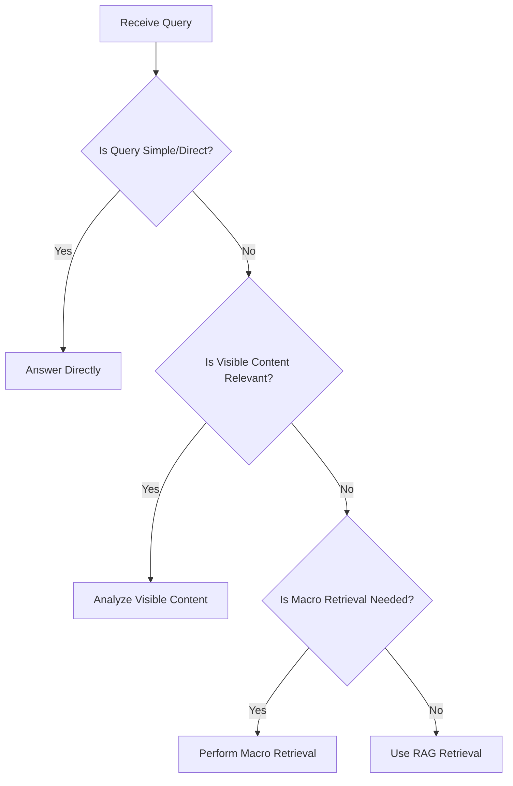
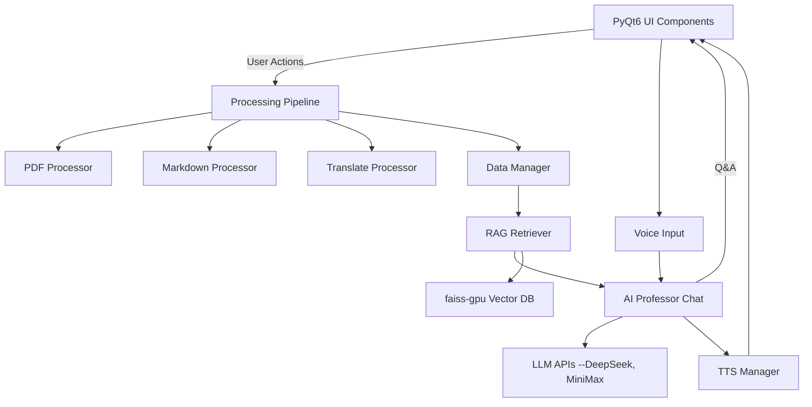
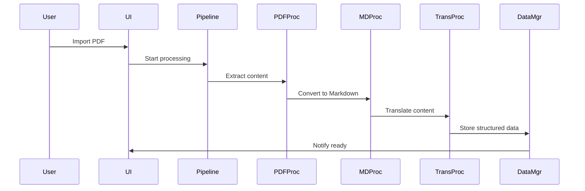
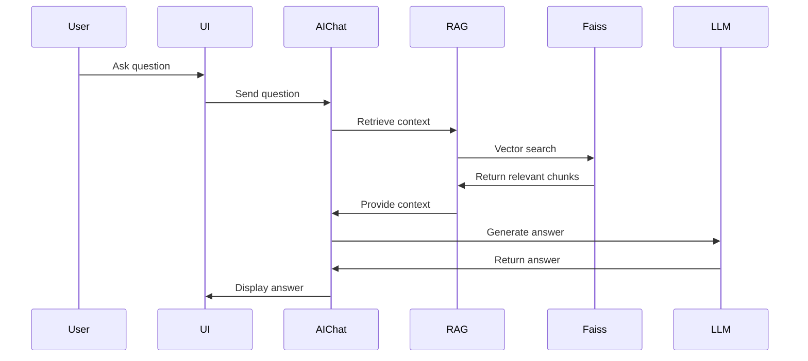
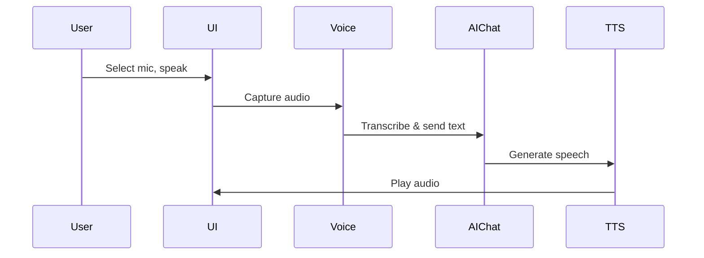

# [Mad Professor](https://github.com/LYiHub/mad-professor-public)
## **1. Main Features**
### **Automatic Paper Processing**  
  - Extracts, translates, and structures PDF content automatically.  
  - Files: <mcfile name="pdf_processor.py" path="processor/pdf_processor.py"></mcfile>, <mcfile name="md_processor.py" path="processor/md_processor.py"></mcfile>, <mcfile name="translate_processor.py" path="processor/translate_processor.py"></mcfile>, <mcfile name="pipeline.py" path="pipeline.py"></mcfile>
  - Tech stack: Python, magic-pdf, PyQt6. Implemented via a processing pipeline that converts PDFs to Markdown, translates, and structures content.

### **Bilingual Display**  
  - Supports side-by-side Chinese and English reading.  
  - Files: <mcfile name="markdown_view.py" path="ui/markdown_view.py"></mcfile>, <mcfile name="AI_professor_UI.py" path="AI_professor_UI.py"></mcfile>
  - Tech stack: PyQt6 for UI, custom Markdown rendering.

### **AI-Powered Q&A**  
  - Provides professional explanations and analysis based on paper content.  
  - Files: <mcfile name="AI_manager.py" path="AI_manager.py"></mcfile>, <mcfile name="AI_professor_chat.py" path="AI_professor_chat.py"></mcfile>, <mcfile name="rag_retriever.py" path="rag_retriever.py"></mcfile>
  - Tech stack: Python, LLM APIs (DeepSeek), RAG (Retrieval-Augmented Generation), vector search (faiss-gpu).

#### Detailed technical breakdown of the AI-powered Q&A system:

##### **1. RAG Implementation & Technologies**
- The system uses a RAG approach to provide contextually relevant answers based on academic paper content.
- **Vector Search:** The core retrieval is handled by the `RagRetriever` class, which loads FAISS-based vector stores for each paper. These vector stores are created using embeddings from a configurable embedding model (see `EmbeddingModel` in config).
- **Database:** The vector database is FAISS (faiss-gpu), with each paper having its own vector store directory containing an `index.faiss` file.
- **Model:** For answer generation, the system uses LLM APIs, specifically DeepSeek (and optionally MiniMax), accessed via the `LLMClient` class.
- **RAG Workflow:** When a user asks a question, the system:
  1. Uses the retriever to perform a vector search over the relevant paper's vector store, retrieving the most similar content chunks.
  2. Extracts and formats these chunks as context.
  3. Passes the user query and retrieved context to the LLM for answer generation.

##### **2. Ensuring Relevant and Accurate RAG Retrieval**
- **Vector Similarity:** The retriever uses semantic similarity (via embeddings) to find the most relevant chunks for a given query.
- **Top-K Selection:** The number of returned chunks (top_k) is configurable, balancing context richness and LLM input limits.
- **Context Extraction:** Retrieved chunks are further processed to ensure they are coherent and relevant before being sent to the LLM.
- **RAG Tree:** Each paper has a `rag_tree` structure (JSON) for hierarchical content mapping, aiding in precise localization and matching.

###### **RAG Tree Implementation**
Each paper is processed to generate a `rag_tree` JSON structure, which provides a hierarchical mapping of the paper's content (sections, subsections, abstract, etc.). This structure is created during the RAG pipeline stage (see `pipeline.py`, `rag_processor.py`) and is used for precise localization and matching of content during retrieval and answer generation. The tree is loaded and accessed via `data_manager.py` and `rag_retriever.py`, and is cached for efficiency. Example usage:
- Creation: `rag_processor.py` → `_restructure_tree`, `_restructure_sections`
- Storage: Output as `final_{paper_name}_rag_tree.json`
- Loading: `data_manager.py` → `load_rag_tree`, `rag_retriever.py` → `load_rag_tree`
- Usage: Matching, localization, and context extraction for RAG retrieval

##### **3. Mechanisms for Accurate Answers**
- **Prompt Engineering:** The system uses persona and explanation prompts (see the `prompt/` folder) to guide the LLM toward professional, context-aware responses.
- **Conversation History:** Maintains a rolling window of the last 10 exchanges to provide conversational context.
- **Decision Logic:** The `AIProfessorChat` class decides whether to answer directly, analyze visible content, perform macro retrieval, or use RAG based on the query and context.
- **Streaming Responses:** Answers are generated and streamed sentence-by-sentence, allowing for real-time feedback and interruption if needed.

###### **AIProfessorChat Decision Logic**
The `AIProfessorChat` class determines the response strategy based on the query and context. The logic is as follows:

- **Answer Directly**: For simple or factual queries.
- **Analyze Visible Content**: If the user is focused on a specific section or content is highlighted.
- **Macro Retrieval**: For queries requiring broader context or summary.
- **RAG Retrieval**: For complex, context-dependent questions, leveraging the `rag_tree` for precise localization.
- **Conversation History:** Maintains a rolling window of the last 10 exchanges to provide conversational context.
- **Decision Logic:** The `AIProfessorChat` class decides whether to answer directly, analyze visible content, perform macro retrieval, or use RAG based on the query and context.
- **Streaming Responses:** Answers are generated and streamed sentence-by-sentence, allowing for real-time feedback and interruption if needed.

##### **4. End-to-End User Workflow**
- The user asks a question via the UI (PyQt6-based).
- The question is routed to the `AIManager`, which coordinates context retrieval and answer generation.
- If RAG is needed, the system retrieves relevant content using FAISS vector search.
- The context and query are sent to the LLM API for answer generation.
- The answer is streamed back to the UI, optionally with emotion tags and scroll-to-context features.
- The user can interact further, with the system maintaining context and history for follow-up questions.

##### **References to Key Files:**
- RAG logic: <mcfile name="rag_retriever.py" path="rag_retriever.py"></mcfile>
- Answer generation and persona: <mcfile name="AI_professor_chat.py" path="AI_professor_chat.py"></mcfile>
- System orchestration: <mcfile name="AI_manager.py" path="AI_manager.py"></mcfile>
- UI workflow: <mcfile name="AI_professor_UI.py" path="AI_professor_UI.py"></mcfile>
- Prompts: <mcfolder name="prompt" path="prompt/"></mcfolder>
- Vector DB: FAISS (faiss-gpu)
- LLM: DeepSeek API (<mcurl name="DeepSeek" url="https://api-docs.deepseek.com"></mcurl>)

### - **Personalized AI Professor**  
  - Answers with a "grumpy professor" persona for engagement.  
  - Files: <mcfile name="AI_professor_chat.py" path="AI_professor_chat.py"></mcfile>, <mcfolder name="prompt" path="prompt/"></mcfolder>
  - Tech stack: Prompt engineering, persona prompt files.

### - **Voice Interaction**  
  - Supports voice input and TTS output.  
  - Files: <mcfile name="voice_input.py" path="voice_input.py"></mcfile>, <mcfile name="TTS_manager.py" path="TTS_manager.py"></mcfile>
  - Tech stack: RealtimeSTT, MiniMax TTS API, PyQt6 for device selection.

### - **RAG-Enhanced Retrieval**  
  - Accurate retrieval and localization based on paper content.  
  - Files: <mcfile name="rag_retriever.py" path="rag_retriever.py"></mcfile>, <mcfile name="rag_processor.py" path="processor/rag_processor.py"></mcfile>
  - Tech stack: faiss-gpu, vector search, context extraction.

### - **Split-Screen UI**  
  - Paper content on the left, AI Q&A on the right, collapsible panels.  
  - Files: <mcfile name="AI_professor_UI.py" path="AI_professor_UI.py"></mcfile>, <mcfolder name="ui" path="ui/"></mcfolder>
  - Tech stack: PyQt6.

## **2. Architecture & Component Interaction (Mermaid Diagram)**

**3. Key Workflows (Mermaid Diagrams)**

- **Paper Import & Processing**

- **AI Q&A with RAG**

- **Voice Interaction**

**4. Framework Integration & Use Cases**
- This is an application, not a general-purpose framework.  
- Integration: Not designed for plug-and-play integration; customization is via prompt files and API keys.  
- Use Cases:  
  - Academic researchers reading and analyzing papers  
  - Students needing bilingual, interactive paper reading  
  - Anyone wanting AI-powered, voice-enabled academic Q&A

**5. Third-Party Tools & Their Purposes**
- **MinerU**: PDF processing and extraction (<mcurl name="MinerU" url="https://github.com/opendatalab/MinerU"></mcurl>)
- **magic-pdf**: PDF to Markdown conversion (installed via pip)
- **RealtimeSTT**: Real-time speech-to-text (<mcurl name="RealtimeSTT" url="https://github.com/KoljaB/RealtimeSTT"></mcurl>)
- **DeepSeek API**: LLM for Q&A (<mcurl name="DeepSeek" url="https://api-docs.deepseek.com"></mcurl>)
- **MiniMax API**: TTS (Text-to-Speech) (<mcurl name="MiniMax" url="https://platform.minimaxi.com/document/Voice%20Cloning?key=66719032a427f0c8a570165b"></mcurl>)
- **faiss-gpu**: Vector search for RAG retrieval (installed via conda)
- **PyQt6**: Desktop UI framework

##### **4. End-to-End User Workflow**
- The user asks a question via the UI (PyQt6-based).
- The question is routed to the `AIManager`, which coordinates context retrieval and answer generation.
- If RAG is needed, the system retrieves relevant content using FAISS vector search.
- The context and query are sent to the LLM API for answer generation.
- The answer is streamed back to the UI, optionally with emotion tags and scroll-to-context features.
- The user can interact further, with the system maintaining context and history for follow-up questions.

##### **References to Key Files:**
- RAG logic: <mcfile name="rag_retriever.py" path="rag_retriever.py"></mcfile>
- Answer generation and persona: <mcfile name="AI_professor_chat.py" path="AI_professor_chat.py"></mcfile>
- System orchestration: <mcfile name="AI_manager.py" path="AI_manager.py"></mcfile>
- UI workflow: <mcfile name="AI_professor_UI.py" path="AI_professor_UI.py"></mcfile>
- Prompts: <mcfolder name="prompt" path="prompt/"></mcfolder>
- Vector DB: FAISS (faiss-gpu)
- LLM: DeepSeek API (<mcurl name="DeepSeek" url="https://api-docs.deepseek.com"></mcurl>)

### - **Personalized AI Professor**  
  - Answers with a "grumpy professor" persona for engagement.  
  - Files: <mcfile name="AI_professor_chat.py" path="AI_professor_chat.py"></mcfile>, <mcfolder name="prompt" path="prompt/"></mcfolder>
  - Tech stack: Prompt engineering, persona prompt files.

### - **Voice Interaction**  
  - Supports voice input and TTS output.  
  - Files: <mcfile name="voice_input.py" path="voice_input.py"></mcfile>, <mcfile name="TTS_manager.py" path="TTS_manager.py"></mcfile>
  - Tech stack: RealtimeSTT, MiniMax TTS API, PyQt6 for device selection.

### - **RAG-Enhanced Retrieval**  
  - Accurate retrieval and localization based on paper content.  
  - Files: <mcfile name="rag_retriever.py" path="rag_retriever.py"></mcfile>, <mcfile name="rag_processor.py" path="processor/rag_processor.py"></mcfile>
  - Tech stack: faiss-gpu, vector search, context extraction.

### - **Split-Screen UI**  
  - Paper content on the left, AI Q&A on the right, collapsible panels.  
  - Files: <mcfile name="AI_professor_UI.py" path="AI_professor_UI.py"></mcfile>, <mcfolder name="ui" path="ui/"></mcfolder>
  - Tech stack: PyQt6.

## **2. Architecture & Component Interaction (Mermaid Diagram)**

**3. Key Workflows (Mermaid Diagrams)**

- **Paper Import & Processing**

- **AI Q&A with RAG**

- **Voice Interaction**

**4. Framework Integration & Use Cases**
- This is an application, not a general-purpose framework.  
- Integration: Not designed for plug-and-play integration; customization is via prompt files and API keys.  
- Use Cases:  
  - Academic researchers reading and analyzing papers  
  - Students needing bilingual, interactive paper reading  
  - Anyone wanting AI-powered, voice-enabled academic Q&A

**5. Third-Party Tools & Their Purposes**
- **MinerU**: PDF processing and extraction (<mcurl name="MinerU" url="https://github.com/opendatalab/MinerU"></mcurl>)
- **magic-pdf**: PDF to Markdown conversion (installed via pip)
- **RealtimeSTT**: Real-time speech-to-text (<mcurl name="RealtimeSTT" url="https://github.com/KoljaB/RealtimeSTT"></mcurl>)
- **DeepSeek API**: LLM for Q&A (<mcurl name="DeepSeek" url="https://api-docs.deepseek.com"></mcurl>)
- **MiniMax API**: TTS (Text-to-Speech) (<mcurl name="MiniMax" url="https://platform.minimaxi.com/document/Voice%20Cloning?key=66719032a427f0c8a570165b"></mcurl>)
- **faiss-gpu**: Vector search for RAG retrieval (installed via conda)
- **PyQt6**: Desktop UI framework

