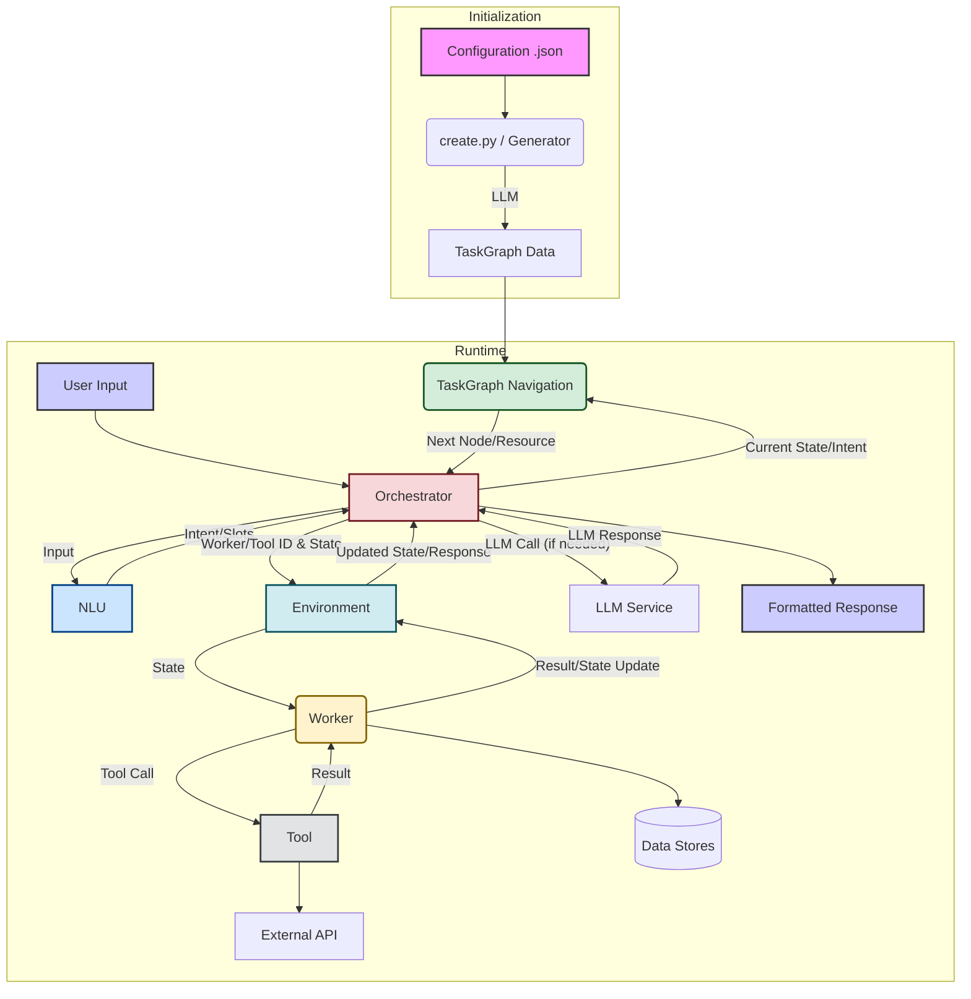

# Arklex Agent-First Organization

## **1. Main Features**

*   **AI Agent Framework:** The core feature is providing a Python framework to build complex, LLM-powered AI agents. It aims to blend the structured control of traditional workflows with the dynamic reasoning capabilities of modern agents.
    *   **Files/Folders:** The entire `arklex/` directory, particularly `arklex/orchestrator/`, `arklex/env/`, `arklex/types.py`.
    *   **Tech Stack & Implementation:** Built using Python. It leverages libraries like `langchain` and `langgraph` for LLM interaction and state management. The framework uses a custom `TaskGraph` (`arklex/orchestrator/task_graph.py`) to define and manage agent workflows, executed by an `Orchestrator` (`arklex/orchestrator/orchestrator.py`). Agents are composed of `Workers` (sub-task specialists) and `Tools` (specific functions).
*   **TaskGraph System:** A central component that defines the workflow and decision-making logic for the AI agent. It acts as a blueprint or domain knowledge graph.
    *   **Files/Folders:** `arklex/orchestrator/task_graph.py`, `arklex/orchestrator/generator/` (for generation), configuration files in `examples/` (e.g., `examples/customer_service/taskgraph.json`). The `create.py` script is used to generate the TaskGraph from a config file.
    *   **Tech Stack & Implementation:** Uses Python and the `networkx` library to represent the graph structure. The `Planner` (logic within `create.py` and `arklex/orchestrator/generator/`) uses an LLM (OpenAI, Gemini, Anthropic via `langchain-*` integrations) to generate the graph based on a high-level configuration JSON. The `Orchestrator` navigates this graph during runtime.
*   **Modular Workers & Tools:** Allows developers to define reusable components (`Workers`) that perform specific sub-tasks (e.g., RAG, database interaction, messaging) using specific `Tools`.
    *   **Files/Folders:** `arklex/env/workers/` (Worker definitions likely reside here, though not explicitly listed in the truncated file list), `arklex/env/tools/` (Tool definitions), `arklex/utils/loaders/` (Data loaders for tools/workers). Examples include `RAGWorker`, `DatabaseWorker`, `MessageWorker` mentioned in docs/code.
    *   **Tech Stack & Implementation:** Implemented in Python. Workers encapsulate logic for specific tasks and interact with the `Env` (`arklex/env/env.py`). Tools are functions that workers can call, potentially interacting with external APIs (like Shopify, Hubspot) or data sources (like FAISS/Milvus vector stores, MySQL databases).
*   **Natural Language Understanding (NLU):** Integrates NLU to better interpret user input and guide agent decisions, particularly for customer-facing agents.
    *   **Files/Folders:** `arklex/orchestrator/NLU/` (contains `nlu.py`, `api.py`).
    *   **Tech Stack & Implementation:** Python. Likely uses LLMs or dedicated NLU models (potentially via `langchain` or custom implementations) to extract intent and entities from user messages, influencing TaskGraph navigation. The `api.py` suggests it runs as a separate service, possibly using `fastapi`.
*   **Evaluation Framework:** Provides tools to simulate conversations and evaluate agent performance against defined goals and metrics.
    *   **Files/Folders:** `eval.py`, `arklex/evaluation/`, `benchmark/`.
    *   **Tech Stack & Implementation:** Python. Uses LLMs (via `langchain-*`) to simulate user interactions (`arklex/evaluation/simulate_*_convos.py`) and potentially evaluate conversation quality (`arklex/evaluation/chatgpt_utils.py`). It compares agent responses against expected outcomes or metrics.
*   **API & Integration:** Allows exposing the created agent via an API and integrating with external systems.
    *   **Files/Folders:** `model_api.py`, `arklex/utils/loaders/shopify.py`, `examples/hubspot/`, `examples/shopify/`. Dependencies like `ShopifyAPI`, `hubspot-api-client`.
    *   **Tech Stack & Implementation:** Python. Uses `fastapi` to create API endpoints (`model_api.py`). Specific loaders (`arklex/utils/loaders/`) and dependencies (`ShopifyAPI`, `hubspot-api-client`) enable integration with platforms like Shopify and Hubspot.


## **2. Architecture**

The Arklex framework follows a modular architecture centered around an Orchestrator managing a TaskGraph:

*   **Configuration (`.json` files):** Defines the agent's role, objectives, domain, tasks, workers, tools, and data sources.
*   **Planner (`create.py`, `arklex/orchestrator/generator/`):** Takes the configuration and uses an LLM to generate the `TaskGraph`.
*   **TaskGraph (`arklex/orchestrator/task_graph.py`):** A directed graph representing the workflow. Nodes are steps/milestones, edges represent transitions based on intent. Stores information about which Worker/Tool to use at each step.
*   **Environment (`arklex/env/env.py`):** Manages the available Workers and Tools.
*   **Workers (`arklex/env/workers/`):** Modules responsible for specific sub-tasks (e.g., RAG, Database Query, Sending Messages). They utilize Tools.
*   **Tools (`arklex/env/tools/`):** Specific functions or integrations used by Workers (e.g., API calls, database lookups, calculations).
*   **NLU (`arklex/orchestrator/NLU/`):** Interprets user input to determine intent and extract information (slots), guiding the Orchestrator.
*   **Orchestrator (`arklex/orchestrator/orchestrator.py`):** The central controller. Receives user input, uses NLU to understand intent, navigates the TaskGraph to determine the next step, invokes the appropriate Worker/Tool via the Environment, manages state (`MessageState`), and formats the final response.
*   **LLMs (via `langchain-*`):** Used by the Planner (TaskGraph generation), NLU, Workers (for reasoning/generation), and the Evaluation framework.
*   **Data Stores (Optional):** Vector stores (FAISS, Milvus), Databases (MySQL) can be used by specific Workers (e.g., RAGWorker, DatabaseWorker).

**Mermaid Chart (Architecture):**



## **3. Key Workflows**

*   **Agent Creation/Initialization (`create.py`):**
    1.  Load agent configuration (`.json`).
    2.  Invoke Planner (using LLM) to generate a task plan based on the config.
    3.  Allow interactive modification of the plan via CLI.
    4.  Generate the final `TaskGraph` (JSON) based on the approved plan.
    5.  Initialize required Workers (e.g., build RAG index for `RAGWorker`, setup `DatabaseWorker`).
    6.  Save TaskGraph and initialized Worker data to the output directory.
*   **Chat Execution (`run.py`):**
    1.  Load the pre-generated `TaskGraph` and Worker data from the input directory.
    2.  Initialize the `AgentOrg` (Orchestrator + Environment).
    3.  Start necessary API services (like NLU, Slot Filling).
    4.  Enter a loop to accept user input.
    5.  For each user message:
        *   Orchestrator receives input and chat history.
        *   Orchestrator calls NLU to get intent/slots.
        *   Orchestrator uses intent/state to find the current node in the TaskGraph.
        *   Orchestrator executes the node:
            *   If it's a direct response node, return the value.
            *   If it requires a Worker/Tool, invoke it via the `Env`.
            *   The Worker performs its logic, potentially calling Tools or LLMs.
        *   Update state (dialog state, memory, path).
        *   Repeat node execution if the current node doesn't yield a final response and isn't a leaf node (up to a limit).
        *   Format and return the final response to the user.
*   **Evaluation (`eval.py`):**
    1.  Start the agent API (`model_api.py`) using the generated TaskGraph/data.
    2.  Load the agent configuration (`.json`) and document directory.
    3.  Use the evaluation framework (`arklex/evaluation/`) to:
        *   Generate user profiles based on config/docs.
        *   Simulate conversations (`simulate_*_pass_convos.py`) by interacting with the agent API. An LLM acts as the simulated user.
        *   Record conversation turns, agent responses, and goal completion.
    4.  Analyze the simulated conversations to calculate metrics (e.g., success rate, turns to completion).
    5.  Save evaluation results.

**Mermaid Charts (Workflows):**

*   **Agent Creation (`create.py`)**
    ```mermaid
    graph TD
        A[Start create.py] --> B{Load Config JSON};
        B --> C[Invoke Planner];
        C -- Config --> LLM1[LLM for Planning];
        LLM1 --> D[Generate Task Plan];
        D --> E{Interactive Plan Review -> CLI};
        E -- Approved Plan --> F[Generate TaskGraph];
        F -- Plan --> LLM2[LLM for Graph Gen];
        LLM2 --> G[Save TaskGraph JSON];
        E -- Config --> H[Initialize Workers];
        H --> I[Build RAG Index / Setup DB];
        I --> J[Save Worker Data];
        J --> K[End];
        G --> K;
    ```
*   **Chat Execution (`run.py`)**
    ```mermaid
    graph TD
        A[Start run.py] --> B{Load TaskGraph & Worker Data};
        B --> C[Initialize AgentOrg];
        C --> D[Start NLU/Slot APIs];
        D --> E{Wait for User Input};
        E -- User Message --> F[Orchestrator: Process Input];
        F --> G[NLU: Get Intent/Slots];
        G --> H[Orchestrator: Navigate TaskGraph];
        H -- Node Info --> I{Execute Node};
        I -- Direct Response --> P[Format & Return Response];
        I -- Worker/Tool Needed --> J[Env: Invoke Worker];
        J --> K[Worker: Execute Logic];
        K -- Tool Call --> L[Tool: Execute Action];
        L -- Result --> K;
        K -- LLM Call --> M[LLM Service];
        M -- Result --> K;
        K -- Result/State Update --> N[Orchestrator: Update State];
        N --> O{Node Complete & Response Ready?};
        O -- No --> H;
        O -- Yes --> P;
        P --> E;
    ```
*   **Evaluation (`eval.py`)**
    ```mermaid
    graph TD
        A[Start eval.py] --> B[Start Agent API model_api.py];
        B --> C{Load Config & Docs};
        C --> D[Generate User Profiles];
        D --> E[Loop: Simulate Conversations];
        E --> F[Simulate User Turn --LLM];
        F -- Simulated Input --> G[Call Agent API];
        G -- Agent Response --> H[Record Turn & Response];
        H --> I{Conversation Goal Met or Max Turns?};
        I -- No --> F;
        I -- Yes --> E;
        E -- All Convos Done --> J[Analyze Results];
        J --> K[Calculate Metrics];
        K --> L[Save Evaluation Report];
        L --> M[End];
    ```

## **4. Framework Integration & Use Cases**

*   **How to Integrate:**
    1.  **Install:** `pip install arklex` (or install from source).
    2.  **Environment:** Set up API keys for required LLM providers (OpenAI, Gemini, Anthropic) and potentially other services (Tavily search, LangSmith tracing) in a `.env` file.
    3.  **Configure:** Create a JSON configuration file defining the agent's purpose, tasks, desired workers, tools, and any necessary documents/data sources (see `examples/` for templates).
    4.  **Generate:** Run `python create.py --config <your_config.json> --output-dir <your_output_dir>` to generate the TaskGraph and initialize workers.
    5.  **Run:** Execute the agent using `python run.py --input-dir <your_output_dir>`.
    6.  **Interact:** Chat with the agent via the command line or integrate the `AgentOrg` class into your own application.
    7.  **(Optional) API:** Run `python model_api.py --input-dir <your_output_dir>` to expose the agent via a FastAPI endpoint.
    8.  **(Optional) Evaluate:** Run `python eval.py --model_api <api_url> --config <your_config.json> ...` to assess performance.
*   **Use Cases:** The framework is designed for building agents that handle complex, multi-step tasks. Examples and documentation suggest suitability for:
    *   Customer Service Bots (Handling inquiries, FAQs, order management, returns)
    *   Booking Assistants (Flights, hotels, appointments)
    *   E-commerce Assistants (Product recommendations, checkout assistance)
    *   Healthcare Screeners
    *   Government Service Assistants (e.g., unemployment claims)
    *   Roleplaying Agents
    *   Potentially other complex workflow automation tasks requiring LLM reasoning and tool use.

## **5. Third-Party Tools & Why**

Based on `requirements.txt`:

*   **Core LLM/Agent Framework:**
    *   `langchain-community`, `langchain-openai`, `langchain-anthropic`, `langchain-google-genai`, `langchain-huggingface`: Interface with various LLM providers (OpenAI, Anthropic, Google Gemini, HuggingFace models). Essential for generation, reasoning, NLU, evaluation.
    *   `langgraph`: Manages the state and execution flow of the agent, likely underpinning the Orchestrator's interaction with the TaskGraph and Workers.
    *   `litellm`: Potentially used as an alternative or supplementary way to interact with multiple LLM APIs consistently.
*   **Web Framework & API:**
    *   `fastapi`, `fastapi-cli`: Used to create and serve the agent's API (`model_api.py`) and potentially the NLU service.
    *   `uvicorn` (implied dependency of fastapi): ASGI server to run FastAPI applications.
    *   `python-multipart`: For handling file uploads/form data in FastAPI.
    *   `websockets`: Likely for potential real-time communication features (e.g., streaming responses).
*   **Data Handling & Processing:**
    *   `pydantic`, `pydantic_ai`: Data validation and settings management, crucial for defining structured types (`arklex/types.py`) and configurations. `pydantic_ai` might be used for structured output from LLMs.
    *   `networkx`: Used to represent and manipulate the `TaskGraph`.
    *   `unstructured`, `unstructured-client`: For parsing and extracting content from various document types (PDF, DOCX, etc.), likely used by RAGWorker initialization.
    *   `faiss-cpu`, `pymilvus`: Vector database libraries. Used by `RAGWorker` for efficient similarity search over document embeddings.
    *   `mysql-connector-python`, `PyMySQL`: Connectors for interacting with MySQL databases, used by `DatabaseWorker`.
    *   `scipy`: Scientific computing library, potentially used for numerical operations or within other dependencies.
    *   `python-Levenshtein`: Calculates Levenshtein distance (string similarity), possibly used in NLU or data cleaning.
*   **External Service Integrations:**
    *   `ShopifyAPI`: Interacts with the Shopify platform API (e.g., for e-commerce agents).
    *   `hubspot-api-client`: Interacts with the Hubspot CRM API.
    *   `tavily-python`: Client for the Tavily search API, likely used by a `SearchWorker` or tool for web searches.
*   **Utilities & Development:**
    *   `python-dotenv`: Loads environment variables from `.env` files (API keys, etc.).
    *   `janus`: Provides queues that work in both sync and async contexts, likely used for handling streaming responses between different parts of the system.
    *   `textual`: Library for building Text User Interfaces (TUIs) in the terminal. Could be used for the interactive chat (`run.py`) or plan review (`create.py`).
    *   `selenium`, `webdriver-manager`: Browser automation tools. Might be used for specific tools that require web scraping or browser interaction (though less common for typical agent tasks).
    *   `email_validator`, `phonenumbers`: Validate email addresses and phone numbers, useful for data cleaning or slot filling.
    *   `watchfiles`: Detects file changes, useful for auto-reloading during development.
    *   `greenlet`, `httptools`, `linkify-it-py`, `mdit-py-plugins`, `PySocks`: Lower-level dependencies likely required by the main libraries (e.g., for async operations, HTTP parsing, markdown handling, proxy support).


## 6. Tech Detail
Based on the analysis of the codebase (`orchestrator.py`, `task_graph.py`, `requirements.txt`, etc.) and supporting files, here's how the Arklex framework appears to address those concepts:

1.  **Continual Learning & Adaptive AI:**
    *   **Current State:** The framework primarily focuses on *contextual adaptation* within a single session using memory (chat history, slots, trajectory stored in `Params`). The core agent logic and `TaskGraph` structure are loaded from static configurations generated by `create.py`.
    *   **How it's Achieved (or Not):** There's no direct evidence of built-in mechanisms for *automatic continual learning* (e.g., model retraining based on interactions) or dynamic adaptation of the `TaskGraph` structure *during* a conversation. Adaptation relies on the agent using its memory to inform decisions within the predefined workflow. Significant changes would likely require offline configuration updates and regeneration via `create.py`. The `eval.py` script facilitates performance assessment, which could *inform* manual offline improvements, but isn't an online learning loop.

2.  **Real-time Interaction:**
    *   **Current State:** The framework is designed to support real-time interaction.
    *   **How it's Achieved:**
        *   **FastAPI:** Used in `model_api.py` to provide a high-performance asynchronous API endpoint.
        *   **WebSockets:** Included as a dependency (`websockets`), enabling efficient, low-latency, bidirectional communication, likely for streaming responses.
        *   **Streaming Support:** The `AgentOrg` class explicitly handles streaming via `stream_type` parameters, `janus` queues (`message_queue`) for async/sync communication, and dedicated methods like `ToolGenerator.stream_context_generate`.

3.  **Mixed-Control for Balancing Autonomy & Control:**
    *   **Current State:** The framework balances predefined structure with localized autonomy.
    *   **How it's Achieved:**
        *   **Control (Structure):** The `TaskGraph` (defined in JSON config, managed by `arklex/orchestrator/task_graph.py`) imposes a strong structure, defining allowed states (nodes/workers) and transitions (edges/intents). The developer dictates this flow.
        *   **Autonomy (Execution & Interpretation):**
            *   **Workers/Tools:** Individual components (like RAG workers, LLM-based message generators) operate autonomously within their defined scope.
            *   **NLU:** The Natural Language Understanding module (`arklex/orchestrator/NLU/`) autonomously interprets user input against the predefined intents.
            *   **Global Intent Switching:** The `TaskGraph` logic allows jumping to different parts of the graph if a strong user intent matching a different global task is detected (`allow_global_intent_switch`), providing flexibility beyond rigid local transitions.
            *   **Planner Fallback:** The `handle_unknown_intent` function in `TaskGraph` suggests a "planner" resource can be invoked when no predefined intent matches, potentially allowing the agent more autonomy in deciding the next step (though the planner's implementation wasn't fully detailed in the examined files).

4.  **Dynamic Task Composition:**
    *   **Current State:** Task composition appears to be primarily static, defined before runtime.
    *   **How it's Achieved (or Not):**
        *   **Static Composition:** The overall task is composed by the developer defining the sequence and connections of workers/nodes in the configuration file, which is then translated into the `taskgraph.json` by `create.py`.
        *   **Nested Graphs:** The framework supports defining "nested graphs" (`NestedGraph` class, `handle_nested_graph_node` in `orchestrator.py`), allowing predefined sub-tasks to be embedded within larger task flows. This is still a form of static composition.
        *   **No Runtime Modification:** There's no evidence in the core orchestrator or task graph logic suggesting that the graph structure itself (nodes, edges, workers) can be dynamically added, removed, or rewired *during* a live user interaction based on the conversation.

5.  **Human-AI Collaboration (Intervention When Needed):**
    *   **Current State:** The framework explicitly includes mechanisms for Human-in-the-Loop (HITL) scenarios.
    *   **How it's Achieved:**
        *   **HITL Flags/Workers:** The presence of `HITLWorkerChatFlag` in `INFO_WORKERS` (`orchestrator.py`) and the `human_in_the_loop` boolean field in the `OrchestratorResp` data structure indicate built-in support.
        *   **Signaling:** Specific workers or conditions within the `TaskGraph` flow can trigger this flag. When set to `True`, the response signals to the external application hosting the Arklex agent that human intervention is needed.
        *   **Example:** The `examples/hitl_server/` directory likely contains a concrete implementation showing how a task can be escalated. The *exact* intervention mechanism (e.g., pausing the bot, routing to a human dashboard) depends on the surrounding application's implementation.

