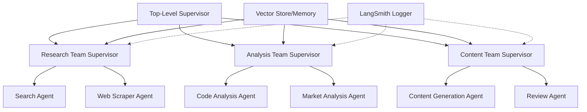

### 1. Architecture Overview



### 2. Key Components

1. **Memory System**:
   - Use Pinecone or Supabase Vector for long-term memory storage
   - Implement memory stream for recording agent experiences
   - Create retrieval model for context-aware responses

2. **RAG Integration**:
   - Vector database for storing documents and context
   - Implement semantic search for relevant context retrieval
   - Create document chunking and embedding pipeline

3. **Multi-Agent Communication Protocol (MCP)**:
   - Define standardized message format between agents
   - Implement supervisor routing logic
   - Create agent state management system

4. **LangSmith Logging**:
   - Set up comprehensive tracing
   - Implement performance monitoring
   - Create debugging dashboards

### 3. Implementation Plan

1. **Base Infrastructure**:
```typescript
// State Management
interface AgentState {
  messages: BaseMessage[];
  team_members: string[];
  next: string;
  instructions: string;
  memory: VectorStore;
}

// Supervisor Configuration
interface SupervisorConfig {
  llm: LanguageModelV1;
  tools: Tool[];
  memory: VectorStore;
  logger: LangSmithLogger;
}
```

2. **Memory Integration**:
```typescript
interface MemorySystem {
  vectorStore: VectorStore;
  retriever: BaseRetriever;
  addToMemory(content: string): Promise<void>;
  queryMemory(query: string): Promise<string[]>;
}
```

3. **RAG System**:
```typescript
interface RAGSystem {
  documentStore: VectorStore;
  embedder: Embeddings;
  chunker: TextSplitter;
  addDocument(doc: Document): Promise<void>;
  query(question: string): Promise<string>;
}
```

4. **LangSmith Integration**:
```typescript
interface LangSmithLogger {
  traceStart(agentId: string): void;
  traceEnd(agentId: string): void;
  logDecision(decision: string): void;
  logError(error: Error): void;
}
```

### 4. Additional Considerations

1. **Error Handling & Resilience**:
   - Implement retry mechanisms for failed agent tasks
   - Create fallback strategies for agent communication
   - Set up monitoring and alerting

2. **Scalability**:
   - Use message queues for async communication
   - Implement caching for frequently accessed data
   - Design for horizontal scaling of agents

3. **Security**:
   - Implement agent authentication
   - Secure inter-agent communication
   - Protect sensitive data in memory store

4. **Performance Optimization**:
   - Cache frequently used embeddings
   - Batch process similar tasks
   - Implement efficient vector search

### 5. Required Dependencies

```json
{
  "dependencies": {
    "@langchain/core": "latest",
    "@langchain/langgraph": "latest",
    "@langchain/openai": "latest",
    "@pinecone-database/pinecone": "latest",
    "@supabase/supabase-js": "latest",
    "langsmith": "latest"
  }
}
```
