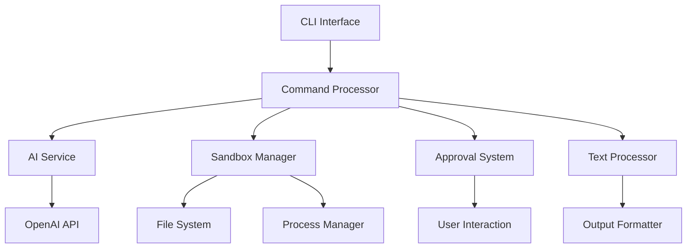
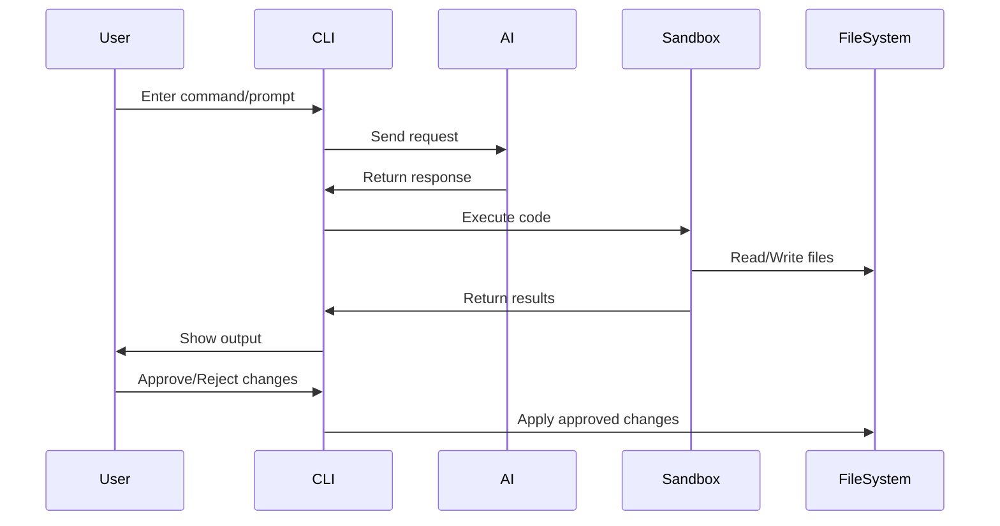
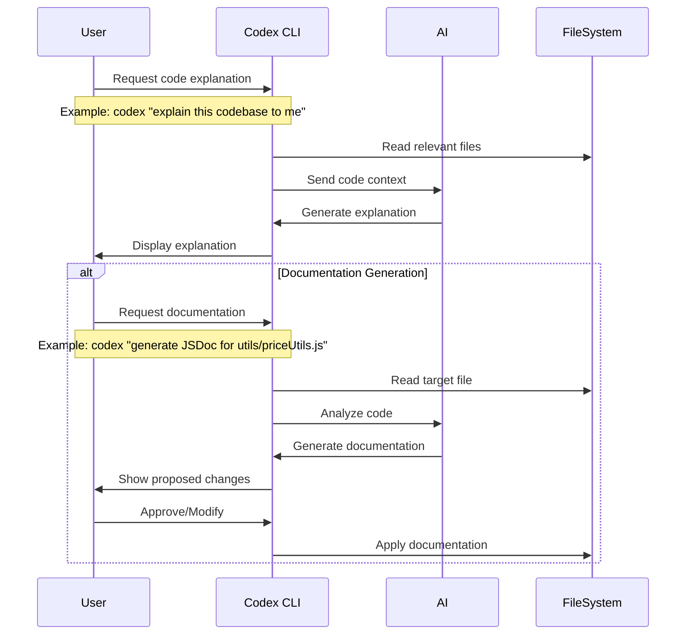
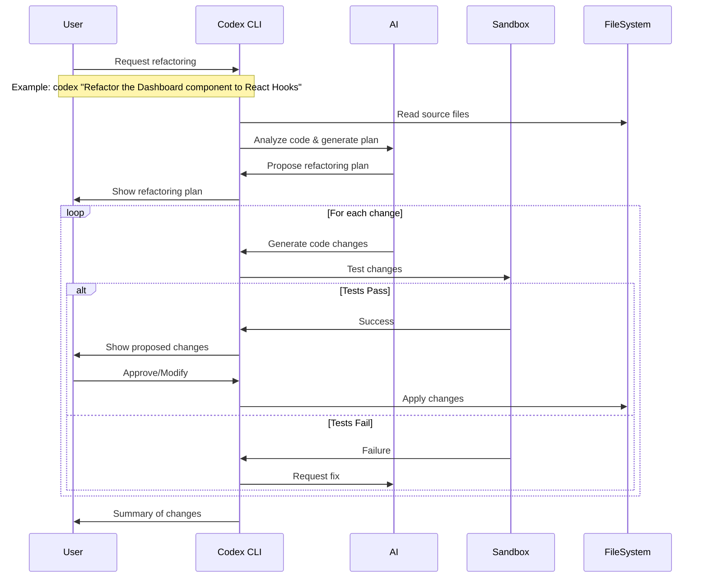
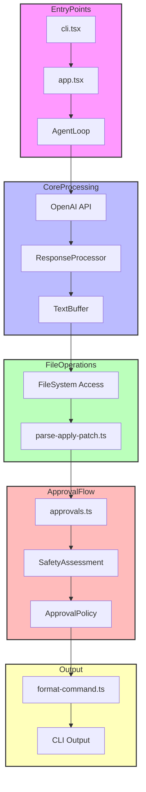
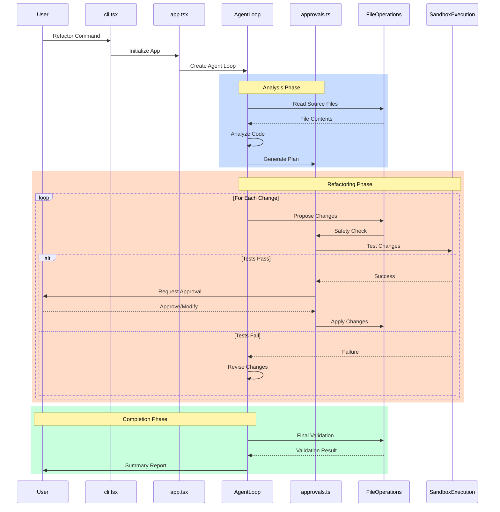
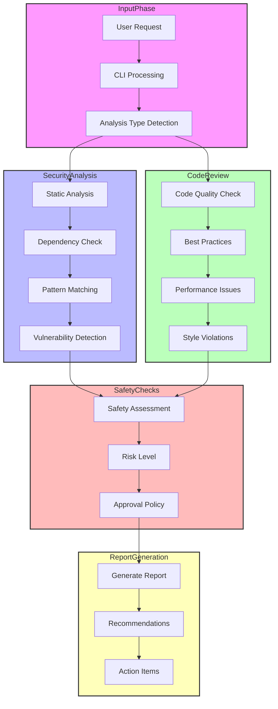
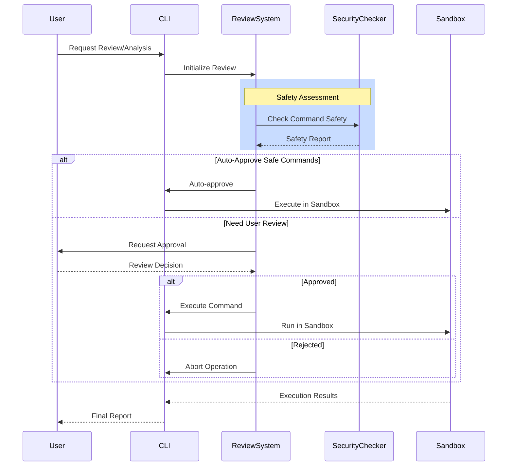
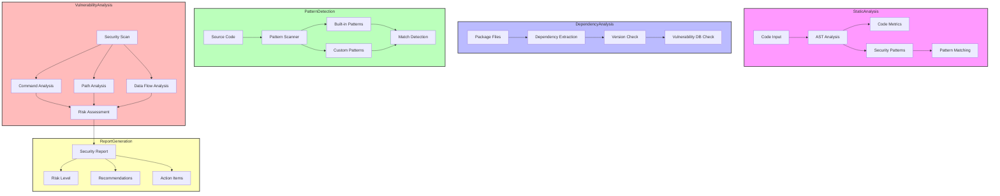

[OpenAI codex](https://github.com/openai/codex)

## 1. Main Features:

### a. Core Features:
- Interactive CLI Interface (`codex-cli/src/cli.tsx`)
  - Provides a chat-like interface for interacting with Codex
  - Handles user input and AI responses
  - Manages the conversation flow

- Code Execution and File Management (`codex-cli/src/approvals.ts`)
  - Executes code in a sandboxed environment
  - Manages file operations (read/write)
  - Handles approval workflows for changes

- Text Processing and Formatting (`codex-cli/src/text-buffer.ts`, `codex-cli/src/format-command.ts`)
  - Processes and formats code and text output
  - Handles text buffer management
  - Formats commands and responses

### b. Tech Stack:
- TypeScript/JavaScript
- Node.js (v22+)
- React (for CLI UI)
- OpenAI API (for AI capabilities)
- Docker (for sandboxing on Linux)

## 2. Architecture:



## 3. Key Workflows:



## 4. Integration and Use Cases:

This is a CLI tool rather than a framework, but here's how to integrate and use it:

Integration Steps:
1. Install globally: `npm install -g @openai/codex`
2. Set OpenAI API key: `export OPENAI_API_KEY="your-key"`
3. Run in your project directory: `codex`

Use Cases:
- Code explanation and documentation
- Code refactoring and optimization
- Bug fixing and debugging
- Test generation
- Code review and security analysis
- Database migrations
- File operations and bulk changes

## 5. Third-party Tools and Dependencies:

- OpenAI API: Core AI capabilities
- Docker: Sandboxing on Linux systems
- Node.js: Runtime environment
- React: CLI UI components
- TypeScript: Type safety and development
- Vite: Build tool
- ESLint: Code linting
- Prettier: Code formatting
- Husky: Git hooks
- Jest: Testing framework

The project is designed to be a secure, sandboxed coding assistant that can help with various development tasks while maintaining safety through its approval system and sandboxing mechanisms. It's particularly useful for developers who want AI assistance directly in their terminal while maintaining control over code changes.

Let me analyze the codebase to understand these specific workflows in detail.

Read file: codex-cli/examples/prompting_guide.md
Based on the codebase analysis, let me detail the workflows for code explanation/documentation and refactoring/optimization:

1. Code Explanation and Documentation Workflow:



Key Features:
- Interactive code analysis
- Documentation generation (JSDoc, README, etc.)
- File-level or function-level explanations
- Support for multiple documentation formats
- Version control integration

2. Code Refactoring and Optimization Workflow:



## Implementation Details:

### 1. Code Explanation Mode:
```typescript
// Example usage
codex "explain utils/priceUtils.js"
```
Features:
- Reads file content
- Analyzes code structure
- Identifies key components
- Explains logic and patterns
- Suggests improvements



### 2. Refactoring Mode:
```typescript
// Example usage
codex "Refactor the Dashboard component to React Hooks"
```
Features:
- Safety checks (git status)
- Code analysis
- Test execution
- Incremental changes
- Rollback capability

Key Safety Features:
1. Sandboxed execution
2. Version control integration
3. Test validation
4. Approval workflow
5. Rollback capability

Best Practices:
1. Always work in a git-tracked directory
2. Use specific, targeted prompts
3. Review changes before approval
4. Keep test coverage high
5. Document significant changes



Example Workflow Commands:

```bash
# Code Explanation
codex "explain the authentication flow in this codebase"
codex "document the API endpoints in api/routes.js"

# Code Refactoring
codex "refactor UserProfile class to functional component"
codex "optimize the performance of utils/dataProcessing.js"
```

The tool provides three levels of autonomy:
1. **Suggest Mode** (Default): Requires approval for all changes
2. **Auto Edit**: Can apply file changes but needs approval for commands
3. **Full Auto**: Can make changes and run commands (in sandbox)

For both workflows, the tool maintains safety through:
- Sandboxed execution
- Network isolation
- Directory confinement
- Git integration for safety net
- Test validation
- User approval system


#### Code Path Details:

1. Entry Point (`cli.tsx`):
```typescript
// Main CLI entry
cli.tsx (line 1-100)
├── Initialize configuration
├── Parse command line arguments
└── Start App or run in quiet mode
```

2. App Initialization (`app.tsx`):
```typescript
// App component
app.tsx (line 1-107)
├── Initialize state
├── Set up agent loop
└── Handle user interactions
```

3. Agent Loop (`utils/agent/agent-loop.ts`):
```typescript
// Core processing logic
AgentLoop
├── Process user input
├── Call OpenAI API
└── Handle responses
```

4. Approvals (`approvals.ts`):
```typescript
// Safety and approval management
approvals.ts (line 1-529)
├── Safety assessment
├── Command validation
└── Patch application
```

5. File Operations:
```typescript
// File handling
parse-apply-patch.ts (line 1-114)
├── Parse patches
├── Apply changes
└── Validate modifications
```

Key Implementation Files:
1. `cli.tsx`: Main entry point and command processing
2. `app.tsx`: Core application logic and UI
3. `approvals.ts`: Safety checks and approval workflow
4. `parse-apply-patch.ts`: File modification handling
5. `text-buffer.ts`: Text processing and manipulation
6. `format-command.ts`: Command formatting and display

The workflow is designed to be:
1. Safe: All operations are sandboxed and validated
2. Incremental: Changes are applied step by step
3. Interactive: User can review and approve changes
4. Reversible: Changes are tracked in git
5. Testable: Changes are validated before applying

The system uses a three-tier approval system:
1. `suggest`: Most restrictive, requires approval for all changes
2. `auto-edit`: Allows automatic file edits but requires command approval
3. `full-auto`: Most permissive, runs in sandbox with network disabled


### 3. Code Review and Security Analysis Workflow:



#### Review Decision Workflow:



Best Practices Implemented:

1. Approval Policies:
- `suggest`: Most restrictive, requires approval for all changes
- `auto-edit`: Allows automatic file edits with command approval
- `full-auto`: Runs in sandbox with network disabled

2. Security Measures:
- Network isolation
- Directory confinement
- Command validation
- Pattern matching for vulnerabilities
- Dependency checking

3. Review Process:
- Static code analysis
- Best practices checking
- Performance review
- Style validation
- Security vulnerability scanning

4. Safety Features:
- Command sandboxing
- Write permission control
- Network access control
- Execution isolation
- Rollback capability


#### Static Analysis:
```typescript
// In utils/singlepass/code_diff.ts - Static code analysis
export class CodeAnalyzer {
    static analyzeCode(content: string): StaticAnalysisResult {
        return {
            // Code metrics
            complexity: calculateComplexity(content),
            dependencies: extractDependencies(content),
            securityIssues: findSecurityIssues(content)
        };
    }
}

// In utils/storage/command-history.ts - Pattern detection
const SENSITIVE_PATTERNS = [
    /password/i,
    /secret/i,
    /token/i,
    /api[_-]?key/i,
    /credential/i,
    /auth/i
];
```

#### Dependency Check:
```typescript
// In utils/check-dependencies.ts
export interface DependencyCheck {
    name: string;
    version: string;
    vulnerabilities: Array<{
        severity: 'low' | 'medium' | 'high' | 'critical';
        description: string;
        fixedIn: string;
    }>;
}

// Command validation in approvals.ts
export function isSafeCommand(
    command: ReadonlyArray<string>,
): SafeCommandReason | null {
    // Check for package manager commands
    if (command[0] === "npm" || command[0] === "yarn") {
        if (command[1] === "install" || command[1] === "add") {
            return {
                reason: "Package installation",
                group: "Dependencies"
            };
        }
    }
}
```

#### Pattern Matching:
```typescript
// In utils/storage/command-history.ts
export function isSensitiveCommand(
    command: string,
    additionalPatterns: Array<string> = [],
): boolean {
    // Check built-in patterns
    for (const pattern of SENSITIVE_PATTERNS) {
        if (pattern.test(command)) {
            return true;
        }
    }

    // Check additional patterns from config
    for (const patternStr of additionalPatterns) {
        try {
            const pattern = new RegExp(patternStr);
            if (pattern.test(command)) {
                return true;
            }
        } catch {
            // Invalid regex pattern, skip it
            continue;
        }
    }
    return false;
}
```

#### Vulnerability Detection:
```typescript
// Security Assessment Types
export type SecurityAssessment = {
    vulnerabilities: Vulnerability[];
    riskLevel: 'low' | 'medium' | 'high';
    recommendations: string[];
};

export type Vulnerability = {
    type: VulnerabilityType;
    severity: 'low' | 'medium' | 'high' | 'critical';
    description: string;
    location: string;
    remediation: string;
};

// Vulnerability Types
enum VulnerabilityType {
    COMMAND_INJECTION = 'command_injection',
    PATH_TRAVERSAL = 'path_traversal',
    UNSAFE_DESERIALIZATION = 'unsafe_deserialization',
    SENSITIVE_DATA_EXPOSURE = 'sensitive_data_exposure',
    INSECURE_DEPENDENCIES = 'insecure_dependencies'
}
```

#### comprehensive security analysis workflow:



The materials used for each analysis type:

1. Static Analysis:
- Source code files
- AST (Abstract Syntax Tree) analysis
- Code metrics (complexity, coupling, etc.)
- Security patterns database
- Coding standards and best practices

2. Dependency Check:
- Package.json/package-lock.json
- Requirements.txt
- Dependency version information
- Known vulnerability databases
- Version compatibility matrix

3. Pattern Matching:
- Built-in security patterns
- Custom pattern configurations
- Regular expressions database
- Common vulnerability patterns
- Code smell patterns

4. Vulnerability Detection:
- Command injection patterns
- Path traversal checks
- Data flow analysis
- Input validation rules
- Security best practices

Implementation Example:

```typescript
class SecurityAnalyzer {
    // Static Analysis
    async performStaticAnalysis(sourceCode: string): Promise<StaticAnalysisResult> {
        const ast = this.parseCode(sourceCode);
        const metrics = this.calculateMetrics(ast);
        const patterns = await this.matchSecurityPatterns(ast);
        
        return {
            complexity: metrics.complexity,
            vulnerablePatterns: patterns,
            recommendations: this.generateRecommendations(patterns)
        };
    }

    // Dependency Check
    async checkDependencies(packageFile: string): Promise<DependencyCheckResult> {
        const deps = this.parseDependencies(packageFile);
        const vulnerabilities = await this.checkVulnerabilityDatabase(deps);
        
        return {
            dependencies: deps,
            vulnerablePackages: vulnerabilities,
            updateRecommendations: this.getUpdateSuggestions(vulnerabilities)
        };
    }

    // Pattern Matching
    async matchPatterns(content: string): Promise<PatternMatchResult> {
        const matches = [];
        
        // Built-in patterns
        for (const pattern of SECURITY_PATTERNS) {
            if (pattern.test(content)) {
                matches.push({
                    type: pattern.type,
                    location: this.findLocation(content, pattern),
                    severity: pattern.severity
                });
            }
        }
        
        // Custom patterns
        const customPatterns = await this.loadCustomPatterns();
        for (const pattern of customPatterns) {
            // Similar matching logic
        }
        
        return {
            matches,
            riskLevel: this.calculateRiskLevel(matches)
        };
    }

    // Vulnerability Detection
    async detectVulnerabilities(
        sourceCode: string,
        dependencies: DependencyCheckResult,
        patterns: PatternMatchResult
    ): Promise<VulnerabilityReport> {
        const vulnerabilities = [];
        
        // Command injection checks
        vulnerabilities.push(...this.checkCommandInjection(sourceCode));
        
        // Path traversal checks
        vulnerabilities.push(...this.checkPathTraversal(sourceCode));
        
        // Dependency vulnerabilities
        vulnerabilities.push(...this.processDependencyVulnerabilities(dependencies));
        
        // Pattern-based vulnerabilities
        vulnerabilities.push(...this.processPatternMatches(patterns));
        
        return {
            vulnerabilities,
            riskLevel: this.assessOverallRisk(vulnerabilities),
            recommendations: this.generateSecurityRecommendations(vulnerabilities)
        };
    }
}
```

This comprehensive security analysis system helps ensure code safety and security by:
1. Analyzing code statically for potential issues
2. Checking dependencies for known vulnerabilities
3. Matching against known dangerous patterns
4. Detecting various types of vulnerabilities
5. Providing actionable recommendations
