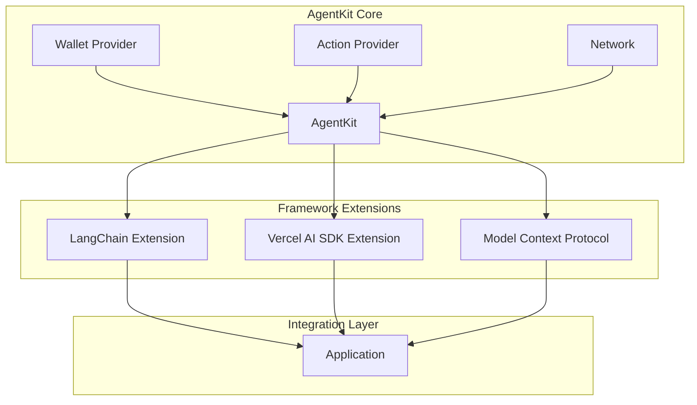
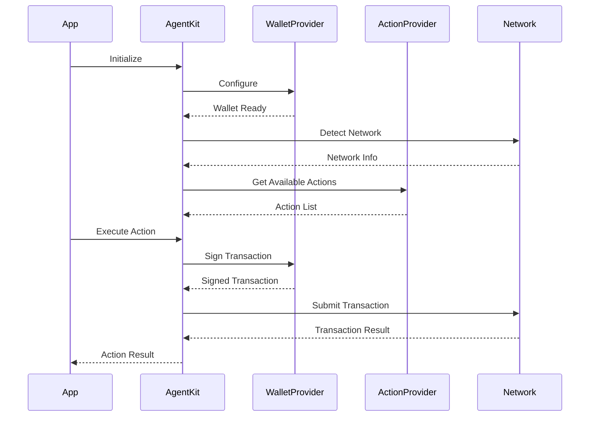

[Coinbase AgnetKit](https://github.com/coinbase/agentkit) tech analysis

## 1. Main Features:

### a. Core Features:
- Wallet Integration (`agentkit/src/wallet-providers/`)
  - Supports multiple wallet providers including CDP Wallet
  - Handles network interactions and wallet management
  
- Action System (`agentkit/src/action-providers/`)
  - Provides composable blockchain actions
  - Extensible action provider system
  
- Network Management (`agentkit/src/network/`)
  - Network detection and configuration
  - Cross-chain compatibility

### b. Feature-File Mapping:
```
agentkit/
├── src/
│   ├── wallet-providers/ - Wallet integration
│   ├── action-providers/ - Action system
│   ├── network/ - Network management
│   └── analytics/ - Usage tracking and analytics

framework-extensions/
├── langchain/ - LangChain integration
├── vercel-ai-sdk/ - Vercel AI SDK support
└── model-context-protocol/ - Anthropic MCP integration
```

### c. Tech Stack Implementation:
- TypeScript as the core language
- Modular architecture using TypeScript interfaces and classes
- Framework-agnostic core with specific framework extensions
- Dependency injection for wallet and action providers

## 2. Architecture:



## 3. Key Workflows:



## 4. Integration and Use Cases:

### a. LangGraph Integration:
```typescript
import { AgentKit } from '@coinbase/agentkit';
import { LangChainExtension } from '@coinbase/agentkit-langchain';

// Initialize AgentKit with LangChain
const agentKit = await AgentKit.from({
  cdpApiKeyName: 'your-key',
  cdpApiKeyPrivateKey: 'your-private-key'
});

// Create LangChain workflow
const workflow = new LangChainExtension(agentKit)
  .withTools(agentKit.getActions())
  .build();
```

### b. Vercel AI Integration:
```typescript
import { AgentKit } from '@coinbase/agentkit';
import { VercelAIExtension } from '@coinbase/agentkit-vercel-ai-sdk';

// Initialize with Vercel AI
const agentKit = await AgentKit.from({
  walletProvider: customWalletProvider
});

// Create Vercel AI stream
const stream = VercelAIExtension.createStream(agentKit, {
  actions: agentKit.getActions()
});
```

## Use Cases:
- DeFi automation agents
- NFT trading bots
- Cross-chain bridge automation
- Wallet management assistants
- Smart contract interaction agents

5. Third-Party Tools Used:

1. Development Tools:
   - PNPM - Package management
   - Turbo - Monorepo management
   - Jest - Testing framework
   - ESLint/Prettier - Code formatting and linting

2. Framework Integrations:
   - LangChain - For AI agent workflows
   - Vercel AI SDK - For streaming AI responses
   - Anthropic MCP - For model context handling

3. Blockchain Tools:
   - CDP Wallet Provider - For secure wallet management
   - Ethereum providers - For blockchain interaction

4. Build Tools:
   - TypeScript - For type safety and better developer experience
   - Changesets - For version management
   - Turbo - For build optimization

Each tool was chosen to provide:
- Type safety and developer experience (TypeScript)
- Scalable monorepo management (PNPM, Turbo)
- Flexible AI integration options (LangChain, Vercel AI)
- Secure blockchain interactions (CDP Wallet)
- Maintainable codebase (ESLint, Prettier, Jest)

