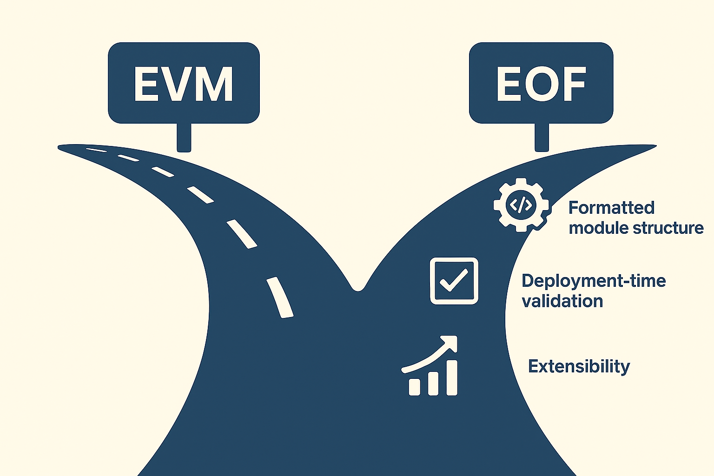

## Understanding the Evolution of EVM: From Legacy Design to EOF

### Introduction

The Ethereum Virtual Machine (EVM) has served as the heart of Ethereum's smart contract execution since the genesis block. It is a stack-based, interpreted virtual machine with a minimal instruction set. While this design was critical for Ethereum's early growth, its simplicity has now become a bottleneck for scalability, security, and optimization. This is where the EVM Object Format (EOF) comes into play.

EOF is a structural redesign of EVM bytecode that introduces validation, modular code layout, and better control flow management. This article explores the differences between Legacy EVM and EOF, outlines the current state of EOF development, and provides guidance for developers who wish to start experimenting with EOF today.

---

### Part 1: Legacy EVM — Simplicity with Limitations

Legacy EVM is an interpreted system with no deployment-time validation. Every byte in a contract's code is treated as a potentially executable instruction. All opcodes are single-byte, and there is no structural separation between code, data, or metadata.

#### Key Limitations:
- **No structural format**: Everything is a raw byte, with no header or versioning.
- **Only supports DUP1–DUP16 and SWAP1–SWAP16**: Stack access is limited to top 16 elements, leading to 'Stack Too Deep' compiler errors.
- **Dynamic jumps**: Control flow via `JUMP` and `JUMPI` is determined at runtime, making static analysis, optimization, and JIT/AOT compilation nearly impossible.
- **No validation**: It’s impossible to verify jump destinations or stack depth at deployment time, increasing runtime overhead and vulnerability risk.

#### Why This Simplicity Becomes a Bottleneck:
- **Scalability**: The lack of structure prevents the use of modern compiler techniques such as function inlining, code deduplication, or gas-efficient static jumps. This leads to bloated bytecode and higher gas usage.
- **Security**: Since there's no deployment-time validation, issues like invalid jump destinations or unchecked stack depth can only be caught at runtime — if at all. This increases the likelihood of exploits.
- **Optimization**: Without clear segmentation of code and data or predictable control flow, optimizing the execution engine (e.g., through JIT compilation) is nearly impossible. The VM must treat every byte as potentially executable, creating a high-overhead execution environment.

---

### Part 2: What EOF Changes

EOF introduces a new modular structure for EVM bytecode with the following improvements:

#### Core Features:
- **Code and data separation**: Bytecode is divided into code sections, data sections, and metadata.
- **Header and versioning**: Allows the VM to interpret code differently based on EOF version.
- **Deployment-time validation**: Checks stack depth, valid jump destinations, and memory bounds statically.
- **Extended instruction set**: Introduces multi-byte opcodes such as `DUPX`, `SWAPX`, and `EXCHANGEX`, allowing access to up to 256 stack items.
- **Static control flow**: New jump instructions with fixed destinations enable efficient analysis and future JIT compilation.

EOF is designed to be backward-compatible: existing legacy bytecode continues to run on the legacy EVM, while new contracts explicitly opt into EOF format.

---

### Part 3: Current Status of EOF (as of June 2025)

EOF was originally planned for inclusion in the upcoming Fusaka upgrade. However, due to technical uncertainties and community concerns, it has been postponed. Key reasons include:

#### Technical Challenges:
- **Instruction decoding ambiguity**: Legacy EVM interprets every byte independently, making it unsafe to introduce new multi-byte instructions.
- **Tooling readiness**: Compilers, debuggers, and audit pipelines must be updated to support EOF’s structural changes.
- **Prioritization conflict**: Developers decided to prioritize PeerDAS and other scalability features for Fusaka.

#### Community Resistance:
- Voter backlash on ETHPulse (17,000+ ETH voted against)
- Perceived complexity and audit cost of new bytecode format

Despite its removal from Fusaka, EOF has been implemented in most major Ethereum clients (Geth, Besu, Nethermind, Erigon) and continues to be tested in devnets.

---

### Part 4: How to Start Experimenting with EOF

EOF is not on mainnet yet, but you can begin testing today:

#### 1. Use Development Clients
EOF support has already been implemented in the following Ethereum clients:

- [Geth (Go Ethereum)](https://github.com/ethereum/go-ethereum/tree/master?utm_source=chatgpt.com)
- [Besu (Hyperledger)](https://github.com/hyperledger/besu?utm_source=chatgpt.com)
- [Nethermind](https://github.com/NethermindEth/nethermind?utm_source=chatgpt.com)
- [Erigon](https://github.com/ledgerwatch/erigon?utm_source=chatgpt.com)
- [ethereumjs (JavaScript EVM)](https://github.com/ethereumjs/ethereumjs-monorepo?utm_source=chatgpt.com)

You can fetch the latest development branches of these clients to run EOF-compatible nodes.

#### 2. Deploy on EOF Devnets
EOF features are currently deployed and testable on the following networks:

- **EOF Devnet-0**: For initial EOF proposals like EIP-3540 and EIP-3670.
- **EOF Devnet-1**: An upcoming devnet aligned with the Pectra upgrade, includes advanced EIPs like EIP-4750 and EIP-5450.

Some features may also be available on newer public testnets like **Hoodi**, but Devnet-0 and Devnet-1 are the canonical EOF testing environments.
- Try out EOF Devnet-0 and Devnet-1, which contain all current EOF EIPs:
  - [EIP-3540: EOF structure](https://eips.ethereum.org/EIPS/eip-3540?utm_source=chatgpt.com)
  - [EIP-3670: Code Validation](https://eips.ethereum.org/EIPS/eip-3670?utm_source=chatgpt.com)
  - [EIP-4200: Static Relative Jumps](https://eips.ethereum.org/EIPS/eip-4200?utm_source=chatgpt.com)
  - [EIP-4750: Functions](https://eips.ethereum.org/EIPS/eip-4750?utm_source=chatgpt.com)
  - [EIP-5450: Stack Validation](https://eips.ethereum.org/EIPS/eip-5450?utm_source=chatgpt.com)

#### 3. Compile with EOF-enabled Solidity
- Use custom Solidity builds or Vyper forks that support EOF-aware compilation.

#### 4. Read and Track Relevant EIPs
- Same EIPs as above, each corresponding to a key aspect of EOF evolution and validation.

---

### Conclusion

EOF marks a major evolution in Ethereum’s execution layer, paving the way for safer, faster, and more predictable smart contract execution. While not yet on mainnet, the groundwork has been laid. Developers interested in the next generation of Ethereum should start familiarizing themselves with EOF today.

