## **What does the downloader do?**
The downloader package is responsible for the full chain synchronization in go-ethereum. It's a critical component that handles:
1. Block synchronization from peers
2. Different sync modes (Full Sync and Snap Sync)
3. State synchronization
4. Header and block body downloads
5. Receipt synchronization
6. Peer management for downloads

#### 1. **Block Synchronization from Peers**

When it starts:
- On node startup
- When node detects it's behind the network
- When receiving new block announcements

Sync Modes:
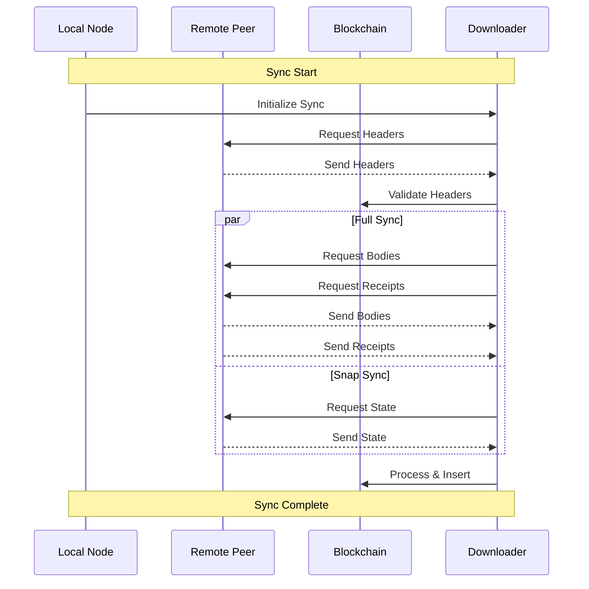

Code paths:
- Main entry: `downloader.go:New()`
- Sync initiation: `downloader.go:synchronise()`
- Block processing: `downloader.go:processBlocks()`

#### 2. **Different Sync Modes**

Full Sync vs Snap Sync:
- Full Sync:
  - Downloads all blocks from genesis
  - Executes all transactions
  - Builds state from scratch
  - Result: Complete blockchain history

- Snap Sync:
  - Downloads recent state directly
  - Only processes recent blocks
  - Uses pivot point for state sync
  - Result: Recent state + recent history

#### 3. **State Synchronization**

Definition: Process of downloading the current state trie of the Ethereum network.

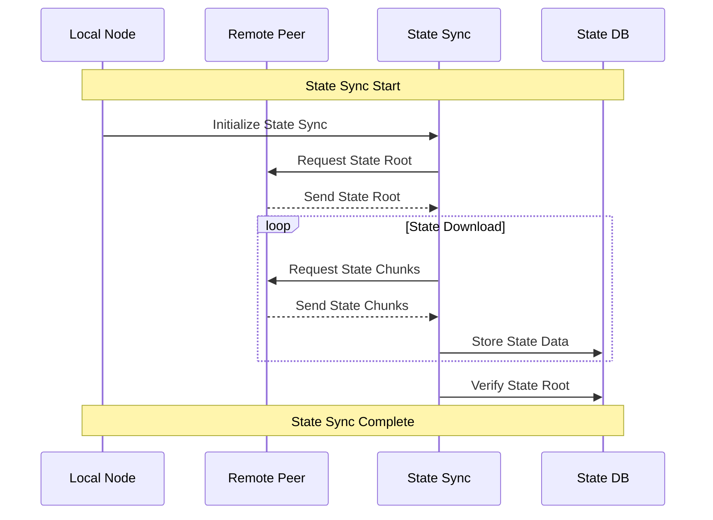

Code paths:
- Entry: `statesync.go:NewStateSync()`
- Processing: `statesync.go:Process()`
- Storage: `statesync.go:CommitState()`

#### 4. **Header and Block Body Downloads**

When and Why:
- Headers: First step in sync to establish chain structure
- Bodies: Required for transaction execution and state updates

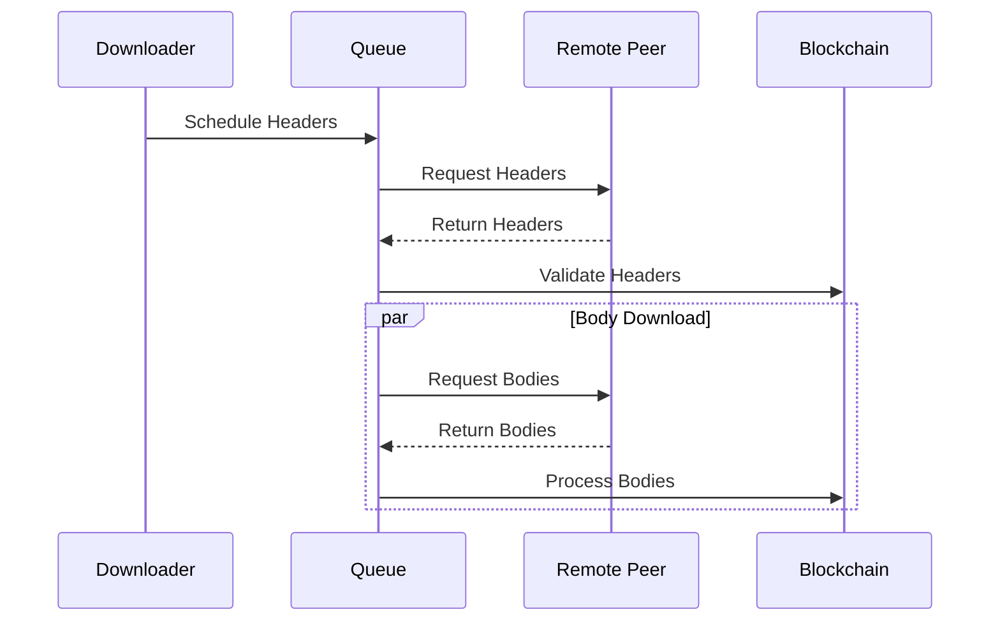

Code paths:
- Header download: `downloader.go:fetchHeaders()`
- Body download: `fetchers_concurrent_bodies.go`

#### 5. **Receipt Synchronization**

Receipts: Transaction execution results containing logs and status.

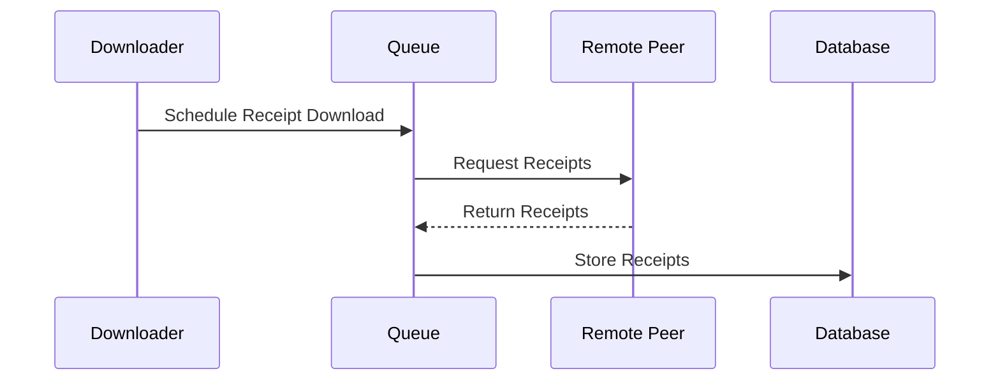

Code paths:
- Receipt sync: `fetchers_concurrent_receipts.go`
- Processing: `queue.go:processReceipts()`

#### 6. **Peer Management**

Role:
- Manages peer connections
- Tracks peer reliability
- Distributes download requests
- Handles peer scoring

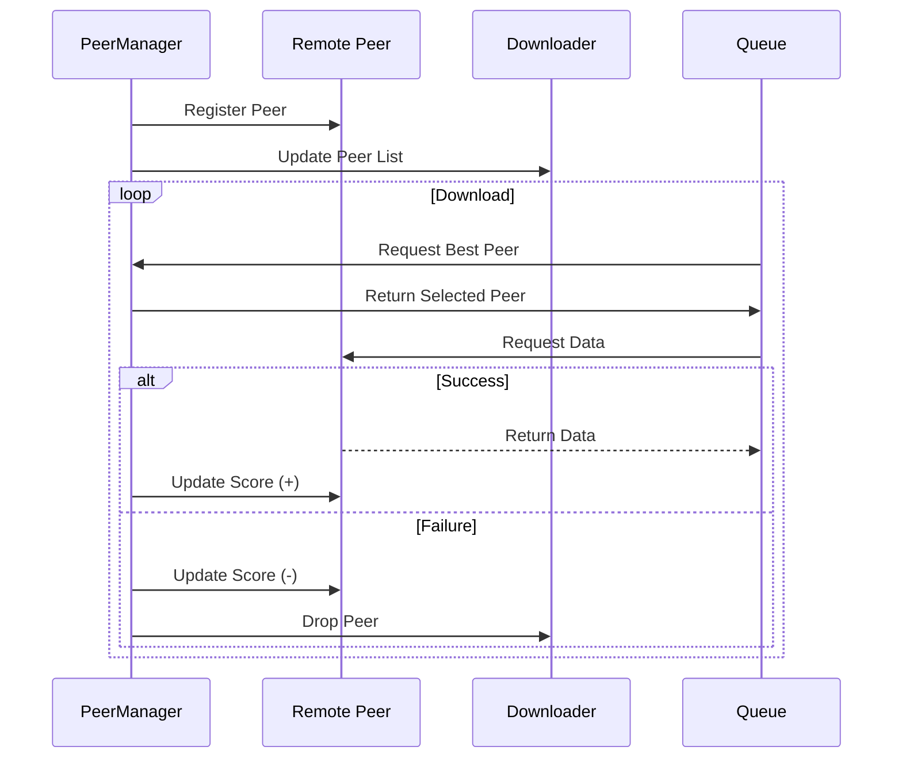

Code paths:
- Management: `peer.go`
- Selection: `queue.go:selectPeer()`


## 2. **Interaction with the whole repo:**

### a) **Role played:**
The downloader is a core component in the Ethereum client that ensures the node stays synchronized with the network. It:
- Manages blockchain synchronization
- Handles different sync strategies
- Coordinates with peers for data retrieval
- Ensures data consistency and validity

### b) **Workflow with whole repo:**

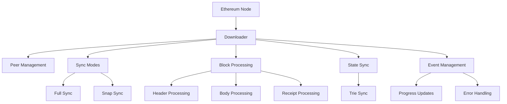

### c) **Architecture in the whole repo:**

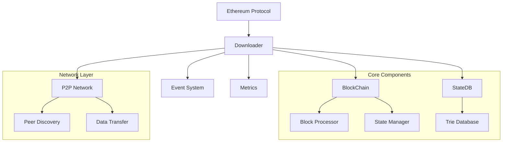

## 3. **Within the folder itself:**

### a) **Detailed features:**
- Header synchronization
- Block body fetching
- Receipt synchronization
- State synchronization
- Skeleton chain sync
- Beacon chain sync support
- Concurrent fetching
- Progress tracking
- Peer management
- Error handling and recovery

### b) **Major sub-components:**
- Downloader: Main orchestrator
- Queue: Manages download scheduling
- Skeleton: Handles header skeleton sync
- Fetchers: Concurrent download handlers
- ResultStore: Manages downloaded data
- BeaconSync: Handles beacon chain sync
- StateSync: Manages state synchronization

#### - **Skeleton Chain**

Purpose:
- Lightweight chain structure
- Enables efficient sync coordination
- Manages chain reorganizations

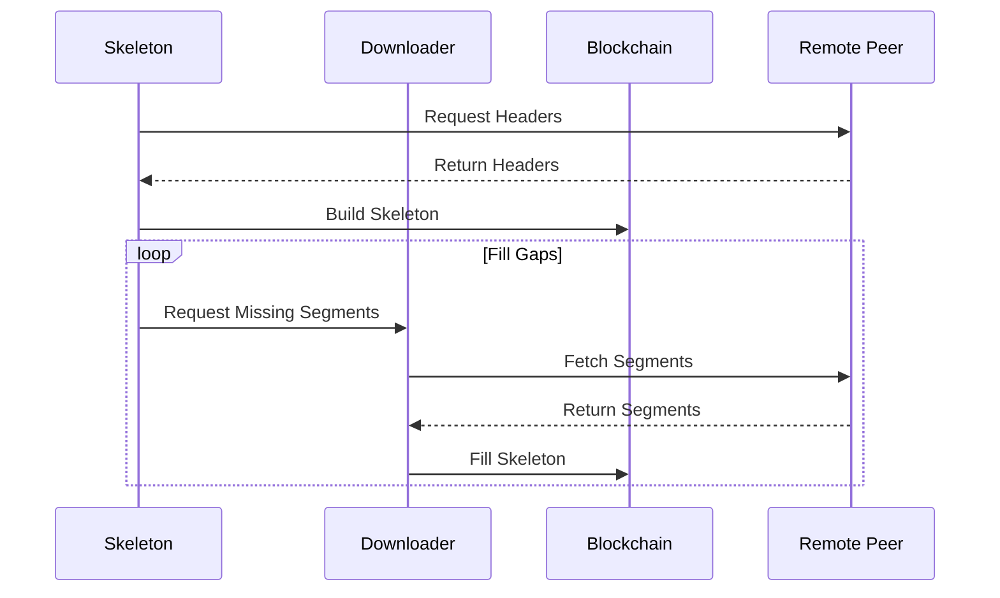

Code paths:
- Implementation: `skeleton.go`
- Processing: `skeleton.go:Process()`

#### - **Beacon Chain Sync**

Purpose:
- Post-merge synchronization
- Coordinates with consensus layer
- Handles finalized blocks

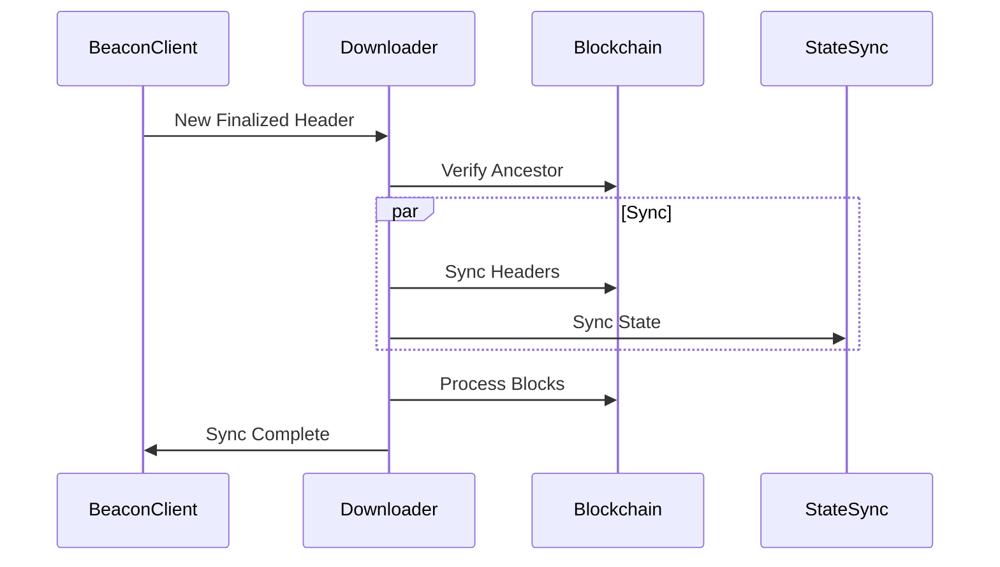

Code paths:
- Implementation: `beaconsync.go`
- Processing: `beaconsync.go:BeaconSync()`


### c) **Sub-component workflow:**

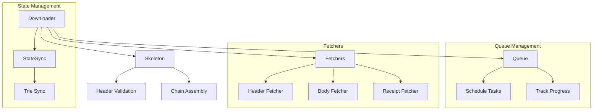

## 4. **Key Concepts:**
The downloader implements several important concepts:

- **Snap Sync**: An optimized synchronization mode that downloads the state directly, rather than reconstructing it from historical blocks. It's more efficient than full sync.
- **Skeleton Chain**: A lightweight representation of the blockchain's structure used to validate and organize block downloads.
- **Pivot Point**: In snap sync, this is the block from which state downloading begins, allowing for faster synchronization.
- **Concurrent Fetching**: The ability to download multiple pieces of data (headers, bodies, receipts) simultaneously from different peers.

## 5. **User Interaction:**
As a user, you can interact with the downloader through:

### 1. **Sync Mode Selection:**
```go
// Choose sync mode when starting geth
geth --syncmode "snap" // or "full"
```

### 2. **API Endpoints:**
```go
// Through RPC
eth.syncing // Check sync status
eth.syncProgress // Get detailed sync progress

// Through Management APIs
downloader.Progress() // Get sync progress
downloader.Cancel() // Cancel ongoing sync
```

### 3. **Monitoring:**
- Track sync progress through metrics
- Monitor sync status through logs
- Get sync statistics through API calls

### 4. **Configuration:**
- Set sync parameters through client configuration
- Configure sync thresholds and limits
- Manage peer connections and timeouts


## [Purge Mode](https://github.com/ethereum/go-ethereum/pull/31414)

#### Mermaid Diagram: Sync Process
it shows the major difference:
> if there is a cutoff, it will only insert header before cutoff and body receipt after, not the full data anymore

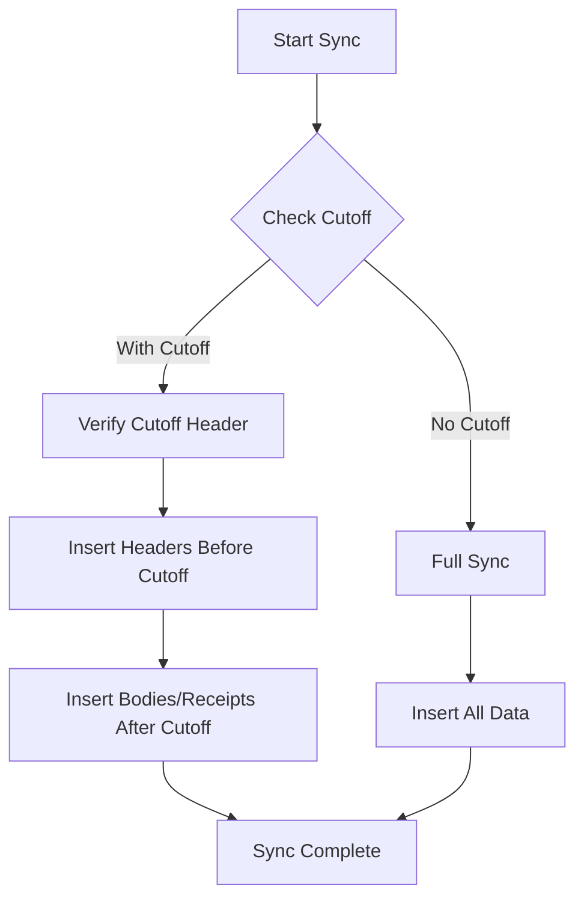
    
#### Sequence Diagram: InsertReceiptChain
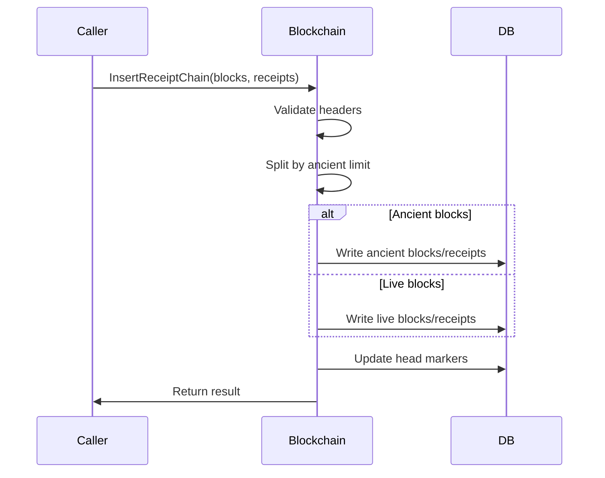