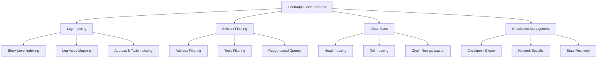
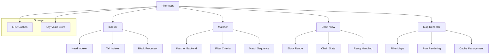
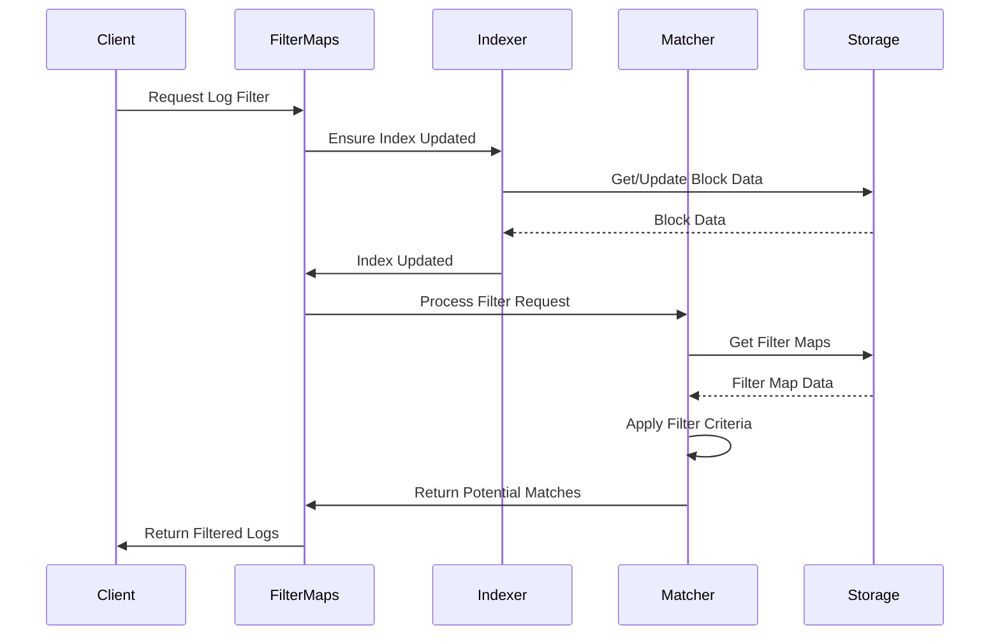
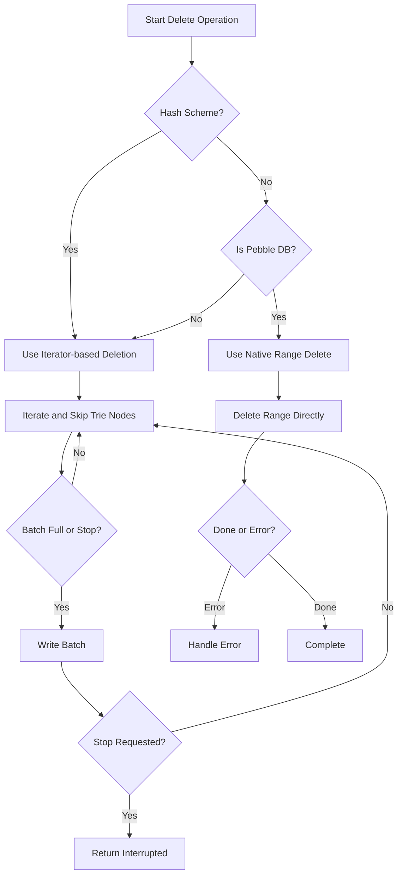
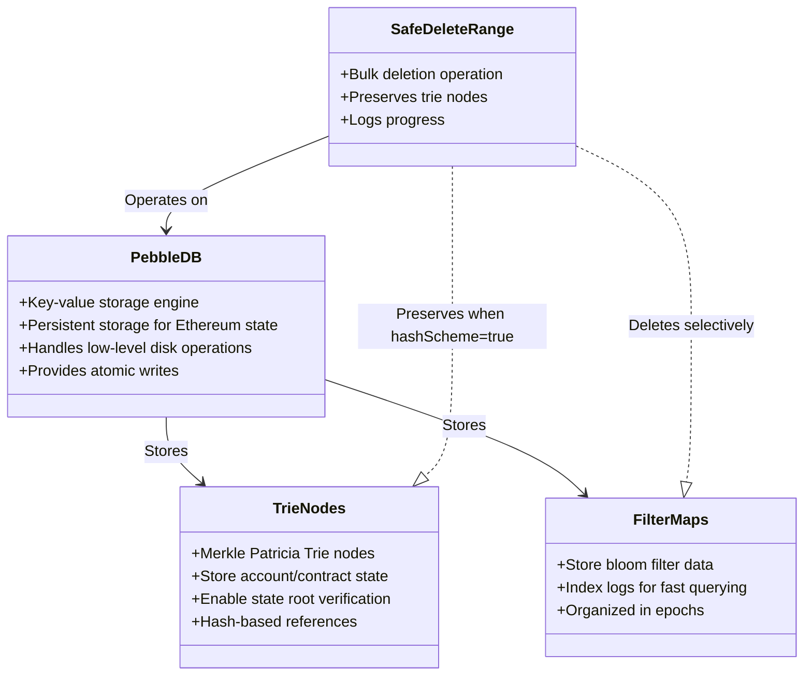

### 1. **What's the filtermaps do and its role?**
Filtermaps is a core component in go-ethereum that implements an efficient log indexing and filtering system. It plays several key roles:

- Provides fast and efficient log filtering capabilities for Ethereum nodes
- Implements the data structure proposed in EIP-7745 (without the tree hashing and consensus changes)
- Maintains an in-memory representation of the log index structure
- Enables efficient querying of historical logs based on addresses and topics
- Manages the synchronization between the log index and the canonical chain

### 2. **Main Features (Mermaid Chart)**

### 3. **Architecture (Mermaid Chart)**

### 4. **Key Workflows (Mermaid Chart)**

### 5. **Alternatives**

There are several alternative approaches to log filtering in Ethereum:

1. **Bloom Filters (Traditional)**
   - Used in older versions of go-ethereum
   - Less efficient for complex queries
   - Higher false positive rate
   - Simpler implementation

2. **Full Log Scanning**
   - No indexing required
   - Very inefficient for large datasets
   - Higher resource usage
   - Simple but not scalable

3. **External Indexing Solutions**
   - TheGraph
   - Custom indexing services
   - Requires additional infrastructure
   - Better for specific use cases

4. **RPC Node Services**
   - Infura, Alchemy, etc.
   - Outsourced log filtering
   - Network dependency
   - Less control over data

The current FilterMaps implementation provides several advantages over these alternatives:
- Better performance for complex queries
- Lower memory footprint
- More efficient chain reorganization handling
- Better integration with the Ethereum node
- Implementation of EIP-7745 data structure
- Support for checkpoint-based recovery

The FilterMaps approach is particularly well-suited for Ethereum nodes that need to handle large volumes of log queries efficiently while maintaining data consistency with the chain state.

### The concepts

#### Delete Log: `safeDeleteWithLogs`

##### Index Reset Operations:
**Purpose**: Used to completely wipe and reinitialize the filter maps database

**Implementation**:
* Clears all cached data (filter maps, last blocks, log value pointers)
* Uses safeDeleteWithLogs to safely delete all filter map data
* Resets the indexed range tracking
* Logs progress during the potentially long-running operation

**Why needed:**
* Required when the index becomes corrupted or inconsistent
* Used during initial setup of a new index
* Ensures clean slate before reindexing

##### Removing Old Bloom Bits Data:

**Purpose**: Cleans up obsolete bloom filter data from the database

**Implementation**:
* Calls rawdb.DeleteBloomBitsDb through safeDeleteWithLogs
* Runs in a separate goroutine from main indexer
* Handles shutdown signals gracefully

**Why needed:**
* Bloom bits are temporary data structures used during initial sync
* They become obsolete after full sync completes
* Removing them saves significant disk space
* Prevents interference with normal filter map operations

##### Deleting Tail Epochs of Filter Maps:
**Purpose**: Prunes old filter map epochs while maintaining boundary markers

**Implementation**:
* Deletes all data except last block pointer of last map in epoch
* Updates indexed range tracking
* Uses safeDeleteWithLogs for safe bulk deletion
* Maintains cache consistency

**Why needed:**
* Allows pruning of historical data while keeping structure intact
* Preserves boundary markers needed for queries
* Helps manage disk space usage
* Maintains performance by removing obsolete data
* The safeDeleteWithLogs method is central to all three operations, providing:

### PebbleDB and TrieNodes

#### Key explanations:
1. PebbleDB:
- Embedded key-value database (fork of RocksDB)
- Used as Ethereum's primary storage engine
- Provides ACID transactions and high performance
- Stores all chain data including blocks, receipts, state

2. Trie Nodes:
- Building blocks of Ethereum's state trie
- Each node contains hashes of child nodes
- Form cryptographic proofs of state
- Critical for light clients and state verification

3. Interaction:
- SafeDeleteRange must skip trie nodes during deletion
- Filter maps reference trie nodes for state proofs
- Both coexist in PebbleDB with different access patterns
- Deletion operations coordinate through PebbleDB's batch writes