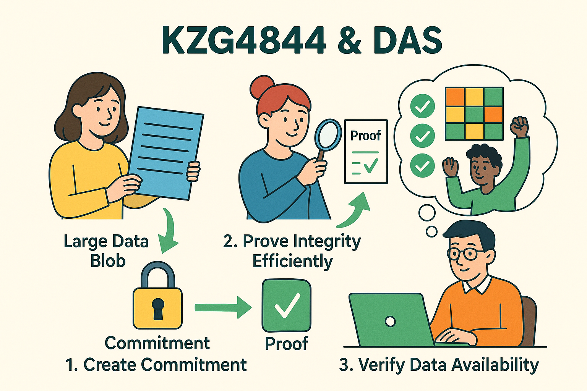
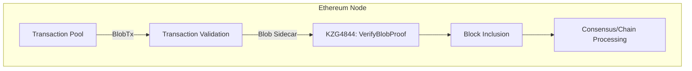
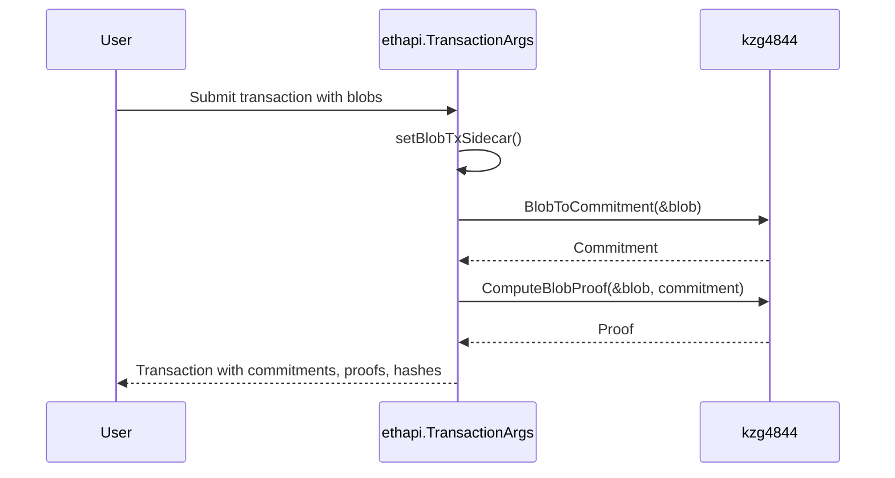
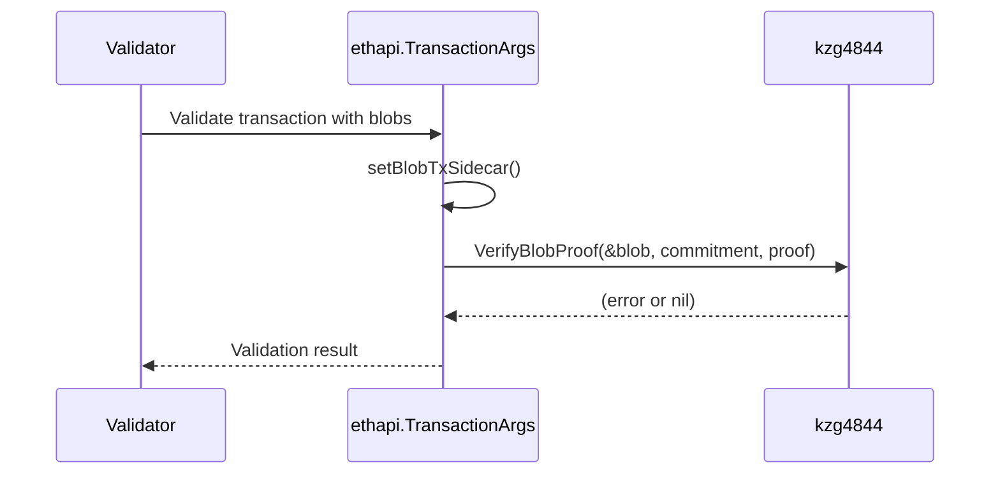
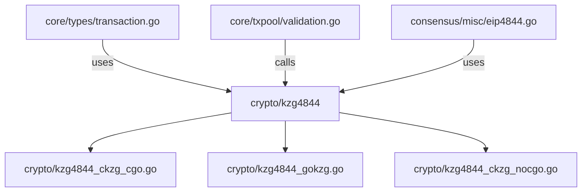
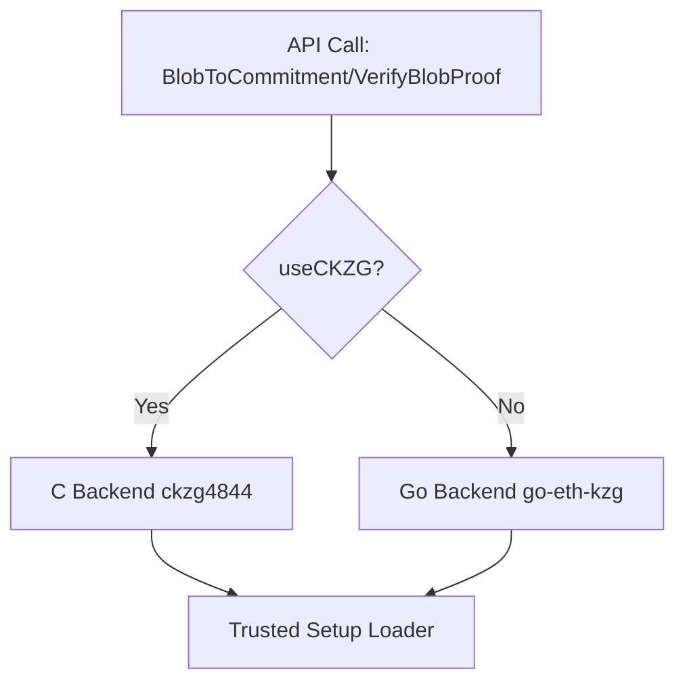
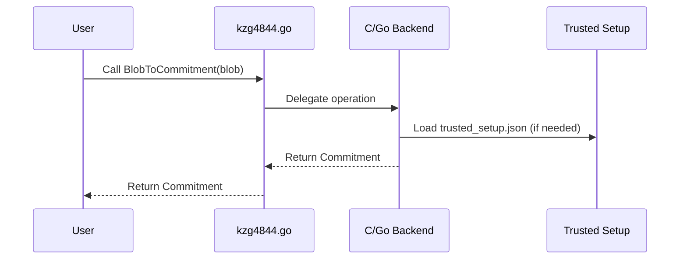

# [KZG4844](https://github.com/ethereum/go-ethereum/tree/master/crypto/kzg4844)


## 1. Relationship of KZG4844 Files

**Files in `crypto/kzg4844/`:**
- `kzg4844.go`: Main API and type definitions for KZG4844 operations.
- `kzg4844_ckzg_cgo.go`: CGO-based implementation using the C KZG library (for performance).
- `kzg4844_ckzg_nocgo.go`: Stub for platforms where CGO/C KZG is unavailable.
- `kzg4844_gokzg.go`: Pure Go implementation using the go-eth-kzg library.
- `kzg4844_test.go`: Tests for the KZG4844 functionality.
- `trusted_setup.json`: Trusted setup parameters for KZG commitments.

**Relationship:**
- `kzg4844.go` provides the main interface and type definitions (Blob, Commitment, Proof, etc.), and delegates cryptographic operations to either the C-based or Go-based implementation depending on platform and configuration.
- `kzg4844_ckzg_cgo.go` and `kzg4844_gokzg.go` implement the actual cryptographic operations, selected at runtime.
- `kzg4844_ckzg_nocgo.go` is a fallback for unsupported platforms.
- `trusted_setup.json` is required for initializing the cryptographic context.

---

## 2. What Does KZG4844 Do?

**KZG4844** implements the KZG (Kate-Zaverucha-Goldberg) polynomial commitment scheme for EIP-4844 (Proto-Danksharding) in Ethereum. It enables:
- **Commitment to large data blobs** (polynomials) with short proofs.
- **Efficient verification** that a given value is the evaluation of a committed polynomial at a specific point.
- **Data availability sampling** and blob transactions, crucial for scaling Ethereum via sharding.


| Function             | Purpose                                      | When Used                        |
|----------------------|----------------------------------------------|----------------------------------|
| BlobToCommitment     | Create a commitment from a blob              | When constructing transactions   |
| VerifyBlobProof      | Verify blob matches commitment (with proof)  | During validation/consensus      |

---

## 3. Interaction with the Whole Repo

### 3.1 Role in the Repo

- **KZG4844** is a cryptographic primitive used for verifying blob transactions introduced in EIP-4844.
- It is called from transaction validation, block processing, and consensus code, especially when handling blob transactions.

### 3.2 Workflow with the Repo (Mermaid Chart)



### 3.2.1. Constructing the Transaction: How `BlobToCommitment` is Called



---

### 3.2.2. During Validation: How `VerifyBlobProof` is Called



### 3.3 Architecture in the Repo (Mermaid Chart)



---

## 4. As a Component

### 4.1 Detailed Features

- **Blob Commitment**: Create a cryptographic commitment to a data blob.
- **Proof Generation**: Generate KZG proofs for blob data.
- **Proof Verification**: Verify that a proof matches a commitment and data.
- **Blob Hash Calculation**: Compute versioned blob hashes for transaction inclusion.
- **Backend Switching**: Switch between Go and C implementations for performance or compatibility.

### 4.2 Major Subcomponents & Interactions

- **API Layer (`kzg4844.go`)**: Exposes all main functions and types.
- **Backend Implementations**:
  - **C-based (`kzg4844_ckzg_cgo.go`)**: High-performance, uses native bindings.
  - **Go-based (`kzg4844_gokzg.go`)**: Pure Go, portable.
  - **No-CGO (`kzg4844_ckzg_nocgo.go`)**: Fallback, panics if used.
- **Trusted Setup Loader**: Loads parameters from `trusted_setup.json`.

### 4.3 Subcomponent Main Workflow (Mermaid Chart)



### 4.4 Sequence Chart: Subcomponent & Main Features



### 4.5 Data Structure
### Data Structures

Both **Commitment** and **Proof** are related to EIP-4844 (proto-danksharding) and are used in blob transactions. In go-ethereum, these are defined in the `github.com/ethereum/go-ethereum/crypto/kzg4844` package.

- **Commitment**: This is typically a fixed-size byte array representing a KZG commitment to a blob of data.
- **Proof**: This is also a fixed-size byte array, representing a KZG proof for a blob.

You can see their usage in transaction marshalling and validation, for example in [transaction_marshalling.go](https://github.com/ethereum/go-ethereum/blob/master/core/types/transaction_marshalling.go) and [validation.go](https://github.com/ethereum/go-ethereum/blob/master/core/txpool/validation.go).

From the context in `transaction_marshalling.go`, you can see:
```go:https://github.com/ethereum/go-ethereum/blob/master/core/types/transaction_marshalling.go
// ... existing code ...
Blobs       []kzg4844.Blob       `json:"blobs,omitempty"`
Commitments []kzg4844.Commitment `json:"commitments,omitempty"`
Proofs      []kzg4844.Proof      `json:"proofs,omitempty"`
// ... existing code ...
```
This means that `Commitment` and `Proof` are types defined in the `kzg4844` package, and are slices of those types in the transaction's JSON representation.

### Where Are They Stored?

- **In-Memory**: When a blob transaction is created or received, its commitments and proofs are stored in the transaction's sidecar (see the `Sidecar` field in the `BlobTx` struct, which is part of the transaction's internal data).
- **On-Chain**: Only the commitments (not the blobs or proofs themselves) are included in the transaction data that is stored on-chain. The proofs are used for validation but are not stored on-chain.
- **In Code**: The commitments and proofs are part of the `BlobTxSidecar` struct, which is attached to blob transactions. You can see validation logic for these in the `validateBlobSidecar` function in [validation.go](https://github.com/ethereum/go-ethereum/blob/master/core/txpool/validation.go).

### Example Usage

In validation:
```go:https://github.com/ethereum/go-ethereum/blob/master/core/txpool/validation.go
func validateBlobSidecar(hashes []common.Hash, sidecar *types.BlobTxSidecar) error {
    if len(sidecar.Blobs) != len(hashes) {
        return fmt.Errorf("invalid number of %d blobs compared to %d blob hashes", len(sidecar.Blobs), len(hashes))
    }
    if len(sidecar.Proofs) != len(hashes) {
        return fmt.Errorf("invalid number of %d blob proofs compared to %d blob hashes", len(sidecar.Proofs), len(hashes))
    }
    if err := sidecar.ValidateBlobCommitmentHashes(hashes); err != nil {
        return err
    }
    // Blob commitments match with the hashes in the transaction, verify the
    // blobs themselves via KZG
    for i := range sidecar.Blobs {
        if err := kzg4844.VerifyBlobProof(&sidecar.Blobs[i], sidecar.Commitments[i], sidecar.Proofs[i]); err != nil {
            return fmt.Errorf("invalid blob %d: %v", i, err)
        }
    }
    return nil
}
```
This shows that the commitments and proofs are stored in the `BlobTxSidecar` struct and are validated together with the blobs.

---

## 5. Concept Explanation: KZG4844 & DAS

### KZG4844 (KZG Commitments for EIP-4844)

- **KZG Commitments**: A cryptographic scheme allowing one to commit to a polynomial and later prove the value at any point with a short proof.
- **EIP-4844 (Proto-Danksharding)**: Introduces "blob-carrying transactions" to Ethereum, which carry large data blobs. KZG commitments are used to ensure the integrity and availability of these blobs without storing them on-chain.
- **Why?**: Enables Ethereum to scale by allowing large data to be referenced and verified efficiently, paving the way for sharding and rollups.

### DAS (Data Availability Sampling)

- **DAS**: A technique allowing light clients to verify that data (blobs) referenced in the blockchain is actually available, without downloading all of it.
- **How?**: By sampling random parts of the data and verifying KZG proofs, clients can be confident that the full data is available to the network.

### What needs to change in 4844 for DAS:**

**Background:**
- EIP-4844 introduces "blob-carrying transactions" and KZG commitments for data availability, but it assumes full nodes download and verify all blob data.
- DAS (Data Availability Sampling) is a future upgrade where nodes only sample parts of the data, not the full blob, to check availability.

1. **Blob Data Handling:**
   - In EIP-4844, all full nodes are required to download and verify all blob data. With DAS, nodes will only download and verify random samples of the blob data.
   - This means the code that currently assumes full blob download and verification (e.g., in `kzg4844.go` and related consensus/validation logic) will need to be updated to support partial sampling and probabilistic availability checks.

2. **KZG Proofs and Sampling:**
   - The current KZG proof system in `kzg4844.go` supports full blob verification. DAS will require the ability to generate and verify proofs for sampled portions (cells) of blobs.
   - The code already has a `ComputeCellProofs` function, but its use and integration may need to be expanded or modified to support DAS sampling logic.

3. **Consensus/Validation Logic:**
   - The consensus rules (see `consensus/misc/eip4844/eip4844.go`) currently require all blob data to be available and valid. With DAS, the consensus rules will need to be updated to accept blocks if enough samples are available, rather than requiring the full blob.
   - This will likely require changes to how blocks are validated and how missing/unavailable data is handled.

4. **Networking and P2P:**
   - The P2P layer will need to support requests for random samples of blob data, rather than full blobs. This may require new message types or protocols.

5. **Storage:**
   - Full nodes may no longer need to store all blob data, only the samples they have checked. This will impact storage logic.

6. **APIs and Interfaces:**
   - Any APIs that currently assume full blob data availability may need to be updated to reflect the probabilistic nature of DAS.

**In summary:**
- The main changes will be in how blob data is downloaded, verified, and stored.
- The KZG proof system will need to support sampling.
- Consensus and validation logic will need to be updated for probabilistic data availability.
- Networking will need to support sampling requests.

**Files likely to be affected:**
- `crypto/kzg4844/kzg4844.go` and related KZG backend files
- `consensus/misc/eip4844/eip4844.go`
- Block/transaction validation logic
- P2P networking code
---

## 6. User Interaction with KZG4844

As a user (developer), you interact with this component by:
- Importing the `kzg4844` package.
- Calling functions like `BlobToCommitment`, `VerifyBlobProof`, `ComputeProof`, etc., to create and verify commitments and proofs for blob data.
- Optionally switching between Go and C backends using `UseCKZG`.

**Example Usage:**
```go
import "github.com/ethereum/go-ethereum/crypto/kzg4844"

commitment, err := kzg4844.BlobToCommitment(&blob)
proof, claim, err := kzg4844.ComputeProof(&blob, point)
err := kzg4844.VerifyProof(commitment, point, claim, proof)
```

