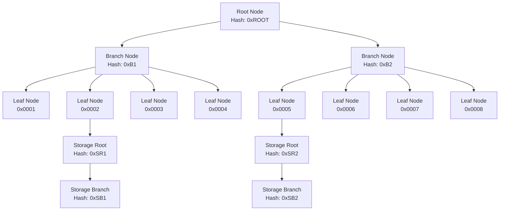
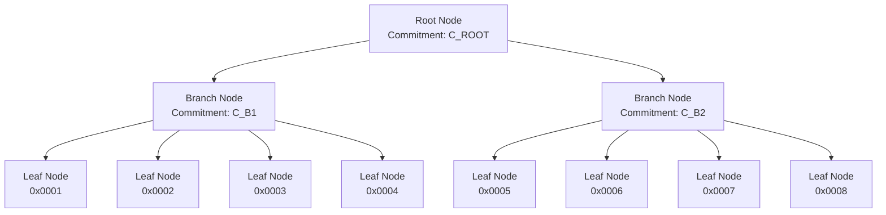

# Merkle and Verkle Tree

## **Merkle Patricia Trie (MPT)**

### Basics
- This is the fundamental data structure used in Ethereum for state storage
- It combines a Merkle tree with a Patricia trie
- What's stored:
    * Account states
    * Contract storage
    * Contract code
- Why it was chosen:
    Benefits:
    * Efficient proof generation
    * Deterministic root hashes
    * Secure verification
    * Efficient updates
    Drawbacks:
    * Complex implementation
    * Higher storage overhead
    * Slower for some operations

### **Merkle Patricia Trie (MPT) Data Structure**:
```
Node Types:
- Branch Node (17 children)
  - 16 children for hex characters (0-f)
  - 1 child for value
- Extension Node
  - Shared prefix
  - Next node
- Leaf Node
  - Remaining path
  - Value
```

### MPT Implementation

#### State Storage in MPT

```go
// core/state/statedb.go
type StateDB struct {
    db      Database
    trie    Trie
    stateObjects map[common.Address]*stateObject
}

// Account Storage
func (s *StateDB) SetState(addr common.Address, key, value common.Hash) {
    // 1. Get or create state object
    stateObject := s.getOrNewStateObject(addr)
    
    // 2. Update storage
    stateObject.SetState(key, value)
}

// core/state/state_object.go
type stateObject struct {
    address  common.Address
    data     types.StateAccount
    db       *StateDB
    storage  map[common.Hash]common.Hash
}

func (s *stateObject) SetState(key, value common.Hash) {
    // 1. Update in-memory storage
    s.storage[key] = value
    
    // 2. Mark as dirty for commit
    s.dirtyStorage[key] = value
}

// trie/state_trie.go
func (t *StateTrie) UpdateAccount(addr common.Address, account *types.StateAccount) error {
    // 1. Encode account data
    encoded, err := rlp.EncodeToBytes(account)
    if err != nil {
        return err
    }
    
    // 2. Update in trie
    return t.trie.TryUpdate(crypto.Keccak256(addr.Bytes()), encoded)
}
```

#### Smart Contract Storage in MPT

```go
// core/state/statedb.go
func (s *StateDB) GetState(addr common.Address, key common.Hash) common.Hash {
    // 1. Get state object
    stateObject := s.getStateObject(addr)
    if stateObject == nil {
        return common.Hash{}
    }
    
    // 2. Get storage value
    return stateObject.GetState(key)
}

// trie/state_trie.go
func (t *StateTrie) GetStorage(addr common.Address, key []byte) ([]byte, error) {
    // 1. Get account
    account, err := t.GetAccount(addr)
    if err != nil {
        return nil, err
    }
    
    // 2. Get storage trie
    storageTrie, err := t.OpenStorageTrie(addr, account.Root)
    if err != nil {
        return nil, err
    }
    
    // 3. Get value from storage trie
    return storageTrie.TryGet(key)
}
```


### MPT state tree data structure
I'll provide a detailed example of MPT data structure with 8 accounts, including 2 smart contracts.

### Example Scenario
Let's consider 8 accounts with the following addresses (simplified for clarity):
```
Account 1: 0x0001 (EOA)
Account 2: 0x0002 (Smart Contract)
Account 3: 0x0003 (EOA)
Account 4: 0x0004 (EOA)
Account 5: 0x0005 (Smart Contract)
Account 6: 0x0006 (EOA)
Account 7: 0x0007 (EOA)
Account 8: 0x0008 (EOA)
```

### MPT Structure



### Node Structure Details

1. **Root Node**
```go
type RootNode struct {
    // Hash of the root node
    Hash: "0xROOT"
    
    // References to branch nodes
    Branches: [
        {Index: 0, Hash: "0xB1"},
        {Index: 1, Hash: "0xB2"}
    ]
}
```

2. **Branch Node (Example: Branch1)**
```go
type BranchNode struct {
    // Hash of the branch node
    Hash: "0xB1"
    
    // References to leaf nodes
    Branches: [
        {Index: 0, Hash: "0xL1"}, // Account 1
        {Index: 1, Hash: "0xL2"}, // Account 2 (Smart Contract)
        {Index: 2, Hash: "0xL3"}, // Account 3
        {Index: 3, Hash: "0xL4"}  // Account 4
    ]
}
```

3. **Leaf Node (Example: Account 1)**
```go
type LeafNode struct {
    // Hash of the leaf node
    Hash: "0xL1"
    
    // Account data
    Account: {
        Nonce: 1,
        Balance: 100 ETH,
        StorageRoot: "0x00", // No storage (EOA)
        CodeHash: "0x00"     // No code (EOA)
    }
}
```

4. **Smart Contract Leaf Node (Example: Account 2)**
```go
type SmartContractLeafNode struct {
    // Hash of the leaf node
    Hash: "0xL2"
    
    // Account data
    Account: {
        Nonce: 0,
        Balance: 50 ETH,
        StorageRoot: "0xSR1", // Points to storage trie
        CodeHash: "0xCODE1"   // Contract code hash
    }
}
```

5. **Storage Root Node (Example: StorageRoot1)**
```go
type StorageRootNode struct {
    // Hash of the storage root
    Hash: "0xSR1"
    
    // References to storage branch nodes
    Branches: [
        {Index: 0, Hash: "0xSB1"},
        {Index: 1, Hash: "0xSB2"}
    ]
}
```

6. **Storage Branch Node (Example: StorageBranch1)**
```go
type StorageBranchNode struct {
    // Hash of the storage branch
    Hash: "0xSB1"
    
    // Storage slots
    Slots: [
        {Key: "0x00", Value: "0x1234"},
        {Key: "0x01", Value: "0x5678"}
    ]
}
```

### Data Structure in Detail

1. **Account State**
```go
type StateAccount struct {
    Nonce       uint64
    Balance     *big.Int
    Root        common.Hash    // Storage trie root
    CodeHash    []byte        // Contract code hash
}
```

2. **Storage Slot**
```go
type StorageSlot struct {
    Key   common.Hash
    Value common.Hash
}
```

3. **Trie Node Types**
```go
type Node interface {
    // Common interface for all node types
    Hash() common.Hash
    Encode() []byte
}

type BranchNode struct {
    Children [16]Node
    Value    []byte
}

type ExtensionNode struct {
    Key   []byte
    Next  Node
}

type LeafNode struct {
    Key   []byte
    Value []byte
}
```

### Storage Layout Example

For Smart Contract Account 2:
```
Account 2 (0x0002)
├── Account State
│   ├── Nonce: 0
│   ├── Balance: 50 ETH
│   ├── StorageRoot: 0xSR1
│   └── CodeHash: 0xCODE1
│
└── Storage Trie (Root: 0xSR1)
    ├── Slot 0x00: 0x1234
    ├── Slot 0x01: 0x5678
    └── Slot 0x02: 0x9ABC
```

### Key Points

1. **Tree Structure**
   - Root node points to branch nodes
   - Branch nodes contain up to 16 children
   - Leaf nodes contain account data
   - Smart contracts have additional storage tries

2. **Node Types**
   - Branch nodes: 16-way branching
   - Extension nodes: Shared prefixes
   - Leaf nodes: Final values

3. **Storage Organization**
   - EOA accounts: No storage trie
   - Smart contracts: Separate storage trie
   - Storage slots organized in tries

4. **Hashing**
   - Each node has a unique hash
   - Changes propagate up the tree
   - Root hash represents entire state

Would you like me to elaborate on any specific aspect of the MPT structure or provide more detailed examples?


## **Verkle Tree**

### Basics
- A newer tree structure being introduced to Ethereum
- What's stored:
    * Similar to MPT but with different internal structure
    * Account states
    * Contract storage
    * Contract code
- Why it was chosen:
    Benefits:
    * Smaller proof sizes
    * Better performance
    * More efficient updates
    Drawbacks:
    * Newer technology
    * Less battle-tested
    * More complex implementation


###  **Verkle Tree Data Structure**:
```
Node Types:
- Internal Node
  - Multiple children (typically 256)
  - Commitment to subtree
- Leaf Node
  - Key
  - Value
  - Commitment
```

The trees themselves don't store data directly - they are data structures that organize and provide access to the data. The actual storage is handled by the underlying databases (Pebble/LevelDB). The trees provide:

1. Efficient lookup and update operations
2. Proof generation for verification
3. State root calculation
4. Secure verification of state

The main differences between MPT and Verkle trees:

1. **Proof Size**:
   - MPT: Larger proofs, linear in tree depth
   - Verkle: Smaller proofs, constant size

2. **Update Efficiency**:
   - MPT: More complex updates
   - Verkle: More efficient updates

3. **Storage Requirements**:
   - MPT: Higher storage overhead
   - Verkle: More efficient storage

4. **Implementation Complexity**:
   - MPT: Simpler implementation
   - Verkle: More complex implementation


### Verkle Tree State Structure
I'll provide a detailed example of Verkle Tree data structure with the same 8 accounts scenario.

### Example Scenario (Same as before)
```
Account 1: 0x0001 (EOA)
Account 2: 0x0002 (Smart Contract)
Account 3: 0x0003 (EOA)
Account 4: 0x0004 (EOA)
Account 5: 0x0005 (Smart Contract)
Account 6: 0x0006 (EOA)
Account 7: 0x0007 (EOA)
Account 8: 0x0008 (EOA)
```

### Verkle Tree Structure



#### Node Structure Details

1. **Root Node**
```go
type VerkleRoot struct {
    // Polynomial commitment of the root
    Commitment: "C_ROOT"
    
    // References to branch nodes
    Branches: [
        {Index: 0, Commitment: "C_B1"},
        {Index: 1, Commitment: "C_B2"}
    ]
}
```

2. **Branch Node (Example: Branch1)**
```go
type VerkleBranch struct {
    // Polynomial commitment of the branch
    Commitment: "C_B1"
    
    // References to leaf nodes
    Branches: [
        {Index: 0, Commitment: "C_L1"}, // Account 1
        {Index: 1, Commitment: "C_L2"}, // Account 2 (Smart Contract)
        {Index: 2, Commitment: "C_L3"}, // Account 3
        {Index: 3, Commitment: "C_L4"}  // Account 4
    ]
}
```

3. **Leaf Node (Example: Account 1 - EOA)**
```go
type VerkleLeaf struct {
    // Polynomial commitment of the leaf
    Commitment: "C_L1"
    
    // Account data
    Values: {
        // Basic data (nonce, balance)
        BasicData: {
            Nonce: 1,
            Balance: 100 ETH,
            CodeSize: 0
        },
        // Code hash (empty for EOA)
        CodeHash: "0x00",
        // Storage slots (empty for EOA)
        Storage: {}
    }
}
```

4. **Smart Contract Leaf Node (Example: Account 2)**
```go
type VerkleSmartContractLeaf struct {
    // Polynomial commitment of the leaf
    Commitment: "C_L2"
    
    // Account data
    Values: {
        // Basic data
        BasicData: {
            Nonce: 0,
            Balance: 50 ETH,
            CodeSize: 1000
        },
        // Code hash
        CodeHash: "0xCODE1",
        // Storage slots
        Storage: {
            "0x00": "0x1234",
            "0x01": "0x5678",
            "0x02": "0x9ABC"
        }
    }
}
```

#### Key Differences from MPT

1. **Unified Structure**
```go
// In Verkle Tree, everything is in one tree
type VerkleNode struct {
    Commitment *Point
    Values     [256][]byte  // All values in one node
}

// Example of value organization
Values: {
    // Account data
    0: BasicData,    // Nonce, balance, code size
    1: CodeHash,     // Contract code hash
    
    // Storage slots
    2: StorageSlot0,
    3: StorageSlot1,
    // ... up to 256 values
}
```

2. **Storage Organization**
```go
// Storage slots are directly in the leaf node
type VerkleStorage struct {
    // Storage slots are indexed by their position
    Slots: map[byte][]byte
    
    // Example for Account 2
    Slots: {
        0x00: "0x1234",
        0x01: "0x5678",
        0x02: "0x9ABC"
    }
}
```

3. **Commitment Scheme**
```go
// Verkle Tree uses polynomial commitments
type VerkleCommitment struct {
    // Commitment to the polynomial
    Commitment *Point
    
    // Evaluation points
    Points []*Point
    
    // Example for a branch node
    BranchCommitment: {
        Commitment: "C_B1",
        Points: ["P1", "P2", "P3", "P4"]
    }
}
```

#### Storage Layout Example

For Smart Contract Account 2 in Verkle Tree:
```
Account 2 (0x0002)
├── Basic Data
│   ├── Nonce: 0
│   ├── Balance: 50 ETH
│   └── CodeSize: 1000
│
├── Code Hash: 0xCODE1
│
└── Storage Slots
    ├── Slot 0x00: 0x1234
    ├── Slot 0x01: 0x5678
    └── Slot 0x02: 0x9ABC
```

#### Key Advantages of Verkle Tree

1. **Compact Proofs**
```go
// Verkle proofs are much smaller
type VerkleProof struct {
    CommitmentPath []*Point
    Values         [][]byte
    // Example proof size: ~1KB
}
```

2. **Efficient Updates**
```go
// Updates only affect the path to the root
func (t *VerkleTrie) UpdateValue(key []byte, value []byte) error {
    // 1. Update leaf value
    // 2. Update commitments along path
    // 3. No need to rebuild entire tree
}
```

3. **Storage Efficiency**
```go
// All data in one tree structure
type VerkleTrie struct {
    Root      *VerkleNode
    Cache     *PointCache
    // No separate storage tries needed
}
```

#### Comparison with MPT

1. **Structure**
   - MPT: Separate tries for accounts and storage
   - Verkle: Single unified tree

2. **Proof Size**
   - MPT: Larger proofs (multiple tree paths)
   - Verkle: Smaller proofs (single path)

3. **Update Efficiency**
   - MPT: Multiple tree updates
   - Verkle: Single tree update

4. **Storage Organization**
   - MPT: Hierarchical storage
   - Verkle: Flat storage within nodes


## When use verkle?

1. **Verkle Tree is chosen when**:
   - The database is configured with `IsVerkle()` returning true
   - You need smaller proof sizes
   - You need better performance for updates
   - You're working with newer Ethereum implementations
   - You need more efficient storage patterns
   - You're handling contract code with chunked approach
   - You need optimized storage slot access patterns

2. **MPT (Merkle Patricia Trie) is chosen when**:
   - The database is configured with `IsVerkle()` returning false
   - You're working with current Ethereum mainnet
   - You need legacy support
   - You're working with older implementations
   - You need full node storage
   - You're handling state pruning and witness generation

The selection is primarily determined by the database configuration:

```go
if db.TrieDB().IsVerkle() {
    // Use Verkle Tree
    tr, err = trie.NewVerkleTrie(root, db, cache)
} else {
    // Use MPT
    tr, err = trie.NewStateTrie(trie.StateTrieID(root), db)
}
```

Key differences in implementation:

1. **Storage Structure**:
   - MPT: Separate tries for accounts and storage
   - Verkle: Single trie for all accounts and storage slots

2. **Access Patterns**:
   - MPT: Independent storage tries
   - Verkle: Merged storage structure

3. **Performance Characteristics**:
   - MPT: 
     - Larger proof sizes
     - More complex updates
     - Higher storage overhead
   - Verkle:
     - Smaller proof sizes
     - More efficient updates
     - Better storage optimization

4. **Use Cases**:
   - MPT:
     - Current mainnet
     - Legacy systems
     - Full node implementations
   - Verkle:
     - Future implementations
     - Optimized storage
     - Light client support

The choice is typically made at the database configuration level and is not something that needs to be decided at runtime for individual operations. The system will automatically use the appropriate tree type based on the configuration.

Would you like me to elaborate on any specific aspect of the selection criteria or implementation details?


### 2. Verkle Tree Implementation

#### State Storage in Verkle Tree

```go
// trie/verkle.go
type VerkleTrie struct {
    root   verkle.VerkleNode
    cache  *utils.PointCache
    reader *trieReader
}

func (t *VerkleTrie) UpdateAccount(addr common.Address, account *types.StateAccount) error {
    // 1. Prepare account data
    var (
        basicData [32]byte
        values    = make([][]byte, verkle.NodeWidth)
    )
    
    // 2. Encode account data
    binary.BigEndian.PutUint64(basicData[utils.BasicDataNonceOffset:], account.Nonce)
    account.Balance.WriteToSlice(basicData[utils.BasicDataBalanceOffset:])
    
    // 3. Update in verkle tree
    values[utils.BasicDataLeafKey] = basicData[:]
    values[utils.CodeHashLeafKey] = account.CodeHash[:]
    
    // 4. Insert into verkle tree
    return t.root.InsertValuesAtStem(t.cache.GetStem(addr[:]), values, t.nodeResolver)
}
```

#### Smart Contract Storage in Verkle Tree

```go
// trie/verkle.go
func (t *VerkleTrie) UpdateStorage(addr common.Address, key, value []byte) error {
    // 1. Prepare storage key
    k := utils.StorageSlotKeyWithEvaluatedAddress(
        t.cache.Get(addr.Bytes()),
        key,
    )
    
    // 2. Prepare value (32-byte aligned)
    var v [32]byte
    if len(value) >= 32 {
        copy(v[:], value[:32])
    } else {
        copy(v[32-len(value):], value[:])
    }
    
    // 3. Update in verkle tree
    return t.root.Insert(k, v[:], t.nodeResolver)
}
```

### 3. Key Code Paths for Further Learning

1. **MPT Implementation**
   - Account Management:
     ```
     core/state/statedb.go
     core/state/state_object.go
     trie/state_trie.go
     ```
   - Storage Management:
     ```
     trie/state_trie.go
     trie/database.go
     ```
   - Trie Operations:
     ```
     trie/trie.go
     trie/node.go
     ```

2. **Verkle Tree Implementation**
   - Account Management:
     ```
     trie/verkle.go
     trie/utils/verkle.go
     ```
   - Storage Management:
     ```
     trie/verkle.go
     trie/utils/verkle.go
     ```
   - Tree Operations:
     ```
     trie/verkle.go
     trie/utils/verkle.go
     ```

### 4. Key Differences in Storage

1. **Data Structure**
   - MPT:
     ```go
     // Separate tries for accounts and storage
     type StateTrie struct {
         trie Trie
         db   *Database
     }
     ```
   - Verkle:
     ```go
     // Unified tree structure
     type VerkleTrie struct {
         root   verkle.VerkleNode
         cache  *utils.PointCache
     }
     ```

2. **Storage Access**
   - MPT:
     ```go
     // Two-step access: account then storage
     accountTrie.GetAccount(addr)
     storageTrie.GetStorage(addr, key)
     ```
   - Verkle:
     ```go
     // Single-step access
     verkleTrie.GetStorage(addr, key)
     ```

3. **Update Pattern**
   - MPT:
     ```go
     // Separate updates for account and storage
     accountTrie.UpdateAccount(addr, account)
     storageTrie.UpdateStorage(addr, key, value)
     ```
   - Verkle:
     ```go
     // Single update operation
     verkleTrie.UpdateAccount(addr, account)
     verkleTrie.UpdateStorage(addr, key, value)
     ```

### 5. Performance Considerations

1. **MPT**
   - Pros:
     - Simpler implementation
     - Well-tested in production
     - Clear separation of concerns
   - Cons:
     - Larger proof sizes
     - Multiple tree traversals
     - Higher storage overhead

2. **Verkle Tree**
   - Pros:
     - Smaller proof sizes
     - Single tree traversal
     - More efficient updates
   - Cons:
     - More complex implementation
     - Newer technology
     - Higher computational overhead

Would you like me to elaborate on any specific aspect of the implementation or provide more detailed code examples?
