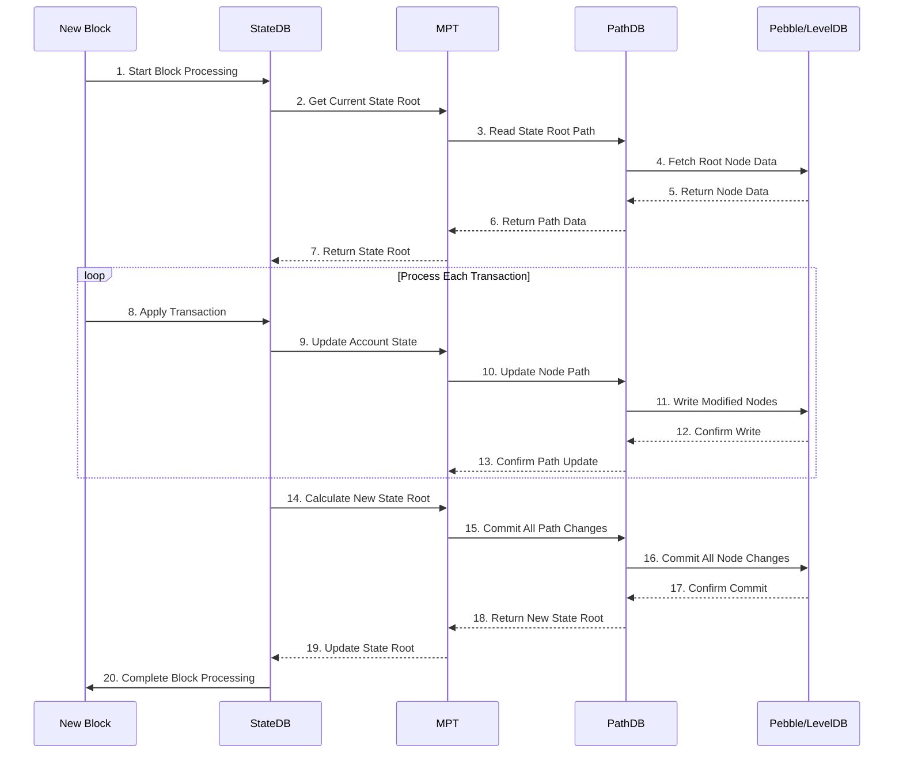
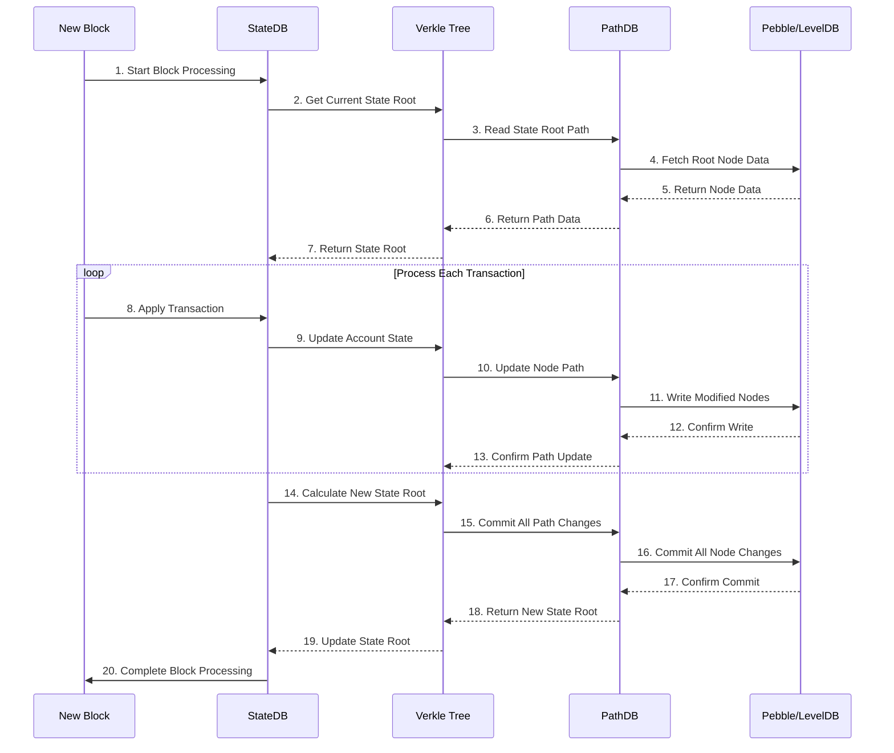

### 1. Terminology

1. **MPT (Merkle Patricia Trie)**
   - Current Ethereum mainnet state tree structure
   - Uses Keccak256 hash function
   - Supports separate storage for accounts and storage

2. **Verkle Tree**
   - Next-generation state tree structure
   - Uses polynomial commitment scheme(多项式承诺方案)
   - Smaller proof sizes
   - More efficient updates

3. **StateDB**
   - State database interface
   - Manages account and storage states
   - Handles state updates and commits

4. **TrieDB**
   - Underlying storage database
   - Manages trie node storage and retrieval


### 2. Processing Flow Comparison

#### MPT Processing Flow(with Storage Layers)



#### Verkle Tree Processing Flow( with Storage Layers)



#### Key Storage Layer Interactions

1. **PathDB Role**
   - Manages path information for trie nodes
   - Optimizes access patterns
   - Handles path updates during state changes
   - Acts as a cache layer for frequently accessed paths

2. **Pebble/LevelDB Role**
   - Provides persistent storage
   - Stores serialized trie nodes
   - Handles physical storage operations
   - Manages batch writes and commits

3. **Storage Flow**
   - Read Operations:
     ```
     MPT/Verkle → PathDB → Pebble/LevelDB
     ```
   - Write Operations:
     ```
     MPT/Verkle → PathDB → Pebble/LevelDB
     ```
   - Commit Operations:
     ```
     MPT/Verkle → PathDB → Pebble/LevelDB
     ```

4. **Optimization Points**
   - PathDB caches frequently accessed paths
   - Pebble/LevelDB handles batch operations
   - Both storage layers work together for efficient state management

### 3. Code Paths

#### MPT Code Paths

1. Start Block Processing
```go
// core/state/statedb.go
func (s *StateDB) BeginBlock(header *types.Header) error {
    // Initialize block processing
}
```

2. Get Current State Root
```go
// trie/state_trie.go
func (t *StateTrie) Hash() common.Hash {
    // Return current state root
}
```

3. Read State Root Node
```go
// trie/database.go
func (db *Database) Node(hash common.Hash) ([]byte, error) {
    // Read node data
}
```

4. Apply Transaction
```go
// core/state/statedb.go
func (s *StateDB) ApplyTransaction(tx *types.Transaction) error {
    // Apply transaction changes
}
```

5. Update Account State
```go
// trie/state_trie.go
func (t *StateTrie) UpdateAccount(addr common.Address, account *types.StateAccount) error {
    // Update account state
}
```

#### Verkle Tree Code Paths

1. Start Block Processing
```go
// core/state/statedb.go
func (s *StateDB) BeginBlock(header *types.Header) error {
    // Initialize block processing
}
```

2. Get Current State Root
```go
// trie/verkle.go
func (t *VerkleTrie) Hash() common.Hash {
    // Return current state root
}
```

3. Read State Root Node
```go
// trie/database.go
func (db *Database) Node(hash common.Hash) ([]byte, error) {
    // Read node data
}
```

4. Apply Transaction
```go
// core/state/statedb.go
func (s *StateDB) ApplyTransaction(tx *types.Transaction) error {
    // Apply transaction changes
}
```

5. Update Account State
```go
// trie/verkle.go
func (t *VerkleTrie) UpdateAccount(addr common.Address, account *types.StateAccount) error {
    // Update account state
}
```

### 4. Pseudocode Implementation

#### MPT Implementation

```go
// Process new block
func ProcessBlock(block *Block) error {
    // 1. Initialize state database
    stateDB := NewStateDB(block.ParentHash)
    
    // 2. Get current state root
    currentRoot := stateDB.GetTrie().Hash()
    
    // 3. Process each transaction
    for _, tx := range block.Transactions {
        // 4. Apply transaction
        if err := stateDB.ApplyTransaction(tx); err != nil {
            return err
        }
        
        // 5. Update account state
        if err := stateDB.GetTrie().UpdateAccount(tx.To, newAccount); err != nil {
            return err
        }
    }
    
    // 6. Calculate new state root
    newRoot := stateDB.GetTrie().Hash()
    
    // 7. Commit changes
    if err := stateDB.Commit(); err != nil {
        return err
    }
    
    return nil
}
```

#### Verkle Tree Implementation

```go
// Process new block
func ProcessBlock(block *Block) error {
    // 1. Initialize state database
    stateDB := NewStateDB(block.ParentHash)
    
    // 2. Get current state root
    currentRoot := stateDB.GetTrie().Hash()
    
    // 3. Process each transaction
    for _, tx := range block.Transactions {
        // 4. Apply transaction
        if err := stateDB.ApplyTransaction(tx); err != nil {
            return err
        }
        
        // 5. Update account state
        if err := stateDB.GetTrie().UpdateAccount(tx.To, newAccount); err != nil {
            return err
        }
        
        // 6. Update storage state
        if err := stateDB.GetTrie().UpdateStorage(tx.To, key, value); err != nil {
            return err
        }
    }
    
    // 7. Calculate new state root
    newRoot := stateDB.GetTrie().Hash()
    
    // 8. Commit changes
    if err := stateDB.Commit(); err != nil {
        return err
    }
    
    return nil
}
```

### 5. Key Differences

1. **Storage Structure**
   - MPT: Separate trees for accounts and storage
   - Verkle: Unified tree structure

2. **Update Efficiency**
   - MPT: Requires updating multiple trees
   - Verkle: Single tree updates, more efficient

3. **Proof Size**
   - MPT: Larger proof sizes
   - Verkle: Smaller proof sizes

4. **Implementation Complexity**
   - MPT: Relatively simpler
   - Verkle: More complex but better performance

5. **Storage Optimization**
   - MPT: Traditional storage approach
   - Verkle: Optimized storage patterns

