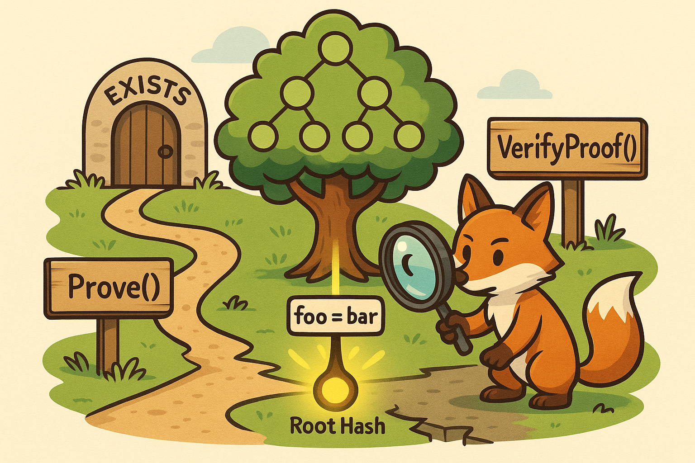
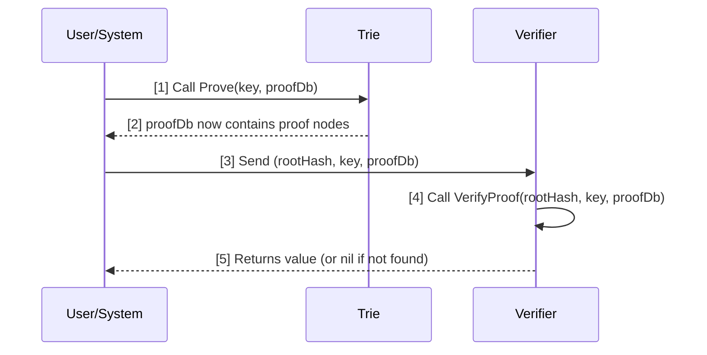

# [Go ethereum - Proof](https://github.com/ethereum/go-ethereum/blob/master/trie/proof.go)



This document explains how Ethereum's Merkle proofs work, why they're important, and how the core functions Prove, VerifyProof, and VerifyRangeProof are used in go-ethereum.

---

## What's it for?

A **Merkle proof** (or trie proof) is used to prove the existence or non-existence of a key-value pair in a Merkle Patricia Trie (the data structure Ethereum uses for state, storage, etc.), **without requiring access to the entire trie**. This is crucial for:

- **Light clients**: They don't store the full state, but can verify that a value is included in the state root by checking a proof.
- **Cross-chain communication**: Proving to another system that a value was present in Ethereum at a certain block.
- **Stateless validation**: Verifying transactions or state transitions with only a subset of the trie.

The proof consists of all the nodes along the path from the root to the value (or to the point where the key would be if it existed). Anyone with the root hash and the proof can verify the value's presence or absence.


## Why is it needed?
- **Security**: Merkle proofs allow nodes to verify state data without trusting the sender.
- **Synchronization**: Both snap and trie sync protocols depend on proofs to securely and efficiently synchronize state.  
  Snap sync rapidly downloads recent state data using proofs instead of walking the full trie.  
  Trie sync downloads and verifies individual trie nodes to reconstruct full state slowly but securely.
- **Snapshot Generation**: Snapshots must be provably correct, which requires proof generation and verification.

---

## Comparison of the proof-related functions -- `Prove`, `VerifyProof`, and `VerifyRangeProof`:

Below we summarize the main proof-related functions and their purpose.

### a. `Prove`

- **Purpose:**  
    - **Merkle Proof Generation:**  
    The `Proof` function constructs a Merkle proof for a given key. This proof consists of all the encoded nodes on the path from the root of the trie to the value at the specified key. If the key does not exist, the proof shows the absence by including the longest existing prefix.

    - **State Verification:**  
    Merkle proofs are fundamental to Ethereum’s trustless architecture. They allow a node to prove to another node (or a light client) that a particular key/value pair is part of the state, without revealing the entire state. This is crucial for stateless clients, light clients, and for syncing nodes efficiently.

    - **Network Protocols:**  
     The proof is used in various network protocols (like `snap` and `eth`) to serve state data to peers, especially during fast or snap sync, where nodes request proofs for account or storage slots to reconstruct the state securely.

- **How it works:**  
  Traverses the trie along the path for the given key, collects all nodes on this path, and stores their RLP-encoded representations in a proof database (`proofDb`).  
- **Usage:**  
  Used when you want to prove the existence or non-existence of a single key in the trie.

---

### b. `VerifyProof`

- **Purpose:**  
  Verifies a Merkle proof for a single key.  
- **How it works:**  
  Given a root hash, a key, and a proof database (containing the proof nodes), it reconstructs the path and checks if the value at the key matches the expected value (or proves absence).  
- **Usage:**  
  Used to check the validity of a proof generated by `Prove` for a single key.

---

### c. `VerifyRangeProof`

- **Purpose:**  
  Verifies a Merkle proof for a range of keys (not just a single key).  
- **How it works:**  
  Given a root hash, a range of keys and values, and a proof database, it checks that:
  - The range is consecutive and strictly increasing.
  - The proof covers the left and right edges of the range (possibly including non-existent keys).
  - There are no missing or extra elements in the range.
  - The trie reconstructed from the proof and the given leaves matches the root hash.
  - Returns a flag indicating if there are more elements after the range.
- **Usage:**  
  Used for proving the correctness and completeness of a range of leaves in the trie, which is important for stateless clients, light clients, and range queries.

---

### Summary Table

| Function           | Proof Type | Input Keys         | Output/Verification         | Use Case                        |
|--------------------|------------|--------------------|-----------------------------|----------------------------------|
| `Prove`            | Single     | 1 key              | Proof nodes for 1 key       | Prove existence/non-existence    |
| `VerifyProof`      | Single     | 1 key              | Value or error              | Verify single key proof          |
| `VerifyRangeProof` | Range      | Range of keys      | Validity + more elements?   | Verify range proof (batch/range) |

---

### Key Differences

- **Scope:**  
  - `Prove`/`VerifyProof` are for single keys.  
  - `VerifyRangeProof` is for a range of keys (batch proof).
- **Complexity:**  
  - `VerifyRangeProof` handles edge cases, consecutive checks, and ensures no gaps or extra elements.
- **Return Value:**  
  - `VerifyRangeProof` returns an extra flag indicating if there are more elements after the range.


## Usage in go-ethereum

Here are the main places where `Prove`, `VerifyProof`, and `VerifyRangeProof` are used inside go-ethereum.

### a. `Prove`
#### **`generate.go` (core/state/snapshot):**  
  In snapshot generation and validation, the `Proof` function is used to create proofs for account and storage slots. These proofs are then used to verify that the snapshot data matches the canonical state trie, ensuring data integrity during state recovery or snapshot creation.

#### **`handler.go` in `snap` protocol:**  
  The `snap` protocol is designed for fast state sync. When a peer requests a range of accounts or storage slots, the handler uses the `Proof` function to generate Merkle proofs for the requested data. This allows the requesting peer to verify the correctness of the data without trusting the sender.

#### **`etherapi/api.go`:**  
  In the API layer, the `Proof` function is exposed to external clients (such as JSON-RPC clients) who may want to verify the inclusion of a key/value in the state trie. This is useful for wallets, explorers, or any service that needs cryptographic assurance of state data.

### b. `VerifyProof`
#### Where is it used?
- The VerifyProof function is primarily used in test files to validate generated proofs.
- Similarly, there is no direct evidence in the provided non-test code that `VerifyProof` is called outside of test files. Its main usage is in test files (e.g., `proof_test.go`).

#### Why is it used?
- `VerifyProof` is used to check the validity of a Merkle proof for a given key and root hash. It ensures that the proof provided matches the expected value in the trie, which is critical for verifying state transitions, validating data received from untrusted sources, and supporting stateless or light client operations.

### c. `VerifyRangeProof`

#### a. **snap.go** (`cmd/devp2p/internal/ethtest/snap.go`)
This file is part of the snap protocol test suite, which is used for fast synchronization of Ethereum nodes. The snap protocol relies on Merkle proofs to:
- Prove the existence or absence of accounts and storage slots in the state trie.
- Validate that the data received from a peer matches the canonical state root.
- Efficiently synchronize large state ranges by verifying proofs for account and storage ranges.

Without the ability to generate and verify proofs, the snap protocol cannot securely synchronize state, as there would be no way to trust the data received from peers.

#### b. **sync.go** (`trie/sync.go`)
This file implements the trie synchronization logic, which is used during state sync (e.g., when a node is catching up with the network). It needs Merkle proofs to:
- Request missing trie nodes from peers and verify their correctness.
- Ensure that the reconstructed trie matches the expected root hash.
- Handle layered tries (account trie and storage tries) by verifying proofs at each layer.

Merkle proofs are essential for trustless state sync, as they allow a node to verify that the data it receives is correct without trusting the peer.

#### c. **generate.go** (`core/state/snapshot/generate.go`)
This file is responsible for generating state snapshots, which are used for fast state recovery and sync. It uses Merkle proofs to:
- Validate that a segment of the state (accounts or storage slots) is consistent with the trie root.
- Prove the correctness of state ranges before including them in a snapshot.
- Ensure that the snapshot can be used to reconstruct the state trie and match the canonical root.

Merkle proofs are necessary here to guarantee that the snapshot is valid and can be trusted by other nodes.


### **Hands-on Example: Building and Verifying a Merkle Proof**

Here's a minimal example in Go that demonstrates how to create a trie, insert a key-value pair, commit it, generate a proof for a key, and then verify that proof using the `Prove` and `VerifyProof` functions from your `trie` package:

```go:example/main.go
package main

import (
	"fmt"
	"log"

	"github.com/ethereum/go-ethereum/common"
	"github.com/ethereum/go-ethereum/ethdb/memorydb"
	"github.com/ethereum/go-ethereum/trie"
)

func main() {
	// Create a new in-memory database for the trie
	db := memorydb.New()
	// In production, persistent databases are used instead of in-memory databases for trie storage.

	// Create a new empty trie
	t, err := trie.New(common.Hash{}, trie.NewDatabase(db))
	if err != nil {
		log.Fatalf("Failed to create trie: %v", err)
	}

	// Insert a key-value pair
	key := []byte("foo")
	value := []byte("bar")
	t.Update(key, value)

	// Commit the trie to persist nodes and get the root hash
	rootHash, err := t.Commit(nil)
	if err != nil {
		log.Fatalf("Failed to commit trie: %v", err)
	}

	// Generate a proof for the key
	proofDb := memorydb.New()
	if err := t.Prove(key, proofDb); err != nil {
		log.Fatalf("Failed to generate proof: %v", err)
	}

	// Verify the proof
	gotValue, err := trie.VerifyProof(rootHash, key, proofDb)
	if err != nil {
		log.Fatalf("Failed to verify proof: %v", err)
	}
	fmt.Printf("Value from proof: %s\n", gotValue) // Should print "bar"
}
```

**Explanation:**
- This code creates a trie, inserts the key `"foo"` with value `"bar"`, commits the trie, and generates a proof for `"foo"`.
- It then verifies the proof using the root hash, key, and the proof database, and prints the value found in the proof.


## Typical Workflow

Here's a typical high-level workflow when generating and verifying Merkle proofs in Ethereum.

### 1. Generating a Proof

**Entry Point:**  
- `(*Trie).Prove(key []byte, proofDb ethdb.KeyValueWriter) error`
- `(*StateTrie).Prove(key []byte, proofDb ethdb.KeyValueWriter) error`

**Workflow:**
1. User has a trie (e.g., state trie in Ethereum).
2. User wants to prove the existence (or non-existence) of a value for a key.
3. User calls `trie.Prove(key, proofDb)`.
   - This walks the trie, collects all nodes along the path to the key, and writes their RLP-encoded representations into `proofDb` (a key-value database).  
   Proof of absence is shown by including the longest existing prefix of the missing key, ensuring verifiers can trust the non-existence.
4. The resulting `proofDb` contains all the nodes needed to verify the proof externally.

### 2. Verifying a Proof

**Entry Point:**  
- `VerifyProof(rootHash common.Hash, key []byte, proofDb ethdb.KeyValueReader) (value []byte, err error)`

**Workflow:**
1. User (or external system) receives:
   - The root hash of the trie.
   - The key to verify.
   - The proof database (containing the proof nodes).
2. User calls `VerifyProof(rootHash, key, proofDb)`.
   - This reconstructs the path from the root using the proof nodes, checking hashes at each step.
   - If the proof is valid and the key exists, returns the value.
   - If the key does not exist, returns nil.

### **Sequence Diagram:**




## Quick Concept Reminders
- **Merkle Patricia Trie**: A compact, path-compressed version of a Merkle Tree optimized for key-value lookups.
- **RLP Encoding**: Recursive Length Prefix encoding, used to serialize nodes efficiently in Ethereum.
- **Stateless Clients**: Clients that avoid storing full state, instead relying on proofs attached to transactions.


## Where to Use

- **Light clients**: To verify state without holding the full trie.
- **Cross-chain bridges**: To prove state transitions or balances.
- **Auditing tools**: To verify historical state proofs.
- **Smart contract verification**: When needing to prove state to on-chain contracts (with additional serialization).


**Summary:**  
- Use `Prove` to generate proofs for a key.
- Use `VerifyProof` to check those proofs.
- The workflow is: generate proof → send proof + root + key → verify proof.
- These are the main entry points for external users or systems.  
- For more details, see the test file for real examples.

       