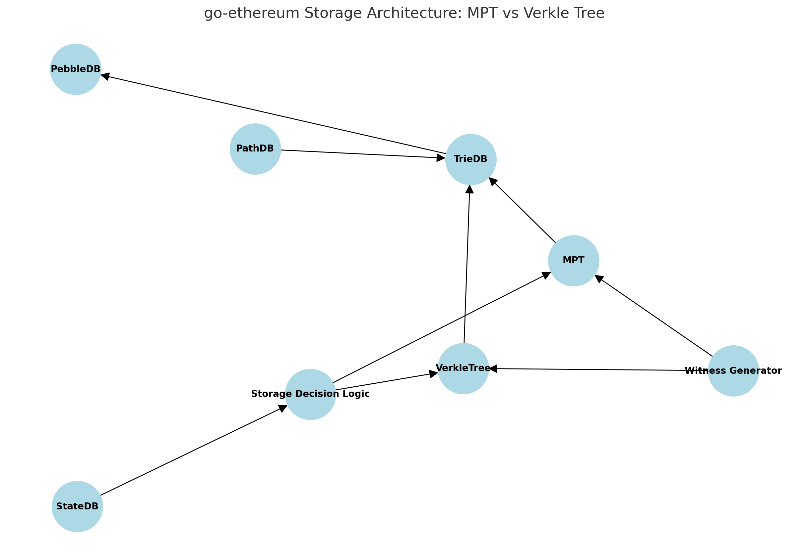
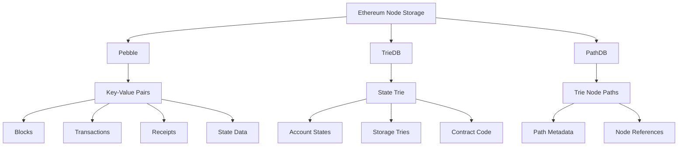
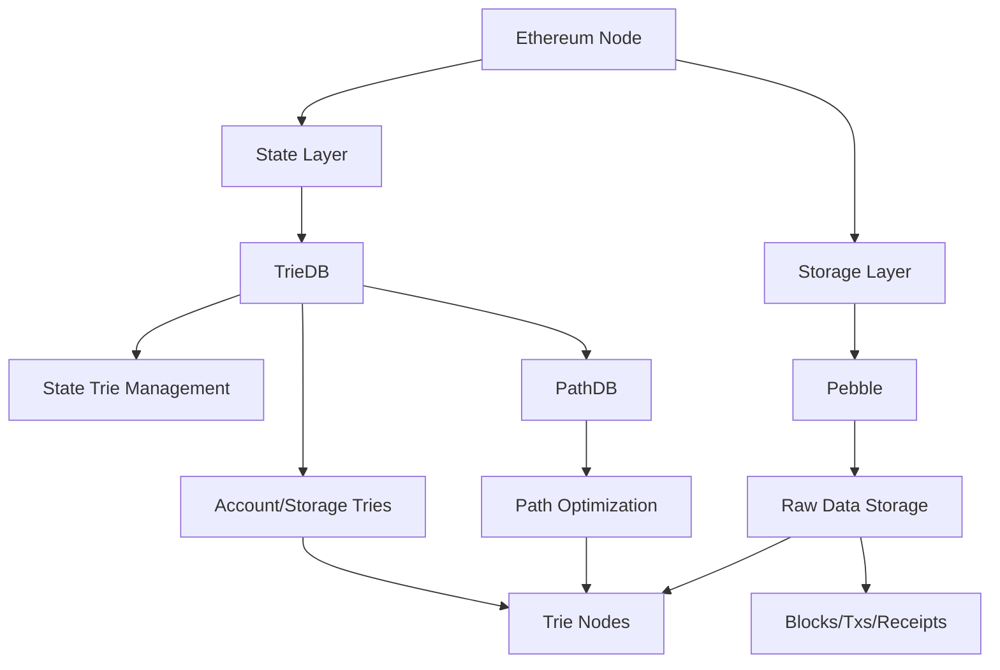
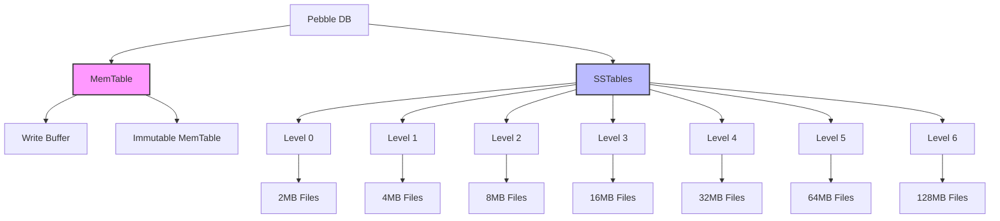
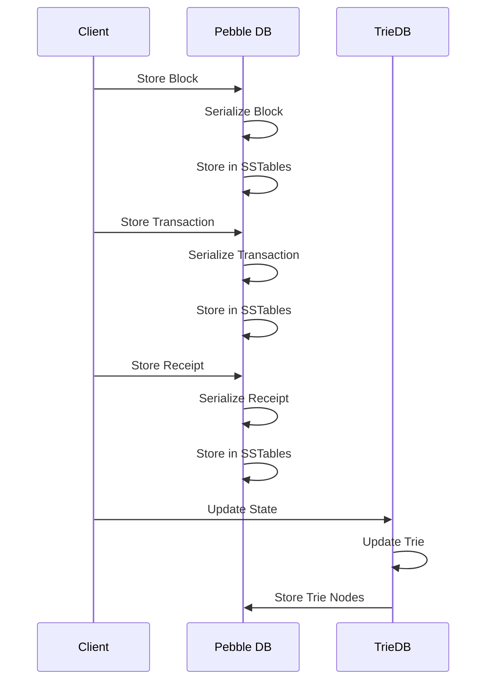
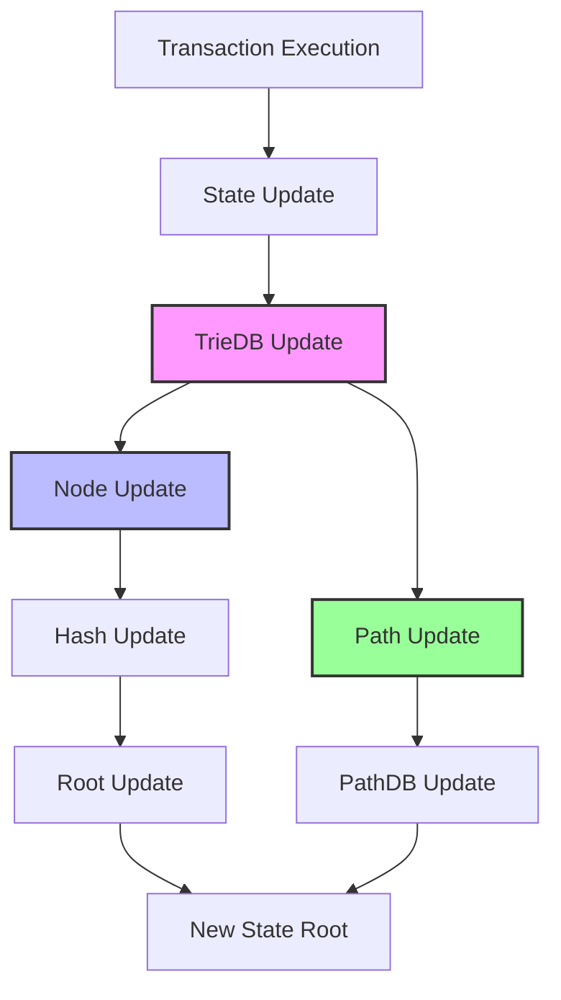

## go-ethereum Storages

## The Main Structure

The relationship between these trees and storage systems:

1. **TrieDB**:
   - Implements the MPT structure
   - Uses Pebble/LevelDB for persistent storage
   - Manages the trie nodes and their relationships
   - Handles state updates and proofs

2. **PathDB**:
   - Optimizes access to trie nodes
   - Stores path information for faster lookups
   - Works with both MPT and Verkle trees
   - Helps in state sync and pruning

3. **Pebble/LevelDB**:
   - Provides the actual storage layer
   - Stores the serialized nodes
   - Handles persistence
   - Manages the physical storage
   
### **Pebble**

* What's stored:
  - Pebble is a key-value storage engine used in go-ethereum
  - It stores blockchain data including blocks, transactions, receipts, and state data
  - It's an alternative to LevelDB, offering similar functionality but with better performance characteristics

* Why it was chosen:
  Benefits:
  - Better performance than LevelDB in many scenarios
  - Native Go implementation (no CGO required)
  - Better memory management
  - More predictable performance under load
  - Built-in support for atomic batch operations
  
  Drawbacks:
  - Relatively newer compared to LevelDB
  - Larger disk space usage in some cases
  - Less battle-tested in production environments

### **TrieDB**

* What's stored:
  - Stores the Ethereum state trie
  - Manages account states, storage tries, and contract code
  - Implements Merkle Patricia Trie data structure
  - Handles state root calculations and state updates

* Why it was chosen:
  Benefits:
  - Efficient proof generation for state queries
  - Supports Ethereum's state model perfectly
  - Allows for efficient state updates and merkle proofs
  - Enables light client functionality
  
  Drawbacks:
  - Complex data structure
  - Higher storage overhead
  - Can be slow for certain operations due to trie traversal

### **PathDB**

* What's stored:
  - Stores trie node paths
  - Used for optimized trie node access
  - Helps in state sync and pruning operations

* Why it was chosen:
  Benefits:
  - Optimizes trie node access patterns
  - Improves sync performance
  - Better handling of state pruning
  
  Drawbacks:
  - Additional storage overhead
  - Complexity in maintaining path information

### Node Storage Charts

### Other Storage Systems in Ethereum Repository:

1. **LevelDB**
   - Traditional key-value store
   - Used as an alternative to Pebble
   - Well-tested but requires CGO

2. **Memory DB**
   - In-memory database implementation
   - Used for testing and temporary storage
   - Not persistent

3. **Ancient DB**
   - Specialized storage for old blockchain data
   - Optimized for cold storage
   - Helps in managing chain size

4. **Freezer**
   - Storage for ancient chain segments
   - Optimized for sequential access
   - Reduces memory usage for old data

The relationship between these storage systems is hierarchical:

1. The base layer is the key-value store (Pebble/LevelDB)
2. TrieDB builds the state trie structure on top of the key-value store
3. PathDB optimizes access to trie nodes
4. Ancient DB and Freezer handle historical data
5. Memory DB is used for temporary operations

1. **Pebble vs LevelDB Implementation and Selection**:
Yes, the repo still contains both implementations. The choice between Pebble and LevelDB is determined by:

- Configuration: Users can specify which database to use in their configuration
- Default: Pebble is the default choice in newer versions
- Build flags: Some build flags can force one or the other
- Platform: LevelDB requires CGO, while Pebble is pure Go

Let me search for the configuration code:

2. **Pebble DB Data Structure**:

3. **State Data vs State Trie Data**:
- State Data: Raw data about the blockchain state (blocks, transactions, receipts)
- State Trie Data: Organized data structure that allows efficient proof generation and verification

4. **Transaction, Block, Receipt Storage Flow**:

5. **Trie Node Path**:
- A path in the trie is a sequence of nibbles (4-bit values) that represents the route from the root to a specific node
- Each nibble represents a branch in the trie
- Paths are used to locate specific data in the trie structure

6. **TrieDB State Update Process**:

The state update process:
1. Transaction execution modifies state
2. TrieDB updates the affected nodes
3. Node hashes are recalculated
4. Path information is updated
5. New state root is calculated
6. Changes are committed to storage

Would you like me to elaborate on any of these aspects?
