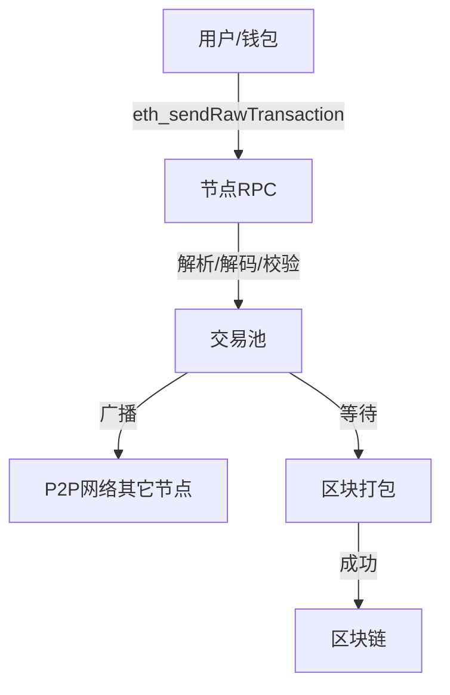

# The Journey of the Transaction
## 1. Transaction 的格式是什么？
以太坊的交易（Transaction）本质上是一个结构体，包含如下主要字段：

- `Nonce`：发送方账户的交易序号，防止重放攻击。
- `GasPrice` 或 `MaxFeePerGas`/`MaxPriorityFeePerGas`（EIP-1559后）：每单位 gas 的价格。
- `GasLimit`：本次交易最多能消耗多少 gas。
- `To`：接收方地址（合约创建时为空）。
- `Value`：转账金额（单位：wei）。
- `Data`：调用合约时的输入数据，普通转账为空。
- `V, R, S`：签名字段，保证交易不可抵赖。

在 go-ethereum 代码中，transaction 的结构体定义在 `[core/types/transaction.go](https://github.com/ethereum/go-ethereum/blob/master/core/types/transaction.go#L55-L106)`：

```go
type Transaction struct {
    // ... existing code ...
	inner TxData    // Consensus contents of a transaction
    // ... existing code ...
}
```
`txdata` 里包含上述字段。

[详细介绍](./the-journey-of-transaction/transaction-structure-cn.md)
---

## 2. 怎么提交到 node 上边来？

用户提交交易通常有两种方式：

- 通过 JSON-RPC 接口（如 `eth_sendRawTransaction` 或 `eth_sendTransaction`）
- 通过 P2P 网络（其他节点广播过来的交易）

### 2.1 JSON-RPC 提交

- 用户用私钥签名交易，得到 RLP 编码的原始交易数据（raw tx）。
- 通过 HTTP/WebSocket/IPC 调用 `eth_sendRawTransaction`，把 raw tx 发送给节点。

在 go-ethereum 代码中，RPC 入口在 `eth/api.go`：

```go
func (api *PublicTransactionPoolAPI) SendRawTransaction(ctx context.Context, rawTx hexutil.Bytes) (common.Hash, error)
```

- 该方法会解码 rawTx，验证签名，然后调用 `txpool.AddLocal(tx)` 把交易加入本地交易池。

- **eth_sendRawTransaction**：你发的就是 RLP 编码的原始交易（已签名）。
- **eth_sendTransaction**：你发的是结构化 JSON，节点帮你签名并编码为 RLP。

---

#### 2.1.1 eth_sendRawTransaction

- **你需要先本地用私钥签名交易**，得到 RLP 编码的原始交易数据（通常是 hex 字符串，比如 `0xf86c808504a817c80082520894...`）。
- 你通过 RPC 发送：
  ```json
  {
    "method": "eth_sendRawTransaction",
    "params": ["0xf86c808504a817c80082520894..."], // 这是RLP编码的原始交易
    ...
  }
  ```
- 节点收到后，直接解码 RLP，验证签名，然后加入交易池。

#### 2.1.2 eth_sendTransaction

- 你发送的是结构化的 JSON 字段（如 from, to, value, data, gas, gasPrice 等），**没有签名**。
- 节点会用本地钱包（keystore）找到 from 对应的私钥，帮你签名，然后编码为 RLP，最后广播。
- 这种方式只适用于本地节点有账户私钥的情况。

---

#### 代码依据

- `eth/api.go` 的 `SendRawTransaction` 方法会先解码 RLP，然后处理。
- `SendTransaction` 方法会先组装交易结构体，再用本地私钥签名，最后编码为 RLP。

你的问题非常关键，涉及以太坊节点的实际使用场景和安全边界。下面详细解答：

---

#### 注意

- **实际生产环境和大多数钱包/前端 DApp，99% 都用 `eth_sendRawTransaction`。**
  - 也就是**用户本地签名**，然后把签名后的 RLP 编码原始交易（raw tx）发给节点。
  - 这样私钥永远不会离开用户本地，安全性高。

- `eth_sendTransaction` 只在**节点本地有账户私钥**时才用（比如 geth 控制台、测试环境、私有链开发时）。
  - 这种方式要求节点的 keystore 里有 from 对应的私钥，节点帮你签名。
  - 生产环境极少用，因为私钥暴露在节点上，风险极大。

---

- **生产环境/前端/钱包：**  
  - 用户本地签名，`eth_sendRawTransaction`，节点只负责广播和打包。
- **节点本地账户（极少用）：**  
  - `eth_sendTransaction`，节点 keystore 里有私钥，节点帮你签名。


### 2.2 RLP 解码

- 节点将 hex 字符串解码为字节流。
- 用 RLP 解码还原为 `Transaction` 结构体（见 `core/types/transaction.go` 的 `DecodeRLP`）。

[详细介绍](./the-journey-of-transaction/rlp-cn.md)

### 2.3 签名和合法性校验

- 校验交易签名（V, R, S），恢复发送者地址。
- 检查 nonce、gas、余额、格式等是否合法。

### 2.4 交易池（TxPool）

- 校验通过后，交易被**加入本地交易池**（`core/tx_pool.go`）。
- 交易池会管理所有待打包的交易，按账户、nonce、gas price 等排序。
- 所有新交易（无论本地还是网络收到）都会被加入到 **交易池（TxPool）**。
- 交易池的核心代码在 `core/txpool/txpool.go`。
[详细介绍](./the-journey-of-transaction/transaction-pool-cn.md)

### 2.5 广播到 P2P 网络

- 节点之间通过 devp2p 协议（eth/66、eth/67等）广播交易。
- 代码入口在 `eth/handler.go` 的 `handleMsg`，消息类型为 `TransactionsMsg`。
- 其它节点收到后，也会做同样的校验和入池。

[详细介绍](./the-journey-of-transaction/transaction-broadcast-cn.md)

---

## 3. 交易的“去向”

- **本地交易池**：等待被矿工/验证者打包进区块。
- **P2P 网络**：同步传播到全网其它节点，保证全网共识。
- **最终目标**：被矿工/验证者选中，打包进新区块，写入区块链。


## 4. 代码关键路径（go-ethereum）

1. `eth/api.go` → `SendRawTransaction`
2. `core/types/transaction.go` → `DecodeRLP`
3. `core/tx_pool.go` → `AddLocal`/`AddRemotes`
4. `p2p/protocols/eth/handler.go` → 交易广播

---

## 5. 总结流程图



---