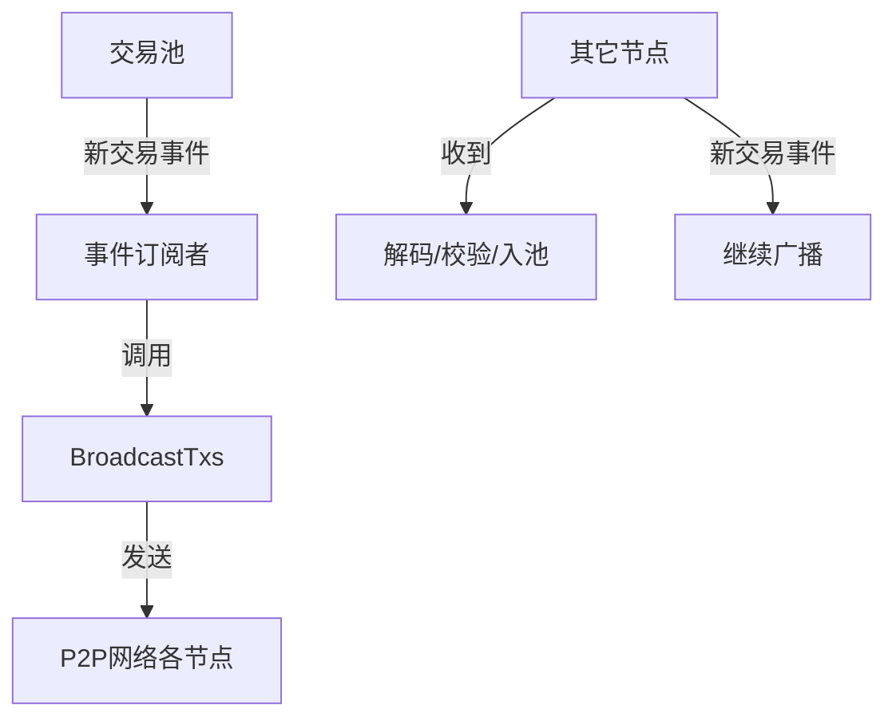

# 交易广播

## 1. 交易进入交易池

- 交易通过 JSON-RPC（如 `eth_sendRawTransaction`）或 P2P 网络进入节点。
- 经过解码、签名校验、合法性检查后，调用 `txpool.AddLocal(tx)` 或 `txpool.AddRemotes(txs)` 加入本地交易池。
- 交易池的核心代码在 `core/txpool/txpool.go`。

---

## 2. 交易池如何触发广播

### 2.1 交易池的事件机制

- 交易池内部有一个事件订阅系统（event.Feed），当有新交易加入时，会向订阅者广播事件。
- 代码位置：`core/txpool/txpool.go`，字段 `txFeed`。

  ```go
  type TxPool struct {
      // ... existing code ...
      txFeed event.Feed // 交易事件订阅
      // ... existing code ...
  }
  ```

- 当新交易加入时，调用 `txFeed.Send` 发送事件：

  ```go
  pool.txFeed.Send(core.NewTxsEvent{Txs: txs})
  ```

---

### 2.2 后台广播协程

- 在 `eth/backend.go` 中，`Ethereum` 结构体会启动一个后台协程，订阅交易池事件，并负责广播新交易。
- 关键代码在 `startTxBroadcastLoop`：

  ```go
  func (s *Ethereum) startTxBroadcastLoop() {
      // 订阅交易池事件
      txs := make(chan core.NewTxsEvent, 16)
      sub := s.txpool.SubscribeNewTxsEvent(txs)
      go func() {
          for {
              select {
              case ev := <-txs:
                  // 处理新交易事件
                  s.BroadcastTxs(ev.Txs)
              // ... existing code ...
          }
      }()
  }
  ```

- 这里的 `BroadcastTxs` 就是负责将新交易广播到 P2P 网络。

---

## 3. 交易的 P2P 广播

### 3.1 广播实现

- `BroadcastTxs` 方法会将新交易打包，通过 P2P 协议发送给已连接的对等节点。
- 代码位置：`eth/backend.go` 和 `eth/protocols/eth/peer.go`。

  ```go
  func (s *Ethereum) BroadcastTxs(txs types.Transactions) {
      // 遍历所有已连接的 peer
      for _, peer := range s.peers.Peers() {
          peer.SendTransactions(txs)
      }
  }
  ```

- 每个 peer 都有 `SendTransactions` 方法，负责将交易编码后通过 devp2p 协议发送。

  ```go
  func (p *Peer) SendTransactions(txs types.Transactions) error {
      // RLP 编码交易
      packet, err := rlp.EncodeToBytes(txs)
      // 发送消息类型为 TransactionsMsg
      return p2p.Send(p.rw, TransactionsMsg, packet)
  }
  ```

- `TransactionsMsg` 是以太坊 P2P 协议中用于交易广播的消息类型。

---

### 3.2 P2P 协议细节

- 以太坊节点之间通过 devp2p 协议（eth/66、eth/67等）通信。
- 交易广播消息类型为 `TransactionsMsg`，在 `eth/protocols/eth/protocol.go` 定义。
- 其它节点收到 `TransactionsMsg` 后，会解码交易，做合法性校验，并尝试加入本地交易池（`AddRemotes`）。

---

## 4. 其它节点的处理

- 其它节点收到广播的交易后，重复上述校验和入池流程。
- 如果交易合法且未见过，则加入本地交易池，并继续向其它 peer 广播（但会避免环路和重复广播）。

---

## 5. 代码关键路径总结

1. **交易入池**：`core/txpool/txpool.go` → `txFeed.Send`
2. **事件订阅**：`eth/backend.go` → `startTxBroadcastLoop`
3. **广播实现**：`eth/backend.go` → `BroadcastTxs` → `eth/protocols/eth/peer.go` → `SendTransactions`
4. **P2P 消息**：`eth/protocols/eth/protocol.go` → `TransactionsMsg`
5. **其它节点处理**：收到 `TransactionsMsg` → 解码 → 校验 → `txpool.AddRemotes`

---

## 6. 流程图




你的问题非常关键，涉及以太坊网络的**交易传播机制**、**区块打包优先级**，以及**如何提高交易被打包的概率**。下面详细解答：

---

## 7. 交易能否保证全网所有节点都收到？

**不能100%保证**。以太坊是一个去中心化、P2P的网络，交易通过“洪泛式”广播（gossip）在节点之间传播，但由于网络延迟、节点连接拓扑、带宽、节点策略等原因，**理论上无法保证每个节点都能及时收到每一笔交易**。

### 传播机制简述

- 你把交易发给一个节点A，A会广播给它的peer，peer再继续广播，形成“扩散”。
- 但每个节点的peer数量有限（通常几十个），网络不是全连接的。
- 某些节点可能因为网络延迟、带宽、策略（如拒绝低gas price交易）等原因，**不会立刻转发或根本不转发**。
- 交易池有去重机制，节点不会重复转发已见过的交易。

---

### 7.1. 可能出现的情况

- **确实可能出现**：你发出的交易没有及时传播到负责打包区块的矿工/验证者节点（block proposer），导致你的交易没被打包，反而其他交易被优先打包。
- 这在网络高峰、交易池拥堵、你设置的 gas price 较低、或你连接的节点与矿工节点距离较远时更容易发生。

---

### 7.2. 如何提高交易被打包的概率？

#### 7.2.1 多节点广播
 
> “如果有很多个node，为了保证这个transaction被先打包，可以多send几次transaction到不同的node上”

- 这叫**多播/多点广播**，是提高交易传播速度和覆盖率的常用手段。
- 你可以把同一笔交易（raw tx）同时发给多个节点（最好是地理位置、网络拓扑分布广泛的节点）。
- 这样可以加快交易在网络中的扩散速度，提高被矿工/验证者节点看到的概率。

#### 7.2.2 其他常用手段

- **提高 gas price / priority fee**：矿工/验证者通常优先打包收益高的交易。
- **选择连接到矿池节点或大节点**：这些节点与矿工/验证者连接更紧密，传播更快。
- **使用交易加速服务**：有些第三方服务专门帮你广播交易到大量节点。

---

### 7.3. 代码层面机制

- 节点收到交易后，**只会转发一次**，不会重复广播同一笔交易。
- 交易池有去重机制，防止网络风暴。
- 节点之间的连接是有限的，且有可能存在“孤岛”或“延迟”。
- 交易池有丢弃机制（如低gas、nonce冲突、池满等）。

---

### 7.4. 现实中的情况

- **绝大多数情况下**，只要你把交易发给一个正常的全节点，几秒内全网大部分节点都能收到。
- 但在极端情况下（如网络分区、节点策略、恶意节点等），确实可能有节点没收到，甚至矿工节点没收到。

---

### 7.5. 结论与建议

- **不能100%保证**全网所有节点都能及时收到你的交易，尤其是负责打包的节点。
- **多发几次到不同节点**，可以显著提高你的交易被打包的概率，尤其是在高峰期或你急需交易被确认时。
- 这也是很多钱包、DApp、交易所的常规做法。

---

#### 参考代码流程

- 你可以在 `eth/api.go` 的 `SendRawTransaction`，或直接用 P2P 协议发给不同节点。
- 只要 raw tx 一样，节点会自动去重，不会造成双花。
