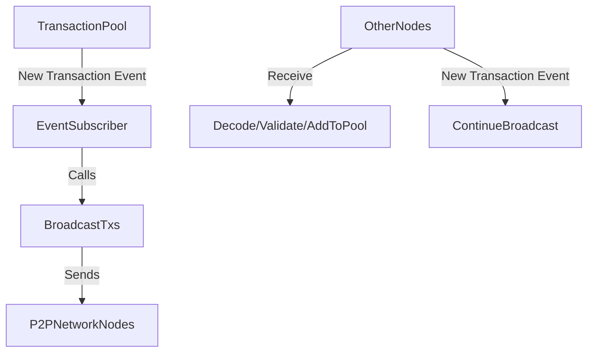

# Transaction Broadcasting

## 1. Transaction Enters the Transaction Pool

- Transactions enter a node via JSON-RPC (e.g., `eth_sendRawTransaction`) or the P2P network.
- After decoding, signature verification, and validity checks, the transaction is added to the local transaction pool by calling `txpool.AddLocal(tx)` or `txpool.AddRemotes(txs)`.
- The core code for the transaction pool is in `core/txpool/txpool.go`.

---

## 2. How the Transaction Pool Triggers Broadcasting

### 2.1 Transaction Pool Event Mechanism

- The transaction pool has an internal event subscription system (`event.Feed`). When a new transaction is added, it broadcasts an event to subscribers.
- Code location: `core/txpool/txpool.go`, field `txFeed`.

  ```go
  type TxPool struct {
      // ... existing code ...
      txFeed event.Feed // Transaction event subscription
      // ... existing code ...
  }
  ```

- When a new transaction is added, `txFeed.Send` is called to send the event:

  ```go
  pool.txFeed.Send(core.NewTxsEvent{Txs: txs})
  ```

---

### 2.2 Background Broadcast Goroutine

- In `eth/backend.go`, the `Ethereum` struct starts a background goroutine that subscribes to transaction pool events and is responsible for broadcasting new transactions.
- The key code is in `startTxBroadcastLoop`:

  ```go
  func (s *Ethereum) startTxBroadcastLoop() {
      // Subscribe to transaction pool events
      txs := make(chan core.NewTxsEvent, 16)
      sub := s.txpool.SubscribeNewTxsEvent(txs)
      go func() {
          for {
              select {
              case ev := <-txs:
                  // Handle new transaction event
                  s.BroadcastTxs(ev.Txs)
              // ... existing code ...
          }
      }()
  }
  ```

- Here, `BroadcastTxs` is responsible for broadcasting new transactions to the P2P network.

---

## 3. P2P Broadcasting of Transactions

### 3.1 Broadcast Implementation

- The `BroadcastTxs` method packages new transactions and sends them to connected peers via the P2P protocol.
- Code location: `eth/backend.go` and `eth/protocols/eth/peer.go`.

  ```go
  func (s *Ethereum) BroadcastTxs(txs types.Transactions) {
      // Iterate over all connected peers
      for _, peer := range s.peers.Peers() {
          peer.SendTransactions(txs)
      }
  }
  ```

- Each peer has a `SendTransactions` method, which encodes the transactions and sends them via the devp2p protocol.

  ```go
  func (p *Peer) SendTransactions(txs types.Transactions) error {
      // RLP encode transactions
      packet, err := rlp.EncodeToBytes(txs)
      // Send message of type TransactionsMsg
      return p2p.Send(p.rw, TransactionsMsg, packet)
  }
  ```

- `TransactionsMsg` is the message type used for transaction broadcasting in the Ethereum P2P protocol.

---

### 3.2 P2P Protocol Details

- Ethereum nodes communicate via the devp2p protocol (eth/66, eth/67, etc.).
- The transaction broadcast message type is `TransactionsMsg`, defined in `eth/protocols/eth/protocol.go`.
- When other nodes receive a `TransactionsMsg`, they decode the transactions, perform validity checks, and attempt to add them to their local transaction pool (`AddRemotes`).

---

## 4. Handling by Other Nodes

- When other nodes receive broadcasted transactions, they repeat the above validation and pool entry process.
- If the transaction is valid and not seen before, it is added to the local transaction pool and further broadcast to other peers (while avoiding loops and duplicate broadcasts).

---

## 5. Key Code Path Summary

1. **Transaction enters pool**: `core/txpool/txpool.go` → `txFeed.Send`
2. **Event subscription**: `eth/backend.go` → `startTxBroadcastLoop`
3. **Broadcast implementation**: `eth/backend.go` → `BroadcastTxs` → `eth/protocols/eth/peer.go` → `SendTransactions`
4. **P2P message**: `eth/protocols/eth/protocol.go` → `TransactionsMsg`
5. **Other node handling**: Receive `TransactionsMsg` → decode → validate → `txpool.AddRemotes`

---

## 6. Flowchart




Your question is very important, involving the **transaction propagation mechanism** of the Ethereum network, **block packaging priority**, and **how to increase the probability of your transaction being included in a block**. Here is a detailed answer:

---

## 7. Can You Guarantee All Nodes in the Network Receive the Transaction?

**Not 100% guaranteed**. Ethereum is a decentralized, P2P network. Transactions are propagated between nodes via a "gossip" (flooding) protocol, but due to network latency, node connection topology, bandwidth, node policies, etc., **it is theoretically impossible to guarantee that every node will receive every transaction in a timely manner**.

### Propagation Mechanism Overview

- You send a transaction to node A, A broadcasts it to its peers, those peers continue broadcasting, forming a "spread".
- Each node has a limited number of peers (usually dozens), and the network is not fully connected.
- Some nodes may not forward immediately or at all due to network latency, bandwidth, or policies (e.g., rejecting low gas price transactions).
- The transaction pool has a deduplication mechanism; nodes do not rebroadcast transactions they have already seen.

---

### 7.1. Possible Scenarios

- **It is indeed possible**: Your transaction may not reach the block proposer (miner/validator) in time, resulting in your transaction not being included, while others are prioritized.
- This is more likely during network congestion, transaction pool overload, low gas price settings, or if your connected node is far from the miner node.

---

### 7.2. How to Increase the Probability of Your Transaction Being Included?

#### 7.2.1 Multi-node Broadcasting
 
> "If you have many nodes, to ensure this transaction is included first, you can send the transaction to multiple nodes."

- This is called **multicast/multi-point broadcasting**, a common way to increase transaction propagation speed and coverage.
- You can send the same transaction (raw tx) to multiple nodes (preferably geographically and topologically diverse).
- This speeds up propagation in the network and increases the chance that miners/validators see your transaction.

#### 7.2.2 Other Common Methods

- **Increase gas price/priority fee**: Miners/validators usually prioritize higher-reward transactions.
- **Connect to mining pool nodes or large nodes**: These nodes are more closely connected to miners/validators and propagate faster.
- **Use transaction acceleration services**: Some third-party services broadcast your transaction to many nodes.

---

### 7.3. Mechanisms at the Code Level

- After receiving a transaction, a node **only forwards it once** and does not rebroadcast the same transaction.
- The transaction pool has deduplication to prevent network storms.
- Node connections are limited, and "islands" or delays may exist.
- The transaction pool may drop transactions (e.g., low gas, nonce conflicts, pool full, etc.).

---

### 7.4. Real-world Situations

- **In most cases**, as long as you send a transaction to a normal full node, most nodes in the network will receive it within a few seconds.
- In extreme cases (e.g., network partition, node policy, malicious nodes), some nodes may not receive it, including miners.

---

### 7.5. Conclusion and Recommendations

- **You cannot 100% guarantee** that all nodes, especially block proposers, will receive your transaction in time.
- **Sending to multiple nodes** can significantly increase the probability of your transaction being included, especially during peak times or when urgent confirmation is needed.
- This is also a common practice for many wallets, DApps, and exchanges.

---

#### Reference Code Flow

- You can use `SendRawTransaction` in `eth/api.go`, or send directly to different nodes via the P2P protocol.
- As long as the raw tx is the same, nodes will deduplicate automatically, so there is no risk of double-spending. 