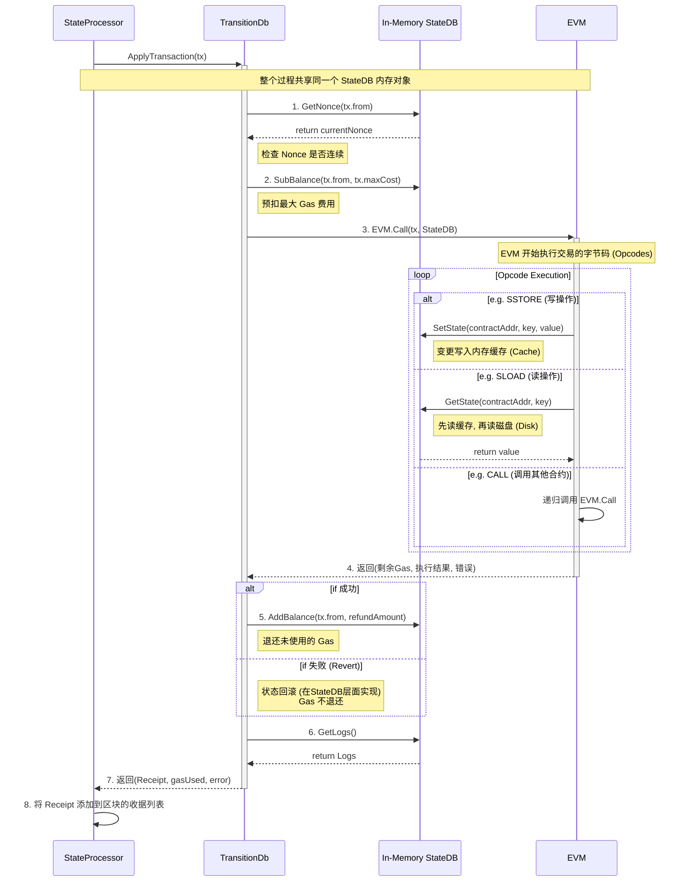
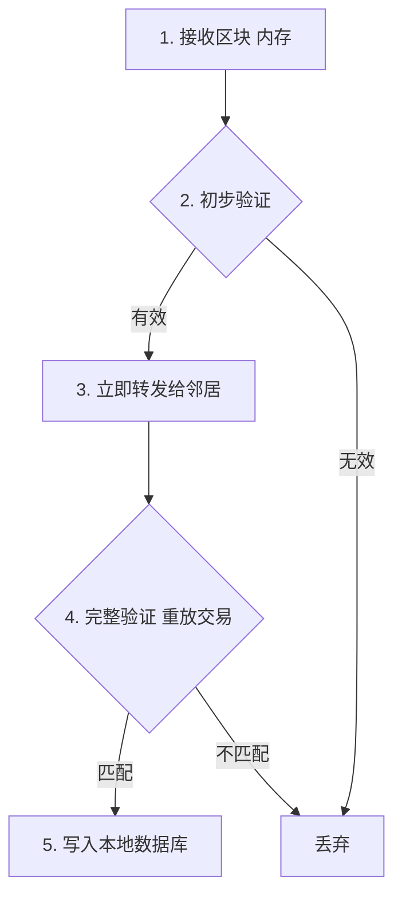
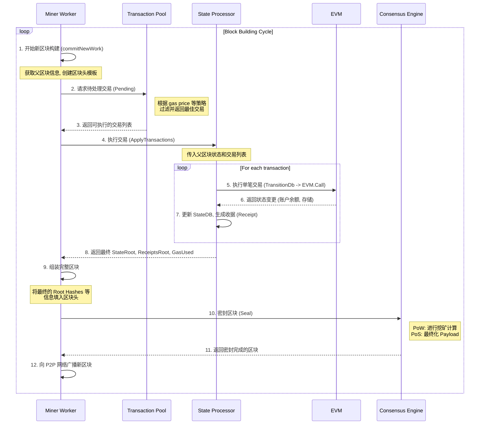
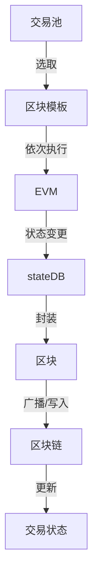

# Package Transaction
## 1. 交易池中选择交易

- 矿工/验证者节点会定期从**交易池**（`core/txpool/txpool.go`）中选取一批合法、gas price 高、nonce 连续的交易，准备打包进新区块。
- 选择逻辑在 `core/tx_pool.go` 和 `core/tx_pool.go` 的 `Pending`、`PendingTransactions` 等方法。

### 1.1 The Two-Tier System: `pending` vs. `queue`

The most critical concept in `LegacyPool` is its two-tiered structure for storing transactions:

1.  **`pending` (待处理/可执行):** 这是一个 `map`, `address -> transaction list`。这里存放的交易都是**可立即处理**的。也就是说，这些交易的 nonce 与账户在链上的下一个 nonce 是连续的，并且它们已经通过了所有基本的验证。矿工会直接从这个池子里挑选交易。

2.  **`queue` (队列/未来):** 这也是一个 `map`, `address -> transaction list`。这里存放的是**暂时不能处理**的交易。最常见的情况是 nonce 有“缺口”。比如，一个账户的当前 nonce 是 2，但交易池收到了来自该账户的 nonce 为 4 的交易。这笔交易就会被放进 `queue` 里，直到 nonce 为 3 的交易被处理后，它才会被“激活”。

### 1.2 交易选择的完整生命周期

结合这个两层结构，我们可以梳理出交易的选择逻辑：

#### 1.2.1. 交易进入 (`add` 方法)

-   当一笔新交易到达节点，`add` 方法会进行验证。
-   **核心决策点**：
    -   如果交易的 nonce 是该账户的下一个期望 nonce，它被认为是“可执行的”，直接进入 `pending` 池。
    -   如果交易的 nonce 大于期望值，它被认为是“未来的”，进入 `queue` 池等待。
    -   如果交易的 nonce 小于期望值，它被认为是陈旧的，将被拒绝。
-   所有被接受的交易（无论是 `pending` 还是 `queue`）都会被索引，以便通过哈希快速查找。

#### 1.2.2. 交易“晋升” (`promoteExecutables` 方法)

-   当一个新的区块被加到链上时，账户的状态（尤其是 nonce）会更新。
-   这会触发一个“重置”流程，该流程会调用 `promoteExecutables` 方法。
-   这个方法会检查 `queue` 池中的所有交易。如果发现某个账户的某笔交易（之前因为 nonce 过高而“排队”），现在由于链上 nonce 的更新而变成了“可执行的”（nonce 连续了），这笔交易就会从 `queue` **移动到** `pending` 池中。这个过程就是“晋升”。

#### 1.2.3. 交易被选取 (`Pending` 方法)

-   这是我们最初追踪的方法，也是矿工（或请求待处理交易的 API）的入口。
-   它**只从 `pending` 池**（以及不受限制的 `local` 交易）中获取交易。因为这里的交易已经保证了 nonce 的连续性和可执行性。
-   它可以接受一个 `filter` 参数，用于根据当前的 `BaseFee` 和 `MinTip` （矿工小费）对 `pending` 池中的交易进行进一步的**经济学筛选**。不满足最低价格要求的交易会被临时滤掉。
-   最后，它返回一个按账户分组、按 nonce 排序的、经济上可行的交易列表。

#### 1.2.4 quene的清理

##### 1.2.4.1 `queue` 会被清理吗？ (Will the `queue` be cleaned up?)

**是的，绝对会。** 如果 `queue` 不被清理，它会成为一个非常简单的攻击向量，攻击者可以发送大量高 nonce 的交易来耗尽节点的内存。

`LegacyPool` 有几个关键机制来清理 `queue`：

*   **交易生命周期 (`Lifetime`)**: 在 `LegacyPool` 的配置中，有一个 `Lifetime` 参数（默认为 3 小时）。一个交易在 `queue` 中如果待了超过这个时间，就会被认为是“过期的”（stale）并被直接丢弃。这是防止无限期等待的主要机制。
*   **池大小限制 (`GlobalQueue`, `AccountQueue`)**: `queue` 有一个全局的总容量限制 (`GlobalQueue`)，和每个账户的容量限制 (`AccountQueue`)。
    *   如果整个 `queue`满了，当一个**新的**交易想进来时，池子会尝试通过驱逐一个**价格最低**的旧交易来腾出空间。
    *   如果某个账户的 `queue` 满了，该账户的任何新交易（即使 gas price 更高）都将被拒绝，直到有位置空出来为止。

所以，一个交易在 `queue` 中要么最终被“晋升”到 `pending`，要么因为超时或池子满了被驱逐。

---

##### 1.2.4.2 如果 gas 费选择很低，一直得不到执行的 transaction 怎么办？

这笔交易的命运取决于它在哪个池子里：

*   **如果在 `pending` 池中**: 这意味着它的 nonce 是连续的，技术上可以被打包。但因为它的 gas price 太低，矿工在调用 `Pending()` 方法时，会使用一个带有当前市场价格的 `filter`，这笔交易会被过滤掉，所以矿工根本“看不见”它。它的最终结局大概率是：
    1.  **被价格更高的交易所取代**：当 `pending` 池满了之后，为了给新来的、出价更高的交易腾地方，池子会从价格最低的交易开始驱逐。这笔低价交易会是第一批被清理的对象。
    2.  **被用户手动替换**：用户（或钱包软件）可以发送一笔**相同 nonce 但更高 gas price** 的交易。`LegacyPool` 检测到这种情况后，会用新交易替换掉旧的低价交易。

*   **如果在 `queue` 池中**: 它首先要面对上面提到的 `Lifetime` 和容量限制。即使它最终等到了 nonce 连续，被晋升到了 `pending` 池，它依然要面对 `pending` 池的竞争和驱逐规则。

**总结：** 在繁忙的网络中，一笔 gas fee 持续过低的交易几乎不可能被打包。它最终的命运，要么是在池子满时被“挤出去”，要么是超时后被清理，要么是被用户自己发送的更高费率的交易所取代。

#### 1.2.5. `filter` 参数是谁来设？

`PendingFilter` 参数是由 **`Pending` 方法的调用者** 来设置的。在 Geth 的代码库中，主要有两类调用者：

1.  **矿工/区块构建者 (`miner/worker.go`)**: 这是最主要的调用者。当矿工准备构建一个新区块时，它会根据当前网络的 `BaseFee` 和自己的挖矿策略（比如愿意接受的最低小费 `MinTip`），来创建一个 `PendingFilter`。然后用这个 filter 去向 `TxPool` 请求一批“有利可-图”的交易。这是实现矿工利益最大化的核心。
2.  **RPC API (`internal/ethapi/api.go`)**: 当你通过 `eth_pendingTransactions` 等 RPC 调用查询待处理交易时，RPC 的处理函数会调用 `Pending` 方法。在这种情况下，它通常会使用一个**空的/默认的 filter**，目的是返回所有技术上可执行的交易，而不过多考虑其经济性，因为查询者只是想看到池子里的内容。

### 1.3 LegacyPool总结

所以，`LegacyPool` 的选择逻辑可以总结为：**“入池时分离（`pending`/`queue`），状态更新时晋升，选取时只看 `pending` 并按经济模型过滤。”**


### 1.4 `BlobPool` 的 `Pending` 逻辑

`BlobPool` 的选择逻辑相对更“直接”，但过滤条件更复杂：

1.  **没有 `queue` 队列**：这是最核心的区别。`BlobPool` 内部没有像 `LegacyPool` 那样的 `queue`（未来交易队列）。它内部只有一个 `index` 结构，功能上等同于 `LegacyPool` 的 `pending` 池。`Stats()` 方法返回 `pending, 0` 也证实了这一点。这意味着 `BlobPool` **只接受 nonce 连续的交易**，不缓存未来交易。

2.  **严格的经济模型过滤**：`Pending` 方法的核心就是过滤。它会遍历池中所有交易，并应用非常严格的经济模型：
    *   **执行费检查**：和 `LegacyPool` 一样，检查交易的 `GasFeeCap`（总 gas 单价）和 `GasTipCap`（矿工小费）是否满足当前网络的 `BaseFee` 和调用者要求的最低小费。
    *   **Blob Gas 费检查**：这是 EIP-4844 交易独有的。它必须额外检查交易的 `BlobFeeCap` 是否高于当前网络的 `BlobFee`。这是为数据 blob 的存储支付的费用。
    *   **提前中止（Optimization）**：一个重要的优化是，由于每个账户的交易是按 nonce 排序的，如果一个账户的某笔交易因为不满足上述的经济条件被拒绝，那么**该账户后续所有更高 nonce 的交易都会被立即跳过**（通过 `break` 实现）。因为 Geth 假设后续交易的定价不会优于当前交易。

#### 1.4.1. `BlobPool`的 gas 费谁交？

**由发送这笔 Blob 交易的地址支付。**

Blob 交易（EIP-4844 Type 3 交易）的费用结构比较特殊，它包含两个部分，都由交易发送方承担：

1.  **执行 Gas 费 (Execution Gas)**: 这和普通交易完全一样，是为交易在 EVM 中计算部分（比如合约调用）支付的费用。它遵循 EIP-1559 的 `BaseFee` + `PriorityFee`（小费）模型。
2.  **Blob Gas 费**: 这是为交易附带的数据 `blob` 所支付的费用，是一个全新的、独立的费用市场。它也有一个由网络拥堵情况决定的 `BlobBaseFee`，交易发送方需要支付 `blob 数量 * BlobBaseFee`。

发送方账户的余额必须足以同时支付这两笔费用，交易才会被认为是有效的。

---

#### 1.4.2. `BlobPool`的 gas 费和用户在 Layer 2 上边交的 gas 费有关系吗？是怎嘛要给你的？

**是的，有非常直接且紧密的关系。L1 的 Blob Gas 费是 L2 交易费用的主要成本来源。**

这个机制是 EIP-4844 的核心目的，我们可以这样理解整个流程：

1.  **用户在 L2 支付费用**: 你在 Arbitrum 或 Optimism 等 Layer 2 网络上进行一笔交易，支付了一笔 L2 的 gas 费。这笔费用交给了 L2 的**定序器 (Sequencer)**。
2.  **L2 定序器打包**: L2 的定序器会收集成百上千笔像你这样的 L2 用户的交易。
3.  **定序器向 L1 提交数据**: 定序器将这些 L2 交易的关键数据捆绑在一起，放进一个（或多个）`blob` 中，然后创建一笔**L1 的 Blob 交易**，并将它发送到以太坊主网。
4.  **定序器支付 L1 Gas**: 这笔 L1 Blob 交易的费用（包括上面说的执行费和 Blob Gas 费），是由 L2 的**定序器**来支付的。它用的是它从 L2 用户那里收来的费用。
5.  **成本分摊**: L2 定序器支付给 L1 的总成本，会被分摊到它所打包的所有 L2 用户身上。

**所以，这个关系是：**

**你付给 L2 的 Gas 费 = (L1 的 Blob Gas 总费用 / 该批次包含的 L2 交易数量) + L2 自身的运营成本和利润**

### 1.5 最终总结：`TxPool` 的协同工作

1.  **分而治之**：Geth 的主交易池 `TxPool` 实际上是一个协调者。它内部维护了至少两个子池（`SubPool`）：`LegacyPool` 和 `BlobPool`，分别处理普通交易和 Blob 交易。

2.  **入口分发**：当一笔新交易进入 `TxPool` 时，它会通过 `Filter` 方法判断交易类型，然后把它分发给对应的子池去处理。

3.  **各自为政**：
    *   **`LegacyPool`** 采用**“pending (待定) + queue (未来)”** 的两级结构。它会缓存 nonce 不连续的未来交易，并在时机成熟时将其“晋升”到 `pending` 队列。
    *   **`BlobPool`** 采用更简单的**单层结构**，只保留 nonce 连续的、可立即执行的交易。

4.  **汇总报告**：当矿工需要构建新区块并调用 `TxPool.Pending()` 时：
    *   `TxPool` 会同时调用 `LegacyPool.Pending()` 和 `BlobPool.Pending()`。
    *   两个子池各自根据我们上面分析的逻辑（特别是经济模型过滤），返回它们认为准备就绪的交易列表。
    *   `TxPool` 最后将这两个列表**合并**在一起，形成一个完整的、包含所有类型交易的、可供打包的候选交易集。


---

## 2. 区块构建流程

### 2.1 区块模板生成

- 代码入口：`core/blockchain.go`、`core/blockchain.go`、`miner/worker.go`
- `miner/worker.go` 的 `commitNewWork` 方法会调用 `core/state_processor.go` 的 `ApplyTransactions`，将选中的交易依次执行。

### 2.2 交易执行

- 每笔交易会被送入 EVM（以太坊虚拟机）执行，涉及：
  - 账户余额、nonce 检查
  - Gas 计算与扣除
  - 合约调用或转账
  - 状态变更（账户余额、合约存储等）
- 关键代码：
  - `core/state_processor.go` → `ApplyTransaction`
  - `core/state_transition.go` → `TransitionDb`
  - `core/vm/` 目录下为 EVM 执行引擎


#### 2.2.1. 单笔交易执行的详细序列图

这张图聚焦于 `StateProcessor` 在处理**单笔交易**时的内部工作流，展示了它与 `StateDB` (状态数据库的内存表示) 和 `EVM` 之间的精密互动。



---

#### 2.2.2. 状态转换 (State Transition) 的发生与存储

现在我们来详细解答“transition什么、怎么做、怎么存储”这个问题。这里的核心是理解 **`StateDB`** 这个对象。

##### `stateDB` - 内存中的临时状态账本

首先，一个至关重要的概念：**所有交易执行期间的状态变更，都不是直接写入硬盘数据库的**。它们被写入一个名为 `stateDB` (`core/state/statedb.go`) 的**内存对象**中。

可以把 `stateDB` 理解为一个带缓存的、可回滚的、临时的“世界状态账本”。

*   **它从何而来？** 在区块处理开始时，Geth 会基于父区块的 `StateRoot` 初始化一个 `stateDB` 对象。它代表了交易执行**前**的世界状态。
*   **写操作怎么处理？** 当 EVM 需要修改一个账户的余额或一个合约的存储时，这个修改**只发生在 `stateDB` 的内存缓存中**。
*   **读操作怎么处理？** 当 EVM 需要读取状态时，`stateDB` 会先检查自己的内存缓存里有没有最新的值。如果没有，它才会去访问磁盘上的持久化数据库（Merkle Trie）。
*   **为何如此设计？** 这种设计带来了两个巨大的好处：
    1.  **高性能**: 内存操作远快于磁盘 I/O。一个交易中可能对同一个存储槽读写多次，这些都可以在内存中快速完成。
    2.  **原子性和可丢弃性**: 这正是实现“模拟”执行的关键。如果区块构建失败，或者这是一个失败的交易，我们只需要**丢弃这个 `stateDB` 内存对象**即可，硬盘上的原始状态丝毫未动。

##### `stateDB` 初始化时包含哪些东西？

当 Geth 基于一个父区块的 `StateRoot` 初始化一个新的 `stateDB` 对象时，这个对象在概念上包含了**那个特定时间点的整个以太坊“世界状态” (World State) 的快照**。

不过，为了效率，它并不会在初始化的瞬间就把整个状态（可能有几百 GB）都加载到内存里。它的内部结构更智能：

`stateDB` 对象主要包含以下几个核心部分：

1.  **Trie (默克尔树) 的根哈希 (`StateRoot`)**: 这是最重要的部分。它不包含数据本身，而是指向硬盘上那个代表了整个世界状态的 Merkle Patricia Trie 的根节点的哈希。`stateDB` 知道从这个根哈希开始，就可以按需索引到任何账户或合约的数据。

2.  **一个空的内存缓存/日记 (`journal`)**: 这是 `stateDB` 的核心工作区。它包含多个映射 (map)，用于暂存本次会话（比如一个区块的处理过程）中发生的所有变更。
    *   `stateObjects`: 缓存被“碰过”的账户对象 (Account Objects)。
    *   `stateObjectsDirty`: 标记哪些账户对象被修改过。
    *   `logs`: 缓存交易执行过程中产生的日志 (Events)。
    *   `preimages`: 缓存哈希值的原像，用于数据库存储优化。
    *   ...等等，用于缓存其他各种状态变更，如退款、销毁账户等。

3.  **一个数据库的连接句柄**: 这是 `stateDB` 与底层物理数据库（LevelDB/Pebble）沟通的桥梁。当需要读取的数据不在内存缓存中时，它就通过这个句柄去访问硬盘。

**总结一下初始化的过程：**

1.  `stateDB` 被创建，内部的缓存和日记都是空的。
2.  它被告知：“你的数据基础是硬盘上由 `StateRoot` <0xabc...> 所代表的那棵树。”
3.  此时，它并没有加载任何实际的账户数据到内存。它只是做好了准备，就像一个图书馆管理员拿到了总目录卡，但他还没去书架上取任何一本书。

只有当一个交易需要**读取**某个账户A的状态时，`stateDB` 才会：
1.  检查自己的内存缓存 `stateObjects` 里有没有账户A。
2.  如果没有，它会顺着 `StateRoot`，通过 Merkle Trie 在硬盘数据库中一路索引，直到找到账户A的数据。
3.  然后将账户A的数据加载到内存缓存 `stateObjects` 中，以备后续使用。


##### `stateDB` 在查找时如何保证取得快？

`stateDB` 的快速查找机制是一个**分层缓存 + 高效数据库**的组合拳。

当 EVM 需要读取一个账户的状态时（`GetState`），`stateDB` 的查找顺序如下：

1.  **第一层：内存缓存 (`stateObjects`)**
    *   `stateDB` 首先会检查它自己的“日记本”/内存缓存，看看这个账户是不是在当前区块的处理过程中已经被访问过了。
    *   如果是，它会直接从内存中返回数据。这是最快的情况，避免了任何磁盘访问。

2.  **第二层：Trie 节点缓存 (Node Cache)**
    *   如果内存缓存中没有，`stateDB` 就需要去访问 MPT。但是，它不会每次都从硬盘读取 Trie 节点。Geth 维护了一个全局的、LRU（最近最少使用）策略的 **Trie 节点缓存**。
    *   当 `stateDB` 需要沿着 MPT 路径向下遍历时，它会先请求这个节点缓存：“你有哈希为 <0x123...> 的这个 Trie 节点吗？”
    *   如果缓存命中，它就直接从内存中获取节点数据，避免了磁盘 I/O。这个缓存对于那些经常被访问的、靠近根节点的 Trie 节点尤其有效。

3.  **第三层：硬盘数据库 (LevelDB/Pebble)**
    *   如果两层内存缓存都未命中，那就只能访问硬盘了。
    *   MPT 的一个巨大优势是，它的键（Trie 节点的哈希）是**高度随机**的。这非常适合 LevelDB/Pebble 这种基于 LSM-Tree 的键值数据库。它可以非常快地通过键（节点哈希）定位到值（节点内容）。
    *   `stateDB` 会从硬盘读取出这个节点，放入 Trie 节点缓存（以备下次使用），然后继续它的遍历过程。

##### 状态转换的具体流程

结合序列图，我们来看“transition”是怎么发生的：

1.  **EVM 执行前的准备 (TransitionDb)**
    *   **转换什么**: 发送者的 Nonce 和余额。
    *   **怎么做**:
        *   `GetNonce`: 从 `stateDB` 读取发送者当前的 Nonce 进行验证。
        *   `SubBalance`: 直接在 `stateDB` 的内存对象中，将发送者的余额减去这笔交易可能消耗的最高费用 (`gas limit * gas price`)。
    *   **存储**: 此时，Nonce 不变，但余额的**变更已经记录在 `stateDB` 的内存缓存里了**。

2.  **EVM 执行期间的状态变更**
    *   **转换什么**: 任何事。账户余额、合约存储、新合约的创建等等。
    *   **怎么做**: `EVM` 在执行 `SSTORE` (写存储), `CALL` (可能导致目标合约状态变化), `CREATE` (创建新合约) 等操作码时，会调用 `stateDB` 提供的接口 (`SetState`, `AddBalance`, `CreateAccount`...) 来修改状态。
    *   **存储**: 所有的这些修改，无一例外，**全部写入 `stateDB` 的内存缓存**。例如，`SSTORE` 会在 `stateDB` 的缓存里标记“合约X的存储槽Y的值现在是Z”。

3.  **EVM 执行后的收尾**
    *   **转换什么**: 发送者的余额 (Gas 退款)。
    *   **怎么做**: `TransitionDb` 拿到 EVM 返回的 `gasUsed`（实际消耗的Gas），计算出需要退还的金额，然后调用 `stateDB.AddBalance`。
    *   **存储**: 这笔退款会更新 `stateDB` 内存缓存中发送者的余额。

4.  **失败处理：Revert**
    *   如果 EVM 执行过程中遇到 `REVERT` 操作码或发生错误，`stateDB` 的强大之处就体现了。它有一个**快照 (snapshot)** 机制。在执行每个交易前可以创建一个快照，如果交易失败，只需调用 `stateDB.RevertToSnapshot()`，所有在该交易中对 `stateDB` 内存缓存的修改都会被瞬间撤销。而预扣的 Gas 不会退还。


##### 关于 Gas 扣费：为何失败了反而可能扣得更多？

您的观察非常敏锐：“失败的预扣gas就不退还了，所以如果是失败，扣的gas还要更多？” **是的，在很多情况下，一个失败的交易确实会比一个成功的、只做少量工作的交易所消耗更多的 Gas。**

这背后的设计原理是为了**惩罚浪费网络资源的行为，并确保矿工/验证者为他们付出的劳动得到补偿。**

我们来分解这个逻辑：

###### a) 为什么预扣 Gas 不退还？

因为**即使一个交易最终失败了，它也已经消耗了网络中节点的计算资源**。

想象一下这个场景：
一个攻击者发送了一笔交易，这笔交易包含一个无限循环。节点开始执行它（在 `EVM.Call` 中），CPU 开始疯狂运转。如果没有 Gas 机制，这个交易会让节点永远卡死。

Gas 机制在这里就像一个“计时器”或“计步器”。EVM 每执行一个操作码，就会消耗一点 Gas。当交易携带的所有 Gas (`gas limit`) 被消耗殆尽时，EVM 就会强制停止执行，并抛出一个 `out of gas` 错误。

在这个过程中：
*   节点的 CPU 已经实实在在地运行了。
*   节点已经花费了时间和资源来处理这笔交易。

**如果此时把预扣的 Gas 退还给发送者，就意味着攻击者可以免费地让全网成千上万的节点为他白打工，这会立刻摧毁整个网络。**

所以，规则是：**只要你让 EVM 开始工作了，你就必须为你所消耗的每一点计算资源付费，无论你的代码最终是成功还是失败。** 预扣的 Gas 是为了确保你付得起这笔账单。

###### b) 失败交易 vs 成功交易的 Gas 消耗

*   **失败的交易**: 会消耗掉从交易开始到它失败（比如 `revert` 或 `out of gas`）那一刻为止，所有已经执行过的操作码的 Gas 费用。它没有“退款”这个概念，消耗了多少就是多少。
*   **成功的交易**: 最终结算时，只扣除**实际使用**的 Gas (`gasUsed`)。预扣的费用中，未用完的部分 (`gas limit - gasUsed`) 会被退还。

**举个例子：**

假设 `gas limit` 都是 1,000,000。

*   **交易 A (成功)**: 它是一个简单的转账，实际只消耗了 21,000 Gas。最终，发送者会被扣除 21,000 Gas 的费用，剩余的 979,000 Gas 的费用会被退还。
*   **交易 B (失败)**: 它调用了一个复杂的合约，在执行了价值 800,000 Gas 的计算后，因为一个条件不满足而 `revert` 了。最终，发送者会被扣除 **800,000 Gas** 的费用。

**结论很明显**：在这个例子中，失败的交易 B 比成功的交易 A 昂贵得多。这正是设计的意图：**你消耗了多少资源，就付多少钱**。失败（Revert）并不会免除你为之前已完成的计算付费的义务。

###### c) 交易模拟
好的，我们来深入探讨“交易模拟”这个至关重要的功能。它就像是宇航员登月前的地面模拟训练，是确保用户资金安全、提升用户体验的第一道，也是最重要的一道防线。

###### 什么是交易模拟？

交易模拟的核心思想是：**在不实际广播交易、不产生任何链上足迹、不花费任何真实 Gas 的前提下，在一个“沙盒”环境中完整地执行一笔交易，并观察其执行结果。**

这个“沙盒”环境并不是一个独立的、特殊的软件，它就是**任何一个以太坊全节点本身**。以太坊节点天生就具备这种能力，它们通过特定的 RPC (远程过程调用) 方法向外界提供这种服务。

最核心的两个 RPC 方法是：

1.  `eth_call`
2.  `eth_estimateGas`

虽然名字不同，但它们底层的执行逻辑几乎完全一样，都是“模拟执行”。

###### 模拟执行的详细流程

我们以用户在 MetaMask 中点击一个 DApp 的“Swap”（交换）按钮为例，看看背后发生了什么：

1.  **DApp 构建交易对象**:
    *   DApp 的前端代码会根据用户的输入（比如用 1 个 ETH 交换 DAI），构建一个标准的以太坊交易对象。这个对象包含：
        *   `from`: 用户的地址
        *   `to`: DApp 的合约地址 (比如 Uniswap Router)
        *   `value`: 发送的 ETH 数量 (1 ETH)
        *   `data`: 最关键的部分，这里编码了要调用的函数（如 `swapExactETHForTokens`）和相应的参数（如期望得到的最低 DAI 数量、交易路径等）。

2.  **MetaMask 拦截并调用模拟**:
    *   当 DApp 请求 MetaMask 签名并发送这笔交易时，MetaMask 不会立即弹出签名请求。
    *   相反，它会拿着 DApp 构建的这个交易对象，通过它连接的 RPC 节点（比如 Infura、Alchemy，或者用户自己的本地节点），发起一个 `eth_estimateGas` 调用。

3.  **节点端的模拟执行**:
    *   RPC 节点接收到这个 `eth_estimateGas` 请求后，会启动一个**临时的、一次性的执行环境**。
    *   **获取最新状态**: 它会基于当前最新的区块（the "latest" block）来初始化一个 `stateDB`。这个 `stateDB` 代表了当下最真实的链上世界。
    *   **执行 `TransitionDb`**: 节点会像处理真实交易一样，调用 `TransitionDb`，传入这笔模拟交易和这个临时的 `stateDB`。
    *   **进入 EVM**: 交易被送入 EVM，在临时的 `stateDB` 上执行所有的状态变更。

4.  **观察并返回结果 (核心区别)**:
    *   **如果执行成功**: EVM 会顺利跑完整个流程。节点会记录下这个过程**实际消耗了多少 Gas**（比如 `123,456`），这就是 `gasUsed`。然后，节点会把这个估算出的 Gas 值 `123,456` 作为结果返回给 MetaMask。
    *   **如果执行失败 (Revert)**: 在执行过程中，如果合约逻辑断定条件不满足并调用了 `REVERT`，或者发生了其他错误（如数组越界），EVM 会立即中止。节点会捕获这个失败事件，并**返回一个错误信息**给 MetaMask，错误信息里通常会包含 `revert` 的原因。
    *   **无论成功还是失败**: 最关键的一步是，执行结束后，**节点会立即丢弃那个临时的 `stateDB` 对象**。所有在模拟过程中产生的状态变更（比如用户的 ETH 减少、DAI 增加）都随之烟消云散，链上状态毫发无损。

5.  **MetaMask 处理模拟结果**:
    *   **收到 Gas 估算值**: 如果 MetaMask 收到了一个具体的 Gas 值（比如 `123,456`），它就知道这笔交易大概率是能成功的。它会把这个值作为 `gasLimit` (通常会再加一点点 buffer，比如 20%)，然后连同交易的其他信息一起，最终展示给用户，请求签名。
    *   **收到错误**: 如果 MetaMask 收到了一个错误，它就知道这笔交易会失败。于是，它不会向用户请求签名，而是直接在界面上显示一个明确的警告信息，例如：“此交易很可能会失败，您确定要继续吗？”

###### 交易模拟与真实执行的根本区别

| 特性             | 交易模拟 (`eth_estimateGas`, `eth_call`)                               | 真实执行 (`eth_sendRawTransaction`)                                         |
| ---------------- | ---------------------------------------------------------------------- | --------------------------------------------------------------------------- |
| **状态变更**     | **临时的、一次性的**。发生在内存中，执行完立即丢弃。                     | **持久的**。成功后，状态变更会被打包进区块，并永久记录在区块链上。            |
| **成本**         | **免费**。对用户和 DApp 来说，这只是一个 RPC 查询，不消耗 Gas。           | **昂贵**。用户需要支付真实的 ETH 作为 Gas 费。                              |
| **上下文**       | **基于“最新”区块**。它模拟的是“如果这笔交易在下一个区块被立即执行”会发生什么。 | **基于打包时的区块**。交易实际被哪个区块打包，就以哪个区块为父区块进行状态转换。 |
| **目的**         | **预测与估算**。预测交易能否成功，并估算其成本。                         | **执行与确认**。在全网共识下，权威地执行交易并改变世界状态。                  |

通过这种机制，以太坊生态系统巧妙地将一个对用户不友好的底层协议规则（失败了也要付费），通过上层工具（钱包）转化成了一个相对安全和可预测的用户体验。

###### 实现思路：
```typescript
import { ethers } from 'ethers';

// 假设你已经通过某种方式获取了 provider 和 signer
// provider 可以是从 MetaMask 获取的，也可以是你自己的 RPC
// const provider = new ethers.providers.Web3Provider(window.ethereum);
// const signer = provider.getSigner();

// 你的合约 ABI 和地址
const contractAddress = "0x...";
const contractABI = [ /* ... 你的合约 ABI ... */ ];

// 创建合约实例
const myContract = new ethers.Contract(contractAddress, contractABI, signer);

// --- 这是你的 DApp 中处理用户点击 "Mint" 按钮的函数 ---
async function handleMintClick(mintAmount) {
  if (!signer) {
    alert("Please connect your wallet first!");
    return;
  }

  console.log("Preparing to mint", mintAmount, "tokens...");

  // --- 步骤 1 & 2: 构建交易参数 ---
  // 在这里，ethers.js 会在幕后帮你构建好 `to`, `data` 等字段
  // 我们只需要准备好要调用的函数和它的参数

  // --- 步骤 3: 调用模拟方法 ---
  try {
    console.log("Simulating transaction to estimate gas...");
    
    // 使用 .estimateGas 来模拟。它会像发送真实交易一样调用函数，
    // 但只返回 Gas 估算值。如果交易会 revert，这里会直接抛出错误。
    const estimatedGas = await myContract.estimateGas.mint(mintAmount, {
        // 如果你的 mint 函数是 payable 的，需要附带 value
        // value: ethers.utils.parseEther("0.1") 
    });

    console.log("Simulation successful! Estimated Gas:", estimatedGas.toString());

    // --- 模拟成功后的处理 ---
    // 你可以给用户一个确认信息
    // showSuccessMessage("Transaction simulation passed! Ready to mint.");

    // 现在，正式发起交易请求
    console.log("Sending actual transaction...");
    const tx = await myContract.mint(mintAmount, {
        gasLimit: estimatedGas.mul(120).div(100) // 增加 20% 的 buffer
    });

    console.log("Transaction sent! Hash:", tx.hash);
    await tx.wait(); // 等待交易被打包
    console.log("Transaction confirmed!");
    // showFinalSuccessMessage("Mint successful!");

  } catch (error) {
    // --- 步骤 4: 处理模拟结果 (失败) ---
    console.error("Transaction simulation failed:", error);

    // 在这里，你可以解析错误，给用户更友好的提示
    let errorMessage = "The transaction is likely to fail. Please check the conditions.";
    
    // ethers.js 会尝试解析 revert reason
    if (error.reason) {
      errorMessage = `Transaction failed: ${error.reason}`;
    } else if (error.data && error.data.message) {
      // 兼容一些其他错误格式
      errorMessage = `Transaction failed: ${error.data.message}`;
    }

    // 在你的 DApp UI 上显示这个错误
    // showErrorInUI(errorMessage);
    alert(errorMessage);
  }
}

// 示例调用
// handleMintClick(5); 
```

##### 最终的“存储” - 从内存到持久化

那么，这些内存中的变更什么时候才真正写入硬盘呢？

这发生在**整个区块的所有交易都成功处理完毕之后**。

1.  `StateProcessor` 在执行完一个区块的所有交易后，手上会有一个最终版的 `stateDB` 对象，这个对象包含了所有交易累积下来的全部状态变更。
2.  此时，会调用 `stateDB.Commit()` 方法。
3.  这个 `Commit()` 方法会做两件事：
    *   将 `stateDB` 内存缓存中所有被“弄脏”的数据，以 Merkle Patricia Trie 的格式，**真正地写入到 LevelDB/Pebble 等硬盘数据库中**。
    *   在写入过程中，计算出代表这个全新世界状态的唯一的 **`StateRoot` 哈希值**。

这个 `StateRoot` 哈希值，就是区块头里那个至关重要的字段。

*   在**区块构建**（“模拟执行”）时，`Commit()` 的主要目的是为了计算出这个 `StateRoot` 值填入区块头。
*   在**区块验证**（“真实执行”）时，`Commit()` 的主要目的是在验证通过后，将新状态真正地持久化到节点的数据库中，完成区块链的前进。

### 2.3 状态变更

- 执行过程中，所有状态变更（账户余额、合约存储、日志等）都记录在临时的 stateDB（`core/state/`）。
- 如果交易执行失败（如 out of gas），只扣除 gas，其他状态回滚。

#### 2.3.1. `stateDB` 是如何 `Commit` 的？

`Commit` 的核心目标是：将内存中 `stateDB` 缓存的所有变更，高效地、确定性地写入到硬盘数据库中，并计算出代表这个全新世界状态的唯一哈希——新的 `StateRoot`。

这个过程不是简单地把数据追加到文件末尾，而是对 MPT 进行一系列的更新操作。

**`Commit` 会提交哪些数据？**

它只提交那些在内存中被“弄脏” (`dirty`) 的数据。`stateDB` 在整个交易执行过程中，会像一个日记本一样记录下所有被修改过的账户 (`stateObjectsDirty`)。`Commit` 时，它只处理这些被标记的账户。

对于每一个被弄脏的账户，`stateDB` 会做两件事：
1.  **更新账户自身的状态**: 包括 `nonce`, `balance`, `codeHash`, `storageRoot`。
2.  **更新账户的存储 (Storage Trie)**: 如果这个账户的合约存储也被修改了，`stateDB` 会先递归地 `Commit` 这个账户自己的 Storage Trie，计算出新的 `storageRoot`，然后再更新到账户状态里。

**`Commit` 如何保证快速且正确地写入？**

答案就是 **Merkle Patricia Trie (MPT)** 的特性。

1.  **路径决定位置**: MPT 是一种基于“路径”的键值存储。一个账户的地址（或一个存储槽的键）被转换成一串十六进制字符，这串字符就决定了它在 Trie 树中的**唯一路径**。当需要更新一个账户时，Geth 不需要“查找”，而是可以直接根据地址路径“定位”到它在树中的位置。

2.  **写时复制 (Copy-on-Write) 与结构共享**: 这是最高效、最核心的机制。当 `Commit` 一个变更时，**它不会修改任何旧的 Trie 节点**。相反，它会：
    *   **复制路径**: 从根节点到要修改的节点，这条路径上的所有节点都会被复制一份。
    *   **修改副本**: 只在新复制的节点上进行修改。
    *   **共享未变部分**: 树中所有其他未受影响的部分，新旧两个版本的 Trie 会完全共享它们的节点指针。

    **举个例子**: 假设世界状态是一棵包含数百万个节点的巨大 Trie 树。现在只修改了一个账户的余额。`Commit` 时：
    *   从根节点到这个账户叶子节点的路径（可能只有几十个节点）会被复制。
    *   这个账户的叶子节点被更新。
    *   路径上的父节点因为子节点的哈希变了，所以也需要更新它们的哈希值。
    *   最终产生一个新的根节点，它的哈希就是新的 `StateRoot`。
    *   而那数百万个其他未被触及的节点，被新旧两个 `StateRoot` 所代表的树**完全共享**，不需要任何读写操作。

    这保证了 `Commit` 的成本只与**变更的深度和广度**成正比，而与整个状态数据库的大小无关。这就是它能“在几百G内找到并修改”的秘密。

3.  **哈希作为指针**: MPT 中的节点之间不是通过内存指针链接，而是通过**子节点的哈希值**链接。`Commit` 的过程，就是从下至上，重新计算路径上所有被修改过的节点的哈希，最终汇聚成一个新的 `StateRoot`。


---

## 3. 区块封装

- 所有交易执行完毕后，生成区块头（包含 merkle root、gas used、logs bloom 等）。
- 关键代码：`core/types/block.go` → `NewBlock`

---

## 4. 区块签名与广播

- PoW/PoS 节点会对区块进行签名（或提交共识），然后通过 P2P 网络广播新区块。
- 代码涉及：`miner/worker.go`、`consensus/` 目录下的具体共识实现

### “区块签名”是什么意思？

“区块签名”这个词是一个概括性的说法，它代表了**一个区块生产者（矿工或验证者）用密码学的方式，为自己创建的区块打上一个不可伪造的“身份印章”，以证明这个区块确实是由他合法生成并发布的。**

这个“印章”的具体形式，在 PoW 和 PoS 中有所不同，但目的是一致的：

#### a) 在 PoW (工作量证明) 中：

严格来说，PoW 中没有传统意义上的“签名”。它的“印章”是**通过解决一个极其困难的数学难题（哈希计算）来实现的**。

*   **“印章”是什么**: 区块头里的 `Nonce` 值和 `MixHash` 值。
*   **如何盖章**: 矿工在组装好一个候选区块后，会不断地尝试不同的 `Nonce` 值，对区块头进行哈希计算。直到计算出的哈希值小于当前网络的难度目标。
*   **如何验证**: 其他任何节点拿到这个区块后，只需要对区块头进行**一次**哈希计算，看看结果是否真的小于难度目标。如果满足，就证明了这个矿工确实付出了大量的、诚实的算力来“制造”这个印章。这个过程本身就赋予了区块合法性，因此不需要额外的数字签名来证明矿工的身份。

#### b) 在 PoS (权益证明) 中 (当前以太坊)：

在 PoS 中，这个过程就更接近字面意义上的“签名”了。

*   **“印章”是什么**: 一个由验证者用其**私钥**生成的、对该区块数据的**数字签名**。
*   **如何盖章**:
    1.  当一个验证者被选中来提议（propose）一个新区块时，它会像 PoW 矿工一样组装交易，生成 Execution Payload（执行层区块）。
    2.  然后，共识层客户端（如 Prysm, Lighthouse）会将这个 Payload 和其他共识层数据打包成一个“信标区块”(Beacon Block)。
    3.  验证者会用它在质押时登记的那个私钥，对这个信标区块的哈希进行签名。
*   **如何验证**: 其他验证者收到这个区块后，会用提议者的**公钥**（全网都知道）来验证签名。如果签名有效，就证明了这个区块确实是由那个被合法选中的、有权提议区块的验证者发布的，而不是冒名顶替的。

**总结**: 无论形式如何，“区块签名”的本质都是为了解决一个核心问题：**如何让全网相信，这个新区块是一个合法的、有授权的实体，按照网络规则生成的，而不是一个攻击者凭空捏造的无效数据。** PoW 用算力来证明，PoS 用质押的私钥来证明。

## 5. 区块链写入

- 区块被本地节点和其他节点验证无误后，写入本地链数据库（leveldb/pebble）。
- 关键代码：`core/blockchain.go` → `InsertChain`、`InsertBlock`
- 注意：区块传播在区块写入之前。具体原因如下：


### **区块的传播（广播）绝对发生在区块被（本地节点）写入数据库之前。**

这是一个为了网络效率和安全而精心设计的顺序，我们来梳理一下一个**接收方节点**（非出块节点）处理一个新区块时的标准流程：

1.  **接收 (Receive)**
    *   节点的 P2P 层从网络中监听，通过 `NewBlock` 或 `NewBlockHashes` 消息，接收到一个来自邻居节点的、新的、完整的区块数据。此时，这个区块只存在于节点的内存中。

2.  **初步验证 (Basic Validation)**
    *   节点会立即对这个内存中的区块进行一系列快速的、成本较低的检查。例如：
        *   检查区块头的基本格式是否正确。
        *   PoW: 验证区块头的工作量证明（`mixHash` 和 `nonce`）是否有效。这只需要一次哈希计算，非常快。
        *   PoS: 验证提议者的签名是否有效。
        *   检查时间戳是否合理。
    *   **这一步非常关键**：它能迅速过滤掉那些格式错误或明显作弊的垃圾区块，防止它们浪费节点更宝贵的计算资源。

3.  **传播/转发 (Propagate)**
    *   **一旦通过了初步验证**，节点就会认为这个区块“看起来是真的”。为了整个网络的健康和低延迟，它会**立即将这个区块转发给它自己的其他邻居节点**。
    *   这个“抢先转发”的策略对于减少区块在全网的传播延迟至关重要，它能有效降低因信息不对称导致的网络分叉的概率。

4.  **完整验证 (Full Validation)**
    *   在转发的同时（或之后），节点才开始进行成本高昂的完整验证。这就是我们之前讨论过的“真实执行”场景：
        *   获取该区块的父区块。
        *   基于父区块的 `StateRoot` 初始化一个 `stateDB`。
        *   **重放 (Re-play) 该区块中的每一笔交易**，并计算出最终的 `StateRoot`, `ReceiptsRoot`, `GasUsed` 等。
        *   将自己计算出的这些 Root 哈希值与新区块头里记录的哈希值进行**严格比对**。

5.  **写入数据库 (Write to DB / Import)**
    *   **只有当且仅当**完整验证成功，即所有计算出的哈希值都与区块头中的值完全匹配时，节点才会最终接受这个区块。
    *   此时，节点会调用 `InsertChain` 之类的函数，将这个区块的头和体写入本地的 LevelDB/Pebble 数据库，并调用 `stateDB.Commit()`，将验证过程中产生的所有状态变更真正地、原子性地写入数据库。
    *   至此，这个区块才正式成为该节点本地视角下的“主链”的一部分。

### 流程图



### 为什么是这个顺序？

*   **效率**: 如果等自己完全验证并写入后才转发，那每个节点都会为区块传播增加几十到几百毫秒的延迟。在地理上分散的全球网络中，这些延迟累加起来会非常可观，可能导致地球另一端的节点在几秒钟后才收到新区块，大大增加了分叉风险。
*   **安全**: 先进行低成本的初步验证，确保了节点不会无脑地转发垃圾数据，保护了网络免受简单的 DoS 攻击。而高成本的完整验证则在本地进行，确保了只有完全合法的区块才能最终改变节点自身的状态。

所以，这个“**先基本认可并传播，后完整验证再写入**”的顺序，是去中心化网络在效率和安全性之间取得的一个精妙平衡。

---

## 6. 交易状态更新

- 交易被打包后，其状态变为“已确认”，可通过 RPC 查询（如 `eth_getTransactionReceipt`）。
- 相关代码：`eth/api.go`、`core/types/receipt.go`

补充: [5.1 StateDB vs Recipt](./stateDB-receipt-cn.md)

---

## 关键代码路径总览

| 步骤         | 主要文件/方法                                      |
|--------------|---------------------------------------------------|
| 交易池选交易 | `core/txpool/txpool.go` → `PendingTransactions`   |
| 区块构建     | `miner/worker.go` → `commitNewWork`               |
| 交易执行     | `core/state_processor.go` → `ApplyTransaction`    |
| 状态变更     | `core/state_transition.go` → `TransitionDb`       |
| EVM 执行     | `core/vm/`                                        |
| 区块封装     | `core/types/block.go` → `NewBlock`                |
| 区块写入     | `core/blockchain.go` → `InsertChain`              |
| 状态查询     | `eth/api.go`、`core/types/receipt.go`             |

---

### 时序图
这张图描绘了从矿工（`Worker`）决定开始构建一个新区块，到最终将这个区块广播出去的完整流程，以及各个核心模块之间的交互。



### 图解说明: 区块构建周期

这个 `loop` 代表了矿工/验证者的工作本质：它是一个永不停歇的循环，总是在当前最新区块的基础上，尝试构建下一个区块。

#### 1. 开始新区块构建 (`commitNewWork`)

*   **参与者**: `Miner Worker`
*   **做什么**: 这是构建过程的起点。`Worker` 在 `miner/worker.go` 中调用 `commitNewWork` 方法，开始准备一个新区块的“空壳”或者叫“模板”。
*   **详细过程**:
    *   它会获取当前区块链的“链头”（最新、最顶端的区块）作为父区块。
    *   创建一个新的区块头 (`types.Header`)。
    *   将新区块头的 `ParentHash` 字段设置为父区块的哈希值。
    *   设置时间戳、难度/mixhash 等基本信息。
    *   **此时，区块头里像 `StateRoot`、`TxsRoot`、`ReceiptsRoot` 这些代表“内容”的哈希值还是空的**，因为我们还没有内容。

#### 2. & 3. 请求并获取待处理交易

*   **参与者**: `Worker` -> `TxPool` -> `Worker`
*   **做什么**: 区块需要装满交易才有价值。`Worker` 向 `Transaction Pool` 发出请求，喊道：“把你那儿最好的交易给我！”
*   **详细过程**:
    *   `Worker` 调用 `TxPool` 的 `Pending()` 方法。
    *   正如我们之前深入讨论的，`TxPool` (及其子池 `LegacyPool`, `BlobPool`) 会执行复杂的筛选逻辑。它会基于当前的 `BaseFee` 和矿工期望的 `Tip`（小费），过滤掉出价低的交易。
    *   它返回一个列表，列表中的交易按 nonce 排序（对于每个账户），并且整个列表通常会按矿工的收益（有效 Gas Price）从高到低排序。这样 `Worker` 拿到的就是一份“最优打包方案”。

#### 4. 执行交易 (`ApplyTransactions`)

*   **参与者**: `Worker` -> `StateProcessor`
*   **做什么**: `Worker` 不能直接把交易列表塞进区块。它必须先**模拟执行**这些交易，以计算出当这个区块被全网接受后，世界状态会变成什么样。这个计算工作，它委托给了 `State Processor`。
    * 之所以叫**模拟执行**是因为每个node，无论他是不是这次被选中的打包人，都会实现执行交易。这是投机性 (Speculative) 的执行。如果这个节点最终没能“赢得”这个区块（比如另一个矿工更快），那么这次执行计算出的所有状态变更都会被丢弃
*   **详细过程**:
    *   `Worker` 将父区块的 `StateRoot`（代表交易执行前的世界状态）和上一步拿到的交易列表，一同传给 `core/state_processor.go` 的 `ApplyTransactions` 方法。

#### 5. 6. & 7. 核心：单笔交易的执行循环

*   **参与者**: `StateProcessor` -> `EVM` -> `StateProcessor`
*   **做什么**: 这是整个流程中最核心的部分，也是你附上的代码片段所描述的地方。`StateProcessor` 会遍历交易列表，一笔一笔地执行。
*   **详细过程**:
    1.  **调用 `TransitionDb`**: 对于每笔交易, `StateProcessor` 会调用 `core/state_transition.go` 中的 `TransitionDb`。这个函数是进入 EVM 前的“安检口”，它负责：
        *   **验证**：检查交易 nonce 是否正确、发送者账户余额是否足够支付转账额 + 最大 Gas 成本。
        *   **扣款**：预先从发送者账户扣除最大 Gas 费用。
    2.  **进入 EVM**: 安检通过后，`TransitionDb` 调用 `EVM.Call`，将控制权交给虚拟机。EVM 根据交易的 `data` 字段执行相应的操作码（opcodes），这可能是简单的转账，也可能是复杂的智能合约调用。
    3.  **状态变更**: EVM 的执行会改变状态数据，例如账户A的余额减少，合约B的某个存储变量被修改。这些修改都记录在一个临时的状态数据库对象 (`stateDB`) 中。
    4.  **返回 & Gas 退款**: EVM 执行完毕，返回执行结果（成功或失败）和剩余的 gas。`StateProcessor` 根据剩余 gas 计算需要退还给发送者的金额。
    5.  **生成收据**: `StateProcessor` 为这笔交易生成一个“收据”(`Receipt`)，记录下这笔交易是否成功、消耗了多少 gas、生成了哪些日志（Events）等信息。

#### 8. 返回最终结果

*   **参与者**: `StateProcessor` -> `Worker`
*   **做什么**: 当所有交易都执行完毕，`StateProcessor` 就完成了它的使命。
*   **详细过程**:
    *   它将最终的 `stateDB` 进行哈希计算，得到最终的 `StateRoot`。
    *   它将所有交易的 `Receipts` 进行哈希计算，得到 `ReceiptsRoot`。
    *   它还会返回这个区块总共消耗的 `GasUsed`。
    *   这些结果被一并返回给 `Worker`。

#### 9. 组装完整区块

*   **参与者**: `Worker`
*   **做什么**: `Worker` 现在收齐了所有拼图碎片。它将 `StateRoot`、`TxsRoot` (交易列表的 Merkle Root)、`ReceiptsRoot` 等关键数据填入第一步创建的区块头模板中。至此，一个内容完整、数据自洽的区块就诞生了。但它还缺少最后的“印章”。

#### 10. & 11. 密封区块 (`Seal`)

*   **参与者**: `Worker` -> `Consensus` -> `Worker`
*   **做什么**: 这个“印章”就是共识引擎的签名或工作量证明。`Worker` 将组装好的区块交给 `Consensus` 模块进行“密封”。
*   **详细过程**:
    *   **PoW (旧版以太坊)**: 共识引擎会开始疯狂计算哈希（挖矿），直到找到一个符合当前网络难度的 `nonce`，这就是所谓的工作量证明。
    *   **PoS (当前以太坊)**: `Worker`（执行客户端）会将这个区块（称为 Execution Payload）通过 Engine API 发送给配对的共识客户端（如 Prysm, Lighthouse）。由共识客户端负责将其在信标链上提议、验证和最终敲定。
    *   无论哪种方式，`Consensus` 模块在完成后，都会返回一个经过密封的、合法的、可以被全网认可的完整区块。

#### 12. 向 P2P 网络广播新区块

*   **参与者**: `Worker`
*   **做什么**: 大功告成！`Worker` 将这个新鲜出炉、合法有效的区块，通过 P2P 网络广播给它的邻居节点。其他节点收到后会进行验证，如果通过，就添加到自己的本地区块链上，并继续向外广播。

一个新的区块就此诞生，区块链的高度加一，整个循环又从第一步重新开始。

补充: [5.2 Block Creation vs Blokck Verification](./block-creation-vs-verification-cn.md)

## 流程图（简化）




---

## 总结

- 交易被打包时，节点会**选取、执行、变更状态、封装区块、写入链上**，并更新交易状态。
- 这一流程涉及交易池、EVM、状态管理、区块构建、共识和存储等多个核心模块。
- 你可以从 `miner/worker.go` 的 `commitNewWork`、`core/state_processor.go` 的 `ApplyTransaction`、`core/blockchain.go` 的 `InsertChain` 等入口深入源码细节。

