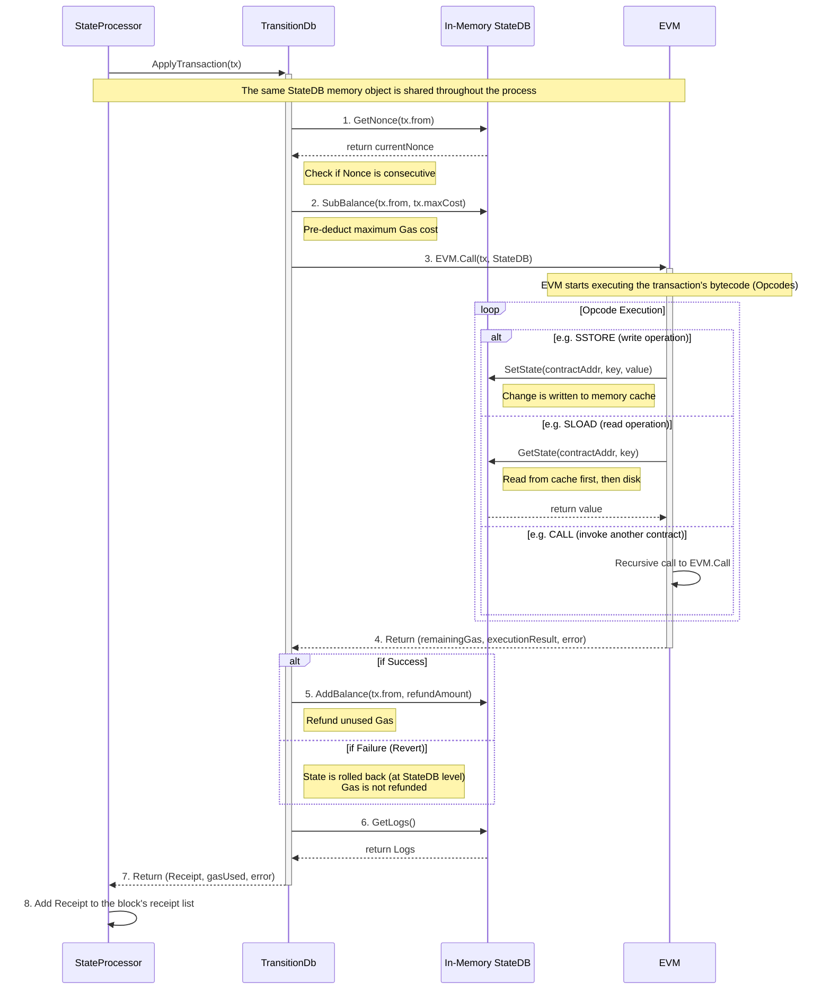
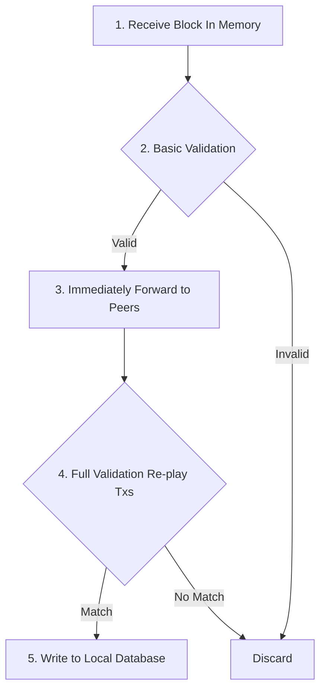
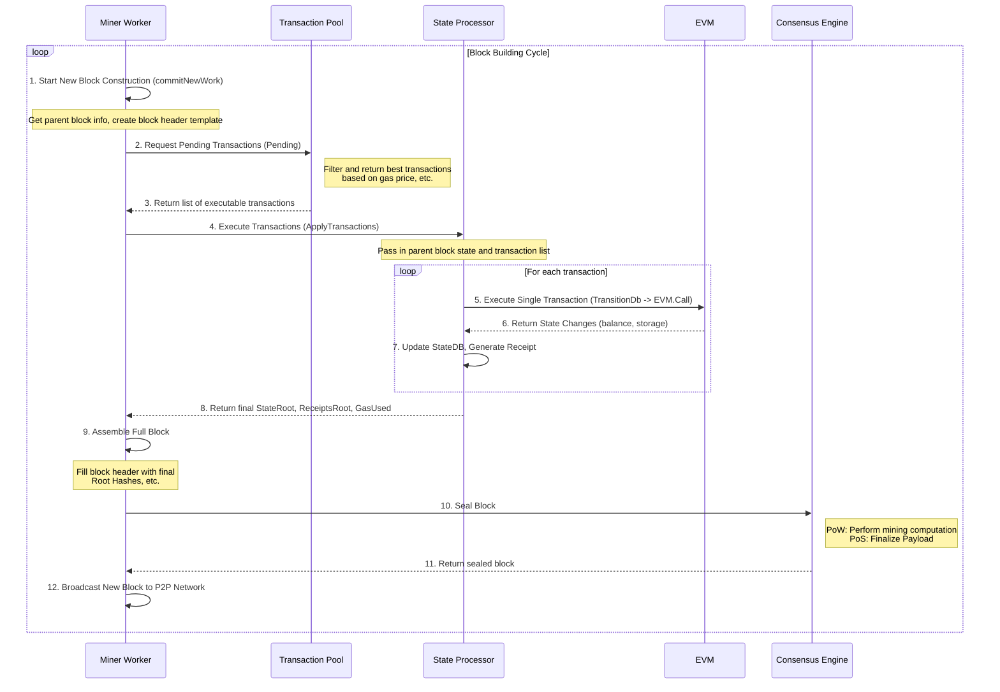
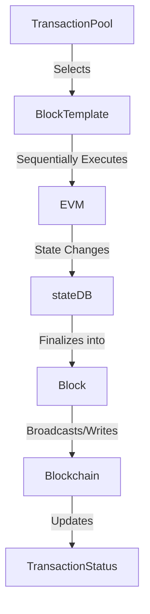

# Package Transaction

## 1. Selecting Transactions from the Transaction Pool

-   Miners/validators periodically select a batch of valid transactions with high gas prices and consecutive nonces from the **transaction pool** (`core/txpool/txpool.go`) to be included in a new block.
-   The selection logic is implemented in methods like `Pending` and `PendingTransactions` in `core/tx_pool.go`.

### 1.1 The Two-Tier System: `pending` vs. `queue`

The most critical concept in `LegacyPool` is its two-tiered structure for storing transactions:

1.  **`pending` (Executable):** This is a map from `address -> transaction list`. It stores transactions that are **immediately processable**. This means their nonces are consecutive with the account's next on-chain nonce, and they have passed all basic validations. Miners select transactions directly from this pool.

2.  **`queue` (Future):** This is also a map from `address -> transaction list`. It stores transactions that are **not yet processable**. The most common reason is a "gap" in nonces. For example, if an account's current nonce is 2, but the transaction pool receives a transaction from that account with nonce 4, this transaction will be placed in the `queue` until the transaction with nonce 3 is processed.

### 1.2 The Complete Lifecycle of Transaction Selection

With this two-tiered structure, we can outline the transaction selection logic:

#### 1.2.1. Transaction Entry (`add` method)

-   When a new transaction arrives at the node, the `add` method validates it.
-   **Core Decision Point**:
    -   If the transaction's nonce is the account's next expected nonce, it is considered "executable" and goes directly into the `pending` pool.
    -   If the transaction's nonce is higher than expected, it is considered a "future" transaction and is placed in the `queue`.
    -   If the transaction's nonce is lower than expected, it is considered stale and will be rejected.
-   All accepted transactions (both `pending` and `queue`) are indexed for quick lookup by hash.

#### 1.2.2. Transaction "Promotion" (`promoteExecutables` method)

-   When a new block is added to the chain, account states (especially nonces) are updated.
-   This triggers a "reset" process, which calls the `promoteExecutables` method.
-   This method checks all transactions in the `queue`. If a transaction that was previously "queued" due to a high nonce becomes "executable" because the on-chain nonce has caught up, it is **moved** from the `queue` to the `pending` pool. This is the "promotion" process.

#### 1.2.3. Transaction Selection (`Pending` method)

-   This is the entry point for miners (or APIs requesting pending transactions).
-   It **only fetches transactions from the `pending` pool** (and unrestricted `local` transactions) because these are guaranteed to be executable with consecutive nonces.
-   It can accept a `filter` parameter to perform further **economic screening** based on the current `BaseFee` and `MinTip` (miner tip). Transactions that do not meet the minimum price requirements are temporarily filtered out.
-   Finally, it returns a list of economically viable transactions, grouped by account and sorted by nonce.

#### 1.2.4. Queue Cleanup

##### 1.2.4.1 Will the `queue` be cleaned up?

**Yes, absolutely.** If the `queue` were not cleaned up, it would become a simple attack vector, allowing attackers to exhaust a node's memory by sending a large number of high-nonce transactions.

`LegacyPool` has several key mechanisms to clean up the `queue`:

*   **Transaction Lifetime (`Lifetime`)**: The `LegacyPool` configuration has a `Lifetime` parameter (defaulting to 3 hours). A transaction that stays in the `queue` longer than this is considered "stale" and is dropped. This is the primary mechanism to prevent indefinite waiting.
*   **Pool Size Limits (`GlobalQueue`, `AccountQueue`)**: The `queue` has a global capacity limit (`GlobalQueue`) and a per-account capacity limit (`AccountQueue`).
    *   If the entire `queue` is full, when a **new** transaction arrives, the pool will try to make space by evicting the **lowest-priced** old transaction.
    *   If a specific account's `queue` is full, any new transactions from that account (even with a higher gas price) will be rejected until space becomes available.

So, a transaction in the `queue` is either eventually "promoted" to `pending` or evicted due to timeout or the pool being full.

---

##### 1.2.4.2 What happens to a transaction with a very low gas fee that never gets executed?

The fate of this transaction depends on which pool it is in:

*   **If in the `pending` pool**: This means its nonce is consecutive and it is technically ready to be included in a block. However, because its gas price is too low, when a miner calls the `Pending()` method with a filter based on current market prices, this transaction will be filtered out, making it "invisible" to the miner. Its likely fate is:
    1.  **Replaced by a higher-priced transaction**: When the `pending` pool is full, to make room for new, higher-paying transactions, the pool evicts the lowest-priced ones first. This low-fee transaction would be among the first to go.
    2.  **Manually replaced by the user**: A user (or their wallet software) can send a new transaction with the **same nonce but a higher gas price**. `LegacyPool` will detect this and replace the old, low-priced transaction with the new one.

*   **If in the `queue` pool**: It first faces the `Lifetime` and capacity limits mentioned above. Even if it eventually waits for its nonce to become consecutive and gets promoted to the `pending` pool, it still has to face the competition and eviction rules of the `pending` pool.

**Conclusion:** On a busy network, a transaction with a persistently low gas fee is almost impossible to get mined. Its ultimate fate is to be "squeezed out" when the pool is full, cleaned up after timing out, or replaced by a higher-fee transaction sent by the user.

#### 1.2.5. Who sets the `filter` parameter?

The `PendingFilter` parameter is set by the **caller of the `Pending` method**. In the Geth codebase, there are two main types of callers:

1.  **Miners/Block Builders (`miner/worker.go`)**: This is the most important caller. When a miner is ready to build a new block, it creates a `PendingFilter` based on the current network `BaseFee` and its own mining strategy (e.g., the minimum tip, `MinTip`, it is willing to accept). It then uses this filter to request a batch of "profitable" transactions from the `TxPool`. This is core to maximizing miner profit.
2.  **RPC API (`internal/ethapi/api.go`)**: When you query for pending transactions via RPC calls like `eth_pendingTransactions`, the RPC handler calls the `Pending` method. In this case, it usually uses an **empty/default filter**. The goal is to return all technically executable transactions without much regard for their economic viability, as the querier just wants to see the content of the pool.

### 1.3 LegacyPool Summary

The selection logic of `LegacyPool` can be summarized as: **"Separate on entry (`pending`/`queue`), promote on state update, select only from `pending` with economic filtering."**

### 1.4 `BlobPool`'s `Pending` Logic

The selection logic for `BlobPool` is more "direct" but has more complex filtering conditions:

1.  **No `queue`**: This is the core difference. `BlobPool` does not have a `queue` for future transactions like `LegacyPool`. It has a single `index` structure that is functionally equivalent to the `pending` pool of `LegacyPool`. The `Stats()` method returning `pending, 0` confirms this. This means `BlobPool` **only accepts transactions with consecutive nonces** and does not cache future transactions.

2.  **Strict Economic Model Filtering**: The core of the `Pending` method is filtering. It iterates through all transactions in the pool and applies a very strict economic model:
    *   **Execution Fee Check**: Like `LegacyPool`, it checks if the transaction's `GasFeeCap` (total gas price) and `GasTipCap` (miner tip) meet the current network `BaseFee` and the caller's minimum required tip.
    *   **Blob Gas Fee Check**: This is unique to EIP-4844 transactions. It must additionally check if the transaction's `BlobFeeCap` is higher than the current network `BlobFee`. This is the fee paid for storing the data blob.
    *   **Early Termination (Optimization)**: An important optimization is that since transactions for each account are sorted by nonce, if a transaction from an account is rejected for failing the economic checks, **all subsequent, higher-nonce transactions from that same account are immediately skipped** (using a `break`). This is because Geth assumes that subsequent transactions will not be priced more favorably.

#### 1.4.1. Who pays the gas fee for `BlobPool`?

**It is paid by the address that sends the Blob transaction.**

The fee structure for a Blob transaction (EIP-4844 Type 3) is special. It consists of two parts, both borne by the transaction sender:

1.  **Execution Gas**: This is exactly like a normal transaction, paying for the computation part of the transaction in the EVM (e.g., contract calls). It follows the EIP-1559 model of `BaseFee` + `PriorityFee` (tip).
2.  **Blob Gas**: This is the fee paid for the data `blobs` attached to the transaction. It's a new, independent fee market. It also has a `BlobBaseFee` determined by network congestion, and the sender must pay `number of blobs * BlobBaseFee`.

The sender's account balance must be sufficient to cover both fees for the transaction to be considered valid.

---

#### 1.4.2. Is there a relationship between `BlobPool` gas fees and the gas fees users pay on Layer 2?

**Yes, there is a very direct and close relationship. The L1 Blob Gas fee is the primary cost component of L2 transaction fees.**

This mechanism is the core purpose of EIP-4844. We can understand the flow as follows:

1.  **User Pays Fee on L2**: You perform a transaction on a Layer 2 network like Arbitrum or Optimism and pay an L2 gas fee. This fee goes to the L2 **Sequencer**.
2.  **L2 Sequencer Bundles Transactions**: The L2 sequencer collects hundreds or thousands of L2 user transactions like yours.
3.  **Sequencer Submits Data to L1**: The sequencer bundles the critical data from these L2 transactions into one or more `blobs`, creates an **L1 Blob Transaction**, and sends it to the Ethereum mainnet.
4.  **Sequencer Pays L1 Gas**: The fee for this L1 Blob Transaction (including both the execution fee and the Blob Gas fee mentioned above) is paid by the L2 **Sequencer**, using the fees it collected from L2 users.
5.  **Cost Amortization**: The total cost paid by the L2 sequencer to L1 is amortized over all the L2 users whose transactions were included in that batch.

**So, the relationship is:**

**Your L2 Gas Fee = (Total L1 Blob Gas Cost / Number of L2 Transactions in Batch) + L2's own operational costs and profit**

### 1.5 Final Summary: `TxPool`'s Coordinated Work

1.  **Divide and Conquer**: Geth's main `TxPool` is actually a coordinator. It maintains at least two sub-pools (`SubPool`): `LegacyPool` and `BlobPool`, which handle legacy and blob transactions respectively.

2.  **Entry Point Distribution**: When a new transaction enters the `TxPool`, the `Filter` method determines its type and dispatches it to the corresponding sub-pool for processing.

3.  **Separate Governance**:
    *   **`LegacyPool`** uses a **"pending + queue"** two-tier structure. It caches future transactions with non-consecutive nonces and "promotes" them to the `pending` queue when they become ready.
    *   **`BlobPool`** uses a simpler **single-tier structure**, only keeping immediately executable transactions with consecutive nonces.

4.  **Aggregated Reporting**: When a miner needs to build a new block and calls `TxPool.Pending()`:
    *   `TxPool` calls `LegacyPool.Pending()` and `BlobPool.Pending()` simultaneously.
    *   Each sub-pool, following its own logic (especially economic filtering) as analyzed above, returns a list of transactions it deems ready.
    *   `TxPool` then **merges** these two lists to form a complete candidate set of transactions of all types, ready for inclusion in a block.

---

## 2. Block Building Process

### 2.1 Block Template Generation

-   Code entry points: `core/blockchain.go`, `miner/worker.go`
-   The `commitNewWork` method in `miner/worker.go` calls `ApplyTransactions` from `core/state_processor.go` to execute the selected transactions sequentially.

### 2.2 Transaction Execution

-   Each transaction is sent to the EVM (Ethereum Virtual Machine) for execution, which involves:
    -   Account balance and nonce checks
    -   Gas calculation and deduction
    -   Contract calls or value transfers
    -   State changes (account balance, contract storage, etc.)
-   Key code:
    -   `core/state_processor.go` → `ApplyTransaction`
    -   `core/state_transition.go` → `TransitionDb`
    -   The `core/vm/` directory contains the EVM execution engine.

#### 2.2.1. Detailed Sequence Diagram of a Single Transaction Execution

This diagram focuses on the internal workflow of the `StateProcessor` when handling a **single transaction**, showing its intricate interaction with the `StateDB` (the in-memory representation of the state database) and the `EVM`.



---

#### 2.2.2. How State Transitions Occur and Are Stored

Let's now answer the question of "what, how, and where" for state transitions. The core concept to understand here is the **`StateDB`** object.

##### `stateDB` - The In-Memory Temporary State Ledger

First, a crucial concept: **during transaction execution, no state changes are written directly to the hard disk database**. They are written to an **in-memory object** called `stateDB` (`core/state/statedb.go`).

Think of `stateDB` as a temporary, cacheable, and revertible "world state ledger."

*   **Where does it come from?** At the beginning of block processing, Geth initializes a `stateDB` object based on the parent block's `StateRoot`. It represents the world state **before** any transactions are executed.
*   **How are writes handled?** When the EVM needs to modify an account's balance or a contract's storage, the modification **only happens in the `stateDB`'s memory cache**.
*   **How are reads handled?** When the EVM needs to read state, `stateDB` first checks its own memory cache for the latest value. If it's not there, it will then access the persistent database on disk (the Merkle Trie).
*   **Why this design?** This design offers two huge advantages:
    1.  **High Performance**: Memory operations are far faster than disk I/O. A transaction might read from and write to the same storage slot multiple times, all of which can be done quickly in memory.
    2.  **Atomicity and Disposability**: This is the key to enabling "simulation." If block building fails, or if a transaction fails, we simply **discard the `stateDB` memory object**. The original state on the hard disk remains untouched.

##### What does `stateDB` contain upon initialization?

When Geth initializes a new `stateDB` object based on a parent block's `StateRoot`, this object conceptually contains a snapshot of the **entire Ethereum "World State" at that specific point in time**.

However, for efficiency, it doesn't load the entire state (which could be hundreds of gigabytes) into memory at once. Its internal structure is smarter:

A `stateDB` object primarily consists of these core components:

1.  **The Trie Root Hash (`StateRoot`)**: This is the most important part. It doesn't contain the data itself but is a hash pointer to the root node of the Merkle Patricia Trie on disk that represents the entire world state. The `stateDB` knows that from this root hash, it can on-demand find any account or contract data.

2.  **An Empty Memory Cache/Journal (`journal`)**: This is the `stateDB`'s primary workspace. It contains several maps to temporarily store all changes that occur during the current session (e.g., the processing of a single block).
    *   `stateObjects`: Caches account objects that have been "touched."
    *   `stateObjectsDirty`: Marks which account objects have been modified.
    *   `logs`: Caches logs (Events) generated during transaction execution.
    *   `preimages`: Caches preimages of hashes for database storage optimization.
    *   ...and so on, for caching other miscellaneous state changes like refunds, self-destructs, etc.

3.  **A Database Connection Handle**: This is the bridge for `stateDB` to communicate with the underlying physical database (LevelDB/Pebble). When data is needed that is not in the memory cache, it uses this handle to access the disk.

**To summarize the initialization process:**

1.  A `stateDB` is created with its cache and journal empty.
2.  It is told, "Your data foundation is the tree on disk represented by `StateRoot` <0xabc...>."
3.  At this point, it has not loaded any actual account data into memory. It's just ready, like a librarian who has the master card catalog but hasn't retrieved any books from the shelves yet.

Only when a transaction needs to **read** the state of Account A does the `stateDB`:
1.  Check its memory cache `stateObjects` for Account A.
2.  If not found, it follows the `StateRoot` path down the Merkle Trie in the on-disk database until it finds the data for Account A.
3.  It then loads the data for Account A into the memory cache `stateObjects` for future use.

##### How does `stateDB` ensure fast lookups?

The fast lookup mechanism of `stateDB` is a combination of **layered caching + an efficient database**.

When the EVM needs to read an account's state (`GetState`), the `stateDB` lookup order is as follows:

1.  **Layer 1: Memory Cache (`stateObjects`)**
    *   The `stateDB` first checks its own "journal"/memory cache to see if this account has already been accessed during the processing of the current block.
    *   If so, it returns the data directly from memory. This is the fastest case, avoiding any disk access.

2.  **Layer 2: Trie Node Cache**
    *   If it's not in the memory cache, `stateDB` needs to access the MPT. However, it doesn't read Trie nodes from the disk every time. Geth maintains a global, LRU (Least Recently Used) **Trie Node Cache**.
    *   As `stateDB` traverses down the MPT path, it first asks this node cache: "Do you have the Trie node with hash <0x123...>?"
    *   If it's a cache hit, it gets the node data directly from memory, avoiding disk I/O. This cache is particularly effective for frequently accessed nodes near the root of the Trie.

3.  **Layer 3: On-Disk Database (LevelDB/Pebble)**
    *   If both memory caches miss, it has no choice but to access the disk.
    *   A major advantage of the MPT is that its keys (the hashes of Trie nodes) are **highly random**. This is a perfect fit for key-value databases like LevelDB/Pebble, which are based on LSM-Trees. It can locate the value (node content) very quickly using the key (node hash).
    *   The `stateDB` reads the node from the disk, puts it into the Trie node cache (for next time), and continues its traversal.

##### The Specifics of a State Transition

Combining this with the sequence diagram, let's see how a "transition" happens:

1.  **Preparation Before EVM Execution (in `TransitionDb`)**
    *   **What is transitioned**: Sender's nonce and balance.
    *   **How it's done**:
        *   `GetNonce`: Reads the sender's current nonce from `stateDB` for validation.
        *   `SubBalance`: Directly in the `stateDB` memory object, it subtracts the maximum possible fee for the transaction (`gas limit * gas price`) from the sender's balance.
    *   **Storage**: At this point, the nonce is unchanged, but the balance **change is recorded in the `stateDB`'s memory cache**.

2.  **State Changes During EVM Execution**
    *   **What is transitioned**: Anything. Account balances, contract storage, creation of new contracts, etc.
    *   **How it's done**: When the `EVM` executes opcodes like `SSTORE` (write storage), `CALL` (which can change the target contract's state), or `CREATE` (create a new contract), it calls the interfaces provided by `stateDB` (`SetState`, `AddBalance`, `CreateAccount`...) to modify the state.
    *   **Storage**: All of these modifications, without exception, are **written to the `stateDB`'s memory cache**. For example, `SSTORE` will mark in the `stateDB` cache, "The value of storage slot Y in contract X is now Z."

3.  **Finalizing After EVM Execution**
    *   **What is transitioned**: Sender's balance (Gas refund).
    *   **How it's done**: `TransitionDb` gets the `gasUsed` (actual gas consumed) from the EVM, calculates the refund amount, and calls `stateDB.AddBalance`.
    *   **Storage**: This refund updates the sender's balance in the `stateDB`'s memory cache.

4.  **Failure Handling: Revert**
    *   If the EVM encounters a `REVERT` opcode or an error during execution, the power of `stateDB` shines. It has a **snapshot** mechanism. A snapshot can be created before each transaction is executed. If the transaction fails, a simple call to `stateDB.RevertToSnapshot()` instantly undoes all modifications made to the `stateDB` memory cache during that transaction. The pre-deducted gas, however, is not refunded.

##### On Gas Deduction: Why can a failed transaction cost more?

Your observation is very sharp: "If the pre-deducted gas for a failed transaction is not refunded, does that mean a failed transaction can cost more?" **Yes, in many cases, a failed transaction does indeed consume more Gas than a successful one that does little work.**

The design principle behind this is to **penalize the waste of network resources and ensure miners/validators are compensated for the work they perform.**

Let's break down the logic:

###### a) Why is the pre-deducted Gas not refunded?

Because **even if a transaction ultimately fails, it has already consumed the computational resources of the network's nodes.**

Imagine this scenario:
An attacker sends a transaction containing an infinite loop. A node starts executing it (in `EVM.Call`), and its CPU starts spinning. Without the Gas mechanism, this transaction would cause the node to hang forever.

The Gas mechanism acts like a "timer" or "step counter." The EVM consumes a little Gas for every opcode it executes. When all the Gas a transaction carries (`gas limit`) is used up, the EVM forcibly halts execution and throws an `out of gas` error.

During this process:
*   The node's CPU has done real work.
*   The node has spent time and resources processing this transaction.

**If the pre-deducted Gas were refunded to the sender at this point, it would mean an attacker could make thousands of nodes across the network work for them for free, which would immediately destroy the network.**

So, the rule is: **Once you make the EVM start working, you must pay for every bit of computational resource you consume, regardless of whether your code succeeds or fails.** The pre-deducted Gas is there to ensure you can afford to pay the bill.

###### b) Gas Consumption: Failed vs. Successful Transactions

*   **Failed Transaction**: Consumes all the Gas for the opcodes executed from the start of the transaction until the point of failure (e.g., `revert` or `out of gas`). There is no "refund" concept here; what's consumed is consumed.
*   **Successful Transaction**: At final settlement, only the **actually used** Gas (`gasUsed`) is deducted. The unused portion of the pre-paid fee (`gas limit - gasUsed`) is refunded.

**For example:**

Assume the `gas limit` for both is 1,000,000.

*   **Transaction A (Success)**: A simple transfer that actually consumes only 21,000 Gas. In the end, the sender is charged for 21,000 Gas, and the fee for the remaining 979,000 Gas is refunded.
*   **Transaction B (Failure)**: It calls a complex contract and, after performing 800,000 Gas worth of computation, it `revert`s because a condition is not met. In the end, the sender is charged for **800,000 Gas**.

**The conclusion is clear**: In this example, the failed Transaction B is far more expensive than the successful Transaction A. This is precisely the intention of the design: **You pay for the resources you consume.** Failure (Revert) does not absolve you of the obligation to pay for the computation already performed.

###### c) Transaction Simulation
Let's delve into the crucial feature of "transaction simulation." It's like a ground-based simulation for an astronaut before a moon landing—the first and most important line of defense for ensuring user fund safety and improving user experience.

###### What is Transaction Simulation?

The core idea of transaction simulation is: **to execute a transaction completely in a "sandbox" environment and observe its result, without actually broadcasting it, leaving any on-chain footprint, or spending any real gas.**

This "sandbox" environment isn't a separate, special piece of software; it's **any Ethereum full node itself**. Ethereum nodes are inherently capable of this and expose this service through specific RPC (Remote Procedure Call) methods.

The two most core RPC methods are:

1.  `eth_call`
2.  `eth_estimateGas`

Although they have different names, their underlying execution logic is almost identical: "simulation."

###### The Detailed Flow of a Simulation

Let's take the example of a user clicking the "Swap" button in a DApp within MetaMask to see what happens behind the scenes:

1.  **DApp Constructs the Transaction Object**:
    *   The DApp's frontend code, based on user input (e.g., swap 1 ETH for DAI), constructs a standard Ethereum transaction object. This object includes:
        *   `from`: The user's address
        *   `to`: The DApp's contract address (e.g., Uniswap Router)
        *   `value`: The amount of ETH being sent (1 ETH)
        *   `data`: The most critical part, encoding the function to be called (e.g., `swapExactETHForTokens`) and its parameters (e.g., minimum expected DAI amount, trade path).

2.  **MetaMask Intercepts and Simulates**:
    *   When the DApp requests MetaMask to sign and send this transaction, MetaMask does not immediately pop up a signature request.
    *   Instead, it takes the transaction object constructed by the DApp and makes an `eth_estimateGas` call to its connected RPC node (e.g., Infura, Alchemy, or the user's own local node).

3.  **Node-Side Simulation Execution**:
    *   The RPC node, upon receiving the `eth_estimateGas` request, spins up a **temporary, one-off execution environment**.
    *   **Get Latest State**: It initializes a `stateDB` based on the current latest block. This `stateDB` represents the most up-to-date state of the world on-chain.
    *   **Execute `TransitionDb`**: The node processes the simulated transaction just like a real one, calling `TransitionDb` with the transaction and the temporary `stateDB`.
    *   **Enter EVM**: The transaction is sent to the EVM, which executes all state changes on the temporary `stateDB`.

4.  **Observe and Return the Result (The Core Difference)**:
    *   **If Execution Succeeds**: The EVM runs the entire process smoothly. The node records **how much Gas was actually consumed** (e.g., `123,456`), which is the `gasUsed`. The node then returns this estimated Gas value `123,456` as the result to MetaMask.
    *   **If Execution Fails (Revert)**: If, during execution, the contract logic determines a condition is not met and calls `REVERT`, or another error occurs (like an array out-of-bounds), the EVM halts immediately. The node captures this failure event and **returns an error message** to MetaMask, which often includes the reason for the revert.
    *   **Regardless of Success or Failure**: The most crucial step is that after execution, **the node immediately discards the temporary `stateDB` object**. All state changes made during the simulation (like the user's ETH decreasing and DAI increasing) vanish, leaving the on-chain state completely untouched.

5.  **MetaMask Handles the Simulation Result**:
    *   **Receives Gas Estimate**: If MetaMask receives a specific Gas value (e.g., `123,456`), it knows the transaction will likely succeed. It uses this value as the `gasLimit` (usually adding a small buffer, e.g., 20%), and then finally presents all the transaction details to the user for their signature.
    *   **Receives Error**: If MetaMask receives an error, it knows the transaction will fail. It then forgoes the signature request and instead displays a clear warning in the UI, such as: "This transaction is likely to fail. Are you sure you want to proceed?"

###### The Fundamental Difference Between Simulation and Real Execution

| Feature          | Transaction Simulation (`eth_estimateGas`, `eth_call`)                    | Real Execution (`eth_sendRawTransaction`)                                |
| ---------------- | ----------------------------------------------------------------------- | ------------------------------------------------------------------------ |
| **State Change** | **Temporary, one-off**. Occurs in memory and is discarded immediately.    | **Permanent**. If successful, changes are included in a block and recorded forever. |
| **Cost**         | **Free**. For the user and DApp, it's just an RPC query that consumes no Gas. | **Expensive**. The user must pay real ETH as a gas fee.                     |
| **Context**      | **Based on the "latest" block**. Simulates what would happen "if this transaction were executed immediately in the next block." | **Based on the block it's included in**. The state transition is based on the parent of the block that actually includes it. |
| **Purpose**      | **Prediction and Estimation**. To predict if a transaction will succeed and to estimate its cost. | **Execution and Confirmation**. To authoritatively execute the transaction and change the world state under network consensus. |

Through this mechanism, the Ethereum ecosystem cleverly transforms a user-unfriendly low-level protocol rule (paying for failures) into a relatively safe and predictable user experience via higher-level tools (wallets).

###### Implementation Idea:
```typescript
import { ethers } from 'ethers';

// Assume you have a provider and signer
// const provider = new ethers.providers.Web3Provider(window.ethereum);
// const signer = provider.getSigner();

// Your contract ABI and address
const contractAddress = "0x...";
const contractABI = [ /* ... Your contract ABI ... */ ];

// Create contract instance
const myContract = new ethers.Contract(contractAddress, contractABI, signer);

// --- DApp function to handle a "Mint" button click ---
async function handleMintClick(mintAmount) {
  if (!signer) {
    alert("Please connect your wallet first!");
    return;
  }

  console.log("Preparing to mint", mintAmount, "tokens...");

  // --- Steps 1 & 2: Build transaction parameters ---
  // ethers.js helps build `to`, `data`, etc. behind the scenes.
  // We just need to prepare the function call and its arguments.

  // --- Step 3: Call the simulation method ---
  try {
    console.log("Simulating transaction to estimate gas...");
    
    // Use .estimateGas to simulate. It calls the function just like
    // a real transaction but only returns the gas estimate.
    // If the transaction would revert, this will throw an error.
    const estimatedGas = await myContract.estimateGas.mint(mintAmount, {
        // If your mint function is payable, attach a value
        // value: ethers.utils.parseEther("0.1") 
    });

    console.log("Simulation successful! Estimated Gas:", estimatedGas.toString());

    // --- Post-simulation success handling ---
    // You can give the user a confirmation message
    // showSuccessMessage("Transaction simulation passed! Ready to mint.");

    // Now, initiate the actual transaction
    console.log("Sending actual transaction...");
    const tx = await myContract.mint(mintAmount, {
        gasLimit: estimatedGas.mul(120).div(100) // Add a 20% buffer
    });

    console.log("Transaction sent! Hash:", tx.hash);
    await tx.wait(); // Wait for the transaction to be mined
    console.log("Transaction confirmed!");
    // showFinalSuccessMessage("Mint successful!");

  } catch (error) {
    // --- Step 4: Handle simulation result (failure) ---
    console.error("Transaction simulation failed:", error);

    // Here, you can parse the error to give a more user-friendly message
    let errorMessage = "The transaction is likely to fail. Please check the conditions.";
    
    // ethers.js tries to parse the revert reason
    if (error.reason) {
      errorMessage = `Transaction failed: ${error.reason}`;
    } else if (error.data && error.data.message) {
      // Handle other error formats
      errorMessage = `Transaction failed: ${error.data.message}`;
    }

    // Display this error in your DApp UI
    // showErrorInUI(errorMessage);
    alert(errorMessage);
  }
}

// Example call
// handleMintClick(5); 
```

##### The Final "Storage" - From Memory to Persistence

So, when do all these in-memory changes actually get written to disk?

This happens **after all transactions in an entire block have been successfully processed**.

1.  After executing all transactions in a block, the `StateProcessor` holds a final version of the `stateDB` object, which contains the accumulated state changes from all transactions.
2.  At this point, the `stateDB.Commit()` method is called.
3.  This `Commit()` method does two things:
    *   It takes all the "dirty" data from the `stateDB`'s memory cache and **truly writes it to the on-disk database (LevelDB/Pebble)** in the Merkle Patricia Trie format.
    *   During this writing process, it calculates the unique **`StateRoot` hash** that represents this brand-new world state.

This `StateRoot` hash is the crucial field in the block header.

*   During **block building** ("simulation"), the main purpose of `Commit()` is to calculate this `StateRoot` to be included in the block header.
*   During **block validation** ("real execution"), the main purpose of `Commit()` is to persist the new state to the node's database after validation passes, thus advancing the blockchain.

### 2.3 State Changes

-   During execution, all state changes (account balances, contract storage, logs, etc.) are recorded in a temporary stateDB (`core/state/`).
-   If a transaction fails (e.g., out of gas), only the gas is deducted; other state changes are rolled back.

#### 2.3.1. How does `stateDB` `Commit`?

The core goal of `Commit` is: to efficiently and deterministically write all the changes cached in the in-memory `stateDB` to the on-disk database and to calculate the unique hash representing this new world state—the new `StateRoot`.

This process isn't just appending data to a file; it's a series of update operations on the MPT.

**What data does `Commit` submit?**

It only commits data that has been "dirtied" in memory. Throughout transaction execution, `stateDB` acts like a journal, recording all modified accounts (`stateObjectsDirty`). When `Commit` is called, it only processes these marked accounts.

For each dirtied account, `stateDB` does two things:
1.  **Update the account's own state**: This includes `nonce`, `balance`, `codeHash`, and `storageRoot`.
2.  **Update the account's Storage Trie**: If the contract storage for this account was also modified, `stateDB` will first recursively `Commit` the account's own Storage Trie to calculate a new `storageRoot`, and then update that in the account's state.

**How does `Commit` ensure fast and correct writes?**

The answer lies in the properties of the **Merkle Patricia Trie (MPT)**.

1.  **Path Determines Position**: The MPT is a key-value store based on "paths." An account's address (or a storage slot's key) is converted into a sequence of hex characters, which determines its **unique path** in the Trie. When an account needs to be updated, Geth doesn't need to "search" for it; it can directly "locate" its position in the tree based on the address path.

2.  **Copy-on-Write and Structural Sharing**: This is the most efficient and core mechanism. When committing a change, **it does not modify any old Trie nodes**. Instead, it:
    *   **Copies the Path**: All nodes along the path from the root to the node being modified are copied.
    *   **Modifies the Copy**: The changes are only made on the newly copied nodes.
    *   **Shares Unchanged Parts**: All other unaffected parts of the tree are completely shared (their node pointers are reused) between the old and new versions of the Trie.

    **Example**: Imagine the world state is a massive Trie with millions of nodes. Now, only a single account's balance is modified. On `Commit`:
    *   The path from the root node to this account's leaf node (perhaps only a few dozen nodes) is copied.
    *   The account's leaf node is updated.
    *   The parent nodes on the path have their hashes updated because their child's hash has changed.
    *   This results in a new root node with a new `StateRoot` hash.
    *   The millions of other untouched nodes are **completely shared** by the trees represented by the old and new `StateRoot`, requiring no read or write operations.

    This ensures that the cost of a `Commit` is proportional to the **depth and breadth of the changes**, not the total size of the state database. This is the secret to how it can "find and modify within hundreds of GBs."

3.  **Hashes as Pointers**: Nodes in the MPT are linked not by memory pointers, but by the **hash of their child nodes**. The `Commit` process involves recalculating the hashes of all modified nodes on the path from the bottom up, ultimately converging to a new `StateRoot`.

---

## 3. Block Finalization

-   After all transactions are executed, the block header is generated (containing the merkle root, gas used, logs bloom filter, etc.).
-   Key code: `core/types/block.go` → `NewBlock`

---

## 4. Block Signing and Broadcasting

-   PoW/PoS nodes sign the block (or submit it to consensus), then broadcast the new block over the P2P network.
-   Relevant code: `miner/worker.go`, and the specific consensus implementations in the `consensus/` directory.

### What does "block signing" mean?

"Block signing" is a general term representing how **a block producer (a miner or validator) cryptographically applies an unforgeable "stamp of identity" to the block they have created. This proves that the block was legitimately generated and published by them.**

The specific form of this "stamp" differs between PoW and PoS, but the purpose is the same:

#### a) In PoW (Proof of Work):

Strictly speaking, there is no "signature" in the traditional sense in PoW. The "stamp" is **achieved by solving an extremely difficult mathematical puzzle (hash computation)**.

*   **What is the "stamp"**: The `Nonce` and `MixHash` values in the block header.
*   **How it's applied**: After assembling a candidate block, a miner repeatedly tries different `Nonce` values and hashes the block header. They continue until the resulting hash is less than the current network difficulty target.
*   **How it's verified**: Any other node that receives this block only needs to perform the hash calculation **once** on the header to see if the result is indeed less than the difficulty target. If it is, this proves the miner expended a massive, honest amount of computational power to "create" this stamp. This process itself grants the block its legitimacy, so no additional digital signature is needed to prove the miner's identity.

#### b) In PoS (Proof of Stake) (Current Ethereum):

In PoS, the process is much closer to the literal meaning of "signing."

*   **What is the "stamp"**: A **digital signature** of the block's data, generated using the validator's **private key**.
*   **How it's applied**:
    1.  When a validator is chosen to propose a new block, it assembles transactions and generates an Execution Payload, just like a PoW miner.
    2.  The consensus layer client (e.g., Prysm, Lighthouse) then bundles this Payload with other consensus-layer data into a "Beacon Block."
    3.  The validator uses the private key it registered when it staked its ETH to sign the hash of this Beacon Block.
*   **How it's verified**: Other validators who receive the block use the proposer's **public key** (which is known to the whole network) to verify the signature. If the signature is valid, it proves that the block was indeed published by the legitimately selected validator who was authorized to propose a block, and not by an impostor.

**Summary**: Regardless of the form, the essence of "block signing" is to solve a core problem: **How to make the entire network trust that this new block was generated by a legitimate, authorized entity according to the network rules, and not just invalid data fabricated by an attacker.** PoW proves it with computational power; PoS proves it with a staked private key.

## 5. Writing to the Blockchain

-   After the block is verified by the local node and other nodes, it is written to the local chain database (LevelDB/Pebble).
-   Key code: `core/blockchain.go` → `InsertChain`, `InsertBlock`
-   Note: Block propagation happens before the block is written. The reason is as follows:

### **Block propagation (broadcasting) absolutely happens before the block is written to the (local node's) database.**

This is a carefully designed sequence for network efficiency and security. Let's walk through the standard flow for a **receiving node** (not the block producer) when it processes a new block:

1.  **Receive**
    *   The node's P2P layer listens on the network and receives new, complete block data from a peer via a `NewBlock` or `NewBlockHashes` message. At this moment, the block exists only in the node's memory.

2.  **Basic Validation**
    *   The node immediately performs a series of quick, low-cost checks on the in-memory block. For example:
        *   Check if the block header has the correct basic format.
        *   PoW: Verify the proof-of-work (`mixHash` and `nonce`) of the block header. This requires only a single hash calculation and is very fast.
        *   PoS: Verify the proposer's signature.
        *   Check if the timestamp is reasonable.
    *   **This step is critical**: It quickly filters out malformed or obviously fraudulent junk blocks, preventing them from wasting the node's more valuable computational resources.

3.  **Propagate/Forward**
    *   **Once basic validation passes**, the node considers the block to be "plausibly authentic." For the health and low latency of the entire network, it **immediately forwards this block to its other peers**.
    *   This "forward-first" strategy is crucial for reducing block propagation delay across the network and effectively lowers the probability of network forks caused by information asymmetry.

4.  **Full Validation**
    *   While (or after) forwarding, the node begins the costly full validation. This is the "real execution" scenario we discussed earlier:
        *   Fetch the block's parent.
        *   Initialize a `stateDB` based on the parent's `StateRoot`.
        *   **Re-play every single transaction in the block**, and calculate the final `StateRoot`, `ReceiptsRoot`, `GasUsed`, etc.
        *   **Strictly compare** these calculated root hashes with the ones recorded in the new block's header.

5.  **Write to DB / Import**
    *   **Only if** full validation succeeds, meaning all calculated hashes perfectly match the values in the block header, will the node finally accept the block.
    *   At this point, the node calls a function like `InsertChain` to write the block's header and body to the local LevelDB/Pebble database and calls `stateDB.Commit()` to atomically write all state changes generated during validation to the database.
    *   Only then does the block officially become part of the "main chain" from this node's local perspective.

### Flowchart



### Why this order?

*   **Efficiency**: If a node waited until after it had fully validated and written the block before forwarding it, each node would add tens to hundreds of milliseconds of delay to the block's propagation. In a geographically dispersed global network, this latency would add up significantly, potentially causing nodes on the other side of the world to receive a new block several seconds later, greatly increasing the risk of forks.
*   **Security**: Performing low-cost basic validation first ensures that nodes don't mindlessly forward junk data, protecting the network from simple DoS attacks. The high-cost full validation is done locally, ensuring that only a completely valid block can ultimately change the node's own state.

Therefore, this sequence of "**basically approve and propagate first, then fully validate and write later**" is a delicate balance struck between efficiency and security in a decentralized network.

---

## 6. Transaction Status Update

-   Once a transaction is included in a block, its status becomes "confirmed" and can be queried via RPC (e.g., `eth_getTransactionReceipt`).
-   Relevant code: `eth/api.go`, `core/types/receipt.go`

[5.1 StateDB vs Recipt](./stateDB-receipt.md)

---

## Key Code Paths Overview

| Step                  | Primary File/Method                               |
| --------------------- | ------------------------------------------------- |
| Select from TxPool    | `core/txpool/txpool.go` → `PendingTransactions`   |
| Block Building        | `miner/worker.go` → `commitNewWork`               |
| Transaction Execution | `core/state_processor.go` → `ApplyTransaction`    |
| State Change          | `core/state_transition.go` → `TransitionDb`       |
| EVM Execution         | `core/vm/`                                        |
| Block Finalization    | `core/types/block.go` → `NewBlock`                |
| Block Write           | `core/blockchain.go` → `InsertChain`              |
| Status Query          | `eth/api.go`, `core/types/receipt.go`             |

---

### Sequence Diagram
This diagram depicts the complete flow from when a miner (`Worker`) decides to start building a new block to when it finally broadcasts this block, showing the interactions between the core modules.



### Diagram Explanation: The Block Building Cycle

This `loop` represents the fundamental work of a miner/validator: it's a never-ending cycle, always attempting to build the next block on top of the current chain tip.

#### 1. Start New Block Construction (`commitNewWork`)

*   **Participant**: `Miner Worker`
*   **What it does**: This is the starting point of the building process. The `Worker` calls the `commitNewWork` method in `miner/worker.go` to prepare a "shell" or "template" for a new block.
*   **Details**:
    *   It gets the current "head" of the blockchain (the latest, topmost block) to use as the parent.
    *   It creates a new block header (`types.Header`).
    *   It sets the `ParentHash` field of the new header to the hash of the parent block.
    *   It sets basic info like the timestamp, difficulty/mixhash, etc.
    *   **At this point, the header fields that represent content, like `StateRoot`, `TxsRoot`, and `ReceiptsRoot`, are still empty** because there is no content yet.

#### 2. & 3. Request and Receive Pending Transactions

*   **Participants**: `Worker` -> `TxPool` -> `Worker`
*   **What it does**: A block needs to be filled with transactions to be valuable. The `Worker` requests the "best" transactions from the `Transaction Pool`.
*   **Details**:
    *   The `Worker` calls the `TxPool`'s `Pending()` method.
    *   As we discussed in depth earlier, the `TxPool` (and its sub-pools `LegacyPool`, `BlobPool`) executes complex filtering logic. It filters out low-paying transactions based on the current `BaseFee` and the miner's desired `Tip`.
    *   It returns a list where transactions are sorted by nonce (for each account) and the entire list is typically sorted by miner profit (effective gas price) from high to low. The `Worker` receives an "optimal packing solution."

#### 4. Execute Transactions (`ApplyTransactions`)

*   **Participant**: `Worker` -> `StateProcessor`
*   **What it does**: The `Worker` can't just stuff the transaction list into the block. It must first **simulate the execution** of these transactions to calculate what the world state will become if this block is accepted by the network. It delegates this computational work to the `State Processor`.
    * This is called **speculative execution** because every node, whether it is selected to be the builder or not, will execute the transactions. If the node doesn't "win" the block (e.g., another miner is faster), all the state changes calculated in this execution are discarded.
*   **Details**:
    *   The `Worker` passes the parent block's `StateRoot` (representing the world state before execution) and the transaction list from the previous step to the `ApplyTransactions` method in `core/state_processor.go`.

#### 5. 6. & 7. The Core: Single Transaction Execution Loop

*   **Participants**: `StateProcessor` -> `EVM` -> `StateProcessor`
*   **What it does**: This is the core of the entire process. The `StateProcessor` iterates through the transaction list and executes them one by one.
*   **Details**:
    1.  **Call `TransitionDb`**: For each transaction, `StateProcessor` calls `TransitionDb` in `core/state_transition.go`. This function is the "security checkpoint" before entering the EVM. It is responsible for:
        *   **Validation**: Checking if the transaction nonce is correct and if the sender has enough balance to cover the transfer amount + max gas cost.
        *   **Deduction**: Pre-deducting the maximum gas fee from the sender's account.
    2.  **Enter EVM**: After passing the checks, `TransitionDb` calls `EVM.Call`, handing control to the virtual machine. The EVM executes the opcodes corresponding to the transaction's `data` field, which could be a simple transfer or a complex smart contract call.
    3.  **State Change**: The EVM's execution changes state data, e.g., Account A's balance decreases, a storage variable in Contract B is modified. These changes are all recorded in a temporary state database object (`stateDB`).
    4.  **Return & Gas Refund**: The EVM finishes execution, returning the result (success or failure) and the remaining gas. `StateProcessor` calculates the amount to be refunded to the sender based on the remaining gas.
    5.  **Generate Receipt**: The `StateProcessor` generates a `Receipt` for the transaction, recording whether it succeeded, how much gas was consumed, what logs (Events) were generated, etc.

#### 8. Return Final Results

*   **Participant**: `StateProcessor` -> `Worker`
*   **What it does**: Once all transactions have been executed, the `StateProcessor` has completed its mission.
*   **Details**:
    *   It hashes the final `stateDB` to get the final `StateRoot`.
    *   It hashes all the transaction `Receipts` to get the `ReceiptsRoot`.
    *   It also returns the total `GasUsed` for the block.
    *   These results are all returned to the `Worker`.

#### 9. Assemble Full Block

*   **Participant**: `Worker`
*   **What it does**: The `Worker` now has all the puzzle pieces. It fills the block header template from step 1 with the `StateRoot`, `TxsRoot` (Merkle Root of the transaction list), `ReceiptsRoot`, and other key data. A block that is content-complete and data-consistent is now born. But it still lacks the final "stamp."

#### 10. & 11. Seal the Block

*   **Participants**: `Worker` -> `Consensus` -> `Worker`
*   **What it does**: This "stamp" is the consensus engine's signature or proof of work. The `Worker` hands the assembled block to the `Consensus` module for "sealing."
*   **Details**:
    *   **PoW (Old Ethereum)**: The consensus engine would start hash mining furiously until it found a `nonce` that met the current network difficulty. This is the proof of work.
    *   **PoS (Current Ethereum)**: The `Worker` (Execution Client) sends this block (called an Execution Payload) via the Engine API to its paired Consensus Client (e.g., Prysm, Lighthouse). The Consensus Client is responsible for proposing, validating, and finalizing it on the Beacon Chain.
    *   Either way, the `Consensus` module, upon completion, returns a fully sealed, legitimate block that can be recognized by the entire network.

#### 12. Broadcast New Block to P2P Network

*   **Participant**: `Worker`
*   **What it does**: Success! The `Worker` broadcasts this freshly baked, valid block to its peers over the P2P network. Other nodes receive it, validate it, and if it passes, add it to their local blockchain and continue to broadcast it outwards.

A new block is born, the blockchain height increases by one, and the entire cycle starts over again from step one.

- [Blofk creation and verification](./block-creation-vs-verification.md)

## Flowchart (Simplified)



---

## Summary

-   When packaging a transaction, a node **selects, executes, changes state, finalizes the block, writes to the chain**, and updates the transaction status.
-   This process involves multiple core modules, including the transaction pool, EVM, state management, block building, consensus, and storage.
-   You can dive deeper into the source code starting from entry points like `commitNewWork` in `miner/worker.go`, `ApplyTransaction` in `core/state_processor.go`, and `InsertChain` in `core/blockchain.go`.
