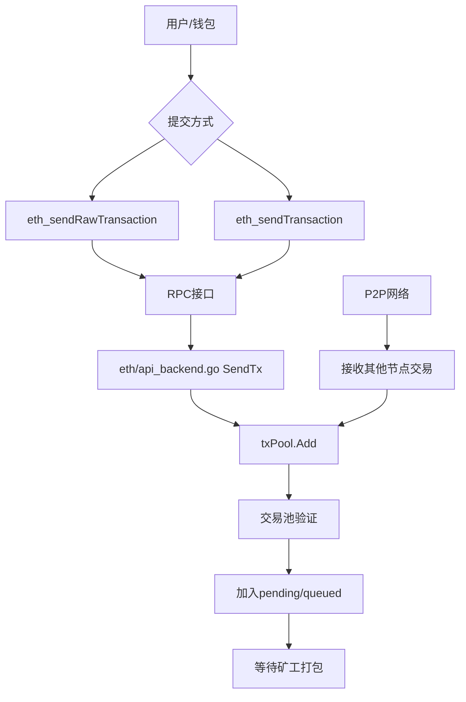
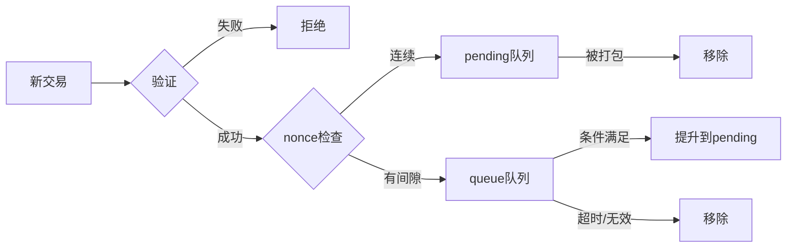
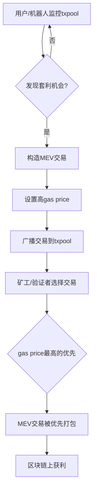

## 交易池 (TxPool) 详细解析

### 1. 交易池的作用和为什么需要交易池

**交易池的核心作用：**

1. **缓存待打包交易**：暂存从网络接收或本地提交的合法交易，等待矿工/验证者打包
2. **交易优先级管理**：按 gas price、nonce 等规则排序，优先处理高价值交易  
3. **防止重复执行**：避免同一交易被重复处理
4. **资源管理**：限制内存使用，防止 DoS 攻击
5. **网络同步**：在 P2P 网络中广播和同步交易

**为什么需要交易池：**

- **异步处理**：交易提交和区块打包是异步的，需要缓冲区
- **公平性**：让所有合法交易都有被打包的机会
- **效率**：批量处理交易，提高打包效率
- **稳定性**：处理网络拥堵和交易突发

### 2. 用户如何与交易池交互



**具体交互代码路径：**

```60:75:eth/api_backend.go
func (b *EthAPIBackend) SendTx(ctx context.Context, signedTx *types.Transaction) error {
	err := b.eth.txPool.Add([]*types.Transaction{signedTx}, false)[0]

	// If the local transaction tracker is not configured, returns whatever
	// returned from the txpool.
	if b.eth.localTxTracker == nil {
		return err
	}
	// If the transaction fails with an error indicating it is invalid, or if there is
	// very little chance it will be accepted later (e.g., the gas price is below the
	// configured minimum, or the sender has insufficient funds to cover the cost),
	// propagate the error to the user.
	if err != nil && !locals.IsTemporaryReject(err) {
		return err
	}
	// No error will be returned to user if the transaction fails with a temporary
	// error and might be accepted later (e.g., the transaction pool is full).
	// Locally submitted transactions will be resubmitted later via the local tracker.
	b.eth.localTxTracker.Track(signedTx)
	return nil
}
```

### 3. 交易池用来做什么，怎么做

**主要功能：**

1. **交易接收和验证**
2. **交易分类存储** (pending/queued)
3. **优先级排序**
4. **资源限制管理**
5. **为矿工提供交易**

**交易池架构 - 模块化设计：**


```go
// TxPool is an aggregator for various transaction specific pools, collectively
// tracking all the transactions deemed interesting by the node. Transactions
// enter the pool when they are received from the network or submitted locally.
// They exit the pool when they are included in the blockchain or evicted due to
// resource constraints.
type TxPool struct {
	subpools []SubPool // List of subpools for specialized transaction handling
	chain    BlockChain
	signer   types.Signer

	stateLock sync.RWMutex   // The lock for protecting state instance
	state     *state.StateDB // Current state at the blockchain head

	subs event.SubscriptionScope // Subscription scope to unsubscribe all on shutdown
	quit chan chan error         // Quit channel to tear down the head updater
	term chan struct{}           // Termination channel to detect a closed pool

	sync chan chan error // Testing / simulator channel to block until internal reset is done
}
```
[code](https://github.com/ethereum/go-ethereum/blob/master/core/txpool/txpool.go#L65-L78)

**Go-ethereum 使用模块化设计，主要有两个子池：**

1. **LegacyPool** - 处理普通交易 (Legacy, AccessList, DynamicFee, SetCode)
    * 目前依然是主流 EVM 交易的唯一池子，并没有被“废弃”，只是命名为 legacy 是为了和 blobPool 区分。
2. **BlobPool** - 专门处理 EIP-4844 blob 交易


### 4. 区块打包顺序详解

#### 4.1 交易池（txpool）中的排序

- 节点收到交易后，先放入txpool（交易池）。
- txpool会根据**nonce**（防止双花）和**gas price**（优先级）对交易进行排序。
- 一般来说，同一个账户的交易必须按nonce递增顺序依次打包。
- 不同账户之间，txpool会优先选择**gas price高**的交易。

#### 4.2. 区块打包流程

- 当矿工/验证者要生产新区块时，会从txpool中选择交易打包进区块。
- 选择和排序的主要依据：
  - **gas price/gas fee**：优先选择gas price高的交易（矿工收益最大化）。
  - **nonce**：同一账户的交易必须按顺序打包。
  - **区块gas limit**：区块能容纳的交易总gas有限，优先塞下收益高的交易。
- 以太坊EIP-1559后，排序依据变为**maxFeePerGas**和**maxPriorityFeePerGas**。

#### 4.3. 代码相关（go-ethereum）

- 交易池排序逻辑：`core/txpool/txpool.go`
- 区块打包逻辑：`core/miner/worker.go`、`core/state_processor.go`
- 交易选择函数：如`worker.commitTransactions()`，会遍历txpool，按优先级选择交易。

---

### 5. 交易池底层实现

**LegacyPool 核心数据结构：**

```go
type LegacyPool struct {
	config      Config
	chainconfig *params.ChainConfig
	chain       BlockChain
	gasTip      atomic.Pointer[uint256.Int]
	txFeed      event.Feed
	signer      types.Signer
	mu          sync.RWMutex

	currentHead   atomic.Pointer[types.Header] // Current head of the blockchain
	currentState  *state.StateDB               // Current state in the blockchain head
	pendingNonces *noncer                      // Pending state tracking virtual nonces
	reserver      txpool.Reserver              // Address reserver to ensure exclusivity across subpools

	pending map[common.Address]*list     // All currently processable transactions
	queue   map[common.Address]*list     // Queued but non-processable transactions
	beats   map[common.Address]time.Time // Last heartbeat from each known account
	all     *lookup                      // All transactions to allow lookups
	priced  *pricedList                  // All transactions sorted by price
	// ... 其他字段
}
```

[code](https://github.com/ethereum/go-ethereum/blob/master/core/txpool/legacypool/legacypool.go#L227-L256)

**关键组件说明：**

- **pending**: 可立即执行的交易 (nonce 连续)
- **queue**: 等待的交易 (nonce 有间隙) 
- **all**: 所有交易的查找表
- **priced**: 按价格排序的交易列表

**交易状态转换：**



### 6. 交易在交易池里的打包逻辑和具体代码

在POS（权益证明）下，geth等执行客户端依然会用这套逻辑来“构造区块payload”，只是最终的区块提议和共识由共识客户端（如Prysm、Lighthouse）驱动。
共识客户端通过Engine API（如 engine_getPayloadV1）请求geth构造区块时，geth内部依然会走到 generateWork → fillTransactions 这条主线。


**矿工从交易池获取交易的过程：**

[code](https://github.com/ethereum/go-ethereum/blob/master/miner/worker.go#L449-L503)

```go
func (miner *Miner) fillTransactions(interrupt *atomic.Int32, env *environment) error {
	// Retrieve the pending transactions from the txpool
	filter := txpool.PendingFilter{
		MinTip: uint256.MustFromBig(env.header.BaseFee),
	}
	if env.header.BaseFee != nil {
		filter.BaseFee = uint256.MustFromBig(env.header.BaseFee)
	}
	filter.BlobFee = uint256.MustFromBig(eip4844.CalcBlobFee(env.header.ExcessBlobGas))

	pendingPlainTxs := miner.txpool.Pending(filter)
	filter.OnlyBlobTxs = true
	pendingBlobTxs := miner.txpool.Pending(filter)

	// Split the pending transactions into locals and remotes.
	localPlainTxs, remotePlainTxs := make(map[common.Address][]*txpool.LazyTransaction), pendingPlainTxs
	localBlobTxs, remoteBlobTxs := make(map[common.Address][]*txpool.LazyTransaction), pendingBlobTxs

	// Fill the block with all available pending transactions.
	if len(localPlainTxs) > 0 || len(localBlobTxs) > 0 {
		plainTxs := newTransactionsByPriceAndNonce(env.signer, localPlainTxs, env.header.BaseFee)
		blobTxs := newTransactionsByPriceAndNonce(env.signer, localBlobTxs, env.header.BaseFee)

		if err := miner.commitTransactions(env, plainTxs, blobTxs, interrupt); err != nil {
			return err
		}
	}
	if len(remotePlainTxs) > 0 || len(remoteBlobTxs) > 0 {
		plainTxs := newTransactionsByPriceAndNonce(env.signer, remotePlainTxs, env.header.BaseFee)
		blobTxs := newTransactionsByPriceAndNonce(env.signer, remoteBlobTxs, env.header.BaseFee)

		if err := miner.commitTransactions(env, plainTxs, blobTxs, interrupt); err != nil {
			return err
		}
	}
	return nil
}
```


**交易池提供 Pending 方法给矿工：**

(code)[https://github.com/ethereum/go-ethereum/blob/master/core/txpool/legacypool/legacypool.go#L508-L559]

```go
func (pool *LegacyPool) Pending(filter txpool.PendingFilter) map[common.Address][]*txpool.LazyTransaction {
	// If only blob transactions are requested, this pool is unsuitable as it
	// contains none, don't even bother.
	if filter.OnlyBlobTxs {
		return nil
	}
	pool.mu.Lock()
	defer pool.mu.Unlock()

	// Convert the new uint256.Int types to the old big.Int ones used by the legacy pool
	var (
		minTipBig  *big.Int
		baseFeeBig *big.Int
	)
	if filter.MinTip != nil {
		minTipBig = filter.MinTip.ToBig()
	}
	if filter.BaseFee != nil {
		baseFeeBig = filter.BaseFee.ToBig()
	}
	pending := make(map[common.Address][]*txpool.LazyTransaction, len(pool.pending))
	for addr, list := range pool.pending {
		txs := list.Flatten()

		// If the miner requests tip enforcement, cap the lists now
		if minTipBig != nil {
			for i, tx := range txs {
				if tx.EffectiveGasTipIntCmp(minTipBig, baseFeeBig) < 0 {
					txs = txs[:i]
					break
				}
			}
		}
		if len(txs) > 0 {
			lazies := make([]*txpool.LazyTransaction, len(txs))
			for i := 0; i < len(txs); i++ {
				lazies[i] = &txpool.LazyTransaction{
					Pool:      pool,
					Hash:      txs[i].Hash(),
					Tx:        txs[i],
					Time:      txs[i].Time(),
					GasFeeCap: uint256.MustFromBig(txs[i].GasFeeCap()),
					GasTipCap: uint256.MustFromBig(txs[i].GasTipCap()),
					Gas:       txs[i].Gas(),
					BlobGas:   txs[i].BlobGas(),
				}
			}
			pending[addr] = lazies
		}
	}
	return pending
}
```

**交易添加到池的完整流程：**

[code](https://github.com/ethereum/go-ethereum/blob/master/core/txpool/txpool.go#L316-L357)

```316:362:core/txpool/txpool.go
func (p *TxPool) Add(txs []*types.Transaction, sync bool) []error {
	// Split the input transactions between the subpools. It shouldn't really
	// happen that we receive merged batches, but better graceful than strange
	// errors.
	//
	// We also need to track how the transactions were split across the subpools,
	// so we can piece back the returned errors into the original order.
	txsets := make([][]*types.Transaction, len(p.subpools))
	splits := make([]int, len(txs))

	for i, tx := range txs {
		// Mark this transaction belonging to no-subpool
		splits[i] = -1

		// Try to find a subpool that accepts the transaction
		for j, subpool := range p.subpools {
			if subpool.Filter(tx) {
				txsets[j] = append(txsets[j], tx)
				splits[i] = j
				break
			}
		}
	}
	// Add the transactions split apart to the individual subpools and piece
	// back the errors into the original sort order.
	errsets := make([][]error, len(p.subpools))
	for i := 0; i < len(p.subpools); i++ {
		errsets[i] = p.subpools[i].Add(txsets[i], sync)
	}
	errs := make([]error, len(txs))
	for i, split := range splits {
		// If the transaction was rejected by all subpools, mark it unsupported
		if split == -1 {
			errs[i] = fmt.Errorf("%w: received type %d", core.ErrTxTypeNotSupported, txs[i].Type())
			continue
		}
		// Find which subpool handled it and pull in the corresponding error
		errs[i] = errsets[split][0]
		errsets[split] = errsets[split][1:]
	}
	return errs
}
```
让我们逐条详细解答你的问题：

---

### 7. 一般用户用RPC能怎么跟txpool打交道

一般用户可以通过以太坊节点暴露的RPC接口与txpool（交易池）进行交互。常见的RPC方法有：

- **txpool_content**  
  获取当前交易池中所有的pending和queued交易的详细内容。  
  示例调用：  
  ```json
  {
    "jsonrpc": "2.0",
    "method": "txpool_content",
    "params": [],
    "id": 1
  }
  ```

- **txpool_status**  
  获取交易池中pending和queued交易的数量。  
  示例调用：  
  ```json
  {
    "jsonrpc": "2.0",
    "method": "txpool_status",
    "params": [],
    "id": 1
  }
  ```

- **txpool_inspect**  
  获取交易池中交易的简要信息（只包含from、nonce、to、value等）。  
  示例调用：  
  ```json
  {
    "jsonrpc": "2.0",
    "method": "txpool_inspect",
    "params": [],
    "id": 1
  }
  ```

**用途**：  
- 查询自己发出的交易是否已进入交易池（pending/queued）。
- 监控全网交易池的拥堵情况。
- 观察其他用户的交易（如MEV相关监控）。

---

### 8. monitoring txpool的作用

监控txpool的作用主要有：

- **交易确认追踪**：用户可以实时追踪自己发出的交易是否已被节点接收、是否还在pending、是否被打包进区块。
- **网络健康监控**：节点运营者可以通过监控pending/queued交易数量，判断网络是否拥堵、节点是否同步正常。
- **套利与MEV监控**：套利者、MEV搜索者会监控txpool，寻找可利用的交易机会（如三明治攻击、抢跑等）。
- **安全分析**：监控异常交易、批量攻击、垃圾交易等，及时响应安全威胁。
- **统计分析**：分析交易费用、gas使用、交易类型分布等。

---

### 8. txpool的MEV是怎么回事，需要调用到哪些逻辑

**MEV（Maximal Extractable Value）** 指的是矿工/验证者通过重新排序、插入、删除区块内交易所能获得的最大收益。  
在txpool层面，MEV相关的行为主要包括：

- **监控交易池**：实时获取所有pending交易，分析其中的套利机会（如DEX交易、清算、NFT抢购等）。
- **交易排序与抢跑**：发现机会后，快速构造并广播自己的交易，争取优先被打包。
- **三明治攻击**：监控大额swap等交易，前后插入自己的交易获利。


#### 8.1. MEV的本质

- MEV（Maximal Extractable Value）是指通过**改变区块内交易顺序**，矿工/验证者可以获得的额外收益。
- 这种收益来源于：抢跑（front-running）、三明治攻击（sandwich）、清算（liquidation）、后跑（back-running）等。

#### 8.2. 典型MEV策略

##### 1）抢跑（Front-running）

- 监控到某个大额交易即将发生（如DEX大额swap），MEV机器人立刻发送一笔自己的交易，**提高gas price**，让矿工优先打包自己的交易在目标交易之前。
- 这样可以提前买入/卖出，利用价格变动获利。

##### 2）三明治攻击（Sandwich）

- 监控到某个大额swap交易（会导致价格滑点）。
- 机器人先发一笔交易（A），抢在目标交易（V）前面买入。
- 目标交易（V）执行，价格被推高/推低。
- 机器人再发一笔交易（B），在目标交易后卖出。
- 通过前后夹击，套利目标交易的滑点。

##### 3）清算（Liquidation）

- 监控DeFi协议的清算机会，抢先发起清算交易，赚取清算奖励。

#### 8.3. MEV实现流程

1. **监控txpool**：实时监听所有pending交易，发现潜在套利机会。
2. **构造MEV交易**：根据机会，构造一组交易（如三明治的前后两笔）。
3. **提高gas price**：设置极高的gas price或priority fee，确保矿工优先打包自己的交易。
4. **发送交易**：通过eth_sendRawTransaction等接口广播交易。
5. **矿工/验证者排序**：矿工/验证者通常会优先打包gas price高的交易，MEV机器人因此能插队成功。

**涉及的主要逻辑/调用：**

1. **txpool_content/inspect**  
   获取所有pending交易，分析目标交易。

2. **构造并发送交易**  
   通过eth_sendRawTransaction等接口，发送自己的MEV交易。

3. **交易排序**  
   节点内部txpool会根据gas price、nonce等对交易排序，矿工/验证者可选择优先打包哪些交易。

4. **区块打包逻辑**  
   在区块生产时，矿工/验证者可自定义交易排序，最大化MEV收益。

**代码相关位置（go-ethereum）**：
- `core/txpool/` 目录：交易池的核心逻辑
- `core/miner/` 目录：区块打包与交易排序
- `eth/filters/`、`rpc/` 目录：RPC接口实现


#### 8.4. MEV与打包顺序的关系

- **谁能决定打包顺序？**  
  - 矿工/验证者有最终决定权，可以自定义区块内交易顺序。
  - 一般节点会按gas price排序，但矿工可手动调整（如通过MEV-Boost、Flashbots等）。
- **MEV机器人如何插队？**  
  - 通过设置高gas price，激励矿工优先打包自己的交易。
  - 甚至直接与矿工/验证者私下合作（如Flashbots），保证交易顺序。

---

#### 8.5 可视化流程图



---

// TODO furtuer MEV investigation

