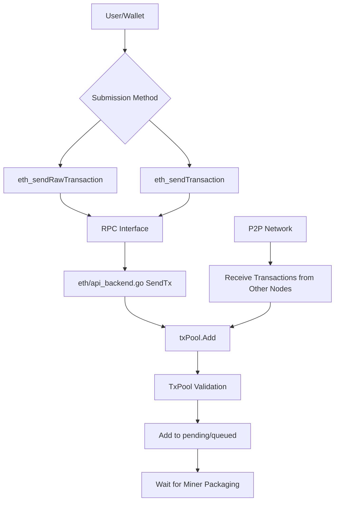
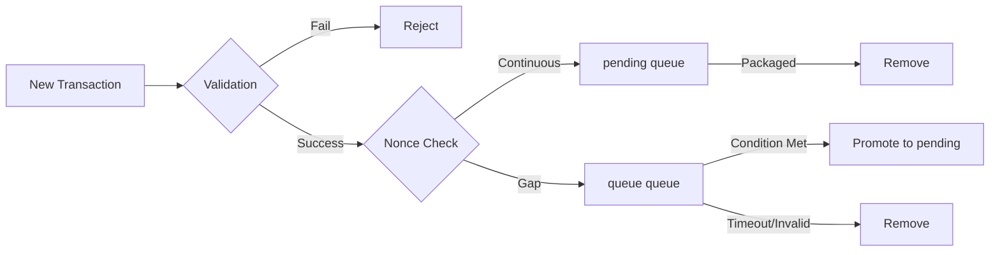
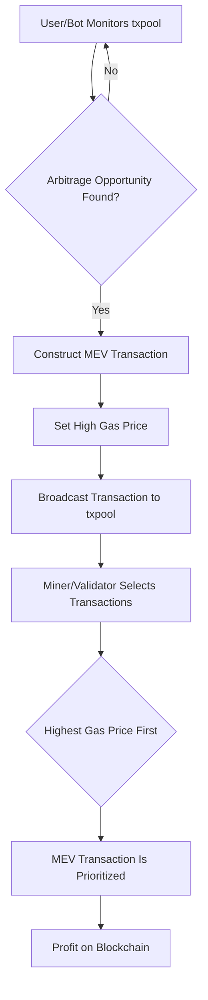

## Transaction Pool (TxPool) Detailed Analysis

### 1. The Role of the Transaction Pool and Why It Is Needed

**Core Functions of the Transaction Pool:**

1. **Buffering Pending Transactions**: Temporarily stores valid transactions received from the network or submitted locally, waiting for miners/validators to include them in a block.
2. **Transaction Priority Management**: Sorts transactions by gas price, nonce, etc., prioritizing high-value transactions.
3. **Prevents Duplicate Execution**: Avoids processing the same transaction multiple times.
4. **Resource Management**: Limits memory usage to prevent DoS attacks.
5. **Network Synchronization**: Broadcasts and synchronizes transactions in the P2P network.

**Why a Transaction Pool Is Needed:**

- **Asynchronous Processing**: Transaction submission and block packaging are asynchronous, requiring a buffer.
- **Fairness**: Ensures all valid transactions have a chance to be included in a block.
- **Efficiency**: Batch processing of transactions improves packaging efficiency.
- **Stability**: Handles network congestion and transaction surges.

### 2. How Users Interact with the Transaction Pool



**Relevant Code Path:**

```60:75:eth/api_backend.go
func (b *EthAPIBackend) SendTx(ctx context.Context, signedTx *types.Transaction) error {
	err := b.eth.txPool.Add([]*types.Transaction{signedTx}, false)[0]

	// If the local transaction tracker is not configured, returns whatever
	// returned from the txpool.
	if b.eth.localTxTracker == nil {
		return err
	}
	// If the transaction fails with an error indicating it is invalid, or if there is
	// very little chance it will be accepted later (e.g., the gas price is below the
	// configured minimum, or the sender has insufficient funds to cover the cost),
	// propagate the error to the user.
	if err != nil && !locals.IsTemporaryReject(err) {
		return err
	}
	// No error will be returned to user if the transaction fails with a temporary
	// error and might be accepted later (e.g., the transaction pool is full).
	// Locally submitted transactions will be resubmitted later via the local tracker.
	b.eth.localTxTracker.Track(signedTx)
	return nil
}
```

### 3. What the Transaction Pool Does and How

**Main Functions:**

1. **Transaction Reception and Validation**
2. **Categorized Storage** (pending/queued)
3. **Priority Sorting**
4. **Resource Limitation Management**
5. **Providing Transactions for Miners**

**TxPool Architecture - Modular Design:**

```go
// TxPool is an aggregator for various transaction specific pools, collectively
// tracking all the transactions deemed interesting by the node. Transactions
// enter the pool when they are received from the network or submitted locally.
// They exit the pool when they are included in the blockchain or evicted due to
// resource constraints.
type TxPool struct {
	subpools []SubPool // List of subpools for specialized transaction handling
	chain    BlockChain
	signer   types.Signer

	stateLock sync.RWMutex   // The lock for protecting state instance
	state     *state.StateDB // Current state at the blockchain head

	subs event.SubscriptionScope // Subscription scope to unsubscribe all on shutdown
	quit chan chan error         // Quit channel to tear down the head updater
	term chan struct{}           // Termination channel to detect a closed pool

	sync chan chan error // Testing / simulator channel to block until internal reset is done
}
```
[code](https://github.com/ethereum/go-ethereum/blob/master/core/txpool/txpool.go#L65-L78)

**Go-ethereum uses a modular design with two main sub-pools:**

1. **LegacyPool** - Handles regular transactions (Legacy, AccessList, DynamicFee, SetCode)
    * Still the only pool for mainstream EVM transactions. The name "legacy" is just to distinguish it from blobPool.
2. **BlobPool** - Specially handles EIP-4844 blob transactions


### 4. Detailed Block Packaging Order

#### 4.1 Sorting in the Transaction Pool (txpool)

- When a node receives a transaction, it is first placed in the txpool.
- The txpool sorts transactions by **nonce** (to prevent double-spending) and **gas price** (priority).
- For the same account, transactions must be packaged in increasing nonce order.
- Among different accounts, the txpool prioritizes transactions with higher **gas price**.

#### 4.2. Block Packaging Process

- When a miner/validator is about to produce a new block, it selects transactions from the txpool to include in the block.
- The main criteria for selection and sorting are:
  - **gas price/gas fee**: Prefer transactions with higher gas price (maximizing miner revenue).
  - **nonce**: Transactions from the same account must be included in order.
  - **block gas limit**: The total gas of transactions in a block is limited; transactions with higher returns are prioritized.
- After Ethereum EIP-1559, sorting is based on **maxFeePerGas** and **maxPriorityFeePerGas**.

#### 4.3. Related Code (go-ethereum)

- Transaction pool sorting logic: `core/txpool/txpool.go`
- Block packaging logic: `core/miner/worker.go`, `core/state_processor.go`
- Transaction selection function: e.g., `worker.commitTransactions()`, which iterates through the txpool and selects transactions by priority.

---

### 5. Underlying Implementation of the Transaction Pool

**Core Data Structure of LegacyPool:**

```go
type LegacyPool struct {
	config      Config
	chainconfig *params.ChainConfig
	chain       BlockChain
	gasTip      atomic.Pointer[uint256.Int]
	txFeed      event.Feed
	signer      types.Signer
	mu          sync.RWMutex

	currentHead   atomic.Pointer[types.Header] // Current head of the blockchain
	currentState  *state.StateDB               // Current state in the blockchain head
	pendingNonces *noncer                      // Pending state tracking virtual nonces
	reserver      txpool.Reserver              // Address reserver to ensure exclusivity across subpools

	pending map[common.Address]*list     // All currently processable transactions
	queue   map[common.Address]*list     // Queued but non-processable transactions
	beats   map[common.Address]time.Time // Last heartbeat from each known account
	all     *lookup                      // All transactions to allow lookups
	priced  *pricedList                  // All transactions sorted by price
	// ... other fields
}
```

[code](https://github.com/ethereum/go-ethereum/blob/master/core/txpool/legacypool/legacypool.go#L227-L256)

**Key Component Descriptions:**

- **pending**: Transactions that can be executed immediately (continuous nonce)
- **queue**: Waiting transactions (nonce gap)
- **all**: Lookup table for all transactions
- **priced**: List of transactions sorted by price

**Transaction State Transitions:**



### 6. Packaging Logic and Code for Transactions in the Pool

Under POS (Proof of Stake), execution clients like geth still use this logic to "construct block payloads"; only the final block proposal and consensus are driven by consensus clients (e.g., Prysm, Lighthouse).
Consensus clients request geth to construct blocks via the Engine API (e.g., engine_getPayloadV1), and geth internally follows the generateWork → fillTransactions mainline.


**How miners obtain transactions from the pool:**

[code](https://github.com/ethereum/go-ethereum/blob/master/miner/worker.go#L449-L503)

```go
func (miner *Miner) fillTransactions(interrupt *atomic.Int32, env *environment) error {
	// Retrieve the pending transactions from the txpool
	filter := txpool.PendingFilter{
		MinTip: uint256.MustFromBig(env.header.BaseFee),
	}
	if env.header.BaseFee != nil {
		filter.BaseFee = uint256.MustFromBig(env.header.BaseFee)
	}
	filter.BlobFee = uint256.MustFromBig(eip4844.CalcBlobFee(env.header.ExcessBlobGas))

	pendingPlainTxs := miner.txpool.Pending(filter)
	filter.OnlyBlobTxs = true
	pendingBlobTxs := miner.txpool.Pending(filter)

	// Split the pending transactions into locals and remotes.
	localPlainTxs, remotePlainTxs := make(map[common.Address][]*txpool.LazyTransaction), pendingPlainTxs
	localBlobTxs, remoteBlobTxs := make(map[common.Address][]*txpool.LazyTransaction), pendingBlobTxs

	// Fill the block with all available pending transactions.
	if len(localPlainTxs) > 0 || len(localBlobTxs) > 0 {
		plainTxs := newTransactionsByPriceAndNonce(env.signer, localPlainTxs, env.header.BaseFee)
		blobTxs := newTransactionsByPriceAndNonce(env.signer, localBlobTxs, env.header.BaseFee)

		if err := miner.commitTransactions(env, plainTxs, blobTxs, interrupt); err != nil {
			return err
		}
	}
	if len(remotePlainTxs) > 0 || len(remoteBlobTxs) > 0 {
		plainTxs := newTransactionsByPriceAndNonce(env.signer, remotePlainTxs, env.header.BaseFee)
		blobTxs := newTransactionsByPriceAndNonce(env.signer, remoteBlobTxs, env.header.BaseFee)

		if err := miner.commitTransactions(env, plainTxs, blobTxs, interrupt); err != nil {
			return err
		}
	}
	return nil
}
```


**The transaction pool provides the Pending method for miners:**

(code)[https://github.com/ethereum/go-ethereum/blob/master/core/txpool/legacypool/legacypool.go#L508-L559]

```go
func (pool *LegacyPool) Pending(filter txpool.PendingFilter) map[common.Address][]*txpool.LazyTransaction {
	// If only blob transactions are requested, this pool is unsuitable as it
	// contains none, don't even bother.
	if filter.OnlyBlobTxs {
// ... existing code ...
```

**Full Process of Adding a Transaction to the Pool:**

[code](https://github.com/ethereum/go-ethereum/blob/master/core/txpool/txpool.go#L316-L357)

```316:362:core/txpool/txpool.go
func (p *TxPool) Add(txs []*types.Transaction, sync bool) []error {
	// Split the input transactions between the subpools. It shouldn't really
	// happen that we receive merged batches, but better graceful than strange
	// errors.
	//
	// We also need to track how the transactions were split across the subpools,
	// so we can piece back the returned errors into the original order.
	txsets := make([][]*types.Transaction, len(p.subpools))
	splits := make([]int, len(txs))

	for i, tx := range txs {
		// Mark this transaction belonging to no-subpool
		splits[i] = -1

		// Try to find a subpool that accepts the transaction
		for j, subpool := range p.subpools {
			if subpool.Filter(tx) {
				txsets[j] = append(txsets[j], tx)
				splits[i] = j
				break
			}
		}
	}
	// Add the transactions split apart to the individual subpools and piece
	// back the errors into the original sort order.
	errsets := make([][]error, len(p.subpools))
	for i := 0; i < len(p.subpools); i++ {
		errsets[i] = p.subpools[i].Add(txsets[i], sync)
	}
	errs := make([]error, len(txs))
	for i, split := range splits {
		// If the transaction was rejected by all subpools, mark it unsupported
		if split == -1 {
			errs[i] = fmt.Errorf("%w: received type %d", core.ErrTxTypeNotSupported, txs[i].Type())
			continue
		}
		// Find which subpool handled it and pull in the corresponding error
		errs[i] = errsets[split][0]
		errsets[split] = errsets[split][1:]
	}
	return errs
}
```
Let's answer your questions one by one in detail:

---

### 7. How Regular Users Can Interact with the TxPool via RPC

Regular users can interact with the txpool (transaction pool) through the RPC interfaces exposed by Ethereum nodes. Common RPC methods include:

- **txpool_content**  
  Retrieves detailed information about all pending and queued transactions in the current transaction pool.  
  Example call:  
  ```json
  {
    "jsonrpc": "2.0",
    "method": "txpool_content",
    "params": [],
    "id": 1
  }
  ```

- **txpool_status**  
  Retrieves the number of pending and queued transactions in the transaction pool.  
  Example call:  
  ```json
  {
    "jsonrpc": "2.0",
    "method": "txpool_status",
    "params": [],
    "id": 1
  }
  ```

- **txpool_inspect**  
  Retrieves brief information about transactions in the pool (only includes from, nonce, to, value, etc.).  
  Example call:  
  ```json
  {
    "jsonrpc": "2.0",
    "method": "txpool_inspect",
    "params": [],
    "id": 1
  }
  ```

**Use Cases**:  
- Check if your submitted transaction has entered the pool (pending/queued).
- Monitor network congestion by observing the number of pending/queued transactions.
- Observe other users' transactions (e.g., for MEV monitoring).

---

### 8. The Role of Monitoring the TxPool

The main purposes of monitoring the txpool are:

- **Transaction Confirmation Tracking**: Users can track in real time whether their submitted transactions have been received by the node, are still pending, or have been included in a block.
- **Network Health Monitoring**: Node operators can monitor the number of pending/queued transactions to determine if the network is congested or if the node is syncing properly.
- **Arbitrage and MEV Monitoring**: Arbitrageurs and MEV searchers monitor the txpool to find exploitable opportunities (e.g., sandwich attacks, frontrunning, etc.).
- **Security Analysis**: Monitor abnormal, batch, or spam transactions to respond to security threats in a timely manner.
- **Statistical Analysis**: Analyze transaction fees, gas usage, transaction type distribution, etc.

---

### 8. What Is MEV in the TxPool and What Logic Is Involved

**MEV (Maximal Extractable Value)** refers to the maximum profit that miners/validators can obtain by reordering, inserting, or deleting transactions within a block.  
At the txpool level, MEV-related behaviors mainly include:

- **Monitoring the Transaction Pool**: Real-time access to all pending transactions to analyze arbitrage opportunities (e.g., DEX trades, liquidations, NFT sniping, etc.).
- **Transaction Sorting and Frontrunning**: Upon discovering an opportunity, quickly construct and broadcast your own transaction to try to be included first.
- **Sandwich Attacks**: Monitor large swap transactions and insert your own transactions before and after to profit.


#### 8.1. The Essence of MEV

- MEV (Maximal Extractable Value) refers to the extra profit miners/validators can obtain by **changing the order of transactions within a block**.
- This profit comes from: frontrunning, sandwich attacks, liquidations, backrunning, etc.

#### 8.2. Typical MEV Strategies

##### 1) Frontrunning

- When a large transaction is about to happen (e.g., a large DEX swap), MEV bots immediately send their own transaction with a **higher gas price** so that miners include their transaction before the target transaction.
- This allows them to buy/sell in advance and profit from the price movement.

##### 2) Sandwich Attack

- When a large swap transaction is detected (which will cause price slippage).
- The bot first sends a transaction (A) to buy before the target transaction (V).
- The target transaction (V) executes, pushing the price up/down.
- The bot then sends another transaction (B) to sell after the target transaction.
- By sandwiching the target transaction, the bot profits from the slippage.

##### 3) Liquidation

- Monitor DeFi protocol liquidation opportunities and be the first to initiate liquidation to earn rewards.

#### 8.3. MEV Implementation Process

1. **Monitor the txpool**: Listen to all pending transactions in real time to find potential arbitrage opportunities.
2. **Construct MEV Transactions**: Based on the opportunity, construct a set of transactions (e.g., the two sides of a sandwich).
3. **Increase Gas Price**: Set a very high gas price or priority fee to ensure miners prioritize your transaction.
4. **Send Transactions**: Broadcast your MEV transactions via eth_sendRawTransaction, etc.
5. **Miner/Validator Sorting**: Miners/validators usually prioritize transactions with higher gas prices, so MEV bots can jump the queue.

**Main Logic/Calls Involved:**

1. **txpool_content/inspect**  
   Get all pending transactions and analyze target transactions.

2. **Construct and Send Transactions**  
   Send your MEV transactions via eth_sendRawTransaction, etc.

3. **Transaction Sorting**  
   The node's txpool sorts transactions by gas price, nonce, etc.; miners/validators can choose which transactions to prioritize.

4. **Block Packaging Logic**  
   During block production, miners/validators can customize transaction order to maximize MEV profits.

**Relevant Code Locations (go-ethereum)**:
- `core/txpool/`: Core logic of the transaction pool
- `core/miner/`: Block packaging and transaction sorting
- `eth/filters/`, `rpc/`: RPC interface implementation


#### 8.4. Relationship Between MEV and Packaging Order

- **Who decides the packaging order?**  
  - Miners/validators have the final say and can customize the transaction order within a block.
  - Regular nodes usually sort by gas price, but miners can manually adjust (e.g., via MEV-Boost, Flashbots, etc.).
- **How do MEV bots jump the queue?**  
  - By setting a high gas price to incentivize miners to include their transactions first.
  - Sometimes by directly collaborating with miners/validators (e.g., Flashbots) to guarantee transaction order.

---

#### 8.5 Visualization Flowchart



---

// TODO furtuer MEV investigation 