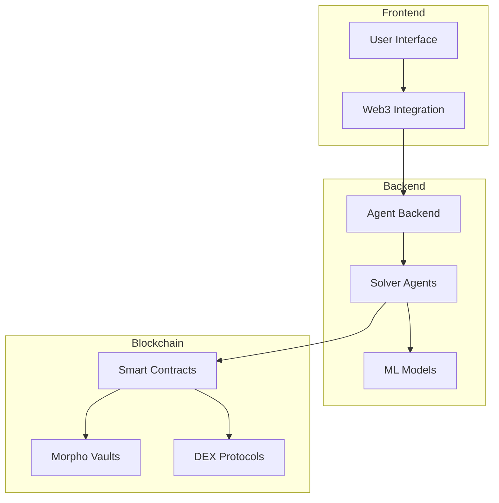
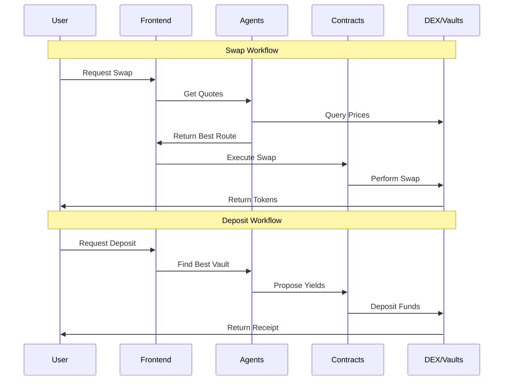
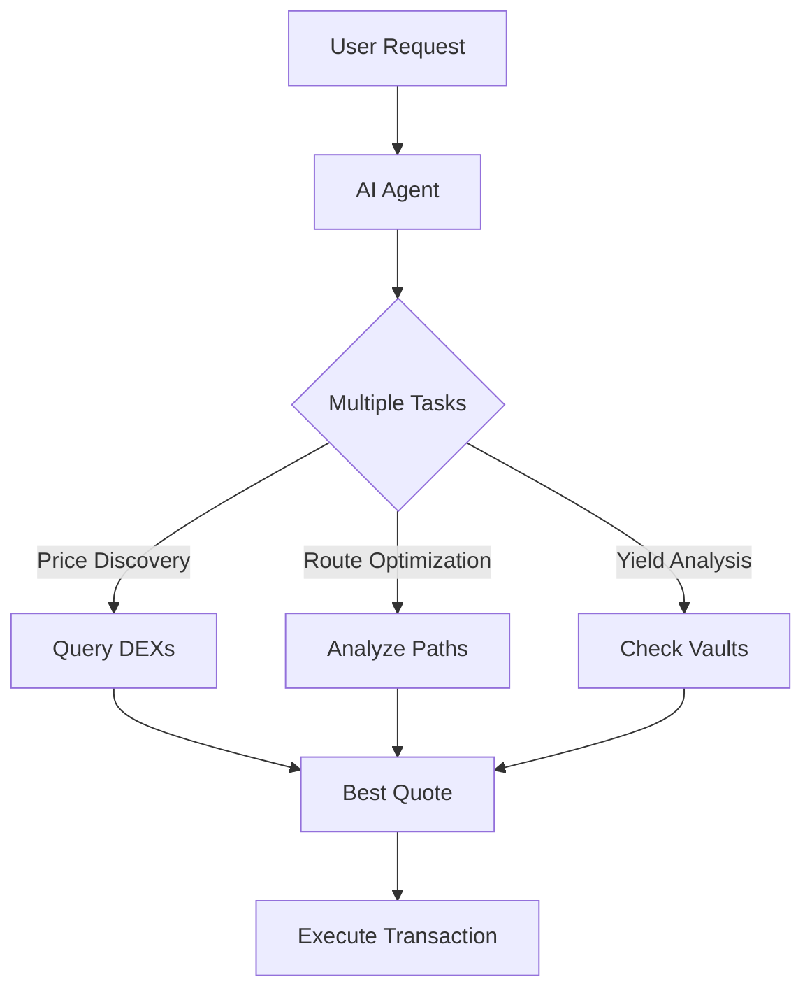
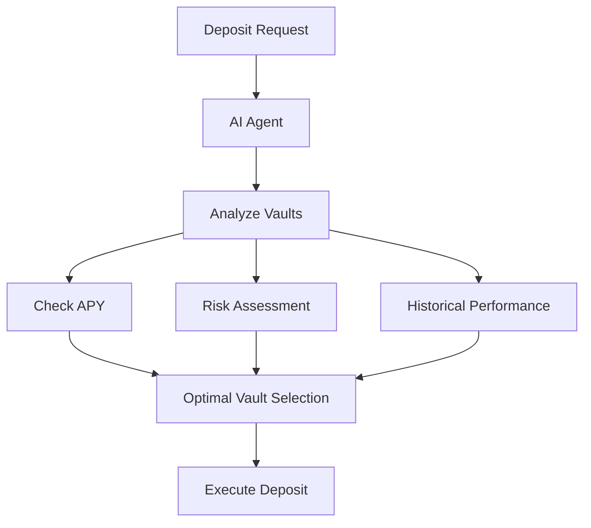
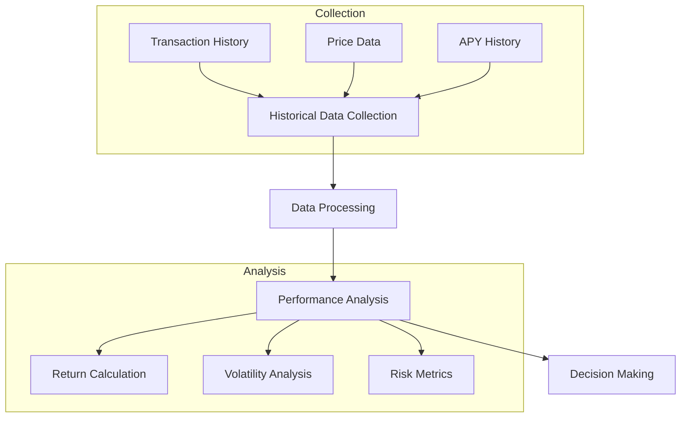
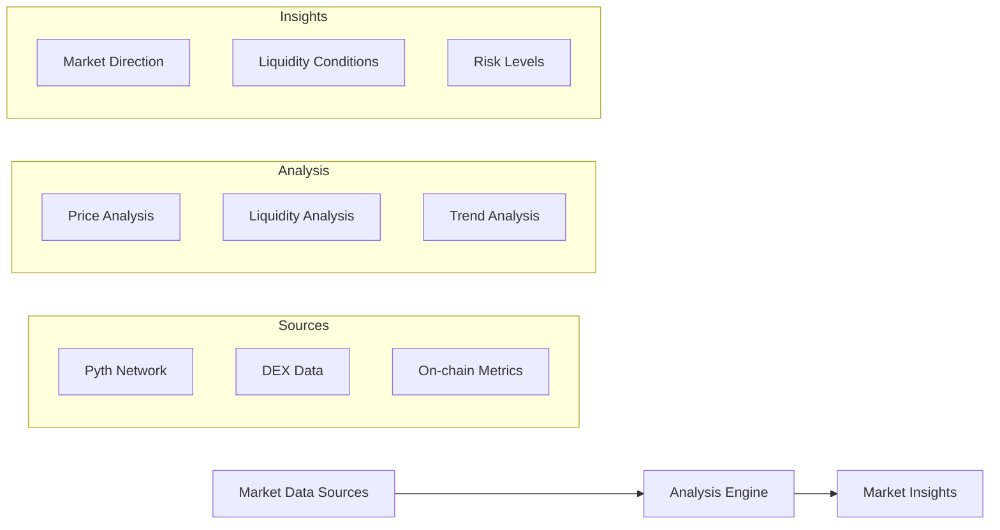
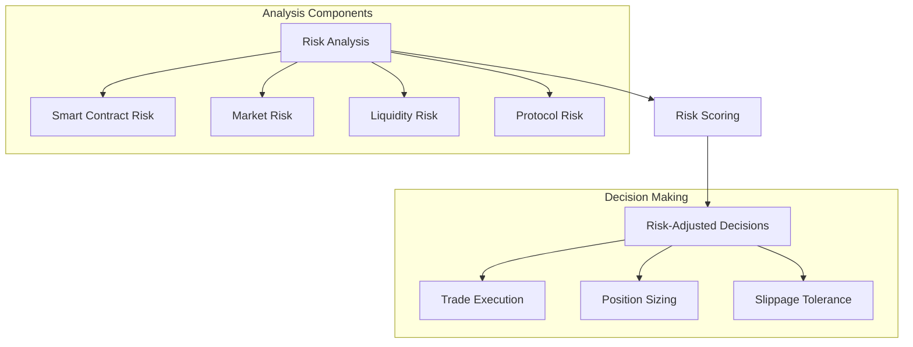

# [Nimble](https://ethglobal.com/showcase/nimble-d5y6f)

### Main Features:

1. Core Features:
- Token Swapping with AI Optimization
- Morpho Vault Deposits
- Morpho Vault Withdrawals
- Multi-chain Support

2. Feature to File/Folder Mapping:
```
├── contracts/
│   ├── src/
│   │   ├── AgentFactory.sol    # AI Agent management
│   │   ├── Deposit.sol         # Vault deposits
│   │   └── Withdraw.sol        # Vault withdrawals
├── frontend/
│   ├── Swap_Page/             # Swap interface
│   ├── Landing_Page/          # Main UI
│   └── bridge/                # Chain bridging
├── backend/
│   ├── cdp-agentkit-core/    # Coinbase AgentKit integration
│   ├── cdp-langchain/        # AI agent logic
│   └── twitter-langchain/    # Social integration
```

3. Tech Stack Implementation:
- Frontend: React.js with Web3 integration
- Smart Contracts: Solidity with Foundry framework
- Backend: Node.js with Coinbase AgentKit
- AI Integration: LangChain for agent orchestration
- Blockchain: EVM-compatible chains (Base, Arbitrum)

### Architecture:



### Key Workflows:



### Framework Integration:

To integrate with Nimble:

1. Smart Contract Integration:
```solidity
interface INimbleAgent {
    function getQuote(address tokenIn, address tokenOut, uint256 amount) external view returns (Quote);
    function executeSwap(SwapParams memory params) external returns (bool);
}
```

2. Backend Integration:
```javascript
import { NimbleSDK } from '@nimble/sdk';

const nimble = new NimbleSDK({
    network: 'base',
    apiKey: YOUR_API_KEY
});
```

Use Cases:
- DEX Aggregators
- Yield Optimization Platforms
- Cross-chain Bridge Services
- Portfolio Management Tools

5. Third-Party Tools:

1. Coinbase AgentKit
   - Purpose: Building AI-driven solver agents
   - Location: `backend/cdp-agentkit-core/`

2. LangChain
   - Purpose: AI agent orchestration and natural language processing
   - Location: `backend/cdp-langchain/`

3. Morpho Protocol
   - Purpose: Vault management and yield optimization
   - Integration: Via smart contracts

4. OpenAI API
   - Purpose: AI model for agent decision making
   - Integration: Through AgentKit

5. Web3.js/Ethers.js
   - Purpose: Blockchain interaction
   - Location: Frontend integration

6. Foundry
   - Purpose: Smart contract development and testing
   - Location: `contracts/` directory

7. OpSec
   - Purpose: Secure frontend deployment
   - Integration: Deployment platform

Each tool was chosen for specific purposes:
- AgentKit: Provides the foundation for AI-driven decision making
- LangChain: Enables sophisticated agent behavior and coordination
- Morpho: Offers secure and efficient vault management
- OpenAI: Powers the AI decision-making capabilities
- Web3 libraries: Enable seamless blockchain interaction
- Foundry: Provides robust smart contract development tools
- OpSec: Ensures secure frontend deployment

## AI's Core Functions:

a. Intelligent Routing and Price Discovery


b. Yield Optimization


### AI Implementation Architecture:

The AI system is built using three main components:

a. Coinbase AgentKit Integration:
- Location: `backend/cdp-agentkit-core/`
- Purpose: Provides the foundation for AI agents
- Features:
  * MPC Wallet Management
  * Network Support
  * Gasless Transactions
  * Smart Contract Interactions

b. LangChain Integration:
- Location: `backend/cdp-langchain/`
- Purpose: Orchestrates AI agent behaviors
- Key Tools:
  * Price Discovery (`pyth_fetch_price`)
  * Vault Operations (`morpho_deposit`, `morpho_withdraw`)
  * Trading Operations (`trade`)
  * Asset Management (`get_balance`, `transfer`)

c. AI Agent Types and Their Roles:

1. Swap Agents:
- Monitor multiple DEXs
- Calculate optimal routes
- Consider gas costs
- Execute atomic transactions

2. Deposit Agents:
- Analyze vault performance
- Calculate risk-adjusted returns
- Monitor market conditions
- Optimize deposit timing

3. Withdrawal Agents:
- Monitor withdrawal conditions
- Optimize gas costs
- Handle emergency withdrawals
- Manage slippage

### AI Decision Making Process:

```mermaid
sequenceDiagram
    participant User
    participant Agent
    participant DEX
    participant Vault
    
    User->>Agent: Request Action
    
    rect rgb(15, 26, 37)
        Note over Agent: AI Analysis Phase
        Agent->>DEX: Query Prices
        Agent->>Vault: Query APY
        Agent->>Agent: Calculate Optimal Path
    end
    
    rect rgb(98, 139, 56)
        Note over Agent: Decision Phase
        Agent->>Agent: Risk Assessment
        Agent->>Agent: Cost Analysis
        Agent->>Agent: Optimization
    end
    
    Agent->>User: Propose Action
    User->>Agent: Confirm
    Agent->>DEX: Execute
```



### Key AI Features:

a. Autonomous Decision Making:
```python
# Example of AI agent decision making
from cdp_langchain.agent_toolkits import CdpToolkit
from langchain_openai import ChatOpenAI

llm = ChatOpenAI(model="gpt-4o-mini")
agent = create_react_agent(llm, toolkit.get_tools())

# AI makes autonomous decisions
response = agent.execute({
    "task": "optimize_swap",
    "params": {
        "token_in": "ETH",
        "token_out": "USDC",
        "amount": "1.0"
    }
})
```

b. Learning and Adaptation:
- Historical performance tracking
- Market condition analysis
- Risk assessment
- Gas optimization

### Integration with External Systems:

a. Price Feeds:
- Pyth Network integration for accurate pricing
- Real-time market data analysis

b. DEX Integration:
- Multiple DEX connectivity
- Liquidity pool analysis
- Slippage calculation

c. Vault Integration:
- Morpho protocol integration
- Yield tracking
- Risk assessment

The AI system achieves its goals through:
1. Continuous monitoring of market conditions
2. Real-time optimization of routes and yields
3. Risk management and cost optimization
4. Autonomous decision-making with user confirmation
5. Learning from historical transactions
6. Integration with multiple data sources and protocols

This creates a sophisticated system that can:
- Find the best prices across DEXs
- Optimize yield strategies
- Manage risk exposure
- Execute complex transactions
- Adapt to changing market conditions


## Data Management
### Historical Performance Tracking:



Implementation is done through:

a. Data Collection:
```python
# From pyth/price_feed.py
class PythPriceFeed:
    def get_historical_prices(self, feed_id: str, timeframe: str):
        """
        Fetches historical price data for analysis
        - Stores in time-series format
        - Includes price, confidence, and timestamp
        """
        return self.client.get_price_feed_history(feed_id, timeframe)
```

b. Performance Metrics:
```python
# From morpho/deposit.py
class MorphoVaultAnalyzer:
    def analyze_vault_performance(self, vault_address: str):
        """
        Analyzes vault performance metrics:
        - Historical APY
        - TVL changes
        - Utilization rate
        """
        historical_data = self.get_historical_data(vault_address)
        return {
            'avg_apy': calculate_average_apy(historical_data),
            'volatility': calculate_volatility(historical_data),
            'consistency': analyze_consistency(historical_data)
        }
```

### Market Condition Analysis:



Implementation through:

a. Real-time Market Data:
```python
# From pyth/fetch_price.py
def fetch_current_market_conditions(self):
    """
    Aggregates current market conditions:
    1. Price feeds from Pyth
    2. DEX liquidity data
    3. Gas prices
    4. Market volatility
    """
    price_data = self.pyth_client.get_price_feeds()
    dex_data = self.get_dex_liquidity()
    gas_data = self.get_gas_prices()
    
    return MarketConditions(
        price_data=price_data,
        liquidity=dex_data,
        gas=gas_data
    )
```

b. Market Analysis:
```python
# From defi/trade.py
class MarketAnalyzer:
    def analyze_market_conditions(self):
        """
        Analyzes current market conditions for optimal trading
        """
        conditions = self.fetch_current_market_conditions()
        
        return {
            'market_direction': self.determine_trend(conditions),
            'liquidity_score': self.assess_liquidity(conditions),
            'volatility_level': self.calculate_volatility(conditions)
        }
```

### Risk Assessment:



Implementation through:

a. Risk Metrics Calculation:
```python
# From actions/defi/risk_assessment.py
class RiskAssessor:
    def assess_protocol_risk(self, protocol_address: str):
        """
        Comprehensive risk assessment including:
        - Smart contract risk (age, audit status)
        - TVL and liquidity metrics
        - Historical reliability
        - Protocol reputation
        """
        contract_risk = self.analyze_contract_risk(protocol_address)
        liquidity_risk = self.analyze_liquidity_risk(protocol_address)
        reputation = self.get_protocol_reputation(protocol_address)
        
        return {
            'risk_score': self.calculate_risk_score(
                contract_risk,
                liquidity_risk,
                reputation
            ),
            'risk_factors': self.identify_risk_factors(),
            'recommendations': self.generate_risk_recommendations()
        }
```

b. Risk-Adjusted Decision Making:
```python
# From morpho/deposit.py
class DepositStrategy:
    def get_optimal_deposit_strategy(self, amount: float):
        """
        Determines optimal deposit strategy based on risk assessment
        """
        market_conditions = self.analyze_market_conditions()
        risk_assessment = self.assess_risks()
        
        return {
            'recommended_vault': self.select_vault(
                amount,
                market_conditions,
                risk_assessment
            ),
            'position_size': self.calculate_position_size(
                amount,
                risk_assessment
            ),
            'entry_timing': self.determine_entry_timing(
                market_conditions,
                risk_assessment
            )
        }
```

The integration of these components creates a comprehensive risk management system:

1. Data Integration Layer:
- Collects data from multiple sources (Pyth, on-chain, DEXs)
- Maintains historical records
- Processes real-time updates

2. Analysis Layer:
- Processes historical performance
- Analyzes current market conditions
- Calculates risk metrics

3. Decision Layer:
- Combines analysis results
- Applies risk management rules
- Generates actionable recommendations

4. Execution Layer:
- Implements risk-adjusted strategies
- Manages position sizes
- Controls execution timing

This system allows Nimble to:
- Make data-driven decisions
- Adapt to changing market conditions
- Manage risk effectively
- Optimize user returns
- Provide transparent risk assessments

