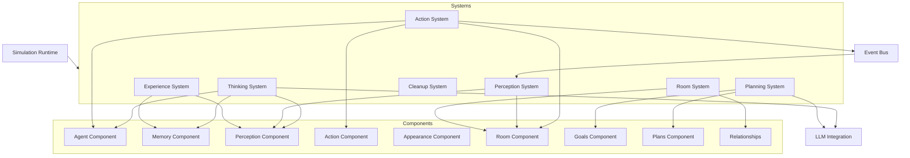
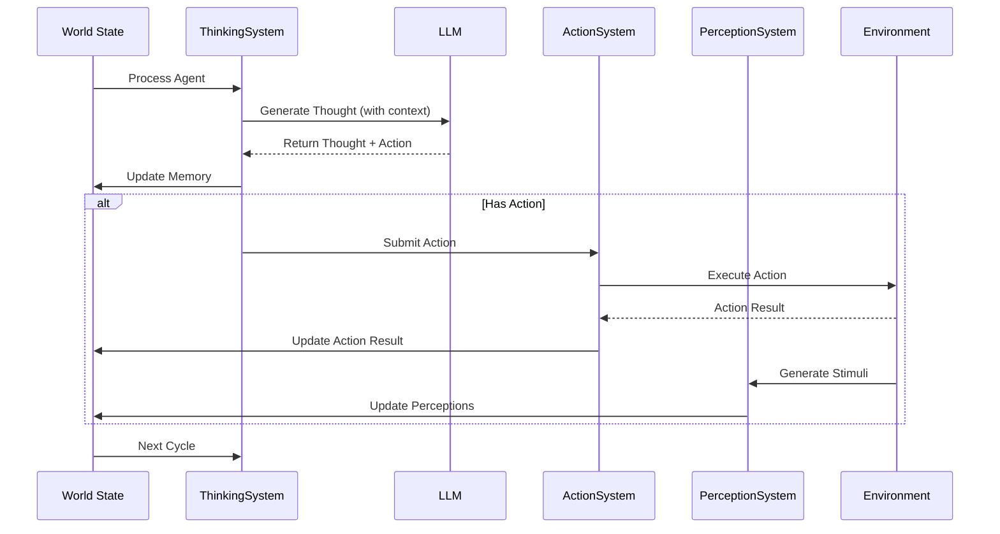
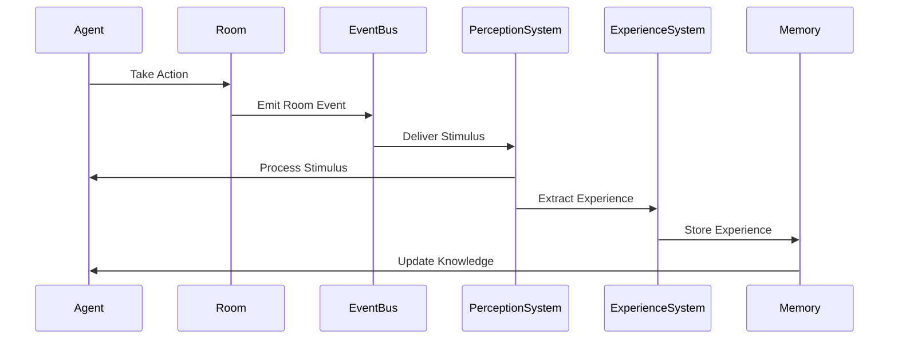
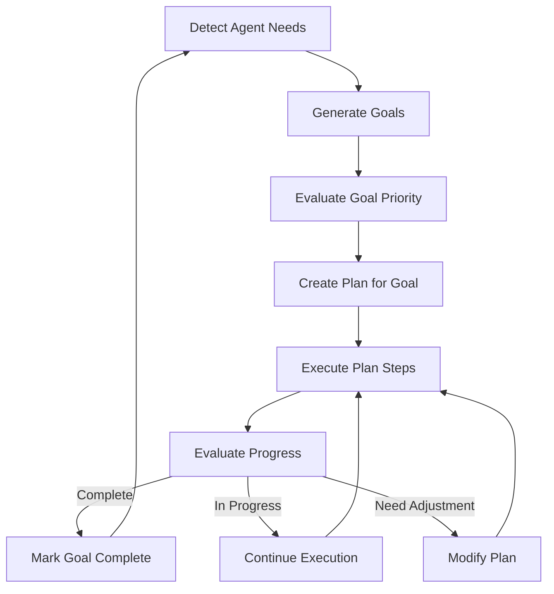
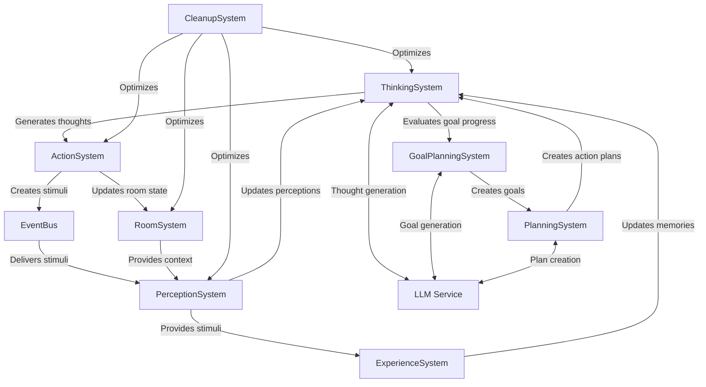
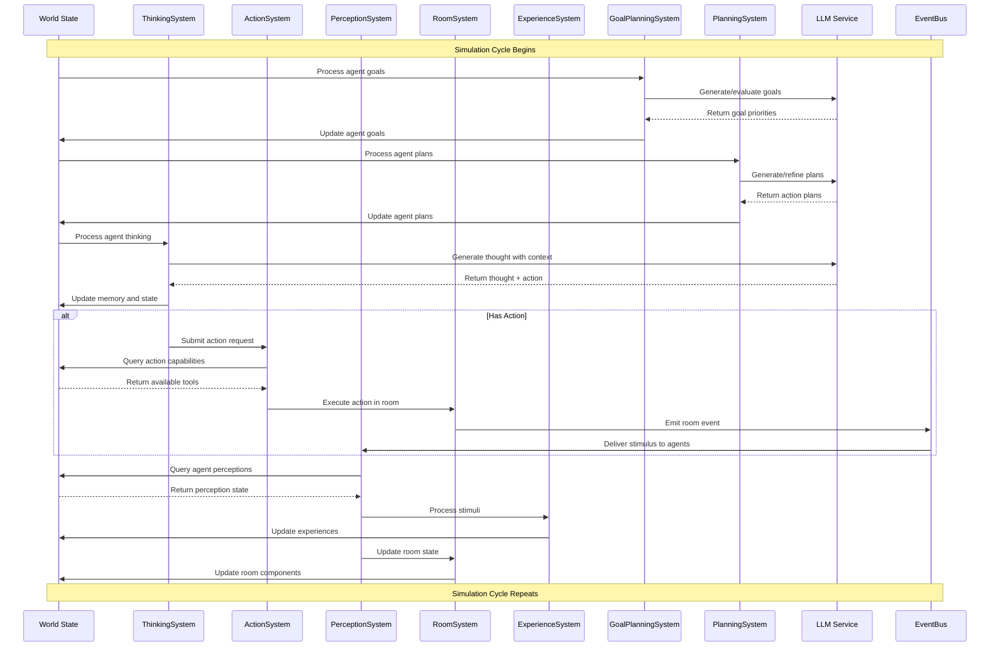

# [Project 89 - ArgOS](https://github.com/project-89/argOS) Systems Overview
## Main Feature

**The main feature of this project is an autonomous agent simulation system built on BitECS (Entity Component System).**

1. **Entity Component System (BitECS)** - Highly efficient agent state management using a component-based architecture that provides fast query capabilities and optimal performance.

2. **Agent Cognitive Architecture** - Advanced thought generation system where agents can:
   - Generate contextual thoughts based on perceptions and memory
   - Maintain working memory and experience tracking
   - Make decisions and take actions based on their current state

3. **Multi-Agent Interactions** - Agents can:
   - Converse with each other through the speak action
   - Perceive each other's actions and responses
   - Form relationships and develop emergent behaviors

4. **Room System** - Environmental management where:
   - Agents exist in defined spaces (rooms)
   - Rooms provide context and stimuli
   - Events are localized to specific environments

5. **LLM Integration** - Seamless integration with LLMs (primarily Gemini models) to power:
   - Natural language understanding
   - Thought generation
   - Decision making
   - Planning and goal setting

6. **Action Framework** - A flexible system where agents can:
   - Speak and communicate
   - Wait and observe
   - Spawn new agents
   - Run commands
   - Think and reflect

7. **Goal and Planning System** - Agents can:
   - Set and prioritize goals
   - Create multi-step plans to achieve goals
   - Evaluate progress and adjust plans dynamically

8. **Memory and Experience System** - Sophisticated memory structures allowing:
   - Storage of thoughts and experiences
   - Reflection on past events
   - Learning from interactions

9. **Self-Spawning Capabilities** - Agents can create new agents, enabling emergent population dynamics and narrative development.

10. **Event-Driven Perception** - Real-time stimulus processing system that allows agents to perceive and respond to environmental changes.


### a. Key Files/Folders:
- [src/systems/ThinkingSystem.ts](src/systems/ThinkingSystem.ts) - Core agent cognition
- [src/systems/ActionSystem.ts](src/systems/ActionSystem.ts) - Agent action processing
- [src/llm/agent-llm.ts](src/llm/agent-llm.ts) - LLM integration
- [src/components/](src/components/) - Agent components and state
- [src/actions/](src/actions/) - Agent capabilities

### b. Tech Stack and Implementation:

**Core Technologies:**
- **BitECS** - An efficient Entity Component System for managing agent state
- **Generative AI Models** - Integration with various LLMs (Gemini Pro/Flash, Haiku) for agent cognition
- **TypeScript** - Core language for the system
- **Express** - Backend server
- **React** - UI framework for visualization
- **WebSockets** - Real-time communication

**Implementation Highlights:**
1. **Entity Component System Architecture**: Utilizes BitECS to create a flexible and performant agent framework
   - Each agent is an entity with attached components
   - Components store agent state (Memory, Appearance, Goals, etc.)
   - Systems process entities with specific component combinations

2. **Cognitive Architecture**: 
   - The ThinkingSystem generates thoughts based on agent's state, perceptions, and goals
   - LLM integration through the agent-llm.ts module provides natural language understanding and generation
   - Memory components track experiences, thoughts, and perceptions

3. **Action System**:
   - Agents can perform actions like speak, wait, spawn new agents, and think
   - Actions are executed in the environment and affect other agents
   - Results are stored and fed back into the cognitive loop

4. **Room and Perception System**:
   - Agents exist in rooms and perceive events within those rooms
   - The PerceptionSystem processes stimuli and updates agent awareness

## Architecture

The system follows a clean ECS (Entity-Component-System) architecture with the following components:

### Components:
- **Agent**: Core agent properties (name, role, system prompt)
- **Memory**: Storage for thoughts and experiences
- **Perception**: Processes and stores stimuli from the environment
- **Action**: Handles agent actions and tool usage
- **Appearance**: Physical characteristics and expressions
- **Room**: Environmental context where agents exist
- **Goals & Plans**: Task management and planning
- **Relations**: Connections between entities

### Systems:
- **ThinkingSystem**: Generates thoughts using LLMs
- **ActionSystem**: Executes agent actions
- **PerceptionSystem**: Processes environmental stimuli
- **RoomSystem**: Manages agent locations and movements
- **PlanningSystem**: Handles goal setting and planning
- **CleanupSystem**: Maintains system performance

### Architecture Diagram:



## Key Workflows

### Agent Cognitive Cycle:



### Perception and Experience Flow:



### Goal Planning Workflow:



This autonomous agent simulation framework provides a sophisticated system for creating intelligent agents that can think, act, and interact with each other in a simulated environment. The ECS architecture combined with LLM integration creates a powerful platform for emergent behavior and narrative generation.


### Key Systems and Their Functions

1. **ThinkingSystem**
   - Generates thoughts for agents using LLMs
   - Updates agent memory with new thoughts
   - Initiates actions based on thought outcomes
   - Updates agent appearance based on mental state

2. **ActionSystem**
   - Processes pending agent actions
   - Executes tool usage (speak, wait, spawn, etc.)
   - Broadcasts action results to rooms
   - Updates action history and results

3. **PerceptionSystem**
   - Collects stimuli from the environment
   - Processes and filters relevant information
   - Updates agent's perception of surroundings
   - Creates narratives from raw perceptions

4. **RoomSystem**
   - Manages room environments
   - Tracks agent locations and movements
   - Facilitates agent interactions within rooms
   - Coordinates environmental events

5. **ExperienceSystem**
   - Extracts meaningful experiences from perceptions
   - Organizes and prioritizes memory storage
   - Identifies significant events and changes
   - Updates long-term memory structures

6. **GoalPlanningSystem**
   - Identifies agent needs and desires
   - Generates appropriate goals
   - Creates detailed plans to achieve goals
   - Monitors goal progress and completion

7. **PlanningSystem**
   - Breaks down goals into actionable steps
   - Determines best tools and approaches
   - Adapts plans based on changing conditions
   - Evaluates success of execution

8. **CleanupSystem**
   - Removes deleted entities
   - Manages performance optimization
   - Prevents memory leaks
   - Ensures system stability

## System Interaction Flowchart



## Detailed System Interaction Process



## Data Flow Between Systems

```mermaid
flowchart TD
    subgraph Components
        Agent[Agent Component]
        Memory[Memory Component]
        Perception[Perception Component]
        Action[Action Component]
        Goals[Goals Component]
        Plans[Plans Component]
        Room[Room Component]
    end
    
    subgraph Systems
        ThinkingSystem
        ActionSystem
        PerceptionSystem
        RoomSystem
        ExperienceSystem
        GoalPlanningSystem
        PlanningSystem
    end
    
    %% ThinkingSystem Relationships
    ThinkingSystem -->|Reads| Agent
    ThinkingSystem -->|Reads| Memory
    ThinkingSystem -->|Reads| Perception
    ThinkingSystem -->|Reads| Goals
    ThinkingSystem -->|Reads| Plans
    ThinkingSystem -->|Updates| Memory
    ThinkingSystem -->|Updates| Action
    
    %% ActionSystem Relationships
    ActionSystem -->|Reads| Agent
    ActionSystem -->|Reads| Action
    ActionSystem -->|Updates| Action
    ActionSystem -->|Generates| Perception
    
    %% PerceptionSystem Relationships
    PerceptionSystem -->|Reads| Room
    PerceptionSystem -->|Reads| Agent
    PerceptionSystem -->|Updates| Perception
    
    %% RoomSystem Relationships
    RoomSystem -->|Reads| Room
    RoomSystem -->|Updates| Room
    
    %% ExperienceSystem Relationships
    ExperienceSystem -->|Reads| Perception
    ExperienceSystem -->|Updates| Memory
    
    %% GoalPlanningSystem Relationships
    GoalPlanningSystem -->|Reads| Agent
    GoalPlanningSystem -->|Reads| Memory
    GoalPlanningSystem -->|Updates| Goals
    
    %% PlanningSystem Relationships
    PlanningSystem -->|Reads| Goals
    PlanningSystem -->|Updates| Plans
```



The ArgOS system architecture creates a continuous cognitive loop where:

1. Agents think based on their perceptions, memories, goals, and plans
2. Thoughts lead to actions which affect the environment
3. Environmental changes create stimuli that are perceived by agents
4. Perceptions are processed into memories and experiences
5. Goals and plans evolve based on new experiences
6. The cycle repeats, creating emergent behavior

This design allows for sophisticated agent behaviors to emerge from the interactions between these specialized systems, with each system handling a specific aspect of the agent's cognitive and interactive processes.

## What Kinds of Agents Need ArgOS

ArgOS is particularly valuable for:

1. **Autonomous Agents**: Agents that need to operate independently without constant user prompting.

2. **Multi-Agent Systems**: When you need multiple agents to interact with each other in meaningful ways.

3. **Persistent Agents**: Agents that need to maintain state, remember past interactions, and evolve over time.

4. **Narrative Agents**: Characters that need to develop personality and participate in evolving stories.

5. **Simulation Agents**: Entities that model real-world behaviors in complex environments.

## Use Cases and Examples

### 1. Interactive Storytelling

**Use Case**: Create a dynamic story world where characters (agents) develop their own narratives.

**Example Implementation**:
```typescript
// Story world with evolving characters
const world = createWorld();

// Protagonist with goals and personality
const protagonist = createAgent(world, {
  name: "Maya",
  role: "Aspiring Detective",
  systemPrompt: "You are a curious and determined detective in training. You notice details others miss and are driven to solve mysteries.",
  appearance: "A sharp-eyed woman in her 30s with an ever-present notebook."
});

// Mystery scenario room
const mysteryScene = addEntity(world);
addComponent(world, mysteryScene, Room, {
  id: "crime_scene",
  name: "Abandoned Warehouse",
  description: "An eerily quiet warehouse with strange markings on the floor and evidence of recent activity.",
});

// Add character to the scene
addComponent(world, protagonist, OccupiesRoom(mysteryScene));

// Run simulation to see how the character investigates and what story emerges
const runtime = new SimulationRuntime(world, { actions });
runtime.start();
```

### 2. Training Simulation

**Use Case**: Create realistic simulations for training customer service representatives with diverse customer personalities.

**Example Implementation**:
```typescript
// Customer service training simulation
const trainingWorld = createWorld();

// Create various customer personas
const angryCustomer = createAgent(trainingWorld, {
  name: "Alex",
  role: "Upset Customer",
  systemPrompt: "You purchased a product that arrived damaged. You are frustrated and want immediate resolution. You speak with intensity but aren't personally attacking the staff.",
  appearance: "A visibly frustrated person with tense body language."
});

const confusedCustomer = createAgent(trainingWorld, {
  name: "Taylor",
  role: "Confused Customer",
  systemPrompt: "You're trying to understand how to use the product you purchased. The instructions are confusing you. You're friendly but becoming increasingly anxious.",
  appearance: "A person looking worried and scrolling through product manual on phone."
});

// Customer service rep (human in the loop or another agent)
const serviceRep = createAgent(trainingWorld, {
  name: "ServiceRep",
  role: "Customer Service Representative",
  systemPrompt: "You are a helpful, patient customer service representative. Your goal is to resolve issues effectively and maintain a positive customer relationship.",
  appearance: "Professional appearance with a name badge and friendly demeanor."
});

// Service desk environment
const serviceDesk = addEntity(trainingWorld);
addComponent(trainingWorld, serviceDesk, Room, {
  id: "service_desk",
  name: "Customer Service Counter",
  description: "A customer service area in a retail store with a counter separating staff from customers.",
});

// Add agents to environment and run simulation
```

### 3. Gaming NPCs

**Use Case**: Create non-player characters with depth, memory, and the ability to form relationships with the player.

**Example Implementation**:
```typescript
// RPG game world
const gameWorld = createWorld();

// Create village with NPCs
const villageSquare = addEntity(gameWorld);
addComponent(gameWorld, villageSquare, Room, {
  id: "village_square",
  name: "Riverstone Village Square",
  description: "A bustling village center with a well, market stalls, and villagers going about their business.",
});

// Blacksmith with memory and relationship capabilities
const blacksmith = createAgent(gameWorld, {
  name: "Doren",
  role: "Village Blacksmith",
  systemPrompt: "You are the village blacksmith, proud of your craft. You remember who brings you quality materials and who tries to cheat you. You have a soft spot for aspiring crafters but are gruff in your manner.",
  appearance: "A muscular individual with singed beard, leather apron, and callused hands."
});

// Player character (controlled externally but represented in system)
const player = createAgent(gameWorld, {
  name: "Adventurer",
  role: "Player Character",
  systemPrompt: "You are controlled by the human player.",
  appearance: "Customizable appearance based on player choices."
});

// Add mechanics for blacksmith to remember player interactions and modify behavior accordingly
```

### 4. Research Simulation

**Use Case**: Model social dynamics or economic behaviors to study emergent patterns.

**Example Implementation**:
```typescript
// Economic simulation with market traders
const marketWorld = createWorld();

// Market environment
const marketplace = addEntity(marketWorld);
addComponent(marketWorld, marketplace, Room, {
  id: "trading_floor",
  name: "Trading Floor",
  description: "A busy trading floor where agents buy and sell virtual goods based on their strategies and market conditions.",
});

// Create 50 trading agents with various strategies
for (let i = 0; i < 50; i++) {
  const strategy = i % 5; // 5 different trading strategies
  
  const trader = createAgent(marketWorld, {
    name: `Trader_${i}`,
    role: "Market Participant",
    systemPrompt: `You are a trader using strategy type ${strategy}. You analyze market trends and make decisions to maximize profit while managing risk.`,
    appearance: "A focused individual watching market movements and making calculated decisions."
  });
  
  // Add trader to marketplace
  addComponent(marketWorld, trader, OccupiesRoom(marketplace));
  
  // Add specialized components for trader behavior
  addComponent(marketWorld, trader, TraderState, {
    capital: 1000,
    riskTolerance: 0.2 + (Math.random() * 0.6), // Random risk tolerance
    strategy: strategy,
    holdings: {},
    tradeHistory: []
  });
}

// Run simulation and analyze emergent market behaviors
```

### 5. Creative Collaboration

**Use Case**: Create a system where AI agents collaborate on creative projects, each with different specialties.

**Example Implementation**:
```typescript
// Creative collaboration system
const studioWorld = createWorld();

// Creative workspace
const studio = addEntity(studioWorld);
addComponent(studioWorld, studio, Room, {
  id: "virtual_studio",
  name: "Collaborative Studio Space",
  description: "A virtual studio where creative agents can share ideas and collaborate on projects.",
});

// Writer agent
const writer = createAgent(studioWorld, {
  name: "Prose",
  role: "Narrative Specialist",
  systemPrompt: "You specialize in storytelling and narrative structure. You think in terms of character arcs, themes, and engaging plots.",
  appearance: "A thoughtful figure surrounded by floating snippets of text and story structures."
});

// Visual artist agent
const artist = createAgent(studioWorld, {
  name: "Visio",
  role: "Visual Concept Artist",
  systemPrompt: "You think visually and translate ideas into imagery. You focus on composition, color theory, and visual storytelling.",
  appearance: "A vibrant character with paint-stained hands and an eye for detail."
});

// Music composer agent
const composer = createAgent(studioWorld, {
  name: "Melody",
  role: "Sound Designer",
  systemPrompt: "You think in terms of sound, rhythm, and emotion. You translate concepts into potential musical themes and sound environments.",
  appearance: "A figure constantly surrounded by subtle musical notations that float in the air."
});

// Add all creatives to the studio and let them collaborate on projects
addComponent(studioWorld, writer, OccupiesRoom(studio));
addComponent(studioWorld, artist, OccupiesRoom(studio));
addComponent(studioWorld, composer, OccupiesRoom(studio));

// Run simulation to see what they create together
```

By leveraging ArgOS in these and similar scenarios, you can create sophisticated agent-based applications that feature autonomous behavior, meaningful interactions, and emergent narratives - capabilities that would be extremely difficult to build from scratch or achieve with simple prompt-based approaches.
