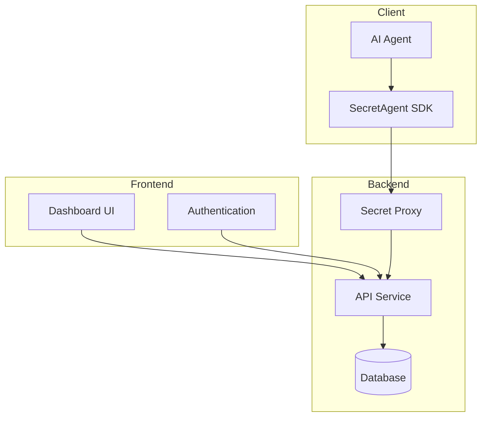
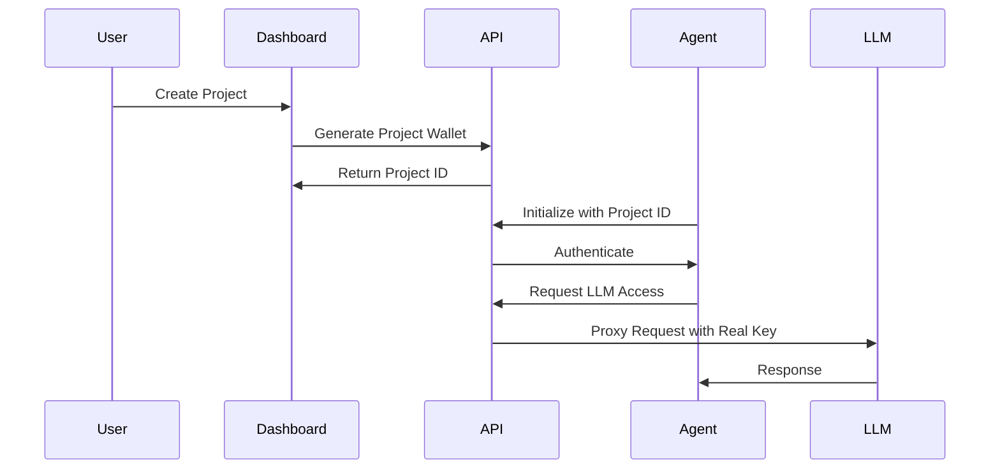
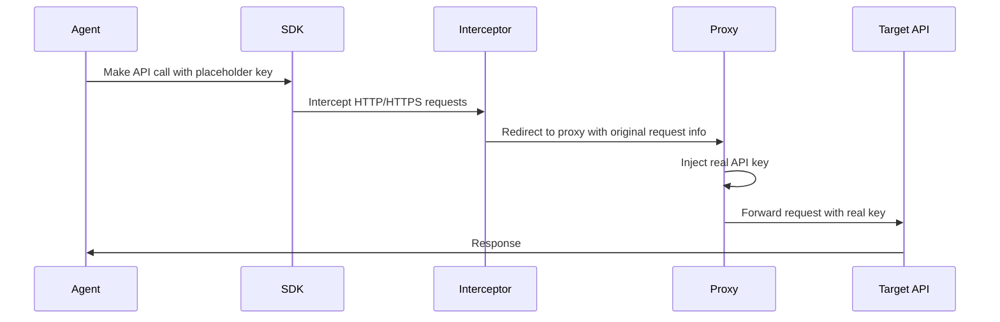

# [SecretAgent](https://ethglobal.com/showcase/secretagent-nkz1u)

### Main Features:

a. Core Features:
- Pay-as-you-go LLM API Access
  - Files: `/packages/secretagent-lib/src/config.ts`
  - Tech: Privy for server wallets, Base L2 for payments
  
- Proxy-based Secret Management
  - Files: `/packages/api/src/proxy/*`
  - Tech: Cloudflare Workers for proxy implementation
  
- Agent Authentication & Fleet Management
  - Files: `/packages/frontend/src/app/dashboard/*`
  - Tech: CDP (Coinbase Developer Platform) for wallet authentication
  
- Real-time Config Updates
  - Files: `/packages/secretagent-lib/src/init.ts`
  - Tech: WebSocket connections for live updates

### Architecture:



### Key Workflows:



#### Framework Integration:

To integrate with SecretAgent:

1. Install the SDK:
```bash
npm install secretagent.sh
```

2. Initialize in your agent code:
```typescript
import SecretAgent from 'secretagent.sh';

await SecretAgent.init({
  projectId: 'your_project_id',
  agentLabel: 'your_agent_label',
  agentId: wallet.address,
  signMessage: (msg) => wallet.signMessage(msg),
});
```

Use Cases That Benefit:
- AI Agents requiring LLM access
- Multi-agent systems needing centralized secret management
- Projects requiring usage-based billing for AI services
- Applications needing real-time config updates
- Systems requiring secure API key management

### Third-party Tools Used:

1. Blockchain/Web3:
- CDP (Coinbase Developer Platform)
  - Purpose: Wallet connect/login and agent toolkit integration
- Base L2
  - Purpose: Payment processing and transactions
- Privy
  - Purpose: Secure server wallet management

2. Backend:
- Hono
  - Purpose: Lightweight, high-performance API framework
- Drizzle
  - Purpose: Type-safe ORM for database operations
- Cloudflare Workers
  - Purpose: Edge computing for proxy functionality

3. Frontend:
- Next.js
  - Purpose: React framework for the web dashboard
- TailwindCSS
  - Purpose: Utility-first CSS framework for styling

4. Development:
- DMNO
  - Purpose: Secrets management during development
- Autonome
  - Purpose: Agent deployment and testing platform

### Key Feature Implementation
#### Proxy Implementation:



The proxy works through several layers:

a. Client-side Interception:
- Uses both fetch and HTTP/HTTPS interceptors
- Patches global request methods (`fetch`, `http.request`, `https.request`)
- Redirects matching requests to the proxy server
- Adds original request metadata in headers

b. Proxy Server:
- Runs on Cloudflare Workers
- Injects real API keys for matching requests
- Forwards requests to actual API endpoints
- Handles response streaming

#### Secret Access via .config:

```typescript
// How it works
const apiKey = SecretAgent.config.API_KEY;
```

- Users can't directly access real secrets through `.config`
- `.config` returns placeholder values that get replaced at the proxy level
- Static config items are the exception - they return actual values after initialization

#### Secret Storage:

The system uses multiple layers for secret storage:

a. Encrypted Storage:
- Secrets are encrypted at rest
- Uses DMNO for secrets management
- Stored in a database (Drizzle ORM)

b. Runtime Storage:
- Secrets are decrypted only when needed by the proxy
- Never exposed directly to the client
- Cached in memory for performance

4. Security Risks and Mitigations:

#### Potential Risks:
1. Man-in-the-Middle Attacks:
   - Risk: Intercepting proxy communications
   - Mitigation: Uses HTTPS and request signing

2. Secret Exposure:
   - Risk: Secrets leaking through logs or errors
   - Mitigation: 
     - Automatic scrubbing of secrets from logs
     - Proxy-only access to real secrets

3. Unauthorized Access:
   - Risk: Unauthorized agents accessing secrets
   - Mitigation:
     - Wallet-based authentication
     - Domain pattern matching
     - Real-time access revocation

4. Proxy Bypass:
   - Risk: Agents trying to bypass proxy
   - Mitigation:
     - SDK-level request interception
     - Domain pattern validation

5. Memory Exposure:
   - Risk: Secrets in memory dumps
   - Mitigation:
     - Minimal secret retention in proxy memory
     - Regular memory clearing

Best Practices Implemented:
1. Zero-trust architecture
2. Principle of least privilege
3. Real-time monitoring and logging
4. Immediate revocation capability
5. Encrypted storage and transport

The approach is generally secure but requires careful attention to:
- Proxy server security
- Network security between components
- Access token management
- Monitoring and alerting
- Regular security audits
