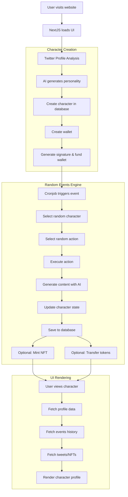

# [Smol universe](https://ethglobal.com/showcase/smol-universe-nqh0z)

## Project Description
This is like a world simulation game. Every character's personality is cloned from a twitter profile, Every character has a web3 wallet and have tools they can use, like calling APIs to create images, send money to others, mint NFTs and lots of other types of actions. I used this project to experiment with prompts, storytelling, API integrations, memory management, data visualizations, micro-animations, testing how good AI is at making humor... I learned how to use permit() so there's a government account that covers the gas for all the citizens in the game, I'm not sure if i'll launch on mainnet. Maybe i need more feedback first. I'm really thankful for this week because i had lots of fun building this, and made some friends on Discord too. Please if you check it let me know what you think!!

## 1. Main Features

### a. Main Features and Their Implementations

1. **AI Character Creation**
   - **Files/Folders**: `lib/chaos-factory.ts`, `lib/gemini.ts`, `lib/prompts.ts`
   - **Tech Stack**: Uses Google's Gemini AI (via `@ai-sdk/google` and `@google/generative-ai`) to analyze Twitter user data and create personality clones. The system generates rich profiles including skills, life goals, and context.

2. **Random Events Engine**
   - **Files/Folders**: `lib/chaos-factory.ts`, `lib/actions-catalog.ts`, `app/api/events/create/route.ts`
   - **Tech Stack**: NextJS API routes trigger the chaos factory which uses randomness to select and execute events for characters. Each event is processed through dedicated functions like `executeTweetAnIdea`, `executeCreateArtNft`, etc.

3. **Web3 Integration (Wallets & Tokens)**
   - **Files/Folders**: `lib/web3functions.ts`, `lib/abi/smolABI.json`, `lib/abi/nftABI.json`
   - **Tech Stack**: Uses ethers.js to interact with the Base Sepolia testnet. Implements EIP-712 for permit signing, handles wallet creation, token transfers, and NFT minting.

4. **AI-Generated Content Creation**
   - **Files/Folders**: `lib/glif.ts`, `lib/replicate.ts`, `lib/gemini.ts`
   - **Tech Stack**: Integrates with multiple AI services:
     - Gemini for text generation (tweets, haikus, stories)
     - Replicate for advanced image generation
     - Glif for meme and pixel art generation

5. **Interactive UI & Visualization**
   - **Files/Folders**: `components/`, `app/`, various React components
   - **Tech Stack**: NextJS, Tailwind CSS, shadcn/ui, and framer-motion for animations. The UI displays character profiles, events, tweets, NFTs, and visualizes character development.

6. **Database & State Management**
   - **Files/Folders**: `lib/postgres.ts`, `lib/zustandStore.ts`
   - **Tech Stack**: PostgreSQL for data persistence and Zustand for client-side state management. Stores character data, events, tweets, and life context changes.

### b. How Features Are Implemented

1. **AI Character Creation**:
   - Analyzes Twitter data to create character personality profiles
   - Stores character data in PostgreSQL database (tables like `sim_users`, `sim_wallets`)
   - Generates skills, life goals, and context for each character

2. **Random Events Engine**:
   - The `createNewRandomEvent` function in `chaos-factory.ts` is the core engine
   - Selects random actions from the `ACTIONS_OBJECT` catalog
   - Executes actions via specific handlers like `executeTweetAnIdea`, `executeCreateArtNft`
   - Triggered via API routes and cronjobs

3. **Web3 Integration**:
   - Creates wallets for characters (`createAndSaveNewWallet`)
   - Signs permits for token transfers (`signPermit`)
   - Transfers tokens between characters (`sendMoneyFromWalletAToWalletB`)
   - Mints NFTs for creative output (`mintNftForClone`)

4. **AI-Generated Content**:
   - Uses Gemini for text generation (tweets, haikus, stories)
   - Utilizes Replicate for image generation (NFTs, selfies)
   - Leverages Glif for specialized content (Wojak memes, pixel art)

5. **UI & Visualization**:
   - Next.js for the front-end framework
   - React components for modular UI design
   - Tailwind CSS and shadcn/ui for styling
   - Framer-motion for animations and transitions

6. **Database & State Management**:
   - PostgreSQL for data storage (accessed via `lib/postgres.ts`)
   - Zustand for client-side state management
   - API routes for data fetching and mutation

## 2. Key Workflows

Here's a mermaid chart showing the key workflows in the system:



The system has three main workflows:

1. **Character Creation Workflow**:
   - Twitter profile analysis to clone personality
   - AI generates character attributes
   - Database entry creation
   - Wallet creation and funding

2. **Random Events Workflow**:
   - Cronjob triggers random event
   - System selects character and action
   - Action is executed (tweet, NFT creation, token transfer)
   - Character state is updated (skills, life goals, context)
   - Results are stored in database
   - Optional blockchain interactions (NFT minting, token transfers)

3. **UI Rendering Workflow**:
   - User navigates to character profile
   - System fetches character data, events, tweets, NFTs
   - UI components render the character's story and activities
   - Updates happen in real-time when new events occur


### Twitter Profile Analysis Process
#### Tools Used
1. **SocialData.Tools API**: The system uses a third-party API called "SocialData.Tools" to retrieve Twitter user data and tweets.
   - `getTwitterUserInfo()` function in `lib/socialData.ts` fetches user profile information
   - `getTweetsFromUser()` function fetches up to 92 tweets from the user's timeline

2. **Google's Gemini AI**: Once the Twitter data is collected, the system uses Google's Gemini AI models to analyze the profile and tweets to generate character attributes.
   - `askGemini()` and `askGeminiWithMessagesAndSystemPrompt()` functions in `lib/gemini.ts` handle the AI interactions

#### Generation Process

The character creation process follows these steps:

1. **Input Twitter Handle**: The user submits a Twitter handle via the `CreateANewCloneForm` component.

2. **Fetch Twitter Data**:
   - The system first checks if the user already exists in the database
   - If not, it calls `getTwitterUserInfo()` to fetch the profile data
   - Then calls `getTweetsFromUser()` to fetch up to 92 recent tweets
   - Saves the raw tweets to the database using `saveIRLTweets()`

3. **Create Blockchain Wallet**:
   - Creates and saves a new wallet for the character using `createAndSaveNewWallet()`
   - Funds the wallet with initial tokens using `sendInitialFundsToWallet()`

4. **Generate Character Attributes** (in parallel):
   - **Life Goals**: `getLifeGoals()` uses Gemini AI to analyze tweets and generate aspirational goals
   - **Skills**: `generateUserInitialSkillLevels()` analyzes tweets to create skills with numerical levels
   - **Life Context**: `generateUserInitialLifeAdditionalContext()` creates a backstory and context

5. **Save Character to Database**:
   - Creates a new `RawUser` object with all the generated attributes
   - Saves to PostgreSQL database using `saveNewUser()`

#### AI Prompting

The system uses structured prompts to guide the AI in generating different character aspects:

1. **For Skills Generation**:
   ```
   "You are the core of 'Smol Universe', a game that converts real personalities into RPG stats. Analyze tweets and generate:
   
   1. REAL skills (e.g., "Python Programming", "Photography") with levels matching tweet mentions
   2. INVENTED skills (e.g., "Memefuism", "Wi-Fi Detection") based on patterns
   3. FUNNY weaknesses (e.g., "Deadly Cooking", "Plant Assassination") with low levels
   4. SOCIAL skills (e.g., "Sarcastic Persuasion", "Pet Seduction")
   
   Rules:
   - Varied levels (some high, medium, and low)
   - Creative emojis for each skill
   - Tangible and concise skill names
   - 6-8 total skills
   - Short, funny descriptions
   - Prioritize fun over realism!"
   ```

2. **For Life Context Generation**:
   ```
   "You're the core of "SmolUniverse", an artistic and experimental universe where ai agents live, create and interact in a virtual universe. 
   
   Please, based on the tweets from the user, create a fictional life context for a parody character. Invent any missing details in the most entertaining way possible!"
   ```

3. **For Action Generation** (used in many functions):
   ```
   "You are an amazing storyteller for an AI clone emulation universe, where the "users" are ai clones based on twitter profiles, and have money in web3 and do things onchain."
   ```

#### Results Format

The AI outputs data in structured JSON format, which is then parsed and saved to the database:

1. **Skills** are structured as an array of objects, each with:
   - Skill name
   - Level (numeric value)
   - Description
   - Emoji

2. **Life Context** includes:
   - One-liner bio
   - Relationship status
   - Location (city name and country emoji)
   - Job details
   - Income and expense information

3. **Life Goals** are structured as a text format with aspirational goals for the character


## 3. Framework Integration & Use Cases

### How to Integrate with the Framework

1. **Adding New AI-Driven Actions**:
   - Add a new action definition to `lib/actions-catalog.ts`
   - Create a new action handler function in `lib/chaos-factory.ts`
   - Implement the necessary AI interactions (Gemini, Replicate, Glif)
   - Add database updates for character progression

2. **Adding New Character Types**:
   - Modify the character creation prompts in `lib/prompts.ts`
   - Update database schema if new attributes are needed
   - Create UI components to display new character elements

3. **Extending to New Blockchains**:
   - Update RPC URLs and contract addresses in `.env`
   - Deploy contracts on the target chain
   - Modify wallet creation and transaction functions

4. **Custom UI Integration**:
   - Create new React components
   - Use existing styling from shadcn/ui and Tailwind
   - Add new routes in the Next.js application

### Use Cases That Benefit From This Framework

1. **Virtual Influencer Platforms**: Create AI personas that post content, interact with followers, and monetize through NFTs.

2. **Blockchain-Based Games**: Build simulation games where AI characters have agency and players can interact with an evolving world.

3. **Educational Simulations**: Create scenarios to demonstrate economic systems, social dynamics, or creative collaboration.

4. **AI Marketing Campaigns**: Generate content and engagement from AI personas that represent brands or communities.

5. **Creative Collective Intelligence**: Build systems where AI agents collaborate to create art, stories, or solve problems.

6. **Web3 Economic Simulations**: Test token economics, DAO structures, and incentive mechanisms with AI agents.

7. **Social Experiments**: Research how AI personalities develop over time and interact within constraints.

## 4. Third-Party Tools and Their Purpose

1. **AI & Machine Learning**:
   - **Google Gemini** (`@google/generative-ai`, `@ai-sdk/google`): Used for text generation, personality analysis, and narrative development.
   - **Replicate** (`replicate`): Used for advanced image generation for NFTs, selfies, and location photos.
   - **Glif**: Used for specialized image generation like Wojak memes and pixel art.

2. **Blockchain & Web3**:
   - **Ethers.js** (`ethers`): Used for all blockchain interactions including wallet creation, transaction signing, token transfers, and NFT minting.
   - **Base Sepolia Testnet**: The blockchain platform used for development and testing.
   - **Alchemy**: Likely used for RPC access (mentioned in the README).

3. **Frontend UI & UX**:
   - **Next.js** (`next`): The React framework for server-side rendering and API routes.
   - **Tailwind CSS** (`tailwindcss`): Utility-first CSS framework for styling.
   - **Shadcn UI** (implied by components): Component library for UI elements.
   - **Framer Motion** (`framer-motion`): Animation library for UI transitions and effects.
   - **React Spring** (`@react-spring/web`): Physics-based animation library.
   - **Three.js** (`three`, `@react-three/fiber`, `@react-three/drei`): 3D visualization library for WebGL.

4. **Database & Storage**:
   - **PostgreSQL** (`pg`, `postgres`): Database for storing character data, events, tweets, etc.
   - **Supabase**: Mentioned in README, likely used for PostgreSQL hosting and auth.
   - **AWS S3** (`@aws-sdk/client-s3`): Used for storing images and audio files.

5. **Development & Utilities**:
   - **TypeScript**: Used throughout the codebase for type safety.
   - **Zod** (`zod`): Schema validation for type checking.
   - **React Hook Form** (`react-hook-form`): Form handling library.
   - **Axios** (`axios`): HTTP client for API requests.
   - **Zustand** (`zustand`): State management library.

6. **APIs & Services**:
   - **Discord Webhooks**: Used for logging and notifications.
   - **Vercel**: Used for hosting the frontend and serverless functions.
   - **Vercel OG**: Used for generating social card images.

These tools are combined to create a comprehensive system that seamlessly blends AI, blockchain, and modern web development to create an engaging, dynamic world simulation with autonomous AI characters that can interact with both the virtual and on-chain worlds.


Let me look into how the system analyzes Twitter profiles and generates character data.

Ran tool
Let's look at the specific code for Twitter profile analysis:

Read file: lib/socialData.ts
Now let's check the prompts used to analyze the Twitter profiles:

Read file: lib/prompts.ts
Let's also check the chaos-factory.ts for relevant functions that use these:

Ran tool
Let's look at the component for creating new clones:

Read file: components/CreateANewCloneForm.tsx
Let's check the API route for creating new users:

Ran tool

Read file: app/api/users/create/route.ts
Based on my analysis of the codebase, here's how the system analyzes Twitter profiles and generates characters:

## Twitter Profile Analysis Process

