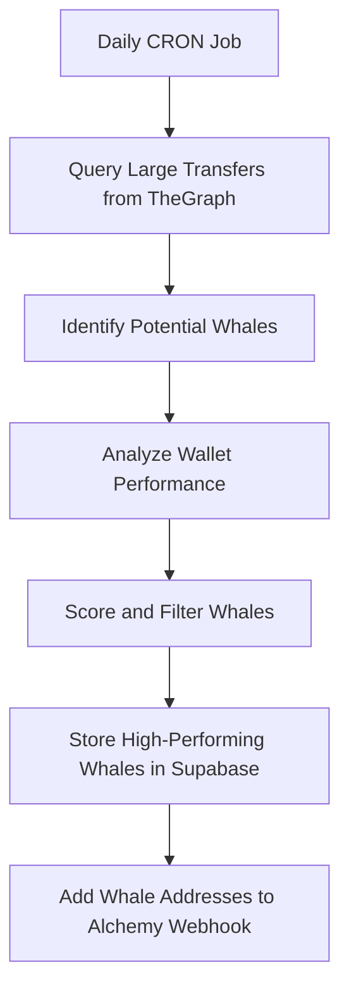
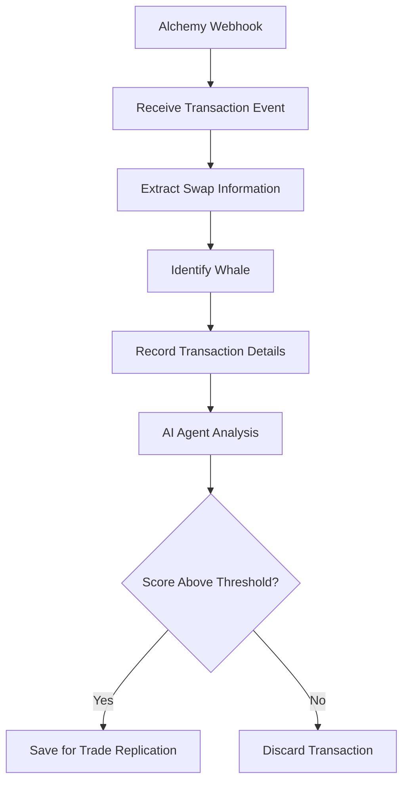
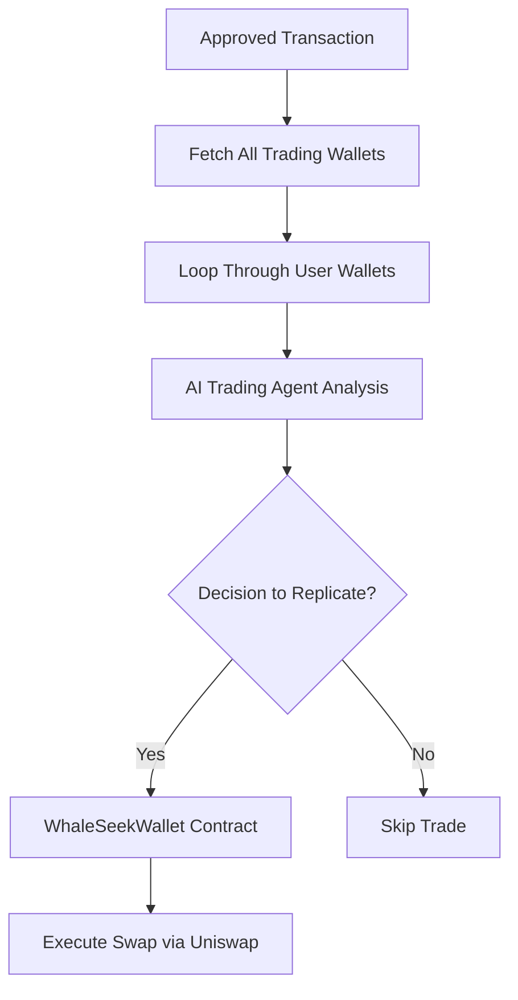

# [Whal-E](https://ethglobal.com/showcase/whal-e-awzsa)

## Project Description
Whal-E is an AI-powered DeFi application focused on whale tracking and automated copy trading. Its purpose is to eliminate the manual effort users spend monitoring trading activities by automating whale discovery, analysis, and trade replication. The system actively discovers new whale wallets, evaluates their trading performance, and maintains a curated list of high-performing traders. When these tracked whales execute trades, an AI agent analyzes multiple factors including portfolio composition, market data, and relevant news to determine if the trade should be replicated. For users who opt in, successful trades are automatically executed across their connected wallets, with optimizations for each user's specific balance and conditions.

## 1. Main Features and Implementation

The main feature of Whal-E is an AI-powered DeFi application that focuses on whale tracking and automated copy trading with three core components:

### Whale Discovery System
**Implementation:**
- Uses TheGraph with a custom subgraph to identify large transactions in the blockchain
- Daily CRON jobs run at 4:00 AM to detect new whale wallets
- The [`DiscoveryService`](src/modules/discovery/discovery.service.ts) analyzes large WETH transfers to identify potential whale wallets
- Newly discovered whales are scored based on performance metrics and stored in Supabase

```12:32:src/modules/discovery/discovery.service.ts
@Cron(CronExpression.EVERY_DAY_AT_4AM)
public async discoverWhales(): Promise<void> {
  this.logger.log('Initiating whale discovery...');

  const foundWhales = await this.findWhales();
  // ... [additional processing logic]
}
```

### Real-time Transaction Monitoring and Analysis
**Implementation:**
- Uses Alchemy webhooks to monitor whale wallet activities in real-time
- The [`WebhookService`](src/modules/webhook/webhook.service.ts) processes transaction events from tracked whales
- When a whale makes a trade, the [`TransactionsService`](src/modules/transactions/transactions.service.ts) extracts swap information and analyzes it
- AI agents built with CDP AgentKit and LangChain analyze transactions to determine if they should be replicated

```33:43:src/modules/webhook/webhook.service.ts
async processTransaction(webhookData: WebhookPayload) {
  // ... [transaction processing logic]
  const swapInfo = await this.transactionsService.extractSwapInfo(activity);
  // ... [additional logic to identify whale and record transaction]
}
```

### Automated Trade Execution
**Implementation:**
- Smart contracts deployed on Base Mainnet implement a wallet factory pattern
- [`WhaleSeekFactory.sol`](WhaleSeekFactory.sol) creates user trading wallets
- [`WhaleSeekWallet.sol`](WhaleSeekWallet.sol) handles the actual execution of trades using Uniswap
- The [`AgentService`](src/modules/agent/agent.service.ts) provides the decision-making capabilities to determine when to replicate trades

```74:95:src/modules/transactions/transactions.service.ts
public async analyseTransaction(
  transactionRecord: Omit<TransactionRecord, 'id'>,
): Promise<any> {
  // ... [transaction analysis using AI]
  if (analysis.score < MIN_THRESHOLD) return;
  await this.saveTransaction(transactionRecord);
  await this.copyTransaction(transactionRecord);
}
```

## 2. Tech Stack and Implementation

The application uses a comprehensive technology stack across multiple layers:

### Data Collection Layer
- **TheGraph**: Custom subgraph for identifying large transactions
- **Alchemy SDK**: Real-time monitoring of whale wallet activities via webhooks
- **Implementation**: The [`GraphService`](src/modules/graph/graph.service.ts) interfaces with TheGraph API, and the [`AlchemyService`](src/modules/alchemy/alchemy.service.ts) handles Alchemy integration

### AI Processing Layer
- **[CDP AgentKit](https://www.coinbase.com/en-gb/developer-platform) and LangChain**: Framework for building AI agents
- **OpenAI models**: Powers the AI analysis
- **Custom tools**: Integration with Brave Search, Alchemy SDK, and cryptocurrency APIs
- **Implementation**: The [`CoinbaseService`](src/modules/coinbase/coinbase.service.ts) initializes and manages different types of AI agents, with custom tools provided by [`AgentToolService`](src/modules/coinbase/agent-tool.service.ts)

```180:253:src/modules/coinbase/coinbase.service.ts
private async initializeAgent(agentType: Agent): Promise<void> {
  // ... [agent initialization logic]
  // Creates and configures agent based on agent type (GENERAL, TRANSACTION_ANALYST, or TRADING)
}
```

### Backend Infrastructure
- **NestJS**: Server framework handling agent operations and webhook processing
- **Supabase**: Database for storing whale information and transaction records
- **Implementation**: The [`AppModule`](src/app.module.ts) imports and configures all required modules

### Smart Contract Layer
- **Solidity**: For implementing smart contracts
- **Uniswap V3 integration**: For executing trades
- **Implementation**: The [`WhaleSeekFactory.sol`](WhaleSeekFactory.sol) and [`WhaleSeekWallet.sol`](WhaleSeekWallet.sol) handle the creation of user wallets and execution of trades

```67:91:WhaleSeekWallet.sol
function swapExactInputSingleHop(address tokenIn, address tokenOut, uint256 amountIn, uint256 amountOutMin)
    external
{
    _ensureOnlyAgentOrOwner();
    // ... [swap execution logic using Uniswap]
    emit SwapExecuted(tokenIn, tokenOut, amountIn);
}
```

### Execution Layer
- **ethers and viem**: For blockchain interactions
- **Basescan API**: For contract verification and transaction analysis
- **Implementation**: The [`ContractService`](src/modules/contract/contract.service.ts) manages contract interactions

## 3. Key Workflows

Here are the key workflows in the Whal-E system:

### Whale Discovery Workflow


### Transaction Analysis Workflow


### Trade Execution Workflow


This powerful system enables users to automatically discover high-performing whale traders, analyze their transactions in real-time using AI, and replicate successful trades across connected wallets - all without requiring manual monitoring or analysis.
