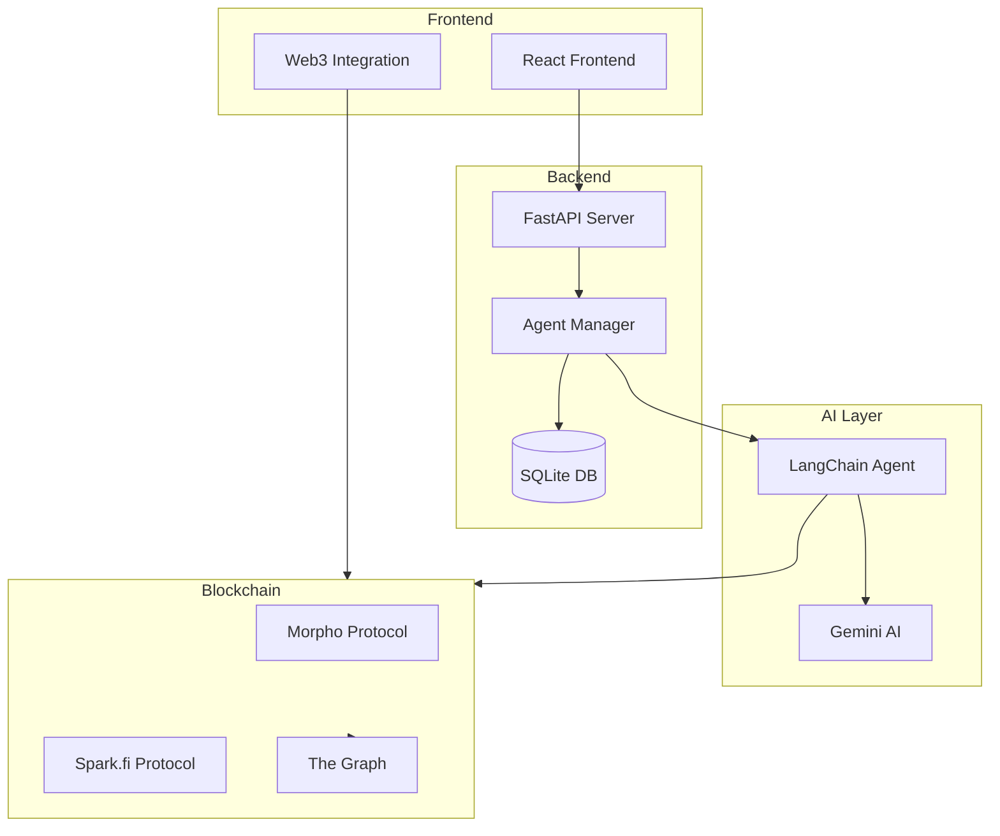
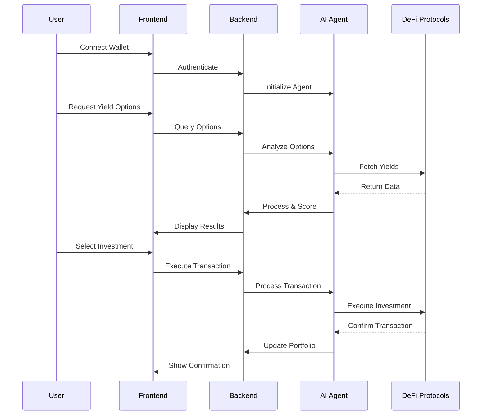

# [YieldSeeker](https://ethglobal.com/showcase/yieldseeker-crg12)

### Main Features:

a. Core Features:
1. Automated Yield Analysis
   - File: `api/agent_hack/list_all_yield_options.py`
   - Tech Stack: LangChain, Gemini AI, CDP AgentKit
   - Implementation: Uses AI to analyze and compare yield options across different protocols

2. Multi-Protocol Integration
   - Files: 
     - `api/agent_hack/morpho_deposit_action.py`
     - `api/agent_hack/spark_get_yield_action.py`
   - Tech Stack: Web3.py, Morpho, Spark.fi protocols
   - Implementation: Interfaces with multiple DeFi protocols for yield opportunities

3. Risk Assessment
   - File: `api/agent_hack/agent_manager.py`
   - Tech Stack: LangChain, Gemini AI
   - Implementation: AI-powered risk scoring system for yield options

4. Portfolio Management
   - Files: 
     - `api/agent_hack/kiba_cdp_agentkit_wrapper.py`
     - `api/agent_hack/kiba_cdp_tool.py`
   - Tech Stack: CDP AgentKit, Web3.py
   - Implementation: Automated portfolio management and rebalancing

### Architecture:



### Key Workflows:



### Framework Integration:
YieldSeeker is built on top of Coinbase's AgentKit framework. To integrate with it:

1. Setup Requirements:
   - Install CDP AgentKit
   - Configure API keys
   - Setup Web3 provider

2. Integration Steps:
   ```python
   from cdp_agentkit_core import KibaCdpAgentkitWrapper
   
   agentkit = KibaCdpAgentkitWrapper(
       cdp_api_key_name="YOUR_KEY_NAME",
       cdp_api_key_private_key="YOUR_PRIVATE_KEY",
       network_id="YOUR_NETWORK"
   )
   ```

Use Cases:
- Automated DeFi Portfolio Management
- Yield Farming Optimization
- Risk-Adjusted Returns Analysis
- Cross-Protocol Yield Comparison

### Third-Party Tools:

1. Coinbase AgentKit
   - Purpose: Core framework for blockchain interactions and agent management
   
2. LangChain
   - Purpose: AI agent orchestration and workflow management

3. Gemini AI
   - Purpose: Natural language processing and decision making

4. The Graph
   - Purpose: Indexing and querying blockchain data

5. Morpho Protocol
   - Purpose: Lending and borrowing functionality

6. Spark.fi
   - Purpose: Additional yield opportunities

7. FastAPI
   - Purpose: Backend API framework

8. SQLite
   - Purpose: Local state management and chat history

9. Web3.py
   - Purpose: Ethereum blockchain interaction


### Data Used from The Graph:
They use The Graph for querying data from two main protocols:

a. Aerodrome Protocol:
```python
# From aerodrome.py
queryUrl = f'https://gateway.thegraph.com/api/{os.environ["GRAPH_API_KEY"]}/subgraphs/id/GENunSHWLBXm59mBSgPzQ8metBEp9YDfdqwFr91Av1UM'
```

b. Uniswap Protocol:
```python
# From uniswap.py
queryUrl = f'https://gateway.thegraph.com/api/{os.environ["GRAPH_API_KEY"]}/subgraphs/id/GqzP4Xaehti8KSfQmv3ZctFSjnSUYZ4En5NRsiTbvZpz'
```

They collect the following data points:
- Total Value Locked (TVL)
- Trading Volume
- Transaction Count
- Token Prices
- Pool Data

### AI Agent Decision Making:
The AI agent makes decisions based on several factors:

a. Data Sources:
- Protocol-specific data (Morpho, Spark.fi)
- Market data from Uniswap and Aerodrome
- Historical performance data

b. Decision Process:
```python
# From agent_hack/agent_manager.py
state_modifier = (
    "You are Yield Seeker. You are an AI bot that helps users find the best yield on the blockchain. "
    "You are empowered to interact onchain using your tools. "
    "Before executing your first action, get the wallet details to see what network you're on. "
)
```

The AI uses:
1. Current market conditions
2. Risk-adjusted APY calculations
3. Protocol-specific metrics
4. User preferences and risk tolerance
5. Historical performance data

### Risk Scoring System:
The risk scoring is implemented in `yield_options.py` and uses a sophisticated multi-factor model:

```python
# Constants for risk assessment
MIN_TVL_USD = 100_000
GOOD_TVL_USD = 1_000_000
MIN_VOLUME_USD = 50_000
GOOD_VOLUME_USD = 500_000
MIN_TX_COUNT = 100
GOOD_TX_COUNT = 1000

def _calculate_token_quality_factor(token: uniswap.TokenWithPools | None) -> float:
    if token is None or isinstance(token, Exception):
        return 0.0
    # TVL Factor (50% weight)
    tvlFactor = min(1.0, max(0.0, (token.totalValueLockedUSD - MIN_TVL_USD) / (GOOD_TVL_USD - MIN_TVL_USD)))
    # Volume Factor (30% weight)
    volumeFactor = min(1.0, max(0.0, (token.volumeUSD - MIN_VOLUME_USD) / (GOOD_VOLUME_USD - MIN_VOLUME_USD)))
    # Transaction Count Factor (20% weight)
    txFactor = min(1.0, max(0.0, (token.txCount - MIN_TX_COUNT) / (GOOD_TX_COUNT - MIN_TX_COUNT)))
    # Weighted Risk Score
    weightedFactor = (tvlFactor * 0.5) + (volumeFactor * 0.3) + (txFactor * 0.2)
    return weightedFactor
```

The risk scoring system considers:

1. Liquidity Metrics:
   - TVL (Total Value Locked) with 50% weight
   - Minimum acceptable TVL: $100,000
   - Good TVL threshold: $1,000,000

2. Market Activity:
   - Trading volume with 30% weight
   - Minimum volume: $50,000
   - Good volume threshold: $500,000

3. Protocol Usage:
   - Transaction count with 20% weight
   - Minimum transactions: 100
   - Good transaction threshold: 1,000

4. Risk-Adjusted Returns:
```python
adjustedRewardApy = reward.apy * qualityFactor
overallRiskAdjustedApy += adjustedRewardApy
```

The system calculates a risk-adjusted APY by:
1. Computing a quality factor for each protocol (Uniswap and Aerodrome)
2. Taking the maximum quality factor between protocols
3. Multiplying the raw APY by the quality factor
4. Summing base APY with adjusted reward APYs

This creates a comprehensive risk assessment that considers both protocol-specific risks and market conditions while weighting different factors according to their importance in determining the overall risk level.


### Data Measurement
#### Current Market Conditions:
```python
# From morpho_queries.py - Market data points collected:
- Asset price data:
  - priceUsd
  - oraclePriceUsd
  - spotPriceEth
- Market liquidity:
  - totalSupply
  - totalAssetsUsd
- Market activity:
  - dailyApy
  - weeklyApy
  - monthlyApy
  - quarterlyApy
  - yearlyApy
```

The system collects real-time data from multiple sources:
- Morpho Protocol API
- The Graph (Uniswap and Aerodrome data)
- Oracle price feeds

#### Risk-adjusted APY Calculations:
```python
# From yield_options.py
def _calculate_token_quality_factor(token):
    # Risk factors weighted calculation
    tvlFactor = min(1.0, max(0.0, (token.totalValueLockedUSD - MIN_TVL_USD) / (GOOD_TVL_USD - MIN_TVL_USD)))
    volumeFactor = min(1.0, max(0.0, (token.volumeUSD - MIN_VOLUME_USD) / (GOOD_VOLUME_USD - MIN_VOLUME_USD)))
    txFactor = min(1.0, max(0.0, (token.txCount - MIN_TX_COUNT) / (GOOD_TX_COUNT - MIN_TX_COUNT)))
    
    # Final risk-adjusted score
    weightedFactor = (tvlFactor * 0.5) + (volumeFactor * 0.3) + (txFactor * 0.2)
    
    # Apply to APY
    adjustedRewardApy = reward.apy * qualityFactor
```

The risk adjustment considers:
- Base APY
- Reward APY
- Protocol risk factors
- Market depth factors
- Liquidity factors

#### Protocol-specific Metrics:
From the Morpho queries, we can see detailed protocol metrics being tracked:
```python
# From morpho_queries.py
state {
    # Protocol health metrics
    totalAssets
    totalAssetsUsd
    fee
    apy
    netApyWithoutRewards
    netApy
    
    # Protocol governance
    curator
    feeRecipient
    guardian
    
    # Protocol performance
    dailyApy
    weeklyApy
    monthlyApy
    quarterlyApy
    yearlyApy
    
    # Risk metrics
    allocation {
        supplyAssets
        supplyAssetsUsd
        supplyCap
        supplyCapUsd
    }
}

# Risk analysis
riskAnalysis {
    provider
    score
    isUnderReview
    timestamp
}
```

#### User Preferences and Risk Tolerance:
This is handled through the AI agent's interaction with users:
```python
# From agent_manager.py
state_modifier = (
    "You are Yield Seeker. You are an AI bot that helps users find the best yield on the blockchain. "
    "You are empowered to interact onchain using your tools. "
    "Before executing your first action, get the wallet details to see what network you're on. "
)
```

The system:
- Interacts with users to understand their risk tolerance
- Filters opportunities based on user preferences
- Considers user's network and wallet details
- Adapts recommendations based on user's portfolio size

#### Historical Performance Data:
The system tracks historical performance through multiple timeframes:
```python
# From morpho_queries.py - Historical performance metrics:
dailyApy
weeklyApy
monthlyApy
quarterlyApy
yearlyApy
allTimeApy

# Additional historical metrics
dailyNetApy
weeklyNetApy
monthlyNetApy
quarterlyNetApy
yearlyNetApy
allTimeNetApy
```

Historical data analysis includes:
- APY trends over different time periods
- Net returns after fees
- Protocol performance history
- Market depth history
- Volume history

The system combines all these metrics to create a comprehensive yield optimization strategy:

1. Data Collection Layer:
- Real-time market data
- Protocol-specific metrics
- Historical performance
- Risk analysis scores

2. Analysis Layer:
- Risk adjustment calculations
- Performance normalization
- Protocol comparison
- Historical trend analysis

3. Decision Layer:
- User preference matching
- Risk tolerance filtering
- Opportunity ranking
- Recommendation generation

This multi-layered approach ensures that yield recommendations are:
- Risk-adjusted
- User-appropriate
- Market-relevant
- Historically validated
