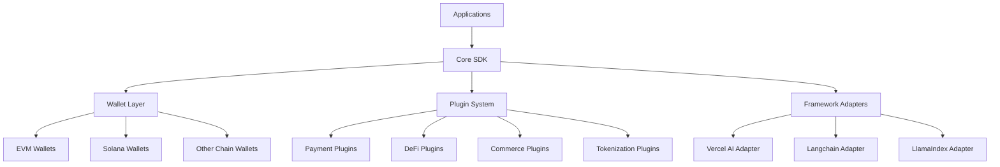
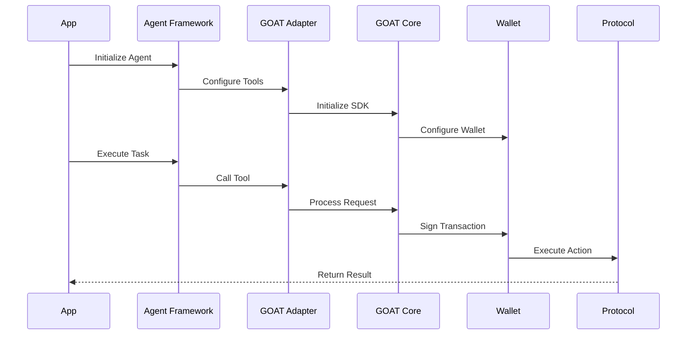

# [Goat](https://github.com/goat-sdk/goat) web3 Ai Agent SDK Analysis

### 1. Main Features:

a) Core Features:
- Wallet Integration & Management
  - Location: `packages/wallets/`
  - Tech: Implements wallet adapters for multiple chains (Solana, EVM, etc.)
  - Implementation: Uses TypeScript interfaces and adapters pattern

- Protocol Integration (200+ tools)
  - Location: `packages/plugins/`
  - Tech: Plugin architecture for extensibility
  - Implementation: Each protocol is a separate plugin that can be imported independently

- Agent Framework Adapters
  - Location: `packages/adapters/`
  - Tech: Adapter pattern to support multiple AI frameworks
  - Implementation: Standardized interfaces for different AI frameworks (Vercel AI, Langchain, etc.)

b) Key Features and Their Implementations:

1. Money Transmission
   - Files: `packages/plugins/payment-protocols/`
   - Tech Stack: Blockchain SDKs, Web3 libraries
   - Implementation: Standardized payment interfaces across chains

2. Commerce Integration
   - Files: `packages/plugins/commerce/`
   - Tech Stack: E-commerce APIs, Payment gateways
   - Implementation: API integrations with major platforms

3. Investment Tools
   - Files: `packages/plugins/defi/`
   - Tech Stack: DeFi protocols, Smart contract interactions
   - Implementation: Protocol-specific adapters

4. Asset Tokenization
   - Files: `packages/plugins/tokenization/`
   - Tech Stack: NFT standards, Token standards
   - Implementation: Chain-specific token creation and management

### 2. Architecture:



### 3. Key Workflows:



### 4. Integration Methods:

#### a) With LangGraph:
```typescript
import { getLangGraphTools } from "@goat-sdk/adapter-langgraph";
import { solana } from "@goat-sdk/wallet-solana";

const tools = await getLangGraphTools({
    wallet: solana({ /* config */ }),
    plugins: [ /* your plugins */ ]
});

// Use in LangGraph workflow
const workflow = new LangGraph()
    .addNode("financial_operations", {
        tools: tools
    });
```

#### b) With Vercel AI:
```typescript
import { getOnChainTools } from "@goat-sdk/adapter-vercel-ai";
import { solana } from "@goat-sdk/wallet-solana";

const tools = await getOnChainTools({
    wallet: solana({ /* config */ }),
    plugins: [ /* your plugins */ ]
});

// Use in Vercel AI
export default async function POST(req: Request) {
    const messages = /* ... */;
    return StreamingTextResponse(
        OpenAIStream({
            model: "gpt-4",
            messages,
            tools: tools
        })
    );
}
```

### 5. Third-Party Tools Used:

1. Blockchain SDKs:
   - `@solana/web3.js` - For Solana blockchain interactions
   - `ethers` - For EVM chain interactions
   - Purpose: Core blockchain communication

2. Agent Frameworks:
   - Vercel AI SDK
   - LangChain
   - LlamaIndex
   - Purpose: AI agent integration and orchestration

3. Protocol-specific SDKs:
   - Jupiter SDK (Solana DEX)
   - Uniswap SDK (EVM DEX)
   - Purpose: DeFi protocol integration

4. Development Tools:
   - TypeScript - Main development language
   - PNPM - Package management
   - Turbo - Monorepo management
   - Purpose: Development workflow and code organization

5. Testing and Quality:
   - Biome - Code formatting and linting
   - Jest - Testing framework
   - Purpose: Code quality and testing
