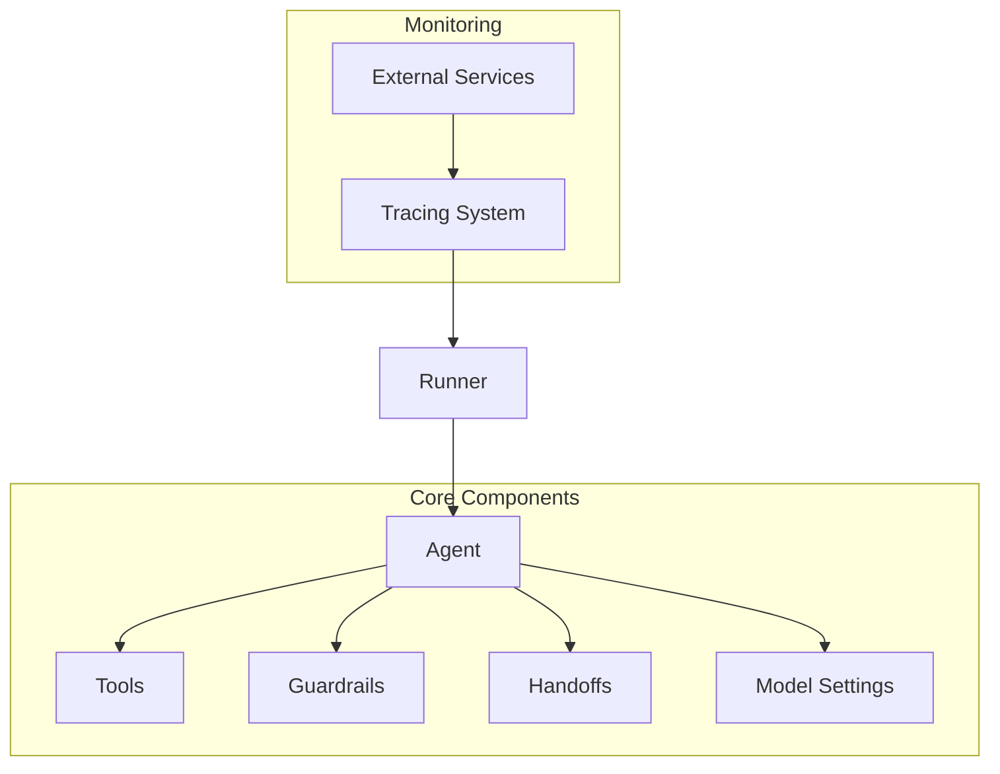
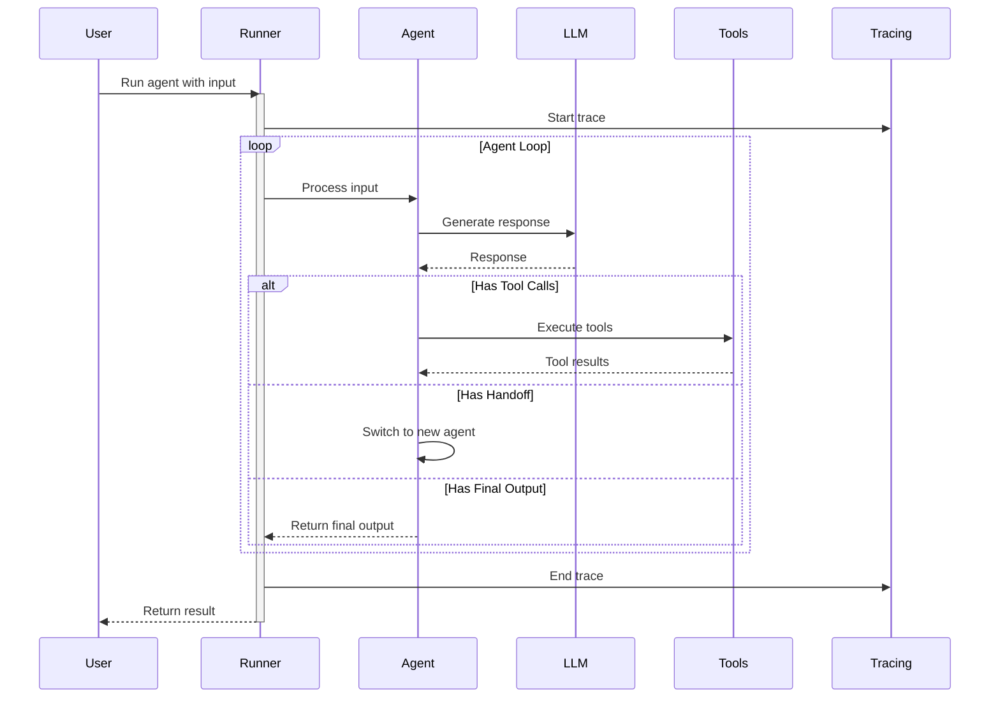
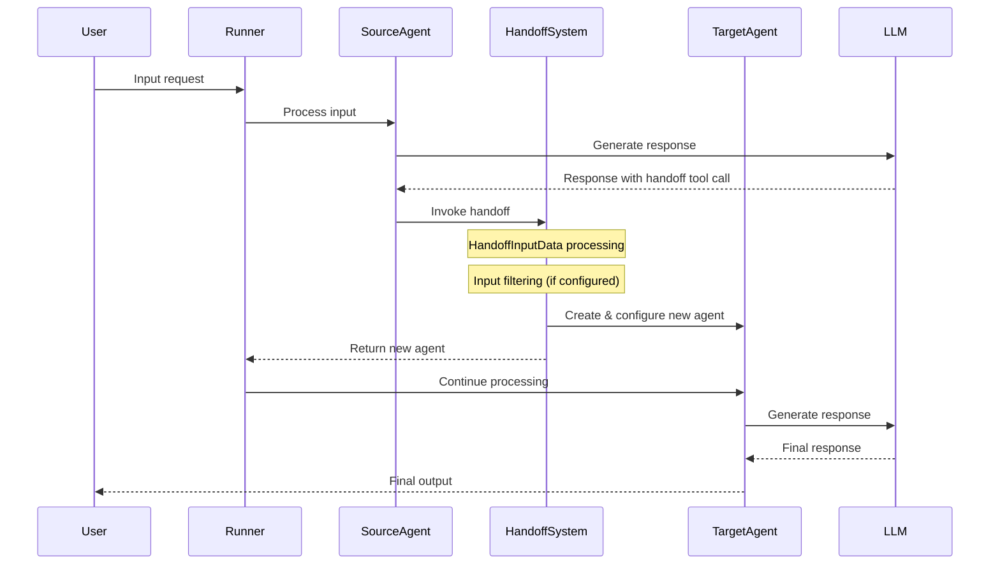
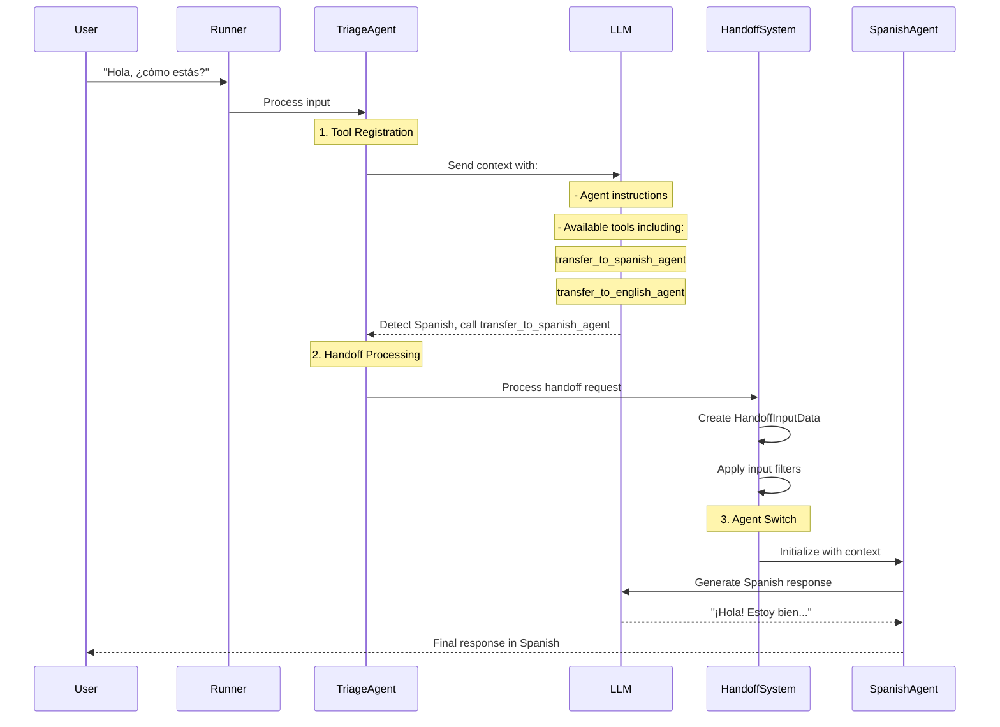
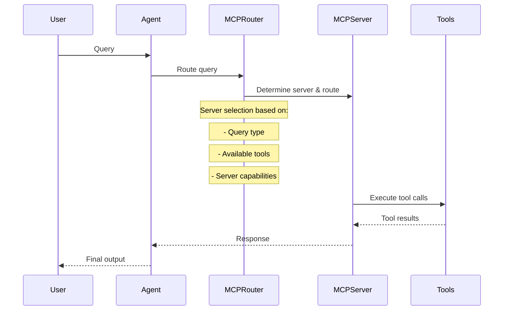
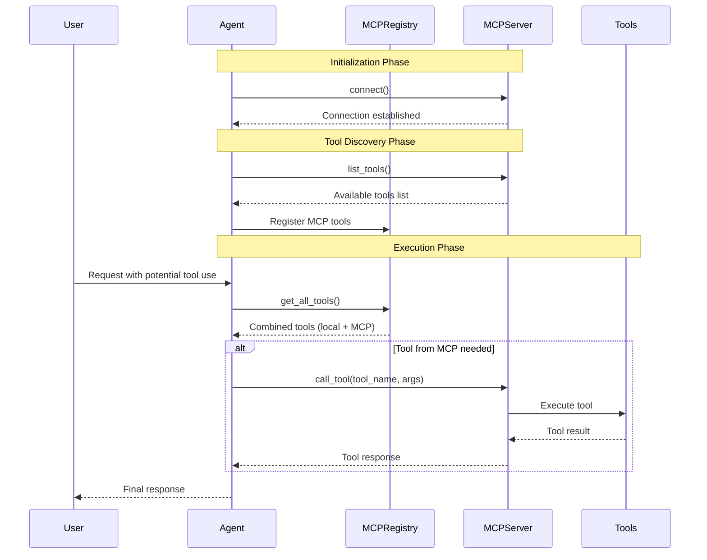
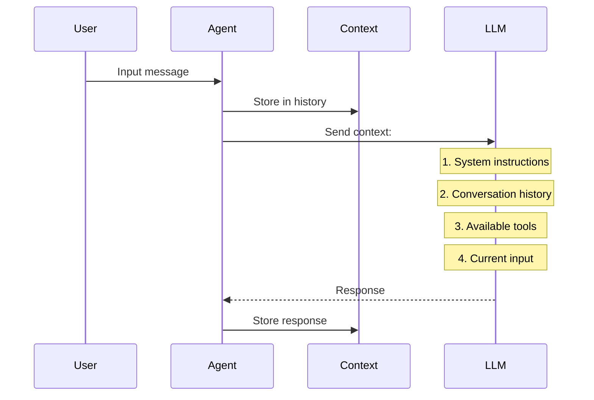
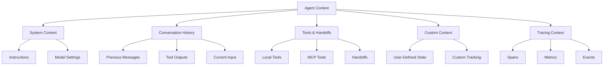
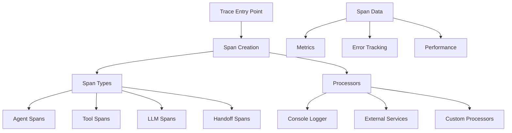

# [OpenAI agents SDK anaylsis](https://github.com/openai/openai-agents-python)
## Main Features:

a. Core Features:
- **Agent System** (`src/agents/agent.py`): Configurable LLM-powered agents with instructions, tools, and guardrails
- **Handoff Mechanism** (`src/agents/handoffs.py`): Enables agent-to-agent communication and task delegation
- **Guardrails System** (`src/agents/guardrail.py`): Input/output validation and safety checks
- **Tracing System** (`src/agents/tracing/`): Built-in tracking and debugging of agent runs
- **Function Tools** (`src/agents/tool.py`): Integration of custom Python functions as agent tools
- **Voice Support** (`src/agents/voice/`): Optional voice interaction capabilities

b. Implementation Details:
- **Agent System**: Implemented using Pydantic models for type safety and validation. Uses OpenAI's Chat Completions API format.
- **Handoffs**: Implemented as specialized tool calls that transfer control between agents.
- **Guardrails**: Built using Pydantic for schema validation and custom validation rules.
- **Tracing**: Supports multiple external processors (Logfire, AgentOps, Braintrust, etc.).
- **Function Tools**: Uses Python decorators and type hints for automatic function-to-tool conversion.

### Architecture:



### Key Workflows:



### Framework Integration:

#### To integrate with this framework:

1. Installation:
```bash
pip install openai-agents
# For voice support:
pip install 'openai-agents[voice]'
```

2. Basic Usage:
```python
from agents import Agent, Runner

agent = Agent(
    name="Assistant",
    instructions="Your instructions here",
    tools=[your_custom_tools],  # Optional
    guardrails=[your_guardrails]  # Optional
)

result = Runner.run_sync(agent, "Your input here")
```

#### Use Cases That Benefit From This Framework:
- Multi-step task automation
- Complex workflow orchestration
- Conversational AI systems
- Task delegation systems
- Voice-enabled AI assistants
- AI systems requiring safety guardrails
- Debug-heavy AI development

### Third-party Tools and Dependencies:

1. **Pydantic & PydanticAI**
   - Purpose: Data validation and advanced agent framework capabilities
   - Why: Provides robust type checking and data validation

2. **OpenAI API**
   - Purpose: Core LLM functionality
   - Why: Provides the foundation for agent intelligence

3. **External Tracing Processors**
   - Logfire: Log management
   - AgentOps: Agent monitoring
   - Braintrust: Debugging and optimization
   - Scorecard: Performance tracking
   - Keywords AI: Integration support
   - Why: Provides comprehensive monitoring and debugging capabilities

4. **Development Tools**
   - UV: Dependency management
   - Ruff: Python linter
   - MkDocs: Documentation generation
   - Griffe: Python documentation parsing
   - Why: Ensures code quality and maintainability


## Tech Detail Explanation
#### Multi-Agent Handoff Implementation:



Key Components:
1. `Handoff` class: Core data structure that defines:
   - Tool name and description for handoff
   - Input schema validation
   - Handoff invocation logic
   - Input filtering capabilities
2. `HandoffInputData`: Manages conversation history and context
3. Input Filtering: Optional mechanism to modify conversation context

#### Example:
```python
from agents import Agent, Runner
import asyncio

# 1. Define specialized agents
spanish_agent = Agent(
    name="Spanish agent",
    instructions="You are a Spanish language expert. You should only communicate in Spanish.",
    handoff_description="Expert in Spanish language communication"
)

english_agent = Agent(
    name="English agent",
    instructions="You are an English language expert. You should only communicate in English.",
    handoff_description="Expert in English language communication"
)

# 2. Define the triage agent that will handle handoffs
triage_agent = Agent(
    name="Triage agent",
    instructions="""You are a language triage agent. Your job is to:
    1. Detect the language of the user's input
    2. Hand off the conversation to the appropriate language agent:
       - For Spanish, use the transfer_to_spanish_agent tool
       - For English, use the transfer_to_english_agent tool
    """,
    handoffs=[spanish_agent, english_agent]  # Register available handoffs
)

async def main():
    # 3. Start conversation with Spanish input
    result = await Runner.run(triage_agent, input="Hola, ¿cómo estás?")
    print(result.final_output)

if __name__ == "__main__":
    asyncio.run(main())
```

Here's how the handoff process works internally:



The key components that make this work:

1. **Tool Registration** (`src/agents/agent.py`):
```python
@dataclass
class Agent(Generic[TContext]):
    handoffs: list[Agent[Any] | Handoff[TContext]] = field(default_factory=list)
```

2. **Handoff Creation** (`src/agents/handoffs.py`):
```python
@dataclass
class Handoff(Generic[TContext]):
    tool_name: str  # e.g., "transfer_to_spanish_agent"
    tool_description: str
    input_json_schema: dict[str, Any]
    on_invoke_handoff: Callable
```

3. **Handoff Processing** (`src/agents/_run_impl.py`):
```python
@dataclass
class ProcessedResponse:
    handoffs: list[ToolRunHandoff]
    
    def has_tools_to_run(self) -> bool:
        return any([self.handoffs, self.functions, self.computer_actions])
```

The LLM knows to use handoff tools because:

1. When the agent is initialized, all handoffs are converted into tools that the LLM can use
2. Each handoff tool has:
   - A clear name (e.g., `transfer_to_spanish_agent`)
   - A description explaining when to use it
   - Input schema if needed
3. These tools are included in the LLM's context along with the agent's instructions

For example, when the triage agent processes "Hola, ¿cómo estás?", the LLM sees:

```json
{
  "available_tools": [
    {
      "name": "transfer_to_spanish_agent",
      "description": "Handoff to the Spanish agent to handle Spanish language requests. Expert in Spanish language communication",
      "parameters": { ... }
    },
    {
      "name": "transfer_to_english_agent",
      "description": "Handoff to the English agent to handle English language requests. Expert in English language communication",
      "parameters": { ... }
    }
  ],
  "instructions": "You are a language triage agent...",
  "messages": [
    {"role": "user", "content": "Hola, ¿cómo estás?"}
  ]
}
```

The LLM recognizes Spanish input and knows to use the `transfer_to_spanish_agent` tool based on:
1. The tool's clear description
2. The agent's instructions about when to use each tool
3. The context of the user's input

This design allows for:
- Clear separation of concerns between agents
- Flexible routing based on content
- Preservation of conversation context during handoffs
- Type-safe handoff implementations
- Tracing and monitoring of the handoff process


#### MCP Integration:



The MCP integration is implemented in `src/agents/mcp/server.py` and handles:
- Server routing and selection
- Tool execution
- Response processing
- Error handling

#### how the MCP integration works:

```python
from agents import Agent, Runner
from agents.mcp import MCPServerStdio, MCPServerStdioParams

# 1. Create an MCP server
browser_tools_server = MCPServerStdio(
    params=MCPServerStdioParams(
        command="python",
        args=["browser_tools_server.py"],
        cwd="./tools"
    ),
    name="Browser Tools"
)

# 2. Create an agent with MCP server
agent = Agent(
    name="Web Assistant",
    instructions="You are a web assistant that can interact with the browser.",
    mcp_servers=[browser_tools_server]  # Register MCP server
)

async def main():
    # 3. Connect to MCP server
    await browser_tools_server.connect()
    
    try:
        # 4. Run the agent
        result = await Runner.run(agent, "Take a screenshot of the current page")
        print(result.final_output)
    finally:
        # 5. Cleanup
        await browser_tools_server.cleanup()

if __name__ == "__main__":
    asyncio.run(main())
```

Here's how the MCP integration works:



The key components that make this work:

1. **MCP Server Registration** (`src/agents/agent.py`):
```python
@dataclass
class Agent(Generic[TContext]):
    mcp_servers: list[MCPServer] = field(default_factory=list)
    
    async def get_mcp_tools(self) -> list[Tool]:
        """Fetches the available tools from the MCP servers."""
        return await MCPUtil.get_all_function_tools(self.mcp_servers)

    async def get_all_tools(self) -> list[Tool]:
        """All agent tools, including MCP tools and function tools."""
        mcp_tools = await self.get_mcp_tools()
        return mcp_tools + self.tools
```

2. **MCP Server Implementation** (`src/agents/mcp/server.py`):
```python
class MCPServer(abc.ABC):
    @abc.abstractmethod
    async def connect(self): ...
    
    @abc.abstractmethod
    async def list_tools(self) -> list[MCPTool]: ...
    
    @abc.abstractmethod
    async def call_tool(self, tool_name: str, arguments: dict[str, Any]) -> CallToolResult: ...
```

3. **Tool Discovery and Execution Flow**:

When a user makes a request:
1. The agent automatically fetches tools from all registered MCP servers via `get_all_tools()`
2. These tools are included in the LLM's context along with local tools
3. When the LLM decides to use a tool:
   - If it's a local tool: executed directly
   - If it's an MCP tool: routed to the appropriate MCP server

The routing is automatic because:
1. Each tool knows its source (local or MCP)
2. MCP tools maintain a reference to their server
3. The agent's tool execution logic routes calls appropriately

For example, when processing "Take a screenshot":

1. Tool Discovery:
```python
# Inside Agent's execution
all_tools = await agent.get_all_tools()
# Returns combined list of:
# - Local tools from agent.tools
# - MCP tools from all mcp_servers
```

2. Tool Selection:
```python
# The LLM sees tools like:
{
    "tools": [
        {
            "name": "take_screenshot",
            "description": "Take a screenshot of the current browser tab",
            "server": "Browser Tools"
        },
        # ... other tools ...
    ]
}
```

3. Tool Execution:
```python
# When LLM chooses take_screenshot:
await mcp_server.call_tool("take_screenshot", {})
```

This design provides:
- Automatic tool discovery from MCP servers
- Transparent tool routing
- Clean separation between local and MCP tools
- Flexible server lifecycle management
- Type-safe tool execution

The agent doesn't need to explicitly know about MCP routing because:
1. Tools are automatically discovered and registered
2. Tool execution is handled transparently
3. The MCP infrastructure handles routing to the correct server


Let me help you understand how to access the LLM's context by examining the relevant code paths.

Read file: src/agents/_run_impl.py
Let me also check the model interface:

Read file: src/agents/models/interface.py
Based on the code analysis, I can show you how to access the LLM's context in different ways. Here's a comprehensive example:

```python
from agents import Agent, Runner
from agents.run_context import RunContextWrapper
from typing import Any

class MyContext:
    def __init__(self):
        self.conversation_history = []

# 1. Create an agent with hooks to access context
class AgentHooks:
    async def before_model_call(
        self,
        context: RunContextWrapper[MyContext],
        system_instructions: str | None,
        input_items: list[Any],
        tools: list[Any],
        handoffs: list[Any]
    ):
        # Here you can access the full context before each LLM call
        print("System Instructions:", system_instructions)
        print("Input History:", input_items)
        print("Available Tools:", [t.name for t in tools])
        print("Available Handoffs:", [h.name for h in handoffs])
        
        # Store in your custom context if needed
        context.context.conversation_history.append({
            'system': system_instructions,
            'input': input_items,
            'tools': [t.name for t in tools]
        })

    async def after_model_call(
        self,
        context: RunContextWrapper[MyContext],
        response: Any
    ):
        # Access the model's response
        print("Model Response:", response)
        context.context.conversation_history.append({
            'response': response
        })

# 2. Create and configure the agent
agent = Agent(
    name="ContextAwareAgent",
    instructions="You are a helpful assistant.",
    hooks=AgentHooks(),  # Add the hooks
)

# 3. Run the agent and access context
async def main():
    context = MyContext()
    result = await Runner.run(
        agent=agent,
        input="Hello!",
        context=context  # Pass your custom context
    )
    
    # Access the stored context
    print("Full Conversation History:", context.conversation_history)
```

##### The LLM's context consists of several components that you can access:

1. **System Context**:
```python
# In your agent definition
agent = Agent(
    name="MyAgent",
    instructions="You are a helpful assistant.",
    model_settings=ModelSettings(
        temperature=0.7,
        top_p=1.0
    )
)

# Access via hooks
async def before_model_call(self, context, system_instructions, ...):
    print("System Instructions:", system_instructions)
    print("Model Settings:", agent.model_settings)
```

2. **Conversation History**:


3. **Tools and Handoffs Context**:
```python
async def get_full_context(agent: Agent):
    # Get all available tools
    tools = await agent.get_all_tools()  # Includes both local and MCP tools
    
    # Get handoffs
    handoffs = agent.handoffs
    
    return {
        'tools': [
            {
                'name': tool.name,
                'description': tool.description,
                'parameters': tool.parameters
            } for tool in tools
        ],
        'handoffs': [
            {
                'name': handoff.name,
                'description': handoff.handoff_description
            } for handoff in handoffs
        ]
    }
```

4. **Custom Context Tracking**:
```python
class MyContext:
    def __init__(self):
        self.messages = []
        self.tool_uses = []
        self.current_state = {}

    def add_message(self, message):
        self.messages.append(message)

    def add_tool_use(self, tool_name, args, result):
        self.tool_uses.append({
            'tool': tool_name,
            'args': args,
            'result': result
        })

# Use in agent
agent = Agent(
    name="StateTrackingAgent",
    instructions="You are a helpful assistant.",
    hooks=AgentHooks()
)

# Access in your application
context = MyContext()
result = await Runner.run(agent, "Hello!", context=context)
print("Message History:", context.messages)
print("Tool Usage:", context.tool_uses)
```

5. **Tracing Context**:
```python
from agents.tracing import Trace, get_current_trace

class DetailedHooks:
    async def before_model_call(self, context, ...):
        trace = get_current_trace()
        if trace:
            # Access current trace information
            print("Current Trace:", {
                'span_id': trace.current_span.span_id,
                'parent_id': trace.current_span.parent_id,
                'start_time': trace.current_span.start_time
            })
```

##### The context is structured hierarchically:


This structure allows you to:
1. Monitor the agent's behavior
2. Track conversation history
3. Debug tool usage
4. Implement custom state management
5. Analyze performance and behavior patterns

#### Tracing System:



The tracing system tracks:
1. Agent Operations:
   - Agent initialization
   - Agent state changes
   - Agent responses

2. Tool Execution:
   - Tool calls
   - Tool responses
   - Execution time
   - Errors

3. LLM Interactions:
   - Prompts
   - Responses
   - Token usage
   - Latency

4. Handoffs:
   - Source agent
   - Target agent
   - Handoff context
   - Success/failure

5. Performance Metrics:
   - Response times
   - Token usage
   - Error rates
   - Cost tracking

The tracing system is implemented through:
- `spans.py`: Defines different types of trace spans
- `processors.py`: Handles trace data processing
- `create.py`: Creates and manages trace sessions
- `setup.py`: Configures tracing system
- `span_data.py`: Defines data structure for spans

The system supports multiple external processors (Logfire, AgentOps, etc.) and can be extended with custom processors through the `processor_interface.py` interface.

This architecture allows for comprehensive monitoring, debugging, and optimization of the agent system while maintaining flexibility for different use cases and integration points.
