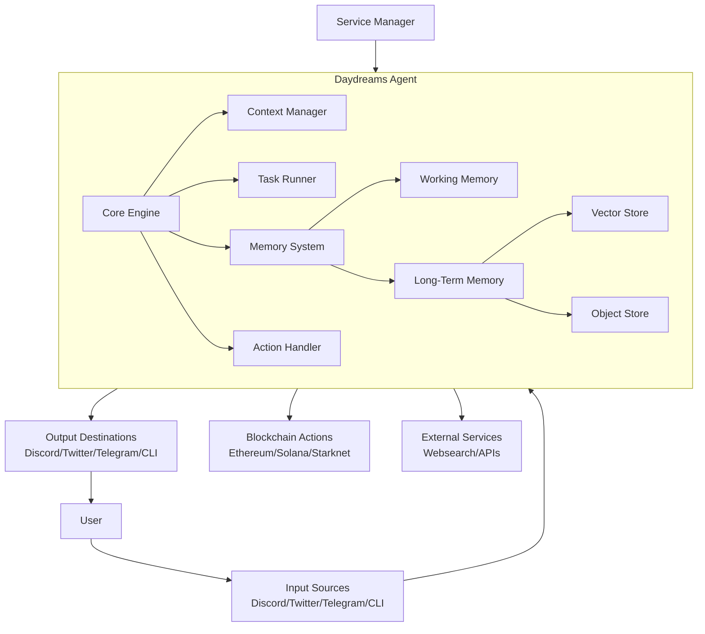
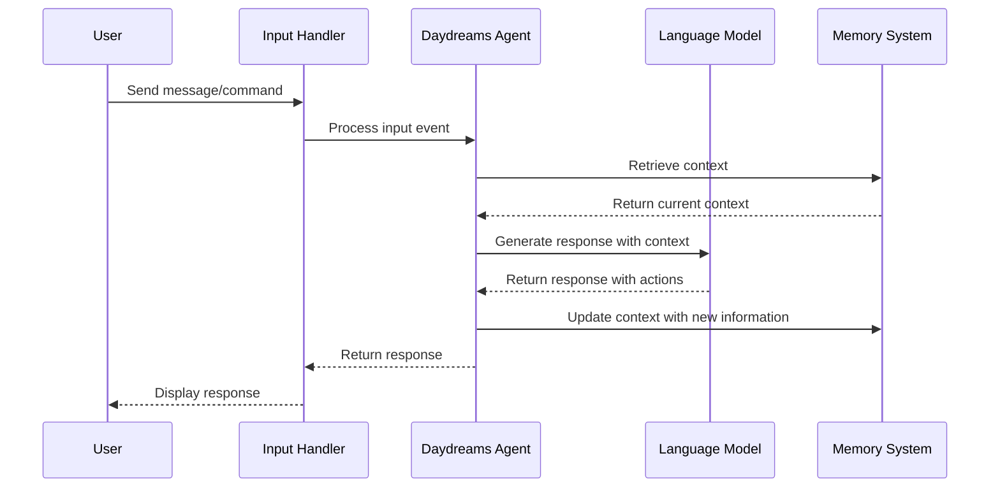
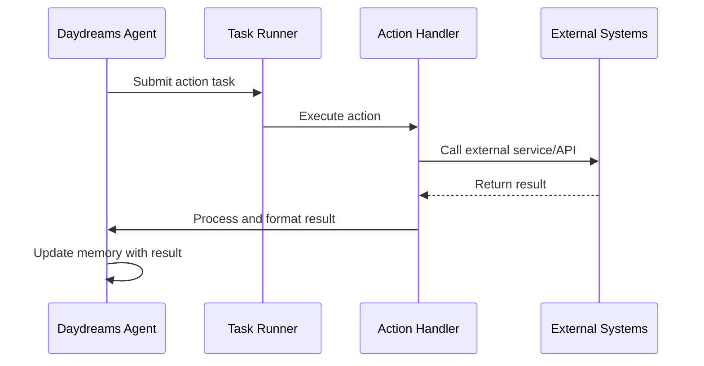
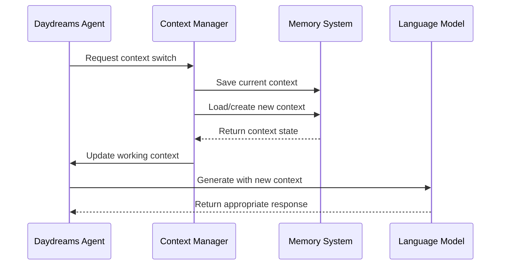

# Daydream - Web3 AI Agent framework overview

## 1. Main Features
### a. Core Agent Framework
- **Feature Description**: A flexible framework for building AI agents with memory, context management, and action orchestration
- **Files/Folders**: `packages/core`
- **Tech Stack**: TypeScript, Zod for schema validation, AI-SDK for LLM integration
- **Implementation**: Uses a functional approach with `createDreams` as the main entry point, allowing composition of agents with different capabilities

### b. Multi-Model LLM Support
- **Feature Description**: Support for multiple LLM providers through AI-SDK
- **Files/Folders**: `packages/core/src/providers`
- **Tech Stack**: AI-SDK integrations with OpenAI, Anthropic, Groq, Gemini
- **Implementation**: Abstracts LLM interfaces through a unified API, allowing easy switching between providers

### c. Context Management System
- **Feature Description**: Robust context and memory management for persistent agent state
- **Files/Folders**: `packages/core/src/context.ts`, `packages/core/src/memory/`
- **Tech Stack**: TypeScript, custom memory stores
- **Implementation**: Uses a flexible memory system with working memory and long-term storage, supporting both simple objects and vector stores

### d. Multi-Platform Integration
- **Feature Description**: Integrations with various platforms like Twitter, Discord, Telegram
- **Files/Folders**: `packages/twitter/`, `packages/discord/`, `packages/telegram/`
- **Tech Stack**: Platform-specific SDKs, TypeScript
- **Implementation**: Provides input/output handlers for each platform, allowing agents to interact with users across different services

### e. Blockchain Integrations
- **Feature Description**: Cross-chain compatibility with various blockchain networks
- **Files/Folders**: `packages/hyperliquid/`, `examples/chains/`
- **Tech Stack**: Ethereum, Arbitrum, Optimism, Solana, Starknet, Hyperledger SDKs
- **Implementation**: Chain-specific adapters providing a unified interface for reading and writing to different blockchains

### f. Action System
- **Feature Description**: Typed, schema-validated actions that agents can perform
- **Files/Folders**: `packages/core/src/actions/`, `packages/core/src/task.ts`
- **Tech Stack**: Zod for schema validation, TypeScript
- **Implementation**: Actions are defined with schemas and handlers, providing a safe way for agents to interact with external systems

### g. Vector Database Integrations
- **Feature Description**: Integration with vector databases for semantic similarity search
- **Files/Folders**: `packages/chroma/`, `packages/mongo/`
- **Tech Stack**: ChromaDB, MongoDB
- **Implementation**: Provides vector store implementations for different databases, enabling semantic retrieval of information

## 2. Architecture



The architecture follows a modular design where:

1. **Core Engine**: Central coordinator that manages the agent's lifecycle
2. **Context Manager**: Handles context switching and management
3. **Task Runner**: Executes tasks in parallel with proper rate limiting
4. **Memory System**: Manages both working (short-term) and long-term memory
5. **Action Handler**: Processes and executes actions based on agent decisions
6. **Service Manager**: Provides access to external services and APIs
7. **Input/Output Handlers**: Connect the agent to various platforms

Components interact through well-defined interfaces, allowing extensions to add new capabilities without modifying the core system.

### Third-Party Tools in the Daydreams Framework

#### LLM Providers
1. **Anthropic Claude** (`@ai-sdk/anthropic`)
   - Used for high-quality reasoning and instruction following
   - Powers the agent's core thinking capabilities

2. **OpenAI GPT** (`openai`)
   - Provides alternative model options for agent reasoning
   - Used in some examples for specific capabilities

3. **Groq** (`@ai-sdk/groq`)
   - Offers high-performance inference for faster agent responses
   - Used in many examples due to speed benefits

4. **Gemini** (`@ai-sdk/google`)
   - Alternative model option for agent reasoning
   - Provides multimodal capabilities in some implementations

#### Blockchain Integrations
1. **Hyperliquid Client** (`@daydreamsai/hyperliquid`)
   - Enables perpetual futures trading on Hyperliquid exchange
   - Used for DeFi trading examples and financial agent capabilities

2. **Ethereum/Web3 Libraries**
   - Supports interactions with Ethereum, Arbitrum, Optimism
   - Enables smart contract interactions and wallet management

3. **Solana Web3.js**
   - Provides Solana blockchain integration
   - Enables transaction creation and management on Solana

4. **Starknet.js**
   - Enables interaction with StarkNet
   - Used for L2 scaling solution integration

#### Data Storage
1. **Chroma** (`chromadb`)
   - Vector database for semantic search capabilities
   - Enables agents to perform similarity search on stored data

2. **MongoDB** (`mongodb`)
   - Persistent storage for agent memory and context
   - Used for scalable and flexible data storage needs

#### Communication Platforms
1. **Discord.js**
   - Powers Discord bot integration
   - Enables real-time communication with Discord communities

2. **TwitterApi** (Twitter client library)
   - Enables Twitter monitoring and posting
   - Used for social media automation examples

3. **Telegraf** (Telegram Bot API)
   - Powers Telegram bot integration
   - Used for messaging app interaction

#### Development & Utility
1. **Zod** (`zod`)
   - Schema validation for type safety
   - Ensures correct parameter types for actions and contexts

2. **uuid** (`uuid`)
   - Generates unique identifiers for contexts, transactions, etc.
   - Ensures proper identification of agent components

3. **ai** (`ai` SDK by Vercel)
   - Provides unified interfaces for LLM integration
   - Standardizes streaming responses and request formatting

4. **chalk** (`chalk`)
   - Terminal string styling
   - Improves CLI output readability

5. **tsx** (`tsx`)
   - Runs TypeScript code without compilation
   - Used for development and example running

#### Why These Tools

The framework uses these tools for several strategic reasons:

1. **Modularity**: Each tool serves a specific purpose and can be swapped out
2. **Specialization**: The best tool for each specific task
3. **Ecosystem Compatibility**: Working with established standards and protocols
4. **Developer Experience**: Tools that provide strong typing and validation
5. **Performance**: Optimized libraries for speed and efficiency
6. **Cross-Platform**: Support for multiple blockchains and communication channels

These integrations allow the framework to provide a unified interface for working with diverse technologies while maintaining high performance and reliability for agent operations.

### Implementing Memory in Daydreams Framework

#### Memory System Overview

The Daydreams framework uses a two-tier memory system:
1. **Working Memory**: Short-term, in-context memory for ongoing interactions
2. **Long-Term Memory**: Persistent storage with optional vector embeddings for semantic search

#### Vector Database Options

The framework primarily supports two vector database implementations:

1. **ChromaDB** (`@daydreamsai/chroma`)
   ```typescript
   import { createChromaMemory } from "@daydreamsai/chroma";
   
   // Create memory with ChromaDB
   const memory = createChromaMemory({
     collection: "agent-memory", 
     url: "http://localhost:8000" // ChromaDB server
   });
   ```

2. **MongoDB** (`@daydreamsai/mongo`)
   ```typescript
   import { createMongoMemory } from "@daydreamsai/mongo";
   
   // Create memory with MongoDB
   const memory = createMongoMemory({
     uri: "mongodb://localhost:27017",
     dbName: "agent-memory"
   });
   ```

#### Embedding Models Used

The framework uses these embedding models:

1. **OpenAI Embeddings** (default)
   ```typescript
   import { createOpenAIEmbeddings } from "@daydreamsai/core/memory";
   
   const embeddings = createOpenAIEmbeddings({
     apiKey: process.env.OPENAI_API_KEY,
     model: "text-embedding-3-small" // or text-embedding-3-large
   });
   ```

2. **Custom Embedding Providers** (extensible)
   ```typescript
   // Custom embedding implementation
   const customEmbeddings = {
     embed: async (text) => {
       // Your embedding logic here
       return [/* vector values */];
     }
   };
   ```

#### Implementation Example

Here's how to implement memory in a Daydreams agent:

```typescript
import { createDreams, createMemory } from "@daydreamsai/core";
import { createChromaMemory } from "@daydreamsai/chroma";
import { createOpenAIEmbeddings } from "@daydreamsai/core/memory";

// 1. Create the vector store
const vectorStore = createChromaMemory({
  collection: "my-agent-memory",
  url: "http://localhost:8000"
});

// 2. Create the embedding provider
const embeddings = createOpenAIEmbeddings({
  apiKey: process.env.OPENAI_API_KEY,
  model: "text-embedding-3-small"
});

// 3. Create memory with object store and vector capabilities
const memory = createMemory(
  // Object store for structured data
  {
    async get(key) { /* implementation */ },
    async set(key, value) { /* implementation */ },
    async delete(key) { /* implementation */ },
    async clear() { /* implementation */ }
  },
  // Vector store with embeddings
  {
    async upsert(contextId, data) {
      const embedding = await embeddings.embed(data.text);
      return vectorStore.upsert(contextId, {
        ...data,
        embedding
      });
    },
    async query(contextId, query) {
      const embedding = await embeddings.embed(query);
      return vectorStore.query(contextId, embedding);
    },
    async createIndex(name) { return vectorStore.createIndex(name); },
    async deleteIndex(name) { return vectorStore.deleteIndex(name); }
  }
);

// 4. Use the memory in your agent
const agent = createDreams({
  memory,
  model: /* your LLM */,
  // other configuration
});
```

#### Using Memory in Contexts

Custom contexts can use memory for persistent state:

```typescript
import { context, render } from "@daydreamsai/core";
import { z } from "zod";

const myContext = context({
  type: "chatMemory",
  schema: z.object({ id: z.string() }),
  
  // Create initial memory state
  create() {
    return {
      conversations: [],
      knowledgeBase: []
    };
  },
  
  // Save memory after changes
  async afterUpdate({ memory, agent }) {
    // Optional: Create embeddings and store in vector DB
    for (const item of memory.knowledgeBase) {
      if (!item.embedded) {
        await agent.memory.vector.upsert(
          "knowledge", 
          { text: item.content, metadata: { source: item.source } }
        );
        item.embedded = true;
      }
    }
  },
  
  // Render context for the LLM
  render({ memory }) {
    return render(`
      Recent conversations:
      {{conversations}}
      
      Relevant knowledge:
      {{knowledge}}
    `, {
      conversations: memory.conversations.slice(-5).join("\n"),
      knowledge: memory.knowledgeBase.map(k => k.content).join("\n")
    });
  }
});
```

#### Semantic Search with Vector Memory

To retrieve semantically similar information:

```typescript
// In an action handler or task
async function findRelevantInfo(query, agent, contextId) {
  // Search vector store for similar content
  const results = await agent.memory.vector.query(contextId, query);
  
  // Process and return results
  return results.map(item => ({
    content: item.text,
    similarity: item.score
  }));
}
```

The vector memory system is flexible and can be extended with different embedding models and vector stores as needed for your specific use case. The framework's modular design allows you to swap components while maintaining the same overall memory management pattern.

## 3. Key Workflows

### Agent Initialization and Input Processing



### Action Execution Workflow



### Context Switching and Management



The framework provides a sophisticated system for AI agents that can interact with various platforms and blockchain networks. It has a flexible architecture that allows for easy extension and customization, while maintaining a strong typing system for safety and developer experience.


## 4. Integrating with the Daydreams Framework

### Integration Methods

1. **Direct Package Integration**
   ```typescript
   import { createDreams, action, context } from "@daydreamsai/core";
   ```

2. **Creating a Custom Extension**
   ```typescript
   // myExtension.ts
   export const myExtension = {
     inputs: { /* your custom inputs */ },
     outputs: { /* your custom outputs */ },
     actions: [ /* your custom actions */ ],
     services: [ /* your custom services */ ],
     install: (agent) => { /* setup code */ }
   };
   ```

3. **Implementing Custom Actions**
   ```typescript
   const myAction = action({
     name: "myCustomAction",
     description: "Performs a specific task",
     schema: z.object({ param1: z.string() }),
     handler: async (call, ctx, agent) => {
       // Implementation
       return { result: "success" };
     }
   });
   ```

4. **Custom Context Provider**
   ```typescript
   const myContext = context({
     type: "myContext",
     schema: z.object({ id: z.string() }),
     create: () => ({ myData: [] }),
     render: ({ memory }) => `Current data: ${memory.myData.join(", ")}`
   });
   ```

5. To create a Daydreams agent with the MCP extension
```typescript
import { createDreams } from "@daydreamsai/core";
import { createMcpExtension } from "@daydreamsai/core/extensions";
import { anthropic } from "@ai-sdk/anthropic";
import { cli } from "@daydreamsai/core/extensions";
import path from "path";

// Create an agent with the MCP extension
const agent = createDreams({
  model: anthropic("claude-3-7-sonnet-latest"),
  
  // Add the MCP extension with your server configurations
  extensions: [
    cli, // Command line interface for interaction
    createMcpExtension([
      {
        id: "your-server-id",
        name: "Your MCP Server",
        transport: {
          // Option 1: For local MCP servers that run as separate processes
          type: "stdio",
          command: "node", // Or any other command to run your server
          args: [path.join(__dirname, "your-mcp-server.js")],
          
          // Option 2: For remote MCP servers with HTTP API
          // type: "sse",
          // serverUrl: "http://your-server-url.com",
          // sseEndpoint: "/sse", // Optional, defaults to "/sse"
          // messageEndpoint: "/messages", // Optional, defaults to "/messages"
        },
      },
      // You can add multiple MCP servers here
    ]),
  ],
}).start();
// List all connected MCP servers
const serversResult = await agent.callTool({
  name: "mcp.listServers",
  arguments: {},
});

// List resources from a specific MCP server
const resourcesResult = await agent.callTool({
  name: "mcp.listResources",
  arguments: {
    serverId: "your-server-id",
  },
});

// Call a tool on an MCP server
const toolResult = await agent.callTool({
  name: "mcp.callTool",
  arguments: {
    serverId: "your-server-id",
    name: "your-tool-name",
    arguments: {
      // Tool-specific arguments
      param1: "value1",
      param2: "value2",
    },
  },
});
```

### Use Cases That Benefit From This Framework

1. **DeFi Trading Assistant**
   - Monitor multiple chains for arbitrage opportunities
   - Execute trades based on market conditions
   - Manage a portfolio across different protocols
   - Example: An agent that trades between Uniswap (Ethereum), Jupiter (Solana), and Hyperliquid with risk management

2. **Cross-Chain NFT Manager**
   - Track NFT collections across multiple blockchains
   - Execute purchases/sales based on predefined criteria
   - Monitor floor prices and trading volumes
   - Example: An agent that buys NFTs when they drop below a certain price and lists yours when demand increases

3. **Web3 Research Assistant**
   - Monitor on-chain activity for specified projects
   - Track governance proposals across DAOs
   - Summarize blockchain developments for users
   - Example: An agent that tracks Ethereum L2 developments and provides updates via Discord

4. **Community Management Agent**
   - Moderate Discord/Telegram/Twitter for a Web3 project
   - Answer common questions about blockchain functionality
   - Share relevant announcements across platforms
   - Example: A Discord bot for a DAO that can explain proposals and track votes

5. **Personal Crypto Assistant**
   - Track your portfolio across chains
   - Suggest gas optimization timing
   - Alert on significant price movements
   - Example: An agent that notifies you when gas is low for pending transactions

6. **Protocol Health Monitor**
   - Track liquidity, TVL, and other DeFi metrics
   - Alert on unusual activity or exploits
   - Process on-chain data for early warning signs
   - Example: An agent monitoring Aave health factors and liquidation risks

7. **Autonomous Content Creator**
   - Generate tweets/posts about blockchain developments
   - Create educational content based on on-chain data
   - Share market insights across platforms
   - Example: A Twitter bot that posts daily analytics about DEX trading volumes

8. **Smart Contract Security Monitor**
   - Watch for suspicious transactions in your protocols
   - Alert on large withdrawals or unusual patterns
   - Track contract interactions for unexpected behavior
   - Example: An agent monitoring your protocol's contracts for potential exploits

The framework is particularly valuable when you need agents that can:
- Operate across multiple chains
- Maintain context across interactions
- Process and respond to events from various platforms
- Execute complex reasoning with LLM capabilities
- Perform autonomous actions with proper safeguards


