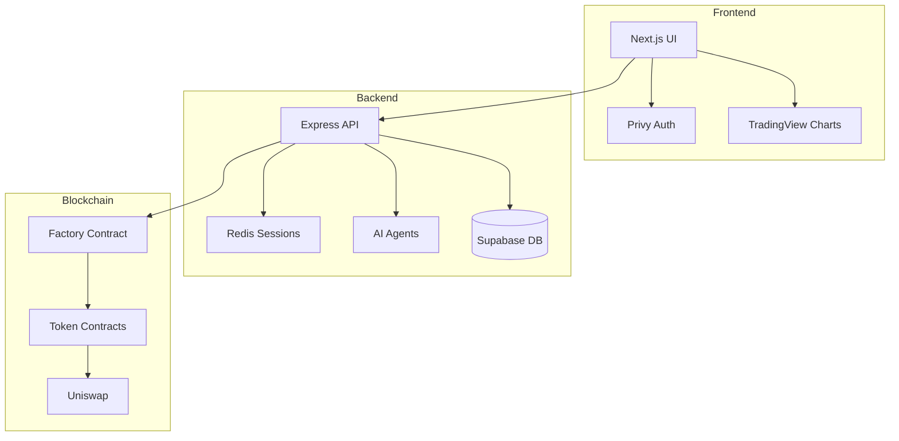
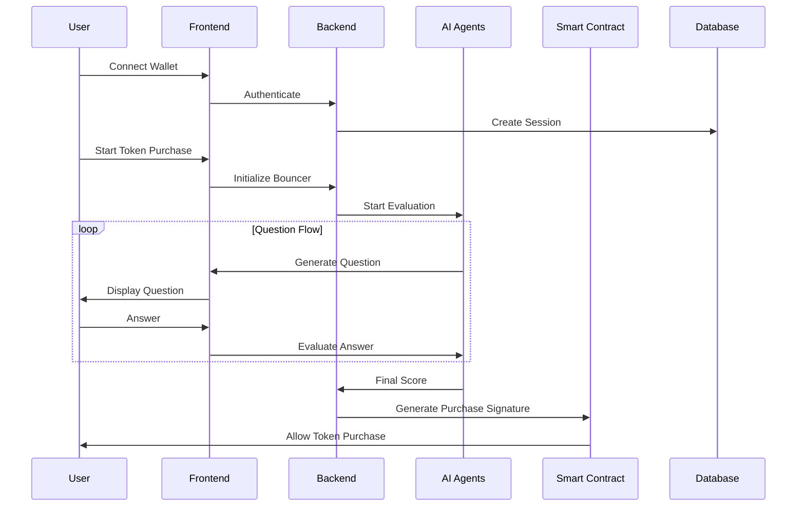
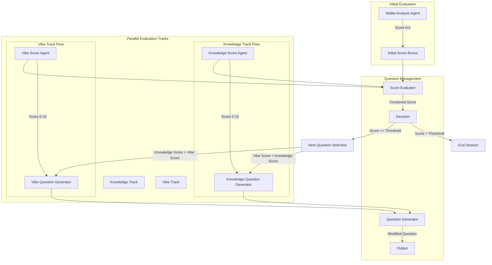

[bouncerAI](https://ethglobal.com/showcase/bouncer-ai-1sd06)

### Main Features:

a. Main Features:
- AI-powered Token Gating System
  - Location: `server/src/agents/`
  - Tech: Covalent AI SDK, TypeScript
  - Implementation: Multiple specialized agents (Knowledge, Vibe, Wallet Analysis)

- Smart Contract-based Token Launch Platform
  - Location: `evm/src/`
  - Tech: Foundry, Solidity
  - Implementation: Factory contract pattern with bonding curve mechanics

- Real-time Price Tracking
  - Location: `token_tracker/src/`
  - Tech: Node.js, Redis
  - Implementation: Continuous monitoring service for token prices

- Web3 Authentication
  - Location: `frontend/app/`
  - Tech: Privy, Next.js
  - Implementation: JWT-based authentication flow

### Architecture:



### Key Workflows:



### Framework Integration:
To integrate with BouncerAI:

1. Smart Contract Integration:
```solidity
interface IBouncerAI {
    function validatePurchase(bytes memory signature) external view returns (bool);
    function buy(uint256 amount) external payable;
}
```

2. Backend Integration:
```typescript
import { BouncerAI } from '@bouncerai/sdk';

const bouncer = new BouncerAI({
    projectId: 'your-project-id',
    apiKey: 'your-api-key'
});
```

Use Cases:
- Token Launches requiring community alignment
- DAO membership screening
- NFT project whitelisting
- DeFi protocol access control
- Community-driven token sales

5. Third-party Tools:

1. Development & Deployment:
- Vercel: Frontend hosting
- DigitalOcean Droplet: Backend hosting
- Foundry: Smart contract development
- Arbitrum: Layer 2 blockchain deployment

2. Frontend:
- Next.js: React framework
- TailwindCSS: Styling
- TradingView: Price charts
- Spline: 3D avatar design
- Privy: Web3 authentication

3. Backend:
- Redis: Session management
- Supabase: Database
- Express: API framework
- TypeScript: Type safety
- Covalent AI SDK: AI agent framework

4. Blockchain:
- Uniswap: DEX integration
- Arbitrum: L2 scaling
- Foundry: Smart contract testing

Each tool was chosen for specific purposes:
- Vercel/Droplet: Scalable hosting
- Redis: Fast session management
- Supabase: Real-time database capabilities
- Privy: Simplified Web3 auth
- TradingView: Professional-grade charts
- Covalent AI SDK: Advanced AI capabilities
- Arbitrum: Lower gas fees and faster transactions

The architecture is modular and each component can be replaced or upgraded independently, making the system highly maintainable and extensible.

## Agent Workflow
Let me break down the AI Agents flow in detail based on the documentation and codebase.



#### Let's break down each agent's responsibility and how they work together:

1. **Core Agents and Their Responsibilities:**

```typescript
// Example Agent Configuration
interface AgentConfig {
    projectContext: string;
    mandatoryKnowledge: string;
    whitepaperKnowledge: string;
    characterChoice: "stoic" | "funny" | "aggressive" | "friendly";
    vibeKeywords: string[];
    scoreThreshold: number;
}
```

a. **Wallet Analysis Agent**
```typescript
class OnChainScoreAgent {
    async evaluate(walletAddress: string): Promise<number> {
        // Uses Covalent AI SDK to analyze:
        // - Transaction history
        // - Token holdings
        // - DeFi interactions
        // - NFT ownership
        // Returns score 0-5
    }
}
```

b. **Knowledge Track Agents**
```typescript
class KnowledgeScoreAgent {
    async evaluate(
        question: string, 
        answer: string, 
        history: Interaction[]
    ): Promise<number> {
        // Uses Covalent AI SDK for:
        // - Technical accuracy assessment
        // - Understanding depth evaluation
        // - Context awareness checking
        return score; // 0-10
    }
}

class KnowledgeQuestionGenerator {
    async generate(history: Interaction[]): Promise<string> {
        // Uses project whitepaper and context
        // Generates technical questions
        // Adapts difficulty based on previous answers
    }
}
```

c. **Vibe Track Agents**
```typescript
class VibeScoreAgent {
    async evaluate(
        question: string,
        answer: string,
        history: Interaction[]
    ): Promise<number> {
        // Analyzes:
        // - Cultural alignment
        // - Communication style
        // - Enthusiasm and authenticity
        return vibeScore; // 0-10
    }
}

class VibeQuestionGenerator {
    async generate(history: Interaction[]): Promise<string> {
        // Creates questions to assess:
        // - Project vision alignment
        // - Community values fit
        // - Long-term commitment
    }
}
```

d. **Question Management Agents**
```typescript
class QuestionGenerator {
    async modifyTone(
        question: string,
        characterChoice: CharacterType
    ): Promise<string> {
        // Adapts question style based on bouncer personality
        // Maintains consistent tone throughout interaction
    }
}

class ScoreEvaluator {
    async evaluateSession(
        knowledgeScore: number,
        vibeScore: number,
        walletBonus: number
    ): Promise<EvaluationResult> {
        // Combines scores with weights
        // Makes continuation/termination decisions
        // Determines next question type
    }
}
```

### **How Covalent AI SDK Helps:**

The Covalent AI SDK provides several key capabilities:

```typescript
// Example of Covalent AI SDK integration
class CovalentAIIntegration {
    // Natural Language Processing
    async analyzeResponse(response: string) {
        return await covalentAI.nlp.analyze({
            text: response,
            features: ['sentiment', 'technical_accuracy', 'coherence']
        });
    }

    // Context Management
    async maintainContext(history: Interaction[]) {
        return await covalentAI.context.update({
            previousInteractions: history,
            projectContext: this.config.projectContext
        });
    }

    // Scoring System
    async calculateScore(analysis: Analysis) {
        return await covalentAI.scoring.compute({
            metrics: ['knowledge', 'vibe', 'authenticity'],
            weights: this.config.scoreWeights
        });
    }
}
```

### **Workflow Integration:**

```typescript
class BouncerAISession {
    async handleInteraction(
        userResponse: string, 
        walletAddress: string
    ): Promise<InteractionResult> {
        // Initial wallet analysis (first interaction only)
        if (this.isFirstInteraction) {
            const walletScore = await this.onChainScoreAgent.evaluate(walletAddress);
            this.setWalletBonus(walletScore);
        }

        // Parallel evaluation
        const [knowledgeScore, vibeScore] = await Promise.all([
            this.knowledgeScoreAgent.evaluate(
                this.currentQuestion,
                userResponse,
                this.history
            ),
            this.vibeScoreAgent.evaluate(
                this.currentQuestion,
                userResponse,
                this.history
            )
        ]);

        // Score evaluation and decision making
        const evaluation = await this.scoreEvaluator.evaluateSession(
            knowledgeScore,
            vibeScore,
            this.walletBonus
        );

        if (evaluation.shouldContinue) {
            // Generate next question based on scores
            const nextQuestion = await this.generateNextQuestion(
                knowledgeScore,
                vibeScore
            );
            return {
                continue: true,
                question: nextQuestion,
                currentScore: evaluation.combinedScore
            };
        }

        return {
            continue: false,
            finalScore: evaluation.combinedScore,
            passed: evaluation.combinedScore >= this.config.scoreThreshold
        };
    }
}
```

### **Scoring Criteria and Thresholds:**

```typescript
interface ScoringCriteria {
    knowledge: {
        poor: 0-3,      // Poor understanding
        basic: 4-6,     // Basic understanding
        good: 7-8,      // Good understanding
        excellent: 9-10  // Excellent understanding
    };
    vibe: {
        poor: 0-3,      // Poor cultural fit
        basic: 4-6,     // Basic alignment
        good: 7-8,      // Good cultural fit
        perfect: 9-10   // Perfect alignment
    };
    wallet: {
        bonus: 0-5      // Based on on-chain activity
    };
}
```

The agents work together in a coordinated manner, with each specializing in its domain while contributing to the overall evaluation. The Covalent AI SDK provides the underlying AI capabilities, context management, and scoring mechanisms that make this possible. The system is designed to be both thorough in its evaluation and adaptable to different project needs through its configuration options.
