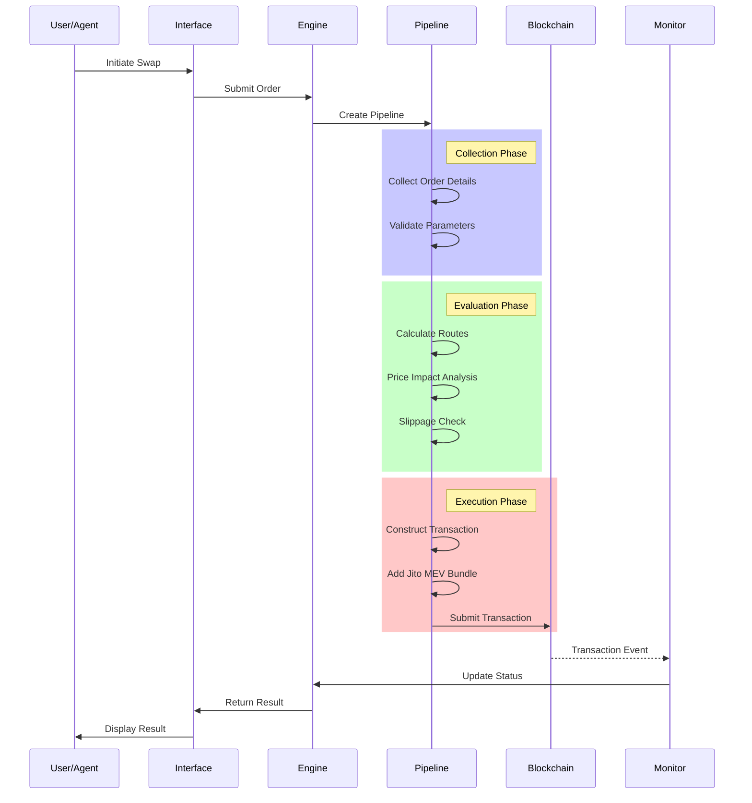
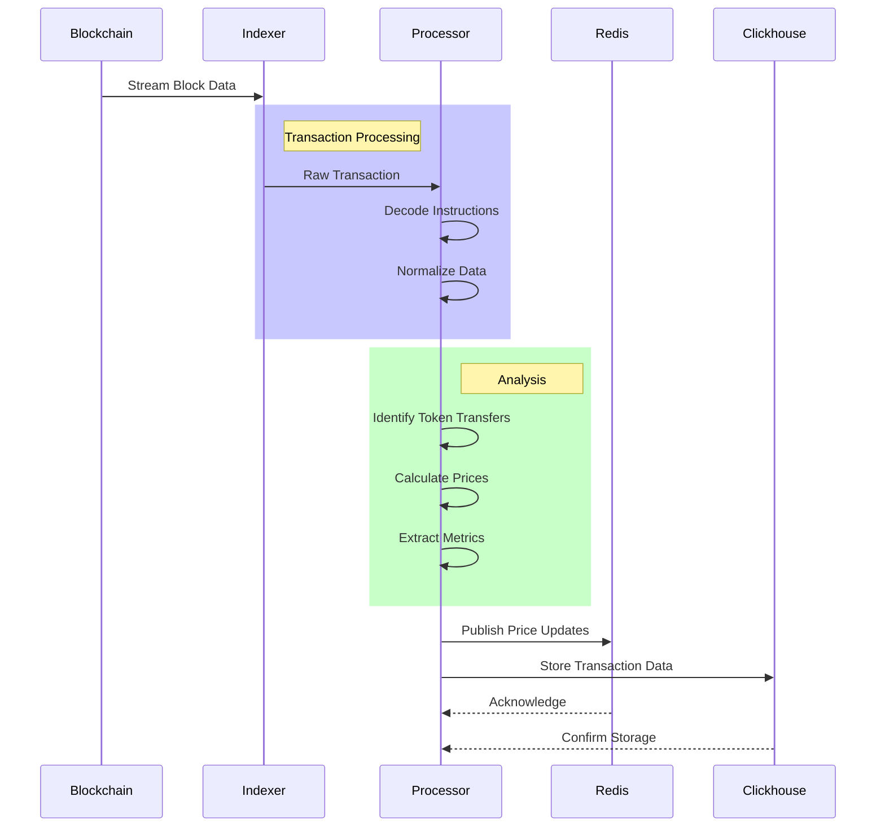
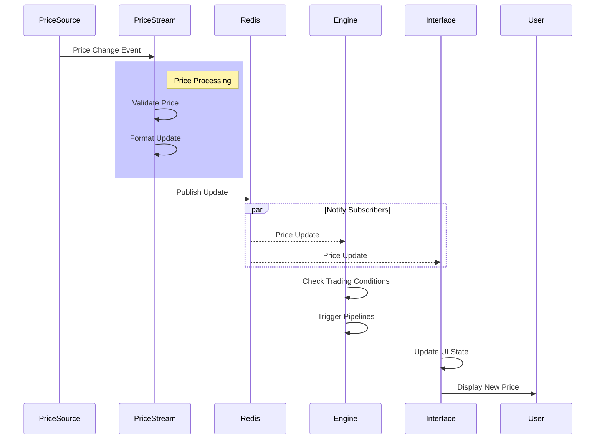
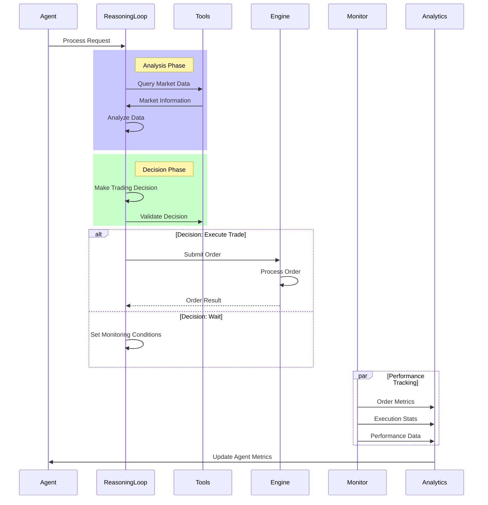

# Listen: Web3 AI Agent Analysis

## Main Features
1. **Real-time Transaction Monitoring**: Monitors blockchain transactions, particularly on Solana
2. **Multi-DEX Swap Execution**: Supports swaps through various DEXs including Pump.fun, Jupiter V6 API, and Raydium
3. **Cross-Chain Trading**: Facilitates transactions across different blockchains (Solana, EVM-based chains)
4. **Price Tracking**: Real-time price tracking and metrics for tokens
5. **AI-Powered Portfolio Management**: Integration with AI agents for automated trading
6. **Token Management Utilities**: Tools for managing tokens across different blockchains
7. **Performance Monitoring**: Metrics collection with Prometheus integration

#### 1. Real-time Transaction Monitoring

**Technologies:**
- **Carbon Framework**: Uses the Carbon library (from sevenlabs-hq) for transaction indexing and decoding
- [**Yellowstone gRPC**](https://www.quicknode.com/docs/solana/yellowstone-grpc/overview): Used for efficient blockchain data streaming via the geyser plugin
- **Redis**: Acts as a message queue for real-time updates, using pub/sub channels
- **Clickhouse**: OLAP database for storing and querying transaction data
- **Tokio**: Asynchronous runtime to handle concurrent processing

**Implementation:**
```rust
// listen-data/src/geyser/
carbon-yellowstone-grpc-datasource = { git = "https://github.com/sevenlabs-hq/carbon", branch = "main", optional = true, version = "0.6.0" }
yellowstone-grpc-proto = { version = "5.0.0", optional = true }
```

The system connects to [Solana's geyser plugin](https://docs.anza.xyz/validator/geyser/) interface through [Yellowstone gRPC](https://www.quicknode.com/docs/solana/yellowstone-grpc/overview), which provides a stream of all transaction data. Each transaction is processed in real-time, decoded using [Carbon's decoders](https://github.com/sevenlabs-hq/carbon?tab=readme-ov-file#available-program-decoders) for specific programs (Raydium, Orca, Token programs), and relevant events are pushed to Redis channels. This provides low-latency monitoring of on-chain activities, essential for MEV opportunities and timely trade execution.

#### 2. Multi-DEX Swap Execution

**Technologies:**
- **[Jupiter SDK](https://github.com/jup-ag/jupiter-swap-api-client)**: Integration with Jupiter V6 API for routing across multiple DEXs
- **[Raydium](https://github.com/piotrostr/raydium-amm)/Orca/Meteora Integrations**: Direct integration with these AMMs
- **[Jito MEV Bundles](https://github.com/piotrostr/searcher-examples)**: For high-priority transaction submission
- **Redis**: For storing quotes and transaction state
- **Solana SDK**: For transaction creation and signing

**Implementation:**
The engine uses a pipeline architecture for processing swaps:

```rust
// listen-engine/src/engine/pipeline.rs
pub struct Pipeline {
    pub id: String,
    pub status: Status,
    pub evaluator: Option<Box<dyn Evaluate>>,
    pub order: Option<Box<dyn Order>>,
    pub created_at: DateTime<Utc>,
    pub updated_at: DateTime<Utc>,
}
```

For Jupiter integration:
```rust
// listen-engine/src/jup.rs
pub async fn get_quote(
    &self,
    input_mint: &str,
    output_mint: &str,
    amount: u64,
    slippage_bps: Option<u64>,
) -> Result<Quote> {
    // Jupiter API integration for quotes
}
```

The system handles the entire swap lifecycle - from obtaining quotes across different DEXs, selecting the best route, constructing transactions, and executing them with proper slippage protection. For high-frequency trading, it utilizes Jito MEV bundles to ensure transactions are prioritized by validators.

#### 3. Cross-Chain Trading

**Technologies:**
- **LiFi Protocol**: For cross-chain bridges and routing
- **[Privy](https://docs.privy.io/guide/react/quickstart)**: For wallet management across chains
- **EVM Approvals**: Custom module for handling EVM-based token approvals
- **Solana and EVM SDKs**: For multi-chain transaction creation

**Implementation:**
```rust
// listen-engine/Cargo.toml
privy = { path = "../privy" }
lifi = { path = "../lifi" }
evm-approvals = { path = "../approvals" }
```

```rust
// listen-engine/src/engine/bridge.rs
pub async fn bridge_tokens(
    from_chain_caip2: &str,
    to_chain_caip2: &str,
    // More parameters
) -> Result<BridgeResponse, BridgeError> {
    // Cross-chain bridging logic
}
```

The system implements a unified interface for cross-chain transactions through LiFi integration. It handles the complex process of finding optimal bridge routes, managing gas across different chains, and ensuring transaction finality. The privy module abstracts wallet management across different chains, providing a seamless experience.

#### 4. Price Tracking and Metrics

**Technologies:**
- **WebSocket Streams**: For real-time market data
- **Redis Time Series**: For storing price history
- **Prometheus/Grafana**: For metrics visualization
- **Clickhouse**: For long-term price data storage and analysis

**Implementation:**
```rust
// listen-data/src/sol_price_stream.rs
pub async fn start_sol_price_stream(
    redis_client: RedisClient,
    message_queue: Arc<RedisMessageQueue>,
) -> Result<()> {
    // WebSocket connection to price sources and publishing to Redis
    // Based on the code analysis, the system uses two price sources for SOL/USDT price:
    // Primary Source - Binance Futures WebSocket:
    // wss://fstream.binance.com/ws/solusdt@aggTrade
    // Fallback Source - Binance REST API
    // https://api.binance.com/api/v3/ticker/price?symbol=SOLUSDT
}
```

```rust
// listen-data/src/metrics.rs
// Prometheus metrics for swap tracking
pub struct SwapMetrics {
    pub pending_swaps: Counter,
    pub processed_swaps: Counter,
    pub swap_amount_sol: Histogram,
    pub swap_duration_ms: Histogram,
}
```

The system combines on-chain and off-chain data sources for comprehensive price tracking. On-chain events from DEX trades are processed to extract price information, while WebSocket connections to centralized exchanges provide reference prices. The data is stored in Redis for immediate access and Clickhouse for historical analysis. Prometheus metrics track system performance and trading statistics, visualized through Grafana dashboards.

#### 5. AI-Powered Portfolio Management

**Technologies:**
- **RIG Agent Kit**: Framework for AI agent integration
- **Tool Calls API**: Interface for AI to interact with blockchain
- **Redis**: For state management and message passing
- **React UI**: For agent interaction visualization

**Implementation:**
```mermaid
// From README.md
subgraph "Rig Agent Kit by Listen"
    RAK[RIG Agent Kit]
    RAK_MT[Multi-tenant Stream Manager]
    RAK_WALLET[Delegated Wallet Manager]
    RAK --> RAK_MT
    RAK --> RAK_WALLET
end
```

The system implements a tool-based framework where AI models can interact with the blockchain through predefined actions. The agent can analyze market data, execute trades, and monitor performance through a standardized API. The multi-tenant stream manager allows multiple agents to operate independently while sharing infrastructure resources. The delegated wallet manager enables agents to initiate transactions on behalf of users while maintaining security controls.

**Resoning Loop**
The core of the agent system is the `ReasoningLoop` which implements an AI-driven decision-making process:

```rust
pub struct ReasoningLoop {
    agent: Arc<Agent<CompletionModel>>,  // AI model agent
    stdout: bool,  // Output control
}
```

The reasoning loop follows this process:
1. Receives a prompt/request
2. Processes it through the AI model
3. Makes decisions about tool usage
4. Executes actions through tools
5. Processes results and continues the loop if needed


#### 6. Token Management Utilities

**Technologies:**
- **Solana Token Metadata Program**: For fetching token metadata
- **MPL Token Metadata**: For handling NFT metadata
- **SPL Token Program**: For token balance and transfer operations
- **Redis**: For caching token information

**Implementation:**
```rust
// listen-data/src/metadata.rs
pub async fn get_token_metadata(
    pubkey: &Pubkey,
    solana_client: &Arc<RpcClient>,
    redis_client: &Arc<RedisKVStore>,
) -> Result<Option<TokenMetadata>> {
    // Token metadata fetching with caching
}
```

```rust
// listen-data/src/diffs.rs
// Token transfer tracking
pub fn process_token_transfers(
    tx_meta: &TransactionMetadata,
    nested_instructions: &[NestedInstruction],
) -> DiffsResult<Vec<TokenTransferDetails>> {
    // Processing token transfers
}
```

The system provides comprehensive token management capabilities, including balance tracking, transfer history, and metadata enrichment. It implements efficient caching strategies to reduce RPC load, with Redis storing frequently accessed token information. The integration with the Token Metadata program allows for rich token information display, including icons, descriptions, and social links.

#### 7. Performance Monitoring with Prometheus Integration

**Technologies:**
- **Prometheus**: For metrics collection and storage
- **Grafana**: For metrics visualization and dashboards
- **Metrics Exporter**: Rust library for exposing metrics
- **Actix-web**: For exposing metrics endpoints

**Implementation:**
```rust
// listen-engine/src/metrics.rs
pub fn setup_metrics() -> MetricsHandle {
    let builder = PrometheusBuilder::new();
    let handle = builder
        .with_endpoint("/metrics")
        .with_global_labels(
            vec![(
                String::from("application"),
                String::from(env!("CARGO_PKG_NAME")),
            )]
            .into_iter()
            .collect(),
        )
        .install()
        .expect("failed to install Prometheus recorder");
    handle
}
```

The system implements comprehensive performance monitoring through Prometheus integration. Key metrics tracked include:
- Transaction processing latency
- Swap execution times and success rates
- Price update frequency
- API response times
- Memory and CPU usage

These metrics are exposed through HTTP endpoints and collected by Prometheus. Grafana dashboards visualize this data, providing real-time monitoring of system health and performance. The monitoring setup includes alerting capabilities for critical issues like increased error rates or system latency.

Each of these features is implemented with a focus on performance, reliability, and scalability, utilizing modern Rust concurrency patterns and efficient data processing techniques. The modular architecture allows for independent scaling of components based on load requirements.


## Key Workflows

1. **Swap Execution Flow**:
   - User or AI agent initiates a swap order via the interface or API
   - Engine receives the order and validates it
   - Order is processed through a pipeline (collect → evaluate → execute)
   - Transaction is constructed and sent to the blockchain
   - Results are monitored and reported back

    **Key Files**:
    - Order Initiation: `listen-interface/src/components/SwapToken.tsx`
    - Engine Processing: `listen-engine/src/engine/mod.rs`
    - Pipeline: 
    - Collection: `listen-engine/src/engine/collect.rs`
    - Evaluation: `listen-engine/src/engine/evaluate.rs`
    - Execution: `listen-engine/src/engine/execute.rs`
    - Transaction Monitoring: `listen-data/src/process_swap.rs`



2. **Data Indexing Flow**:
   - Blockchain data is streamed through the indexer
   - Transactions are processed and normalized
   - Token transfers and swaps are identified and analyzed
   - Prices are calculated and published to Redis
   - Data is stored in Clickhouse for analytics


    **Key Files**:
    - Indexer: `listen-data/src/geyser/`
    - Transaction Processing: `listen-data/src/process_swap.rs`
    - Token Analysis: `listen-data/src/diffs.rs`
    - Price Publishing: `listen-data/src/price.rs`
    - Database Storage: `listen-data/src/db.rs`



3. **Real-time Price Updates**:
   - Price changes are detected through blockchain monitoring
   - Updates are published to Redis channels
   - Subscribed services (engine, interface) receive notifications
   - Trading pipelines are triggered based on price conditions
   - User interface is updated with new prices
    **Key Files**:
    - Price Stream: `listen-data/src/sol_price_stream.rs`
    - Message Queue: `listen-data/src/message_queue.rs`
    - Engine Subscription: `listen-engine/src/engine/mod.rs`
    - Interface Updates: `listen-interface/src/components/PriceUpdates.tsx`



4. **AI Agent Integration**:
   - AI agents can interact with the system via a tool-based framework
   - Agents can query data, analyze markets, and make trading decisions
   - Orders created by agents go through the same execution pipeline
   - Performance metrics are collected for agent evaluation

   **Key Files**:
    - Agent Framework: `listen-kit/src/reasoning_loop.rs`
    - Tool Integration: `listen-kit/src/signer/mod.rs`
    - Market Analysis: `listen-kit/src/chart_analyst.rs`
    - Order Execution: `listen-engine/src/engine/order.rs`



The system is designed to be highly scalable, with Redis for real-time messaging and caching, Clickhouse for analytics data storage, and a microservices architecture that allows components to scale independently. The entire stack is containerized with Docker, making deployment and scaling straightforward.
