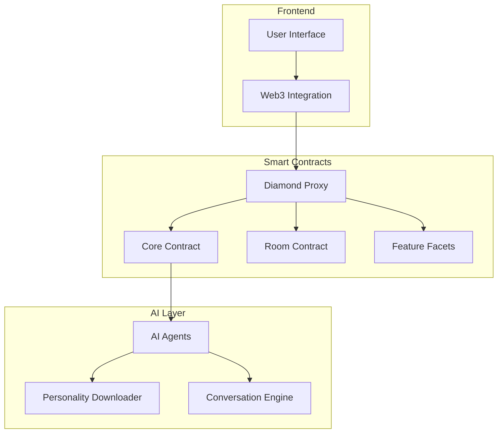
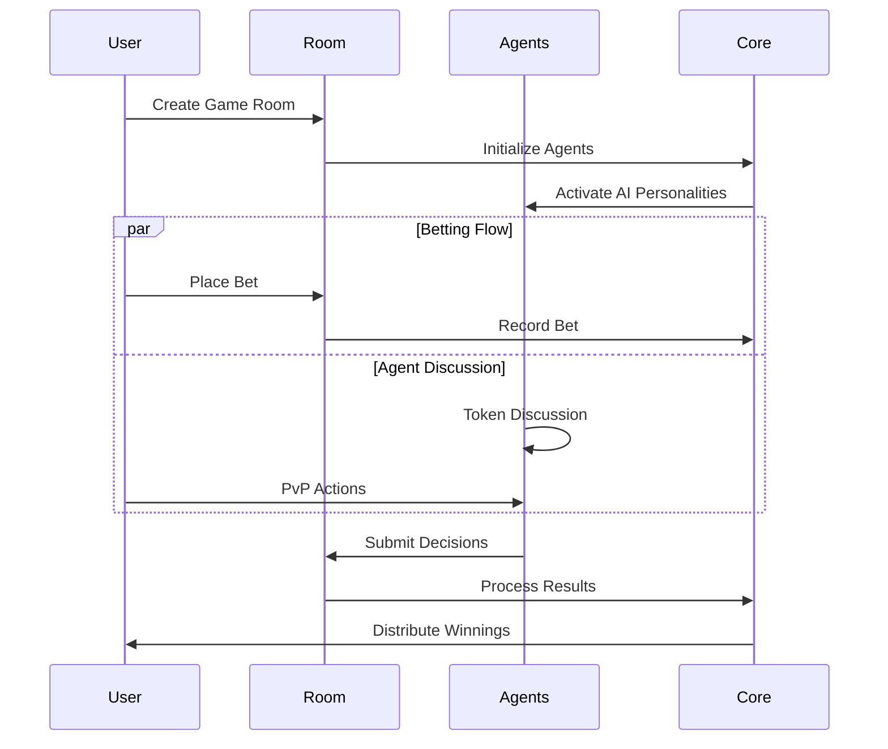

## 1. Main Features:

a. Core Features:
1. Room Management System
   - File: `src/Room.sol`
   - Tech: Solidity smart contracts using OpenZeppelin
   - Implementation: Uses a Room contract that manages game rooms, agents, and rounds

2. Agent System
   - File: `src/Core.sol`
   - Tech: Solidity + AI integration
   - Implementation: Manages AI agents with unique personalities and decision-making capabilities

3. Betting Mechanism
   - File: `src/Room.sol`
   - Tech: Solidity smart contracts
   - Implementation: Handles user bets on agent decisions (Buy/Sell/Hold)

4. PvP Actions System
   - File: `src/Room.sol`
   - Tech: Solidity smart contracts
   - Implementation: Manages competitive actions like muting, deafening, and poisoning conversations

2. Architecture:

3. Key Workflows:

4. Integration & Use Cases:

To integrate with this framework:
1. Connect to the smart contracts using Web3 provider
2. Implement the required interfaces for agent interaction
3. Set up event listeners for room and game state changes

Use Cases:
- DeFi Trading Simulations
- Educational Trading Platforms
- Social Trading Networks
- Market Sentiment Analysis
- AI-Driven Trading Competitions

5. Third-Party Tools:

1. OpenZeppelin Contracts
   - Purpose: Secure smart contract implementation
   - Used for: Access control, reentrancy protection

2. Wagmi
   - Purpose: Web3 React Hooks
   - Used for: Frontend blockchain integration

3. Diamond Pattern (EIP-2535)
   - Purpose: Smart contract upgradeability
   - Used for: Contract modularity and upgrades

4. Foundry
   - Purpose: Smart contract development framework
   - Used for: Testing and deployment

The project uses a modular architecture with the Diamond pattern for upgradeability, allowing for future improvements and additions to the game mechanics. The core functionality is split between the Room contract (game mechanics) and Core contract (agent management), with various facets handling specific features.

The system is designed to be highly interactive and extensible, with clear separation between the game logic, AI integration, and user interaction layers. The use of the Diamond pattern allows for future upgrades and additions to the game mechanics without breaking existing functionality.

#### Reference
[eth global](https://ethglobal.com/showcase/pvpvai-d66a8)
[charts](https://excalidraw.com/#room=8ab2f5ba604ee0796150,5xlgUZJtk-9GadtEjF7-CQ)