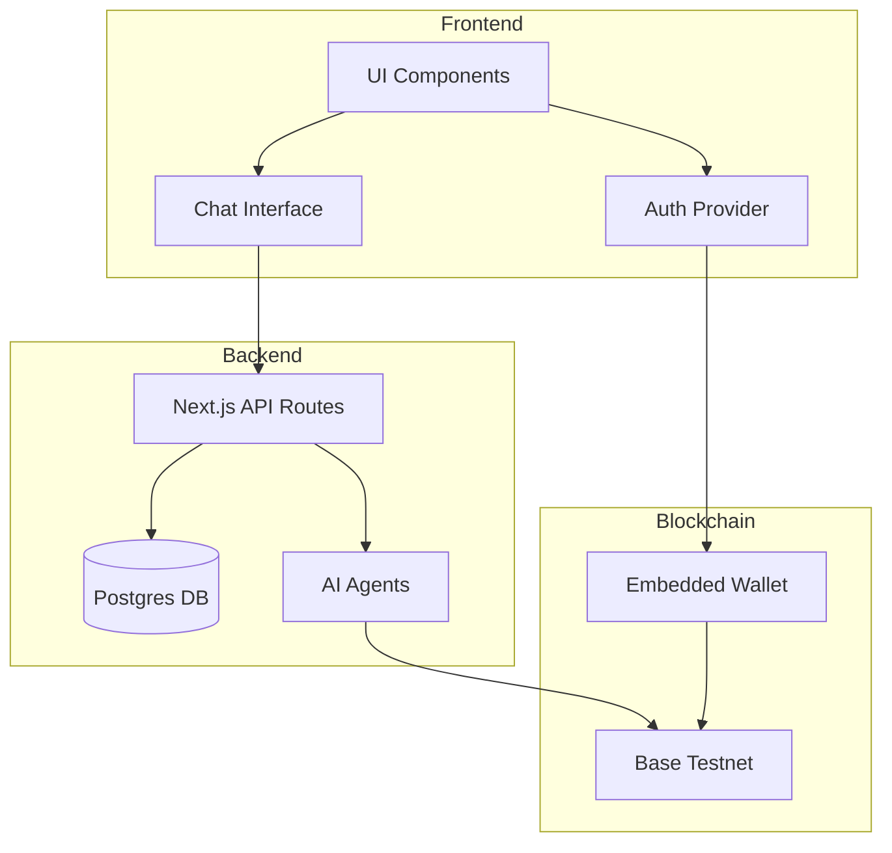
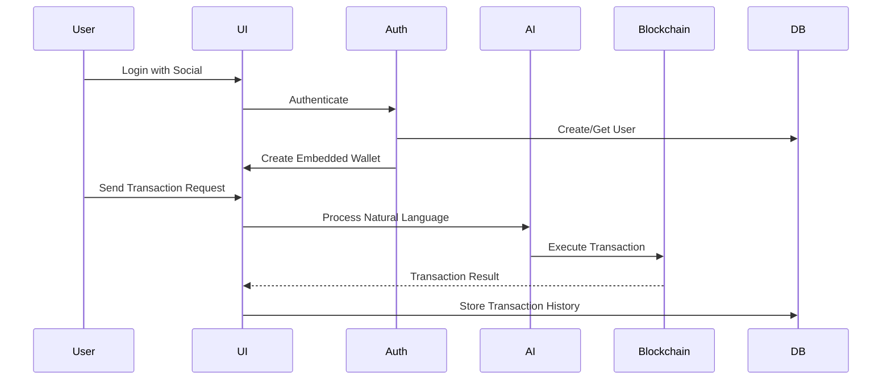

# S. Y. N. X. (Self-evolving Yotascale Network eXchange)

## Project Description
S. Y. N. X. (Self-evolving Yotascale Network eXchange) is an AI Agent Aggregator where users can interact with multiple Blockchain-based terminologies such as transfer, mint, ERC20s transfer and more. S. Y. N. X. is a initiative to solve the most critical problem of Web3 which is user-onboarding by bridging Web3 with AI. At the current level, S. Y. N. X. provides the best User Interface for seamless user interactions in the most simplistic way. At S. Y. N. X., we believe that digital products should provide the best experience to each and every user by simplifying all the tedious tasks. S. Y. N. X. provide a chat-based interaction to its user where users can perform blockchain-based tasks just by providing simple prompts such as “Transfer X amount of ETH to address 0x123…. These interactions remove the enormous amount of tasks users had to perform to do a simple transfer. S. Y. N. X. create embedded wallets as soon as user joins the platform. It create unique wallet for every user and store these details in a secured db for future interactions. S. Y. N. X. handles transaction signing on its own based on user prompts. Currently it provides basic features such as Transfer, Faucet fund request, NFT minting, Basename registration on Base Testnet and a few more. Our User Interface is our Edge, we feel that the current user-interface has the ability to hold users and make the come back and use the product. With many more features coming in near future, we want to test our product in public and check for the improvements to cater every set of user out there. We are storing wallets for a smooth prompt-based transaction, messages and chats so that user can see what transactions they have performed in past.

I'll help analyze the project in detail. Let me start by exploring the repository.

Ran tool
Let me explore the src directory to understand the project structure better.

Ran tool
Let me check the app directory to understand the main features and routes.

Ran tool
Let me analyze the package.json to understand the tech stack and dependencies.

Read file: package.json
Let me check the prisma schema to understand the data model.

Ran tool

Read file: prisma/schema.prisma
Based on my analysis, I'll provide a comprehensive breakdown of the project:

## Main Features:

a. Core Features:
1. Social Login & Wallet Creation
   - File: `src/Providers/auth.tsx`
   - Tech: Privy for social login, embedded wallet creation
   - Implementation: Uses Privy SDK for authentication and wallet management

2. AI Chat Interface
   - File: `src/app/chat/`
   - Tech: LangChain, CDP Agentkit
   - Implementation: Uses LangChain for chat processing and CDP Agentkit for blockchain interactions

3. Blockchain Transactions
   - Files: `src/lib/transactions/`
   - Tech: Viem, Base Testnet
   - Implementation: Handles ETH transfers, NFT minting, and other blockchain operations

4. Message History & Wallet Management
   - Database: Postgres (Neon)
   - Schema: `prisma/schema.prisma`
   - Implementation: Stores user wallets, chat history, and transaction records

## Architecture:

## Key Workflows:

## Framework Integration:
SYNX is built as an application rather than a framework, but it can be integrated with other systems through:
- API endpoints for transaction processing
- AI agent integration using CDP Agentkit
- Wallet management system

Use Cases:
- DeFi applications requiring natural language interfaces
- Web3 onboarding platforms
- Blockchain interaction simplification tools
- Multi-chain transaction management

## Third-party Tools:

1. **Privy (`@privy-io/react-auth`)**
   - Purpose: Social login and wallet management
   - Why: Simplifies user onboarding and wallet creation

2. **CDP Agentkit (`@coinbase/agentkit`)**
   - Purpose: AI agent framework for blockchain interactions
   - Why: Provides structured way to build blockchain-aware AI agents

3. **LangChain (`@langchain/*`)**
   - Purpose: AI/LLM integration and orchestration
   - Why: Handles natural language processing and AI agent coordination

4. **Viem**
   - Purpose: Ethereum interaction library
   - Why: Modern, type-safe library for blockchain interactions

5. **Prisma**
   - Purpose: Database ORM
   - Why: Type-safe database access and schema management

6. **ShadCN UI**
   - Purpose: UI component library
   - Why: Provides consistent, accessible UI components

7. **Next.js**
   - Purpose: React framework
   - Why: Server-side rendering, API routes, and modern development features

8. **Neon (Postgres)**
   - Purpose: Database hosting
   - Why: Serverless Postgres database with good scalability

9. **Base Testnet**
   - Purpose: Blockchain network
   - Why: Ethereum L2 with lower fees and faster transactions

The project is well-structured with a clear separation of concerns between UI, blockchain interactions, and AI processing. It uses modern tools and frameworks to create a user-friendly interface for blockchain interactions, with a focus on simplifying complex operations through natural language processing.
